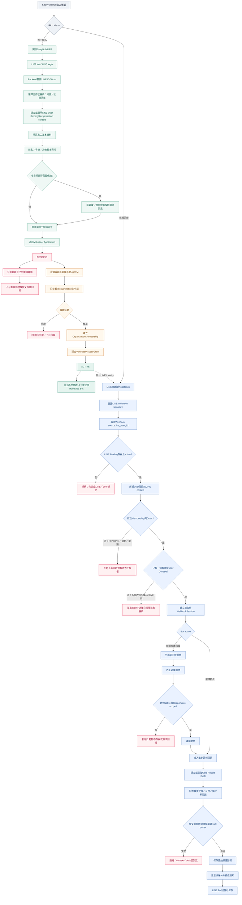
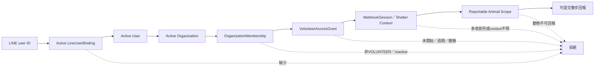

# 志工LIFF報名與LINE Bot散步回報流程

> 目的：確認志工從StrayHub Hub官方帳號完成LIFF報名、經合作收容所CRM核准後，能否在Hub LINE Bot中選擇「散步」並安全提交照護回報。
>
> 核心原則：LIFF負責身份綁定與志工申請；CRM負責資格審核；LINE Bot負責回報操作；Backend每次Webhook／postback都重新驗證有效Membership、Grant、Shelter Context與動物scope。

## 1. End-to-end flow



## 2. 授權判斷

Bot每次收到postback或訊息，都要重新套用：



有效志工授權條件：

```text
organization.status == active
user.status == active
membership.role == VOLUNTEER
membership.status == active
membership.valid_from <= database_now < membership.expires_at
grant.status == active
grant.valid_from <= database_now < grant.expires_at
grant.organization_id == membership.organization_id
grant.user_id == membership.user_id
grant.membership_id == membership.id
```

## 3. 狀態結果

| 條件 | LINE Bot結果 |
|---|---|
| 尚未完成LIFF綁定 | 要求先完成LINE／LIFF綁定 |
| 已報名但PENDING | 拒絕照護回報，只顯示審核狀態 |
| CRM拒絕 | 拒絕照護回報 |
| CRM核准且Grant ACTIVE | 可開始散步回報 |
| Grant尚未開始 | 拒絕 |
| Grant已過期 | 拒絕 |
| Grant已撤銷 | 拒絕 |
| 收容所停用 | 拒絕 |
| 同一志工有多個有效收容所 | 要求在LIFF選擇Shelter Context |
| 動物不在reportable scope | 拒絕 |
| draft不屬於該志工或該organization | 拒絕 |

## 4. 邊界與資料流

```text
LIFF：
  LINE identity綁定、選擇合作收容所、shelter context、志工申請、基本資料、條件式保險資料

CRM：
  收容所管理員審核、建立Membership與Grant、撤銷／到期管理

LINE Bot：
  顯示照護選單、選擇動物、選擇散步、逐題回報、通知結果

Backend：
  Webhook signature、LINE binding、tenant scope、Membership、Grant、
  WebhookSession、reportable scope、draft owner、提交時重新驗證

Database：
  以organization_id與user_id雙重隔離；不信任postback內的organization或role
```

## 5. 需要團隊確認的產品決策

1. Hub官方帳號Rich Menu是否顯示`志工報名`、`照護回報`、`領養媒合`三個入口？
2. 一位志工同時支援多個收容所時，是否要求先在LIFF選擇目前服務單位？
3. 散步回報是否需要照片、備註、異常狀況與通知管理員？
4. Grant被撤銷或到期時，是否要主動透過Hub LINE Bot通知志工？
