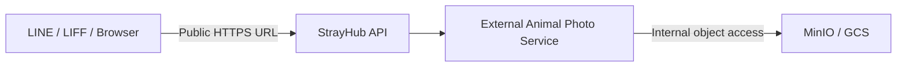
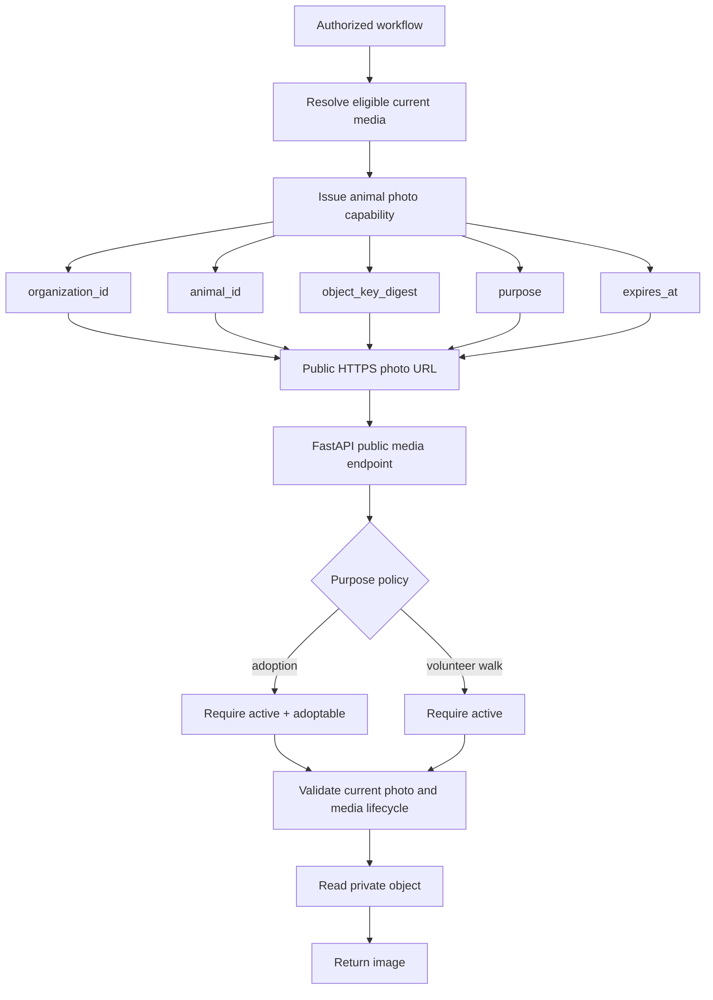
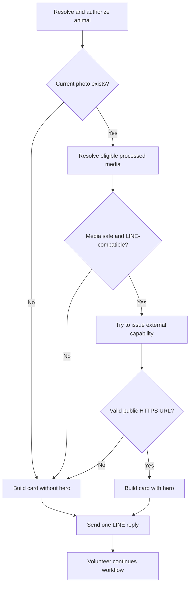
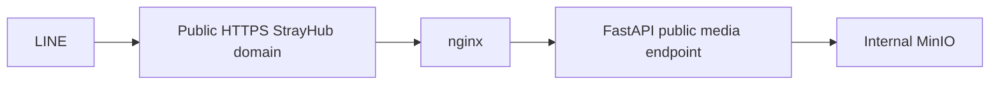

# Fix Animal Photo — Implementation Plan

## 1. Confirmed Root Cause

The LINE walk-report animal confirmation flow currently treats an object-storage URL as an external presentation URL:

```text
POST /v1/line/webhook
→ webhook()
→ _handle_postback()
→ action=select_animal
→ AnimalSelectionService.confirm()
→ VolunteerReportingAuthorizationService.authorize()
→ AnimalRepository.get()/get_with_area()
→ _walk_confirmation_bubble()
→ MediaAccessService.signed_url()
→ MinioStorageAdapter.signed_url()
→ animal_confirmation_bubble(photo_url=...)
→ Flex hero.url
→ LINE Messaging API
```

`MinioStorageAdapter.signed_url()` signs against the configured `MINIO_ENDPOINT`. In local development this can produce URLs such as `http://127.0.0.1:9000/...`; the checked-in GCP topology uses the internal Compose endpoint `http://minio:9000/...`. These addresses are not public HTTPS resources and are not valid LINE Flex image URLs. LINE consequently rejects the entire message at `/hero/url` before the volunteer receives the animal confirmation actions.

This is a storage-versus-presentation boundary defect, not a missing database record and not primarily a merge-conflict defect. A storage adapter answers how the API reaches private object storage. A LINE message needs a separately authorized, externally reachable StrayHub HTTPS URL.

The fix must not alter MinIO into a public presentation server:

> Do not expose MinIO to the public internet.
>
> Do not change `MINIO_ENDPOINT` to an external HTTPS endpoint as the fix.

MinIO must remain private and reachable only by the API and trusted internal services. The StrayHub API remains responsible for authorization, tenant isolation, media lifecycle validation, and external delivery.

Confirmed repository locations:

- `services/api/app/api/line_webhook.py`: webhook routing, `_line_public_base_url()`, `_animal_photo_url()`, `_walk_confirmation_bubble()`, and all three walk-selection paths.
- `services/api/app/application/animal_selection.py`: `AnimalSelectionService.confirm()` and QR/search candidate resolution.
- `services/api/app/application/volunteer_reporting_authorization.py`: effective volunteer membership/grant authorization.
- `services/api/app/persistence/repositories/animal_repository.py`: organization-scoped animal queries.
- `services/api/app/application/media_access.py`: current adoption capability token and `MediaAccessService`.
- `services/api/app/infrastructure/storage/minio.py`: MinIO object access and presigned URL generation.
- `services/api/app/application/line_message_presenter.py`: `animal_confirmation_bubble()` and Flex `hero.url` assembly.
- `services/api/app/infrastructure/line/messaging_api_adapter.py`: final LINE reply boundary.

## 2. Goals

1. Replace direct storage URL generation in every walk-confirmation entry path with one shared external animal-photo capability.
2. Ensure every walk image URL placed in a LINE payload is an externally reachable StrayHub HTTPS URL.
3. Support active, non-adoptable animals in authorized volunteer walk flows.
4. Preserve the existing adoption photo endpoint and its current callers.
5. Keep tenant isolation, current-object binding, media processing checks, and EXIF sanitization fail-closed.
6. Make animal photos optional: missing, invalid, unsupported, or unavailable photos produce a complete confirmation card without a hero image.
7. Prevent internal MinIO/GCS endpoints, loopback addresses, private storage hostnames, and plain HTTP URLs from entering LINE image fields.
8. Cover text-search single-result, `select_animal` postback, and QR-based selection with the same code path and regression tests.
9. Keep this change additive and avoid a database migration.
10. Validate the full public HTTPS delivery path in GCP with a real LINE smoke test before considering the work complete.

## 3. Non-Goals

The following are explicitly outside this fix:

- Exposing MinIO publicly.
- Changing MinIO networking or changing `MINIO_ENDPOINT` into a public HTTPS endpoint.
- Migrating storage providers or replacing MinIO with GCS.
- CDN introduction.
- ETag or `Last-Modified` optimization.
- Immutable public image URLs or photo-version architecture.
- Broad browser image-cache redesign.
- Large frontend or LIFF refactoring.
- Migrating every existing media consumer in the same change.
- Implementing a generic retry for `send invalid Flex → LINE 400 → retry without hero`.
- Changing adoption eligibility rules.
- Adding a database migration unless implementation uncovers an unavoidable persisted-data requirement and receives separate approval.

Phase 1 must prevent invalid LINE payloads before sending. It must not infer that an arbitrary LINE 400 was caused by an image, and it must not consume or reuse reply tokens through speculative retries.

## 4. Existing Architecture

The repository currently has two URL models.

### Storage URLs

`ObjectStoragePort.signed_url()` and `MediaAccessService.signed_url()` produce URLs for the configured object-storage endpoint. Current production call sites include:

- Walk-report LINE confirmation in `services/api/app/api/line_webhook.py`.
- LINE growth-diary history in `services/api/app/api/line_webhook.py`.
- LIFF/volunteer animal selection responses in `services/api/app/api/animal_selection.py`.
- The authenticated staff download-URL endpoint in `services/api/app/api/media.py`.

These URLs can be appropriate only when the intended consumer can reach the storage endpoint and the exposure is intentional. They are not suitable for LINE when MinIO is private.

### External media URLs

The adoption flow already uses this pattern:

```text
_animal_photo_url()
→ issue_adoption_photo_token()
→ https://<WEB_PUBLIC_BASE_URL>/v1/public/adoption/animals/{animal_id}/photo?token=...
→ FastAPI validates token, tenant, animal, and media
→ FastAPI reads private MinIO content
→ image response
```

The current adoption endpoint requires:

- The token purpose to be `public_adoption_photo`.
- A valid token signature and expiry.
- Token animal ID to match the route animal ID.
- Token organization ID to scope the database session and repository.
- The current object-key digest to match the digest in the token.
- `animal.status == "active"`.
- `animal.is_adoptable == true`.
- A non-null `current_photo_key`.
- A matching tenant-scoped `MediaAsset`.
- `media.status == "processed"`.
- `media.exif_removed == true`.
- An image content type.

That endpoint is intentionally adoption-specific. An active animal with `is_adoptable == false` is a valid walk-report subject but receives 404 from the adoption endpoint.

The target boundary is:



Storage location and external presentation URL remain different responsibilities.

## 5. Target Architecture

Introduce a shared external animal-photo capability while retaining purpose-specific policy.

### Capability claims

Use a common claims model in the existing media-access application layer. Names should follow the repository's current `issue_*_token()` and `verify_*_token()` conventions. The claims must include:

```text
purpose
organization_id
animal_id
object_key_digest
expires_at
```

Initial supported purposes:

- `public_adoption_photo`
- `volunteer_walk_photo`

The implementation may use a `Literal`, enum, or validated string consistent with nearby code. Unknown purposes must fail closed. The existing HMAC secret can continue to sign these short-lived capabilities; no new persisted field is needed.

### Purpose-specific policy

```text
public_adoption_photo
→ animal is active
→ animal is adoptable

volunteer_walk_photo
→ animal is active
→ animal need not be adoptable
→ capability is issued only after the existing volunteer authorization flow succeeds
```

The public endpoint cannot authenticate the LINE user when LINE fetches the image. The signed capability is therefore bearer authorization for exactly one organization, animal, current object, purpose, and expiry. Volunteer membership/grant authorization occurs before issuance in the webhook flow; the endpoint revalidates token scope and resource state rather than attempting to recreate LINE-user authentication.

### Shared media validation

Extend the existing `services/api/app/application/media_access.py` rather than creating a parallel media subsystem. Add or refactor a shared service/function that resolves a capability to a safe media record. It must:

1. Verify signature, purpose, animal ID, organization ID, object-key digest, and expiry.
2. Set/query the tenant scope using the organization from verified claims.
3. Load the animal through an organization-scoped repository.
4. Apply the selected purpose policy.
5. Require the token to match the animal's current photo key.
6. Load the matching `MediaAsset` using both organization ID and object key.
7. Require processed status and EXIF removal.
8. Apply content-type policy.
9. Return only the object reference and response metadata needed by the API layer.

Expected endpoint:

```text
GET /v1/public/animals/{animal_id}/photo?token=...
```

Expected builder responsibility:

```text
authorized workflow + animal + public base URL + purpose
→ validate known media eligibility
→ issue short-lived capability
→ return StrayHub public HTTPS URL

known unavailable/unsafe photo
→ return None
```

The generic endpoint reads bytes through `ObjectStoragePort`/`MinioStorageAdapter` internally. It never redirects to MinIO and never returns a storage URL.



### LINE content types

LINE-targeted image URLs should only be issued for content types supported by the LINE Flex image contract, initially:

- `image/jpeg`
- `image/png`

If an existing photo is WebP or another image type, Phase 1 must omit the hero and preserve the walk workflow. Phase 1 does not add transcoding. Existing management/browser endpoints must retain their current content-type behavior, and the legacy adoption endpoint must not be silently narrowed without a compatibility test. A later task may normalize LINE-facing images or introduce derived assets.

### URL validation defense-in-depth

The external builder is the primary guarantee. Before any URL is inserted into a LINE image component, a reusable presentation-boundary helper must additionally require:

- Scheme exactly `https`.
- A non-empty hostname.
- No username/password authority component.
- Host is not `localhost`, `127.0.0.1`, `::1`, or an internal MinIO Compose hostname.
- Host is not an IP in loopback, private, link-local, or reserved ranges.

The helper should parse URLs with standard URL parsing and IP-address utilities rather than relying on substring matching. It returns the normalized URL or `None`; it does not raise for an optional image. This is defense-in-depth and not a substitute for constructing URLs from a reviewed `WEB_PUBLIC_BASE_URL`.

## 6. Security / Tenant Boundary

The implementation must preserve the project's multi-shelter isolation rules:

1. Never accept organization ID from the public route or query as authority. Derive it only from a verified capability.
2. Verify the route animal ID against the signed animal ID before database access.
3. Set RLS/session organization scope from verified claims before loading shelter-owned data.
4. Use `AnimalRepository(session, claims.organization_id)` or an equivalent tenant-scoped query.
5. Query `MediaAsset` with both `organization_id` and the animal's current object key.
6. Compare object-key digests using constant-time comparison.
7. Reject a token if the current photo has changed since issuance.
8. Reject expired, malformed, unknown-purpose, cross-animal, and cross-organization capabilities with the same non-enumerating 404 behavior.
9. Never include raw MinIO credentials, bucket topology, internal hostnames, or object-storage URLs in public responses or logs.
10. Keep `X-Content-Type-Options: nosniff` on image responses.
11. Keep the capability short lived. Retain 300 seconds initially for compatibility; validate the practical LINE fetch window during GCP smoke testing before changing TTL.
12. Issue `volunteer_walk_photo` only after `VolunteerReportingAuthorizationService.authorize()` and tenant-scoped animal selection have succeeded.

Expected endpoint policy failures return 404 and do not reveal whether the animal, shelter, media, or token component was invalid.

No database migration is expected: all required claims derive from existing animal and media fields and are carried in the signed token.

## 7. Walk Report Changes

Remove this responsibility from `_walk_confirmation_bubble()`:

```text
MediaAccessService(MinioStorageAdapter(), organization_id).signed_url(...)
```

Replace it with one external-photo builder invocation:

```text
authorized candidate
+ organization_id
+ public_base_url
+ purpose=volunteer_walk_photo
→ public StrayHub HTTPS URL or None
```

### Parameter threading

`webhook()` already computes `public_base_url = _line_public_base_url(request)`. Thread this value through the walk call chain instead of recomputing request state or reading MinIO configuration:

```text
webhook()
→ _handle_postback(..., public_base_url=...)
→ _search_result_bubble(..., public_base_url=...)
→ _walk_confirmation_bubble(..., public_base_url=...)
```

The QR path inside `webhook()` must pass the same value directly to `_walk_confirmation_bubble()`.

### Three required entry paths

All of these must converge on the same `_walk_confirmation_bubble()` and external-photo builder:

1. Text search returning exactly one animal through `_search_result_bubble()`.
2. `action=select_animal` handled by `_handle_postback()` after a list/search selection.
3. QR image resolution through `AnimalSelectionService.resolve_qr()`.

The implementation must search every `_walk_confirmation_bubble()` call site after editing and prove that none can omit the external-photo context or fall back to `MediaAccessService.signed_url()`.

No LINE walk payload may contain:

```text
http://localhost
http://127.0.0.1
http://minio
http://10.*
private/reserved IP storage hosts
direct MinIO or GCS object URLs
```

The existing animal confirmation body and actions remain unchanged.

## 8. Fail-Soft Behavior

The photo is an enhancement, not a workflow dependency.



Expected fallback for all optional-photo failures is `photo_url = None`.

The walk confirmation builder must catch/log sanitized diagnostic context and continue without a hero for:

- Missing `current_photo_key`.
- Missing `MediaAsset`.
- Media not yet processed.
- EXIF not removed.
- Unsupported LINE image content type.
- Capability token generation failure.
- External media URL builder failure.
- Missing or invalid public base URL.
- A generated URL that fails the final LINE URL validator.

Logging must not include capability tokens, raw object-storage URLs, credentials, or sensitive object paths. Expected media-unavailable states should not produce noisy exception traces; unexpected token/build failures should include a stable error code and correlation context.

`animal_confirmation_bubble(photo_url=None)` must continue to include:

- Animal name.
- Shelter number.
- Area.
- Organization name when available.
- `確認是這隻` action.
- `重新選擇` action.

Phase 1 sends exactly one prevalidated reply. It does not retry a rejected LINE request without the hero.

An outage occurring after issuance, while LINE fetches the public image URL, cannot be made impossible without synchronously reading the full object before reply. The endpoint must still fail closed, while the Flex actions remain independent of the image. GCP smoke testing must verify actual client behavior for a temporarily unavailable image.

## 9. Backward Compatibility

The rollout is additive:

1. Keep `GET /v1/public/adoption/animals/{animal_id}/photo?token=...` operational.
2. Keep `issue_adoption_photo_token()` and `verify_adoption_photo_token()` as compatible wrappers or retain their existing contract while delegating to shared claims verification.
3. Add the generic public animal-photo endpoint rather than replacing the adoption route immediately.
4. Allow the adoption endpoint to reuse shared tenant/media validation while preserving the active-and-adoptable policy and current 404 behavior.
5. Move only walk-report confirmation to `volunteer_walk_photo` in this fix.
6. Do not change frontend response contracts for `/v1/animals` or management animal APIs as part of this fix.
7. Do not alter the authenticated `/v1/media/{mediaId}/download-url` behavior in this fix.
8. Preserve the current adoption photo cache header unless separately reviewed; cache optimization is not required here.
9. Keep existing token invalidation behavior when an animal's current object key changes.
10. Regenerate or update checked-in API contract artifacts only for the additive generic endpoint, following the repository's existing OpenAPI workflow.

If generic claims are introduced underneath the adoption wrappers, existing adoption tokens issued immediately before a rolling deployment must remain verifiable for their remaining short TTL, or deployment must explicitly accept a maximum five-minute image-only compatibility window. Prefer preserving the payload shape and signature semantics so no window is needed.

## 10. Files Expected to Change

Only the following existing files are expected to change during implementation unless a discovered repository constraint is documented first.

| File | Existing/New | Expected responsibility change |
|---|---|---|
| `services/api/app/application/media_access.py` | Existing | Generalize capability claims/verification while preserving adoption wrappers; add purpose validation and shared external animal-photo eligibility/policy logic. |
| `services/api/app/api/media.py` | Existing | Add the generic public animal-photo route; delegate both generic and existing adoption routes to shared validation and internal storage reads without redirects. |
| `services/api/app/api/line_webhook.py` | Existing | Remove walk use of `MediaAccessService.signed_url()`; build a `volunteer_walk_photo` external URL; thread `public_base_url` through all three walk-selection paths. |
| `services/api/app/application/line_message_presenter.py` | Existing | Add/apply reusable LINE image URL validation at the presentation boundary; omit invalid hero URLs while preserving body/actions. |
| `packages/contracts/src/openapi.ts` | Existing | Refresh the checked-in generated OpenAPI TypeScript contract for the additive public endpoint if required by the repository generation workflow. |
| `specs/001-volunteer-care-report/contracts/openapi.yaml` | Existing | Document the additive public-photo contract if this feature contract remains the source used by repository checks; reconcile carefully with existing uncommitted user edits. |
| `tests/unit/test_adoption_photo_access.py` | Existing | Cover generic claims, purpose separation, compatibility wrappers, expiry, object-key replacement, and external URL construction. |
| `tests/integration/test_public_adoption_photo.py` | Existing | Extend the established public-photo fixture/style to cover the generic endpoint, non-adoptable walk policy, media lifecycle failures, and cross-tenant denial while retaining adoption tests. |
| `tests/unit/test_line_message_presenter.py` | Existing | Verify HTTPS hero inclusion and invalid/missing URL omission without losing identity details or actions. |
| `tests/unit/test_line_role_menu_actions.py` | Existing | Cover the three walk entry routes using one external builder and assert no storage URL enters emitted LINE payloads. |
| `tests/unit/test_settings_runtime_safety.py` | Existing | Add public-origin edge cases if URL validation is shared with settings or changes runtime validation behavior. |
| `tests/security/test_media_scope.py` and/or `tests/isolation/test_timeline_and_media_isolation.py` | Existing | Extend established tenant-isolation tests for the new capability and ensure Shelter A cannot resolve Shelter B media. |
| `tests/contract/test_gce_production_nginx_contract.py` | Existing | Confirm the generic `/v1/public/...` route remains covered by the existing `/v1/` proxy contract; change only if an explicit path assertion is warranted. |

Files not expected to change:

- `services/api/app/infrastructure/storage/minio.py`
- `services/api/app/infrastructure/storage/gcs.py`
- `services/api/app/infrastructure/storage/ports.py`
- GCP nginx configuration
- Docker Compose files
- Deployment environment templates
- Database models or migrations
- Frontend components

Implementation must begin with `git status` because several contract and volunteer-related files already contain unrelated user changes. It must preserve and reconcile those edits rather than overwrite them.

## 11. Test Plan

Reuse the repository's existing pytest style, `MockLineAdapter`, public-photo integration fixture, and tenant-isolation tests. Do not create a parallel test harness.

### Unit tests: capability claims and URL construction

Extend `tests/unit/test_adoption_photo_access.py`:

1. Generic capability round-trip preserves purpose, organization, animal, and object-key digest.
2. Adoption wrapper tokens remain valid and keep `public_adoption_photo` semantics.
3. `volunteer_walk_photo` cannot be verified as adoption and vice versa.
4. Unknown purpose is rejected.
5. Wrong animal ID is rejected.
6. Expired token is rejected.
7. Replacing `current_photo_key` causes old object-key verification to fail.
8. Builder returns a StrayHub generic HTTPS URL for eligible walk media.
9. Builder returns `None` when the public origin is absent or invalid.
10. Capability tokens and storage internals are not logged.

### Integration tests: public media endpoint

Extend `tests/integration/test_public_adoption_photo.py` using its existing database/storage monkeypatch pattern:

1. Active, adoptable animal with processed sanitized JPEG/PNG returns 200 through the existing adoption endpoint.
2. Active, adoptable animal also works through a correctly issued generic walk capability.
3. Active, non-adoptable animal returns 200 with `volunteer_walk_photo`.
4. The same non-adoptable animal remains 404 with `public_adoption_photo`.
5. Inactive animal returns 404 for both purposes.
6. Missing current photo returns 404.
7. Missing media row returns 404.
8. Pending/unprocessed media returns 404.
9. `exif_removed == false` returns 404.
10. Unsupported LINE content type is not issued for walk and/or returns the documented policy result.
11. Capability for Shelter A cannot expose an animal or media belonging to Shelter B.
12. Token for animal A cannot retrieve animal B.
13. Replacing the current photo invalidates the old token.
14. Expired and malformed tokens return the same non-enumerating 404.
15. Storage read failure returns 404 without leaking internal details.
16. Successful response retains correct `Content-Type` and `X-Content-Type-Options: nosniff`.

### Presenter and fail-soft tests

Extend `tests/unit/test_line_message_presenter.py`:

1. Valid public HTTPS URL produces `contents.hero.url`.
2. `photo_url=None` produces no hero.
3. HTTP URL produces no hero.
4. `localhost`, `127.0.0.1`, `::1`, `minio`, private IP, link-local IP, malformed URL, and credential-bearing URL produce no hero.
5. Every no-hero case still contains animal name, shelter number, area, organization, Confirm, and Reselect.

### Walk call-chain tests

Extend `tests/unit/test_line_role_menu_actions.py` with the repository's existing mocks/fixtures, or place focused tests beside the nearest established webhook tests only if fixture complexity requires it:

1. Text search with exactly one result calls the shared walk external-photo builder.
2. `select_animal` postback calls the same builder.
3. QR resolution calls the same builder.
4. Active adoptable animal emits a public StrayHub HTTPS hero URL.
5. Active non-adoptable animal emits a public StrayHub HTTPS hero URL.
6. No-photo animal emits no hero and retains both actions.
7. Pending media, unsanitized media, unsupported format, token exception, and invalid public origin emit no hero and retain both actions.
8. No test payload contains a direct object-storage URL.

### Architecture regression assertion

Add a reusable assertion for emitted LINE Flex image fields. Traverse nested `hero`, image components, carousel bubbles, and applicable LINE image URL fields. For the walk payloads in scope, assert:

```text
scheme == https
hostname is present
hostname is not loopback/private/link-local/reserved
hostname is not minio or another configured storage endpoint
URL belongs to the reviewed StrayHub public origin
```

Explicit regression inputs must include:

```text
http://localhost/...
http://127.0.0.1/...
http://minio:9000/...
http://10.0.0.1/...
https://10.0.0.1/...
```

### Existing coverage to retain

- `tests/unit/test_line_message_presenter.py`: confirmation card structure.
- `tests/unit/test_adoption_photo_access.py`: adoption token animal/object/expiry binding.
- `tests/integration/test_public_adoption_photo.py`: processed adoptable photo delivery and non-adoptable rejection.
- `tests/unit/test_line_role_menu_actions.py`: LINE menu/action routing.
- `tests/integration/test_line_webhook_idempotency.py`: webhook event lifecycle.
- `tests/security/test_line_webhook_signature.py`: webhook signature boundary.
- `tests/security/test_media_scope.py`: storage tenant scope.
- `tests/isolation/test_timeline_and_media_isolation.py`: cross-tenant media isolation.
- `tests/unit/test_settings_runtime_safety.py`: non-local public URL/runtime safety.
- `tests/contract/test_gce_production_nginx_contract.py`: `/v1/` route preservation and forwarded HTTPS headers.
- `tests/contract/test_storage_adapter_contract.py`: storage adapter behavior, which must remain unchanged.

### Validation commands

Run targeted tests first, using the repository's `uv` environment:

```bash
uv run pytest \
  tests/unit/test_adoption_photo_access.py \
  tests/unit/test_line_message_presenter.py \
  tests/unit/test_line_role_menu_actions.py \
  tests/integration/test_public_adoption_photo.py \
  tests/security/test_media_scope.py \
  tests/isolation/test_timeline_and_media_isolation.py \
  tests/unit/test_settings_runtime_safety.py \
  tests/contract/test_gce_production_nginx_contract.py
```

Then run focused lint and broader LINE/media regression coverage using scripts actually available in the repository:

```bash
uv run ruff check \
  services/api/app/application/media_access.py \
  services/api/app/api/media.py \
  services/api/app/api/line_webhook.py \
  services/api/app/application/line_message_presenter.py \
  tests/unit/test_adoption_photo_access.py \
  tests/unit/test_line_message_presenter.py \
  tests/unit/test_line_role_menu_actions.py \
  tests/integration/test_public_adoption_photo.py

uv run pytest tests/unit tests/integration tests/security tests/isolation tests/contract
```

Before handoff:

```bash
git diff --check
git status --short
```

## 12. GCP Smoke Test Plan

The automated suite cannot prove public DNS/TLS reachability or LINE's image-fetch behavior. After deploying the exact tested commit to GCP, validate:



### Pre-deployment checks

1. Record the exact release commit SHA.
2. Run the existing production preflight.
3. Confirm `WEB_PUBLIC_BASE_URL` is the reviewed canonical HTTPS origin with no path confusion.
4. Confirm DNS resolves publicly to the intended edge.
5. Confirm the TLS certificate chain and hostname are valid.
6. Confirm nginx preserves `/v1/public/animals/...` and sends it to FastAPI.
7. Confirm `MINIO_ENDPOINT` remains internal (`http://minio:9000` in the checked-in topology).
8. Confirm MinIO has no public host port or firewall exposure.

### External endpoint checks

Using short-lived synthetic capabilities generated through an authorized test flow, verify from outside the GCP private network:

1. Adoptable + processed JPEG/PNG photo returns 200.
2. Non-adoptable + processed JPEG/PNG photo returns 200 with volunteer-walk purpose.
3. No-photo animal results in a confirmation card without a hero.
4. Expired token returns 404.
5. Wrong-animal and cross-shelter token attempts return 404.
6. Response `Content-Type` matches the supported image type.
7. `X-Content-Type-Options: nosniff` is present.
8. Response body is delivered by FastAPI reading internal MinIO, not by redirecting to MinIO.

Do not store capability tokens in committed logs or screenshots. Redact query strings from captured evidence.

### Real LINE scenarios

With a controlled approved volunteer account, verify all three entry routes:

1. Text search with one result.
2. List/search followed by tapping an animal.
3. QR scan.

For each relevant route, verify:

- Adoptable animal: image, animal identity, Confirm, and Reselect display.
- Non-adoptable active animal: image and the same actions display.
- No-photo animal: no image, but all identity details and actions display.
- Confirm proceeds to the next walk-report step.
- Application logs contain no LINE `invalid uri scheme` response.
- Emitted payloads contain the public StrayHub hostname and no internal MinIO hostname.

Observe whether a 300-second token remains usable for LINE's initial fetch and normal chat reopening. If behavior is uncertain, record it as follow-up evidence; do not broaden this fix into cache/CDN work without a separate decision.

## GCP / Runtime Smoke Test Result

Implementation: merged to `main` through the scoped animal-photo change.

Controlled runtime validation: **PASS**.

Production GCP validation: **PENDING RELEASE VALIDATION** through the normal
`main → release → CI/CD → GCP` workflow. This is not an implementation blocker,
and this change does not modify or trigger the release branch.

Runtime validation performed on 2026-09-04 used the repository's guarded loopback demo database, the existing controlled LINE test account, and the configured HTTPS ngrok origin. The tested path was:

```text
LINE Desktop
→ controlled public HTTPS ngrok origin
→ Next.js /v1 proxy
→ FastAPI generic animal-photo endpoint
→ local private MinIO
```

The deterministic FurKids bootstrap had no eligible active non-adoptable animal, so `柴福福` (`SBA-20170922-001`) was temporarily changed only in the guarded loopback demo database. Before testing it was verified as active, non-adoptable, backed by processed EXIF-removed JPEG media, and carrying a current photo. The existing `scripts.bootstrap_demo` workflow restored the deterministic state immediately after the test and verified `is_adoptable=true` again.

| Runtime check | Status | Evidence |
|---|---|---|
| Public HTTPS endpoint | PASS | At 2026-09-04 01:16:29 +08:00 the generic `/v1/public/animals/{animal_id}/photo` request returned 200. The capability query value is intentionally omitted. |
| LINE Flex image rendering | PASS | LINE Desktop displayed the animal hero, shelter number, area, organization, Confirm, and Reselect controls. |
| Volunteer walk capability | PASS | The inspected signed payload purpose was `volunteer_walk_photo`; the capability itself was not printed or committed. |
| Non-adoptable animal | PASS | The active `is_adoptable=false` runtime fixture displayed its JPEG hero. The adoption policy was not changed. |
| No invalid URI errors | PASS | The tested walk Flex rendered successfully and no `invalid uri scheme` or `hero/url invalid` response was observed for this flow. |
| 300-second TTL behavior | RISK | The tested capability expired at 2026-09-04 01:21:29 +08:00. After expiry, leaving and reopening the same chat kept the image visible and caused no new request, demonstrating a cache hit. The same runtime also recorded another old Flex being re-requested after expiry and receiving repeated 404 responses, so cache behavior is not guaranteed across old messages/client state. Do not change TTL without a separate design decision. |
| MinIO remains internal | PASS | LINE received only the public application URL. The tunnel exposed the application proxy, not the MinIO endpoint; FastAPI read the object internally. |
| Canonical GCP chain | PENDING RELEASE VALIDATION | The active GCP release is `7ddeb79deedbfec238990d12bcd091a114c33953`, which predates the generic route. Current GCP nginx logs contain no generic animal-photo request, so `LINE → GCP nginx → FastAPI → internal MinIO` will be validated after the normal release workflow deploys this implementation. |

## Capability Logging Protection

Capability tokens are short-lived bearer credentials and must not be retained in permanent access logs.

### Uvicorn

Application startup now attaches the existing `SensitiveLogFilter` policy to `uvicorn.access`. Uvicorn's `AccessFormatter` requires its five positional record arguments, so the filter masks the request-target argument without flattening that record structure. Both animal-photo routes render `token=[REDACTED]`; no prefix, suffix, partial value, or hash is retained. Ordinary non-sensitive queries such as `/v1/animals?page=2` keep their existing logging behavior.

### nginx

The canonical GCP edge config and controlled local nginx template now identify these paths using `$uri`:

```text
/v1/public/animals/{animal_id}/photo
/v1/public/adoption/animals/{animal_id}/photo
```

Only matching requests use `strayhub_capability`, a log format containing `$request_method $uri $server_protocol` but no `$request`, `$request_uri`, `$args`, or Referer. All other requests continue using a combined-style `strayhub_standard` format that retains ordinary query logging. The policy applies to both the HTTP redirect server and HTTPS server so an accidentally submitted HTTP capability is not persisted before redirection.

### Development tunnel

Development tunnels may expose query strings in their own inspection console; do not use real long-lived secrets in such URLs. ngrok is not part of the production logging fix and was not modified.

### Tests

- Security tests use Uvicorn's real `AccessFormatter` to verify generic and adoption capabilities are redacted and ordinary query logging is preserved.
- GCP and local nginx contract tests verify route matching, the query-free capability format, and continued standard logging for other routes.
- A real loopback Uvicorn process emitted both capability routes with `token=[REDACTED]`, retained `page=2` for an ordinary query, and produced no formatter error.
- The repository's local nginx helper passed syntax validation and API/Web routing checks with the updated template.

## 13. Risks

| Risk | Impact | Mitigation |
|---|---|---|
| Generic capability accepts the wrong purpose | Adoption or volunteer policy bypass | Verify an explicit allow-listed purpose and pass the expected purpose at each endpoint/builder boundary. |
| Organization claim is trusted before signature validation | Cross-shelter data exposure | Verify token fully before setting scope; use verified organization ID only. |
| Animal/object changes after issuance | Stale photo exposure | Bind token to animal and current object-key digest; re-check at fetch time. |
| Walk URL is issued before volunteer authorization | Public bearer URL created for unauthorized actor | Keep issuance after existing membership/grant and animal authorization. |
| Expected media failures still raise | Walk workflow remains fragile | Convert expected optional-photo states to `None`; test every lifecycle state. |
| Valid HTTPS points to private/reserved host | LINE cannot fetch and internal topology may leak | Construct from reviewed public origin and apply parsed hostname/IP defense-in-depth validation. |
| Existing WebP photos are used in LINE | Broken/missing LINE image | Restrict LINE issuance to JPEG/PNG and omit hero; defer transcoding. |
| Adoption compatibility breaks during claims refactor | Existing adoption cards lose images | Preserve wrapper functions, endpoint path, payload semantics, and current tests. |
| Mock LINE adapter accepts invalid payloads | Regression escapes automated tests | Add explicit URL-policy traversal assertions plus real GCP/LINE smoke. |
| Capability token appears in logs | Short-lived media access leaks | Never log full public URL/query; sanitize exceptions and smoke evidence. |
| Dirty worktree changes are overwritten | Unrelated user work is lost | Inspect status/diff before every edit and make narrowly scoped patches. |
| Scope expands into all-media migration | Review and release risk increase | Limit production migration to walk confirmation plus naturally shared capability code. |

## 14. Follow-Up Work

These issues are known but are not blockers for the walk fix:

1. **LINE growth-diary history — high-priority follow-up.** It currently places MinIO signed URLs into LINE Flex images. Migrate it to the same external media capability in the next focused task, with a growth-diary-specific purpose and policy if required.
2. **LIFF animal selection — separate evaluation.** `/v1/animals` and confirm responses currently expose MinIO signed URLs. Determine whether they should use the generic StrayHub capability or an authenticated relative media endpoint.
3. **Staff signed-download API — intentional exception review.** `/v1/media/{mediaId}/download-url` intentionally returns a storage signed URL to authorized staff. Document the boundary and retain it unless private MinIO reachability makes the API unusable in deployed browsers.
4. **Adoption LINE image formats.** Review existing WebP/other media and decide whether to normalize, derive JPEG/PNG, or omit unsupported heroes.
5. **Capability TTL evidence.** Controlled LINE Desktop reopening produced a cache hit after expiry, but another old Flex was re-requested and received 404 after expiry. Treat 300 seconds as a documented runtime risk; collect GCP and mobile-client evidence before changing the lifetime.
6. **Browser caching.** Review management `private, no-store`, blob URL lifecycle, LIFF signed-URL churn, and conditional caching separately.
7. **CDN and immutable assets.** Consider only after privacy, capability, and invalidation semantics are approved.
8. **Broader LINE media validator adoption.** Apply the reusable presentation helper to adoption and growth-diary builders after walk behavior is stable.
9. **Logging coverage beyond animal-photo capabilities.** The Uvicorn filter naturally masks token-like query values, but nginx route-specific protection currently covers only the two animal-photo capability paths. Separately review LIFF `qr_token`, shelter entry-reference query values, and any future public capabilities before declaring a broader query-credential logging policy.

## 15. Implementation Order

### Phase 1 — Shared External Animal Photo Capability

1. Add generic capability claims and allow-listed purposes in `media_access.py`.
2. Preserve adoption issue/verify wrappers and token compatibility.
3. Add shared tenant-scoped animal/media lifecycle validation.
4. Add the generic public endpoint in `media.py`.
5. Keep the existing adoption endpoint and delegate shared work without changing its policy.
6. Add focused capability and endpoint tests before integrating LINE.

### Phase 2 — Walk Report Integration

1. Add the external walk-photo URL builder using `volunteer_walk_photo`.
2. Remove `MediaAccessService.signed_url()` from `_walk_confirmation_bubble()`.
3. Thread `public_base_url` from `webhook()` through `_handle_postback()` and `_search_result_bubble()`.
4. Update text-single-result, `select_animal`, and QR call sites.
5. Confirm no `_walk_confirmation_bubble()` call path can generate a storage URL.

### Phase 3 — Fail-Soft Presentation Boundary

1. Add the reusable LINE image URL validator.
2. Convert missing/unsafe/ineligible image states to `photo_url=None`.
3. Preserve the complete confirmation body and both actions without a hero.
4. Do not add LINE 400 retry behavior.

### Phase 4 — Automated Regression Coverage

1. Add adoptable and non-adoptable walk-photo tests.
2. Add no-photo, pending-media, EXIF, format, invalid-origin, and token-failure tests.
3. Add purpose, expiry, current-object, and cross-shelter tests.
4. Add all-three-entry-path tests.
5. Add architecture assertions preventing storage URLs in walk LINE payloads.
6. Run targeted then broader LINE/media suites, lint, and diff checks.

### Phase 5 — GCP and Real LINE Smoke

1. Deploy the exact tested commit through the existing release/preflight process.
2. Verify public HTTPS → nginx → FastAPI → internal MinIO externally.
3. Verify adoptable, non-adoptable, no-photo, and invalid-token scenarios.
4. Exercise all three selection entry routes with a controlled volunteer account.
5. Record sanitized evidence tied to the exact release commit.

### Future Phase

1. Migrate LINE growth diary to external media capability.
2. Evaluate LIFF animal selection and the staff signed-download exception.
3. Review image normalization, browser caching, token TTL, CDN, and immutable URL design.

## 16. Acceptance Criteria

- **AC-01:** Walk-report LINE messages never directly use MinIO/GCS object-storage URLs.
- **AC-02:** Walk-report image URLs inserted into LINE are public HTTPS StrayHub URLs.
- **AC-03:** MinIO remains internal/private and is not exposed or reconfigured as the public image origin.
- **AC-04:** An active non-adoptable animal can display a walk-report photo through `volunteer_walk_photo`.
- **AC-05:** An animal without a photo can still complete walk reporting.
- **AC-06:** Missing media, pending media, unsupported format, token-generation failure, and external URL failure cannot block walk reporting.
- **AC-07:** Media without completed EXIF removal is not exposed.
- **AC-08:** A capability scoped to Shelter A cannot retrieve an animal or media from Shelter B.
- **AC-09:** Replacing an animal's current photo invalidates a capability bound to the old object key.
- **AC-10:** Text-search single-result, `select_animal` postback, and QR resolution use the same external-photo builder and policy.
- **AC-11:** Existing adoption photo URLs, token wrappers, active/adoptable policy, and tested response behavior remain compatible.
- **AC-12:** No database migration is added unless an unexpected persisted-data requirement is documented and separately approved.
- **AC-13:** Existing server-side tenant isolation, RLS scope, membership/grant authorization, and non-enumerating denial behavior are preserved.
- **AC-14:** Automated tests prevent `localhost`, `127.0.0.1`, `::1`, `minio`, private/reserved IP storage hosts, direct object-storage URLs, and plain HTTP URLs from reaching walk-report LINE image fields.
- **AC-15:** Without a usable image, the confirmation card still contains animal name, shelter number, area, organization when applicable, Confirm, and Reselect.
- **AC-16:** GCP smoke testing verifies `LINE → public HTTPS → nginx → FastAPI → internal MinIO` successfully for the exact release commit.
- **AC-17:** LINE-facing walk photos are limited to explicitly supported content types; unsupported existing images degrade to no hero without changing non-LINE consumers.
- **AC-18:** Phase 1 prevents invalid payloads before send and does not implement generic LINE 400 retry behavior.
- **AC-19:** Capability tokens, internal storage URLs, credentials, and raw object paths are absent from application logs and committed smoke evidence.
- **AC-20:** Targeted tests, relevant broader regression tests, lint, `git diff --check`, and final worktree review pass before implementation handoff.

### Runtime acceptance status — 2026-09-04

```text
AC-01: PASS
AC-02: PASS — controlled public HTTPS runtime
AC-03: PASS
AC-04: PASS — active non-adoptable LINE runtime fixture rendered its hero
AC-05: PASS
AC-06: PASS
AC-07: PASS
AC-08: PASS
AC-09: PASS
AC-10: PASS
AC-11: PASS
AC-12: PASS
AC-13: PASS
AC-14: PASS
AC-15: PASS
AC-16: PENDING RELEASE VALIDATION — controlled runtime passed; canonical GCP validation awaits the normal main → release workflow
AC-17: PASS
AC-18: PASS
AC-19: PASS — Uvicorn masks capability values and nginx uses query-free logs for both photo routes
AC-20: PASS
```
