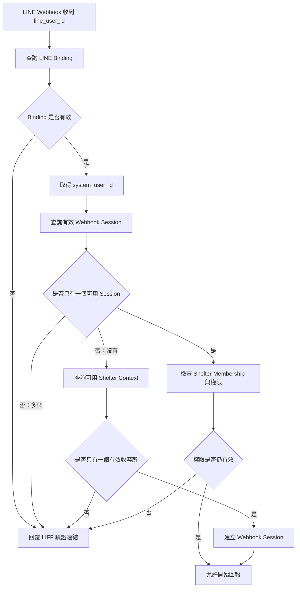

# 實作計畫：志工日常照護回報與動物近期歷程

**分支**：`001-volunteer-care-report` | **日期**：2026-08-07 | **規格**：[spec.md](spec.md)

**輸入**：來自 `specs/001-volunteer-care-report/spec.md` 的功能規格，以及使用者提供的「開發與部署階段」約束。

## 摘要

本功能規劃為一個本機優先的多收容所平台，包含 LINE Bot 主要回報流程、Next.js LIFF 輔助與管理介面、FastAPI CRM 邊界服務、Background Worker，以及由 PostgreSQL 保存的正式業務資料。開發與整合測試使用 Docker Compose 啟動 PostgreSQL、MinIO 與必要的本機基礎服務；Next.js 與 FastAPI 直接以開發模式執行，以保留 Hot Reload。

所有動物、收容所、使用者、照護回報、照片、AI 結果與稽核資料透過 CRM 邊界管理。每一次資料存取都先依已驗證身分判定 Shelter 範圍。AI 以非同步 Job 處理，不能阻塞人工回報，也不能覆蓋原始資料。

GCP 只在本機品質門檻全部通過後建立 Demo 環境。Demo 使用 Cloud Run、Cloud SQL for PostgreSQL、Cloud Storage、Secret Manager、Artifact Registry 與 Cloud Logging；MinIO 僅供本機開發與整合測試使用。正式部署不在本 feature 的交付範圍內。

## 管理工作台整體設計基線

本次管理入口不採逐頁補功能的方式，而是先建立共通的 Management App Shell，再將既有
Timeline、收容所管理與觀察語彙頁面納入同一個工作流。完整資訊架構、角色導航矩陣、
API 缺口、交付階段與完成定義記錄於
[management-workbench-plan.md](management-workbench-plan.md)。

整體入口的決策如下：

- `/` 是角色感知的工作台首頁，顯示今日摘要、待處理事項與快速入口；不再以第一隻
  動物作為正式首頁行為。
- `/animals` → `/animals/:animalId` → `/animals/:animalId/timeline` 是工作人員的主要
  動物工作流；志工的 `/animal-confirmation` 與 `/care-report` 保持手機優先的獨立流程。
- Login、Refresh、Logout、Active Shelter Context、角色導覽、API client、錯誤狀態與
  Session 失效處理由共通 Shell 管理，不由每個頁面重複實作。
- `ORG-A` 僅是本機 Seed 的預設展示 Context；正式產品必須依登入帳號的有效 Membership
  讓使用者明確選擇 Context。
- 在 Dashboard、動物管理、回報收件匣、Reportable Scope、QR／Cage／Area、AI 覆核與
  Audit 查詢所需的 API 契約完成前，不以多個低階 endpoint 拼成看似完整的孤立 UI。

## 技術脈絡

**語言／版本**：Next.js 使用 TypeScript；FastAPI 與 Background Worker 使用 Python。Python 專案命令與環境管理採用 `uv`；Python 與 Node.js 的精確版本在實作階段依專案工具鏈鎖定，但必須可在本機與 Demo 環境重現。

**主要依賴**：Next.js Development Server、FastAPI Development Server、SQLAlchemy 2.x、Alembic、`asyncpg`、`argon2-cffi`、`PyJWT[crypto]`、`cryptography`、PostgreSQL Container、MinIO Container、Background Worker、Docker Compose、Mock LINE／LIFF Context、Mock LINE Adapter、正式 LINE Messaging API Adapter、Mock AI Service 或測試用 AI Adapter，以及由 `openapi-typescript` 產生的 TypeScript Contract Types。GCP Demo 依賴 Terraform、Cloud Run、Cloud SQL for PostgreSQL、Cloud Storage、Secret Manager、Artifact Registry 與 Cloud Logging。

**儲存**：PostgreSQL 保存 CRM 正式資料、權限範圍、回報、AI 狀態與稽核資料；本機物件檔案使用 MinIO；Demo 物件檔案使用 Cloud Storage。Application Layer 只能透過共通 Object Storage Interface 存取檔案。

**測試**：Python 使用 Ruff 與 Pytest；前端測試工具與命令必須在 `apps/web/package.json` 固定；另需提供 `tests/contract`、`tests/unit`、`tests/integration`、`tests/security`、`tests/isolation`、`tests/frontend` 與 `tests/e2e`。驗證範圍包含 OpenAPI 與生成型別漂移、Authentication Session 生命週期、Database Scope Setter、Repository／RLS、多租戶隔離、Alembic migration、Object Storage Adapter、正式 LINE Adapter Contract、Webhook Signature、Event Idempotency、Rich Menu、Postback State Machine、LIFF、QR Code、EXIF 清理與 AI 失敗降級。

**目標平台**：本機 Docker Compose 加直接執行的 Next.js／FastAPI／Worker；GCP Demo 使用 Terraform 管理 Cloud Run、Cloud SQL、Cloud Storage、Secret Manager、Artifact Registry 與 Cloud Logging。

**專案類型**：多租戶 Web application，包含手機優先前端、CRM API、非同步 Worker 與本機／GCP 基礎服務。

**效能目標**：至少 80% 測試志工在 90 秒內完成標準回報；工作人員在兩秒內看到近 14 天主要摘要；前端主要流程與隔離驗收以使用者可觀察結果為準，不以單一 API 延遲取代使用者成功條件。

**限制**：本機日常開發、單元測試與主要整合測試不得要求連接 GCP 正式資源；所有正式資料必須歸屬單一 Shelter；資料隔離不得只靠前端；AI 不得診斷、計分、排序、修改正式狀態或阻塞人工回報；Demo 不得包含真實個資或正式收容所敏感資料。

**規模／範圍**：第一階段支援多個台灣收容所或中途機構、相同 Shelter Number 在不同 Shelter 並存、`PLATFORM_ADMIN` 使用平台級 `PLATFORM` Scope 且不建立 Shelter Membership、一般角色依授權 Shelter 範圍操作、志工可被授權多個 Shelter 但同一時間只有一個目前服務中的 Shelter，以及同日多筆 Daily Care Report。精確使用者數、動物數與併發容量不是本 feature 的已知驗收數字，實作任務需保留可調整設定，不得把未確認容量誤寫成產品承諾。

## Constitution Check

### Gate：Phase 0 前

- **I. CRM 為唯一事實來源：通過。** PostgreSQL CRM 是正式資料來源；Next.js、LINE Bot、LIFF、QR Code、AI 與 Worker 不保存獨立正式業務副本。
- **II. 原始資料不得被衍生結果取代：通過。** Daily Care Report、Volunteer Note、Photo、原始 AI 輸出與人工覆核分開保存。
- **III. AI 不負責計算、診斷或最終判定：通過。** AI Job 只產生描述性觀察，所有限制與人工確認邊界列入 contract。
- **IV. AI 結果必須驗證、標示與追溯：通過。** AI 結果必須保留來源、Provider、Model Name／Version、Prompt Template／Version、Schema Version、原始輸出、處理狀態與人工修正。
- **V. 志工回填必須低摩擦：通過。** LINE Bot 的單題 Quick Reply／Postback、90 秒目標、圖片訊息、Mock LINE Adapter 與 AI 非同步均列入設計；LIFF 只作為輔助介面。
- **VI. 歷史紀錄必須完整且可追溯：通過。** 同日多筆保存、近 14 日逐日檢視、無回報日期與更早歷史查詢列入資料模型與 quickstart。
- **VII. LINE Bot 是主要輸入通道：通過。** Rich Menu、Quick Reply、Postback、Message／Image Event 與 Webhook 是本 Feature 範圍；Webhook 必須先驗證原始 Body 簽章並依 `webhookEventId` 冪等處理。LIFF 負責身分綁定、完整確認、答案修改、長文字與 Bot 備援，FastAPI 仍是唯一正式權限與 CRM 邊界。
- **VIII. 權限、隱私與稽核預設啟用：通過。** 一般角色的每一個資料操作均帶有已驗證的 Shelter 範圍；`PLATFORM_ADMIN` 以平台級 `PLATFORM` Scope 執行跨機構管理並留下 Audit Record；本 Feature 不建立公開頁面，未登入與未授權存取採一致拒絕。
- **IX. P0 不得依賴 P1 或 P2：通過。** US1、LINE Bot US2 與歷程 US3 不依賴 AI；本機流程不依賴 GCP；真實 LINE 行為以 Mock Adapter 與受控 HTTPS 測試路徑隔離。
- **X. 正體中文與 Python 品質門檻：通過。** 本計畫與產物使用台灣正體中文；Python 品質門檻為 `ruff check .`、`ruff format --check .` 與 `pytest`。
- **XI. 多收容所資料隔離：通過。** 所有 query、command、圖片存取與修改都在後端依 Shelter 授權範圍強制判定；本 Feature 不提供批次匯出；A／B 隔離測試為 Demo 門檻。

**Gate 結論**：D-001～D-010 與本輪 LINE Bot、平台級 `PLATFORM_ADMIN` Scope、Webhook Session 解析、PostgreSQL RLS、Database Scope Setter、Authentication API、正式 LINE Adapter、Observation／Job Foundational 邊界、OpenAPI Contract Types、測試目錄、Terraform 與 `uv` 決策已同步至本計畫與 Phase 1 設計方向。`tasks.md` 已依管理工作台規劃重產，US3 優先級已與 spec 一致為 P3；最新 Analyze 結果為 `CRITICAL = 0`、`HIGH = 0`。本文件沒有以降低 Constitution 要求方式處理的例外。

### Gate：Phase 1 後

**重新檢查結果：通過。** Phase 1 設計已同步 LINE Bot／LIFF 邊界、Webhook Signature、Event Idempotency、Bot State Machine、圖片訊息、平台級 `PLATFORM_ADMIN` Scope、Webhook Session 解析、PostgreSQL RLS／Database Scope Setter、Authentication API、`Argon2id` Password Hash、`RS256` JWT Access Token、Refresh Token digest／rotation、正式 LINE Adapter、Observation／Job Foundational 邊界、OpenAPI Contract Types、測試目錄、Terraform、`uv`、AI 版本追溯、EXIF 清理、Draft／Media 刪除與 Care Report Archive。`tasks.md` 已依管理工作台規劃重產，US3 優先級已與 spec 一致為 P3；最新 Analyze 結果為 `CRITICAL = 0`、`HIGH = 0`，可繼續執行剩餘實作任務，但尚未達到 Feature Completion。

## Database Access

後端使用 SQLAlchemy 2.x 作為 PostgreSQL ORM 與資料存取工具，使用 Alembic 管理所有 Database Migration。FastAPI API 與 Background Worker 使用 SQLAlchemy `AsyncSession`；PostgreSQL 非同步 Driver 採用 `asyncpg`。

Pydantic Model 與 SQLAlchemy Model 分離：

- Pydantic 負責 API Request／Response 驗證。
- SQLAlchemy 負責 Database Mapping。
- Domain／Application Layer 負責業務規則與交易流程。

不使用 SQLModel，避免 API Schema、Database Model 與複雜多租戶關係過度耦合。

所有租戶資料查詢必須經過受控 Repository，並強制套用 `Organization Scope`；本計畫中的 `Organization` 是資料存取層對收容所／Shelter 租戶的技術稱呼。租戶隔離採 Composite Constraint、PostgreSQL Row-Level Security（RLS）與跨租戶自動化測試提供 Defense in Depth；交易內設定的租戶 Scope 是 RLS 判斷依據，不以單純應用層篩選取代資料庫防護。

Runtime Database Role 不得擁有資料表，也不得具備 `BYPASSRLS`；租戶資料表使用 `FORCE ROW LEVEL SECURITY`。一般 Request／Worker Transaction 只允許由後端在交易內設定單一 `app.current_org_id`。`PLATFORM_ADMIN` 通過 Session、User 與內建角色重新驗證後，後端才能在該交易設定獨立的 `app.platform_scope`；RLS Policy 以此受控旗標允許跨 Organization 操作並要求同一交易寫入 Audit Record。Request、QR Code、Postback 或 Access Token 內容不得直接設定上述 PostgreSQL Scope。Migration 專用 Role 與 Runtime Role 分離；Worker 不取得平台級 Scope。

Database Scope Setter 固定置於 `services/api/app/persistence/database/scope.py`，由 Application Service 在開始 `AsyncSession` transaction 且完成 Actor／Session 驗證後呼叫。一般租戶交易使用參數化的 `set_config('app.current_org_id', :org_id, true)`；經重新驗證的 `PLATFORM_ADMIN` 交易使用 `set_config('app.platform_scope', 'true', true)`。第三個參數必須為 `true`，使設定只存在於目前 transaction，transaction 結束後不得殘留到 connection pool 的下一個使用者。Setter 不接受 Request body、Query、QR、Postback 或 Access Token 直接提供的 scope；Worker 只能呼叫 Organization Scope Setter。測試必須以真實 PostgreSQL 驗證未設定 scope 時拒絕、transaction 結束自動清除、pooled connection 不殘留，以及平台 scope 只能由受控入口建立。

資料表與 Schema 變更只能透過 Alembic Migration 管理，不得以手動操作資料庫介面作為唯一建置方式。空資料庫 migration、升級、必要的回復驗證與 GCP Cloud SQL migration 驗證都必須納入測試與 Demo 門檻。

## 實作前技術與範圍決策同步

### Authentication 與 Session

FastAPI 是唯一的 Authentication／Authorization 執行邊界。`PLATFORM_ADMIN`、`SHELTER_ADMIN` 與 `STAFF` 使用帳號密碼；Volunteer 透過 LIFF 身分交換後，由 FastAPI 對應既有 User 與 Membership。系統使用短效 Access Token、可輪替 Refresh Token 與可立即撤銷的 Server-side Session Record；每個受保護 Request 都重新驗證 Session、User、Organization、Membership、角色與 Active Shelter Context。Access Token 的 `org_id` 與角色不得作為最終授權依據。

`PLATFORM_ADMIN` 使用平台級 `PLATFORM` Scope，不建立任何 Shelter Membership，也不需要逐次額外授權；其跨 Shelter 管理能力由內建最高權限角色提供，但每一項跨機構操作仍須由後端記錄完整 Audit Record。一般 Shelter 使用者才透過有效 Membership 取得 Shelter Scope。

`active_org_id` 必須由使用者明確切換、由後端驗證並綁定 Session；QR Code 不得自動切換。系統不以 GPS、IP、裝置、時間重疊或地理距離推測志工地點。Worker 使用獨立 Credential／Service Account，但每次 Job 處理仍驗證 Job、Report、Organization 與狀態一致。

Authentication HTTP 邊界固定由 `services/api/app/api/authentication.py` 提供，涵蓋 `POST /v1/auth/login`、`POST /v1/auth/refresh`、`POST /v1/auth/logout`、`GET /v1/auth/me`、`POST /v1/auth/liff/exchange`、`GET /v1/auth/active-shelter-context` 與 `PUT /v1/auth/active-shelter-context`。Session 建立、Refresh Token rotation／replay 防護、撤銷、LIFF identity exchange、目前使用者查詢及 Shelter Context 切換由 `services/api/app/application/authentication/` 協調；Token 驗證、密碼雜湊與 LINE Identity 驗證放在受控 Adapter。Contract、Session lifecycle、立即停用與跨 Organization Context 測試必須先於受保護 User Story API。

Authentication Port 固定置於 `services/api/app/application/ports/authentication.py`，分別定義 `PasswordHasherPort`、`AccessTokenPort` 與 `LineIdentityVerifierPort`。正式 Adapter 固定置於 `services/api/app/infrastructure/auth/password_hasher.py`、`services/api/app/infrastructure/auth/access_token_adapter.py` 與 `services/api/app/infrastructure/line/identity_verification_adapter.py`。Application Service 只依賴 Port，不得直接匯入密碼雜湊、Token 或 LINE SDK；測試以 `tests/contract/test_authentication_adapters.py` 驗證共同契約，並以 `tests/security/test_authentication_adapters.py` 驗證錯誤密碼、格式錯誤／過期 Token、Refresh replay、錯誤 issuer／audience、無效 LINE 身分資料、撤銷後立即拒絕與 Secret 遮罩。Adapter、Contract 與 Security Test 均為 Foundational Gate，必須先於 `session_service.py` 與所有受保護 API。

Authentication 密碼與 Token 密碼學方案固定如下：密碼使用 `argon2-cffi` 實作 `Argon2id`，產生 PHC encoded hash；基準參數為 `m=19456 KiB`、`t=2`、`p=1`，每個密碼由函式庫產生唯一 salt，不使用可逆加密，也不在本期加入 pepper。Password Hash Adapter 必須依儲存字串中的演算法與參數驗證，若低於目前基準則在成功登入後重新雜湊。Access Token 使用 `PyJWT[crypto]` 與 `cryptography` 實作 `RS256` 簽署的 JWT，RSA key 至少 2048-bit；Header 固定包含 `typ=JWT`、`alg=RS256` 與版本化 `kid`。Payload 必須包含 `sub`、`sid`、`jti`、`iat`、`exp`、`iss`、`aud` 與固定的 access-token type，TTL 為 15 分鐘；不得包含可直接授權的 `org_id`、角色或 Membership。`AUTH_JWT_ISSUER`、`AUTH_JWT_AUDIENCE` 與 active／previous public key set 由受控設定提供，不接受 Request 或 Token 內容覆寫；驗證固定允許 `RS256`，並檢查簽章、`kid`、issuer、audience、`typ`、時間與必要 Claims。Access Token 通過密碼學驗證後仍必須查詢有效 Server-side Session，才能授權請求。Refresh Token 使用至少 256-bit 的 opaque random value，只將其 `SHA-256` digest 保存於 CRM，採 rotation／family replay detection；原始 Refresh Token 不寫入 Log、Database 或 Audit Record。Key rotation 必須在同時接受 current 與 previous public key 的 15 分鐘 Token TTL 加 30 秒 clock skew 窗口內完成。

### LINE Webhook Session 與 Active Shelter Context 解析

LINE Webhook 收到 `line_user_id` 後，FastAPI 依序查詢有效 LINE Binding、取得 `system_user_id`，再查詢有效 Webhook Session。只有一個可用 Webhook Session 時，重新檢查其 Shelter Membership 與權限；權限失效不得開始回報。沒有可用 Webhook Session 時，系統查詢可用 Shelter Context，只有一個有效收容所時才建立綁定該 Context 的 Webhook Session。有多個可用 Webhook Session 或多個有效收容所時，系統不得自動選擇，應回覆 LIFF 連結要求明確選擇。LINE Binding 無效時同樣回覆 LIFF 驗證連結，不建立正式 Draft 或 Care Report。



### LINE Bot／LIFF 邊界

LINE Bot 是志工日常回報的主要介面，使用 Rich Menu、Quick Reply、Postback、文字訊息、圖片訊息與 LINE Messaging API Webhook。Bot 只能執行受控 Conversation State Machine，不以自然語言自由對話取代結構化選項。LIFF 是輔助介面，提供第一次 LINE 身分綁定、QR／Deep Link 識別、完整動物確認、答案修改、長文字與 Bot 備援；不要求每次回報開啟完整 LIFF 表單。

FastAPI 是唯一 Authentication、Authorization、Organization Scope 與 CRM 業務邊界。LINE Webhook Request 必須以未修改的原始 Request Body 與 `X-Line-Signature` 完成驗證，再解析事件；每個 `webhookEventId` 必須冪等。LINE Webhook 事件中的使用者、Postback、`draft_token`、`step`、`value` 與圖片 Message ID 都只是候選輸入，後端必須重新驗證 Session、LINE User Binding、Membership、Active Shelter Context、Draft 與 CRM 關聯。

Rich Menu 只作為入口，不承載完整問卷；Rich Menu 的環境版本與 Action 設定由受控設定管理。Quick Reply 通常提供 3 至 6 個選項，顯示名稱與穩定 Observation Option Code 分離。

標準回報的必要結構化答案固定包含 `care_completion`、`walk_completion`、`feeding`、`water`、`activity`、`urination`、`defecation`、`resource_guarding`、`human_interaction`、`animal_interaction`、`emotion`、`walk_reaction` 與 `appearance_special_status`。每個欄位都必須有答案；`not_observed`、`uncertain` 及 `walk_completion.not_done` 是有效答案，不代表略過。照片與心得不屬於標準回報必要項目；選擇 `other` 或被設定為需補充的選項時才要求文字。

Bot State Machine 的主要轉移為：`selecting_animal` → `confirming_animal` → `answering_completion` → `answering_feeding` → `answering_water` → `answering_activity` → `answering_elimination` → `answering_behavior` → `answering_special_status` → `awaiting_media` → `awaiting_note` → `reviewing` → `submitting` → `submitted`。`answering_completion` 依序取得照護完成狀態與散步完成狀態；`answering_behavior` 依序取得護食或資源防衛、對人的互動、對其他動物的互動、情緒與散步反應；`answering_special_status` 取得外觀／特殊狀態。尚有未回答的必要欄位時不得進入 `reviewing` 或 `submitting`；任一步驟仍可依規則回到上一步、取消或過期，但不得由 Postback 的 `step` 直接跳轉。

志工在送出前重新選擇 Animal 時，後端先保留原 Draft 並顯示內容保留預覽，不得立即改綁。確認新 Animal、Organization、Membership 與 Reportable Scope 後，結構化答案與心得可複製為待重新確認內容；原 Draft Media 不自動移至新 Animal，志工必須重新附加。所有保留答案在逐項確認前不得進入 `submitting`，跨 Organization 重新選擇一律拒絕。

正式 LINE 整合使用 `services/api/app/application/ports/line_messaging.py` 定義的 `LineMessagingPort`。本機 `MockLineAdapter` 與正式 `LineMessagingApiAdapter` 都實作同一契約；正式 Adapter 固定置於 `services/api/app/infrastructure/line/messaging_api_adapter.py`，負責 Reply Message、必要的受控 Push Message、依 Message ID 及時取得圖片內容，以及 Rich Menu 的驗證、建立、上傳與環境綁定。Quick Reply／Postback Message payload 由後端 Presenter 依有效 Observation Vocabulary 產生，不由 Next.js 或 Bot 程式硬編碼第二套選項。Channel secret／access token 只從受控設定取得，不進入 log、Postback 或資料庫業務值。Rich Menu 以版本化設定檔搭配 `scripts/sync_line_rich_menu.py` 發布；Mock 測試不得連線真實 LINE API，正式 Adapter 另以 Contract Test 與受控 Demo smoke test 驗證。

### AI 版本與原始輸出

每一筆 AI Job 必須保存非空的 Provider、Model Name、Model Version／Snapshot、Prompt Template ID、Prompt Version、Output Schema Version、時間、原始輸出、驗證結果、失敗原因與 Retry Count。`raw_ai_output`、`validated_ai_observation` 與 `human_review_result` 分開保存。

### Foundational 階段邊界：Observation 與 Job

US1／US2 的 Bot 問答與正式 Care Report 已依賴標準化 Observation Vocabulary，因此 `ObservationCategory`、`ObservationOption`、平台預設 Seed、穩定 Code、停用後保留歷史顯示規則，以及取得 Organization Effective Options 的唯讀 Repository／Service 必須在 Foundational 階段完成。平台預設 Seed 必須逐一涵蓋 FR-017～FR-022 的進食、飲水、活動、排泄、護食／資源防衛、人際互動、動物互動、外觀與特殊狀態最低選項，包含各類適用的「未觀察」、「無法判斷」與「其他」穩定 Code；Seed Test 驗證完整最低 Code 集合，不得只驗證資料列存在。情緒最低 Code 為 `emotion.usual`、`emotion.calm`、`emotion.alert`、`emotion.excited`、`emotion.tense`、`emotion.withdrawn`、`emotion.seeking_interaction`、`emotion.not_observed`、`emotion.uncertain`、`emotion.other`；散步反應最低 Code 為 `walk.usual`、`walk.willing`、`walk.exploring`、`walk.reluctant`、`walk.slow_or_stopping`、`walk.tries_to_return`、`walk.human_reaction`、`walk.animal_reaction`、`walk.not_done`、`walk.not_observed`、`walk.uncertain`、`walk.other`。上述 Code、預設顯示名稱與非診斷性說明必須與 `spec.md` 一致。US4 只新增 Shelter Admin 的建立、修改、排序、停用、Audit 與管理畫面，不得等到 US4 才建立 US2 所需的基礎資料模型。

照護與散步完成狀態是 US2 必要的基礎語彙，必須在同一個 Foundational 邊界提供 `care_completion.completed`、`care_completion.partially_completed`、`care_completion.not_provided`、`care_completion.not_observed`、`care_completion.uncertain`，以及 `walk_completion.completed`、`walk_completion.partially_completed`、`walk_completion.not_done`、`walk_completion.not_observed`、`walk_completion.uncertain`。這些必要 Code 不得因 Organization 自訂選項停用而使標準回報無法完成；顯示名稱與說明仍由有效語彙查詢提供，歷史回報保存當時的 Code 與顯示快照。`walk_completion.*` 與散步反應的 `walk.*` 是不同類別，不得混用。

AI Worker 不阻擋 MVP，但 US2 在人工 Report 保存後需要記錄非同步處理意圖，因此 `AI Processing Job` 的 SQLAlchemy Model、Alembic Migration、版本欄位、狀態、唯一冪等關係與 Job Repository 必須在 Foundational 階段完成。Report 的正式交易先獨立 commit；成功後才以另一個受控 transaction 冪等建立 Job，外部 AI 呼叫永遠不在 Report transaction。Job 建立失敗不得回滾已保存 Report，Report 保留 `pending_enqueue`／`enqueue_failed` 的可追蹤狀態，並由 reconciliation 找出已保存但尚無有效 Job 的 Report。US5 才實作 Worker claim／retry、正式 AI Adapter、結構與禁用語意驗證、`AIObservation`、人工 Confirm／Reject／Correct 與前端覆核。

### OpenAPI Contract Types

`specs/001-volunteer-care-report/contracts/openapi.yaml` 是 HTTP Contract 的唯一來源。`packages/contracts/` 使用 `openapi-typescript` 產生 type-only 的 `src/openapi.ts`，供 `apps/web` 與其他 TypeScript consumer 使用；生成檔不得手動修改，也不得反向取代 OpenAPI。FastAPI 的 Pydantic Model 維持獨立實作，透過 `tests/contract/test_openapi_contract.py` 與 endpoint contract tests 驗證，不從 TypeScript 型別推導。`packages/contracts/package.json` 必須提供 `generate` 與 `check` 命令；`check` 重新產生到暫存位置並比較差異，CI／Demo gate 在型別過期時失敗。

Care Report HTTP Contract 使用 `DraftAnswers` 表達可逐題累積的草稿答案，使用 `CareReportAnswers` 表達送出時必須完整具備的答案集合。`CareReportAnswers` 必須包含 `care_completion`、`walk_completion`、`feeding`、`water`、`activity`、`urination`、`defecation`、`resource_guarding`、`human_interaction`、`animal_interaction`、`emotion`、`walk_reaction` 與 `appearance_special_status`；照護／散步完成狀態使用固定 Code enum，其餘值使用 CRM 有效 Observation Vocabulary 的穩定 Code。Draft PATCH 可以只傳目前答案，但 Application Service 必須依 Draft State 驗證順序；`POST /v1/care-reports` 只能接受完整 `CareReportAnswers`，缺少任何必要欄位時拒絕正式寫入。

### EXIF 與媒體

照片在成為正式 `media_asset` 前完成大小／MIME／格式驗證、解碼、EXIF 清理、重新編碼與 Checksum。含原始 EXIF 的檔案不得進入正式 Object Storage；AI 只能讀取已清理圖片。MinIO 與 GCS 使用相同政策，Storage Adapter 只儲存已清理資料。

### 公開資料與批次 Export

本 Feature 不建立公開動物頁面、公開欄位 Allowlist 或批次 Export；只驗證未登入／未授權者不能取得內部照護資料。這些能力另立 Specification。

### Delete 與 Archive

正式 Care Report 不允許 Hard Delete，只能 Correction 或 Archive 並保留 Audit。Draft 與未提交 Temporary Media 可由建立者刪除或過期清理；正式 Media 不 Hard Delete，只能標記不可使用或封存。

## 開發與部署階段

本專案採本機優先開發策略。第一階段所有日常開發、單元測試與主要整合測試，必須能在開發者本機完成，不要求連接 GCP 正式資源。

### 本機開發環境

本機環境包含：

- Next.js Development Server
- FastAPI Development Server
- PostgreSQL Container
- MinIO Container
- Background Worker
- Mock LINE／LIFF Context
- Mock AI Service 或測試用 AI Adapter
- 虛構 Seed Data
- `uv` Python 專案命令與環境管理

Docker Compose 用於啟動 PostgreSQL、MinIO 及其他必要的本機基礎服務。Next.js 與 FastAPI 可直接以開發模式執行，以保留 Hot Reload。

### 本機儲存策略

本機開發及整合測試使用 MinIO 作為物件儲存；Demo 與正式 GCP 環境使用 Cloud Storage。Application Layer 必須透過共通 Object Storage Interface 存取檔案，不得直接依賴 MinIO 或 Cloud Storage SDK。

至少提供以下替代實作：

- `MinioStorageAdapter`
- `GcsStorageAdapter`
- `InMemoryStorageFake`

資料庫只保存穩定的 Object Key 與 Metadata，不得將 MinIO URL 或 Cloud Storage Signed URL 作為永久識別。

### 本機測試要求

在部署 GCP 前，本機必須能完成：

1. 建立多個收容所。
2. 建立不同收容所的使用者。
3. 建立動物與收容編號。
4. 產生或解析 QR Token。
5. 建立照護回報。
6. 上傳及處理照片。
7. 建立非同步 AI Job。
8. 查看近 14 天歷程。
9. 驗證跨收容所資料隔離。
10. 執行 Ruff 與 Pytest。
11. 驗證同一志工可有多個授權 Shelter，但同一時間只有 Session 明確選定的 Active Shelter Context；Organization 不一致時阻擋送出並保留 Draft。
12. 驗證志工可在 24 小時內修改自己的回報內容、照片與心得，但不能修改動物綁定。
13. 驗證 Authentication API、Refresh Token rotation、立即撤銷與 Active Shelter Context 切換。
14. 驗證 Database Scope Setter 在 transaction 與 pooled connection 間不洩漏 Organization Scope。
15. 驗證 OpenAPI 生成的 Contract Types 無漂移。
16. 驗證 Observation Vocabulary 與 AI Job Persistence 已在 US2 前可用，且 AI Job 建立失敗不回滾人工 Report。
17. 驗證 `Argon2id` Password Hash、`RS256` JWT Access Token、Refresh Token digest、key rotation 與 Session 立即撤銷。

### 真人 Usability Validation Protocol

真人驗收使用 `specs/001-volunteer-care-report/validation/usability-test-plan.md` 保存固定測試腳本，並將去識別化結果分別保存至 `validation/volunteer-usability-evidence.md` 與 `validation/staff-usability-evidence.md`。所有測試只使用本機或受控 Demo 的虛構 Seed Data，不保存 LINE User ID、真實姓名或正式收容所敏感資料。

- 志工組至少 10 人，未接受本系統專門訓練且未參與設計／實作；使用相同標準 LINE Bot 回報案例驗證 SC-001／SC-002，至少 8 人獨立完成 SC-001，且至少 8 人在 90 秒內完成 SC-002。
- 工作人員組至少 10 人，未參與設計／實作；使用相同 Timeline 案例驗證 SC-006／SC-014，至少 9 人在最多三次主要操作內進入歷程並正確區分四種狀態。
- 證據至少記錄測試批次、去識別化參與者代碼、角色群組、裝置類型、開始／結束時間、是否完成、是否接受協助、操作次數、狀態辨識答案與失敗原因。失敗樣本不得排除。
- `tests/integration/test_performance_targets.py` 只驗證系統計時、Timeline 兩秒、Query Count 與固定路徑，不得用自動化通過結果代替真人完成率或辨識率。
- 真人驗收在本機 MVP 可運作後即可執行，不依賴 US4、US5 或 GCP Demo；結果未達門檻時不得把 Feature 標記完成，但不阻擋團隊繼續修正與重測。

### LINE Bot／LIFF 本機整合

一般 LIFF 與 Bot 流程開發使用 Mock LIFF Context、Mock LINE Webhook Payload、Signature Test Helper、`MockLineAdapter`、Postback／Image／Redelivery Fixture。需要驗證真正 LINE 身分、Webhook、Rich Menu、LIFF URL 或 LIFF Browser 行為時，才啟用 `LineMessagingApiAdapter` 並使用 LINE 官方建議的 HTTPS 本機開發環境或受控 Demo 入口。Webhook 事件處理不得在一般單元測試呼叫真實 LINE API；圖片內容取得、Reply Token、Push Message 與 Rich Menu API 以 Adapter／Contract Test 隔離。不得要求所有日常前端開發都透過已部署的 GCP 環境進行。

### Demo 部署門檻（GCP Demo Deployment Gate）

以下條件屬於 GCP Demo Deployment Gate，不代表 Feature Completion；只有全部滿足後，才部署至 GCP Demo：

- `ruff check .` 通過。
- `ruff format --check .` 通過。
- `pytest` 通過。
- Frontend 測試通過。
- `npm --prefix packages/contracts run check` 通過，確認 OpenAPI Contract Types 無漂移。
- Database Migration 可由空資料庫完整執行。
- 本機關鍵流程測試通過。
- Organization A／B 資料隔離測試通過。
- MinIO Storage Adapter 測試通過。
- GCS Storage Adapter Contract Test 通過。
- `terraform fmt -check -recursive infra/gcp-demo/terraform` 與 `terraform -chdir=infra/gcp-demo/terraform validate` 通過；在 Terraform 設定尚未加入前，CI 的 Terraform Job 以 Path Filter 明確跳過，不得因目錄不存在阻擋本機 Setup。
- 不含真實個資或正式收容所敏感資料。

### GCP Demo 環境

Demo 前才建立：

- Next.js Cloud Run Service
- FastAPI Cloud Run Service
- Background Worker／Job
- Cloud SQL for PostgreSQL
- Cloud Storage
- Secret Manager
- Artifact Registry
- Cloud Logging

上述 GCP 資源全部由 `infra/gcp-demo/terraform/` 的 Terraform 設定建立與更新，包含三個 Cloud Run 執行單元及其 Service Account、IAM、環境設定與 Cloud SQL／Cloud Storage 關聯。`cloud-run-*.yaml` 不作為正式部署來源；若產生診斷或匯出用 YAML，必須視為可重建產物且不得由部署流程直接套用。LINE Rich Menu 設定不屬於 GCP 資源，可使用獨立的環境設定檔，但不得承載授權資訊。GCP Demo 只使用虛構資料或合法公開資料。

部署後必須重新執行：

- Database Migration 驗證
- Cloud Storage 權限驗證
- Signed URL 驗證
- LIFF HTTPS 驗證
- QR Code 流程驗證
- Organization A／B 資料隔離驗證
- AI 失敗降級驗證
- 正式 `LineMessagingApiAdapter` 的 Reply、Image Content 與 Rich Menu smoke test

本機測試通過不代表 GCP 整合已完成；GCP 專屬的 IAM、Signed URL、Cloud SQL 連線及 Service Account 行為必須在 Demo 環境另外驗證。

## Completion Gate 分層

本 Feature 的完成 Gate 與 GCP Demo Deployment Gate 必須分開判定：

### Feature Completion Gate

Feature Completion 必須同時具備：

- 本機品質與整合 Gate：T224、T245～T252，以及由 T256 彙整的本機基線、品質與阻擋事項證據。
- 管理工作台 Gate：T257～T308，包含 API／Contract、角色／Context、共通 Shell、所有管理工作流、品質、A／B Isolation 與 T308 整體證據。
- 真人驗收 Gate：T253 Protocol、T254 志工證據與 T255 工作人員證據，且 Success Criteria 達標。

以上任一項未通過，都不得將 Feature 標記為完成。Feature Completion 可在本機優先流程驗證，不以 T239～T244 的 GCP 資源或環境驗證取代。

### GCP Demo Deployment Gate

GCP Demo Deployment 是獨立部署分支：T238 是建立資源前的硬 Gate，T239～T244 負責受控 Terraform 部署、Migration、虛構資料 Seed、LINE 設定、環境 Smoke Test 與部署證據。T244 通過只證明 GCP Demo 可用，不證明 Feature Completion；Feature Completion 通過也不會跳過 T238～T244 的 GCP 專屬驗證。

## 專案結構

### 本功能文件

```text
specs/001-volunteer-care-report/
├── plan.md              # 本文件
├── research.md          # Phase 0 研究與決策
├── data-model.md        # Phase 1 業務資料模型與驗證規則
├── management-workbench-plan.md # 管理工作台資訊架構、角色導航與交付 Gate
├── quickstart.md        # 本機與 Demo 驗證指南
├── contracts/           # CRM、租戶、儲存、LINE Bot／LIFF／Webhook 與 AI 邊界契約
│   └── openapi.yaml     # 前後端正式 API Contract
└── tasks.md             # $speckit-tasks 產生，不由本命令建立
```

### 原始碼與測試

```text
apps/
└── web/                         # Next.js LIFF 輔助回報與管理介面

services/
├── api/                         # FastAPI CRM 邊界與業務規則
│   ├── app/
│   │   ├── main.py              # FastAPI 啟動入口
│   │   ├── api/                 # Pydantic Request／Response 與通道邊界
│   │   │   └── authentication.py # Login、Session、LIFF Exchange 與 Context API
│   │   ├── application/         # Use Case、交易協調與服務
│   │   │   ├── authentication/  # Session lifecycle 與 Context 切換
│   │   │   └── ports/
│   │   │       ├── authentication.py # Password／Token／LINE Identity Ports
│   │   │       └── line_messaging.py # LineMessagingPort
│   │   ├── domain/              # 業務規則與 Policy
│   │   ├── infrastructure/      # LINE、Storage、AI 與外部 Adapter
│   │   │   ├── auth/
│   │   │   │   ├── password_hasher.py       # PasswordHasherPort 正式 Adapter
│   │   │   │   └── access_token_adapter.py  # AccessTokenPort 正式 Adapter
│   │   │   └── line/
│   │   │       ├── identity_verification_adapter.py # LineIdentityVerifierPort Adapter
│   │   │       ├── messaging_api_adapter.py         # 正式 LINE Adapter
│   │   │       └── mock_adapter.py                   # 本機／測試 Adapter
│   │   └── persistence/         # SQLAlchemy Mapping、AsyncSession 與受控 Repository
│   │       └── database/
│   │           └── scope.py     # transaction-local Database Scope Setter
│   └── migrations/              # Alembic env.py 與 versions/
└── worker/                      # 非同步 AI、圖片與其他背景工作
    ├── worker.py                # Worker 啟動入口
    └── app/
        ├── persistence/         # Worker AsyncSession 與 Job Repository
        ├── infrastructure/      # AI／Storage Adapter
        └── handlers/            # Job Handler 與 Validation

packages/
└── contracts/                   # 由 Feature OpenAPI 產生的 TypeScript 契約型別
    ├── package.json             # generate／check 命令與 openapi-typescript 版本
    └── src/
        └── openapi.ts           # 生成檔；禁止手動修改

scripts/
└── sync_line_rich_menu.py       # 依環境設定驗證、發布與綁定 Rich Menu

infra/
├── local/                       # Docker Compose、MinIO 與本機設定
└── gcp-demo/                    # Demo 環境設定與驗證文件
    └── terraform/               # 唯一 GCP Demo Infrastructure as Code
        ├── main.tf              # Provider 與共通設定
        ├── cloud-run.tf         # Next.js、FastAPI、Worker／Job
        ├── cloud-sql.tf         # PostgreSQL
        ├── storage.tf           # Private Cloud Storage
        ├── iam.tf               # Service Account、IAM 與 GitHub OIDC
        ├── observability.tf     # Artifact Registry 與 Cloud Logging
        ├── variables.tf
        └── outputs.tf

tests/
├── contract/                    # 外部與內部邊界契約測試
├── integration/                 # PostgreSQL、MinIO、Worker 與 CRM 流程
├── security/                    # 簽章、Authentication、Tampering 與資源越權
├── isolation/                   # Organization A／B 資料隔離
├── frontend/                    # Next.js 使用者流程
├── e2e/                         # Mock LINE／LIFF 到 FastAPI、PostgreSQL、MinIO、Worker 的垂直流程
├── fixtures/                    # Webhook、Postback、Redelivery、圖片與 A／B Seed Fixture
└── unit/                        # FastAPI、Worker 與領域規則

specs/001-volunteer-care-report/validation/
├── usability-test-plan.md       # 固定真人測試腳本與量測規則
├── volunteer-usability-evidence.md # SC-001／SC-002 去識別化證據
└── staff-usability-evidence.md  # SC-006／SC-014 去識別化證據
```

**結構決策**：採 `apps/web`、`services/api` 與 `services/worker` 的分離結構。FastAPI 程式碼固定置於 `services/api/app/`，Alembic 固定置於 `services/api/migrations/`；Worker 啟動入口固定為 `services/worker/worker.py`，其 Session、Repository、Adapter 與 Handler 固定置於 `services/worker/app/`。`contracts/openapi.yaml` 是前後端正式 API Contract，`packages/contracts/src/openapi.ts` 只是其生成型別；`infra/local` 服務本機優先策略；`infra/gcp-demo/terraform/` 是所有 GCP Demo 資源的唯一 IaC 來源。`tests/security` 驗證單一安全控制，`tests/isolation` 以真實 PostgreSQL 專測跨租戶矩陣，`tests/e2e` 專測跨程序垂直流程，`tests/fixtures` 只保存非正式、虛構測試輸入。後續 Tasks 不得再建立與此結構平行的第二套 Migration、Worker Persistence、Contract Types 或 Cloud Run 部署路徑。

## 複雜度追蹤

無。上述分離是由多收容所隔離、前端／後端／Worker 獨立生命週期、本機 MinIO 與 GCP Cloud Storage 差異，以及 Constitution 的 CRM 與非同步邊界所要求；不構成未合理化的 Constitution 例外。

## 管理工作台 Phase Gate

管理工作台另依下列順序交付：

1. Shell／Authentication／Context／Role Navigation。
2. Dashboard／Animal List／Animal Profile／Timeline 串接。
3. Report Inbox／Report Detail／AI 狀態／Correction／Archive。
4. Shelter Operations：Membership、Cage／Area、QR、Reportable Scope、Observation Vocabulary。
5. AI Review／Audit Query 與真人 Usability 驗收。

每一階段都必須先補齊對應 API Contract、權限／隔離測試與前端錯誤狀態，才進入下一階段；
不得把「可以手動輸入深層網址」視為管理工作台完成。
