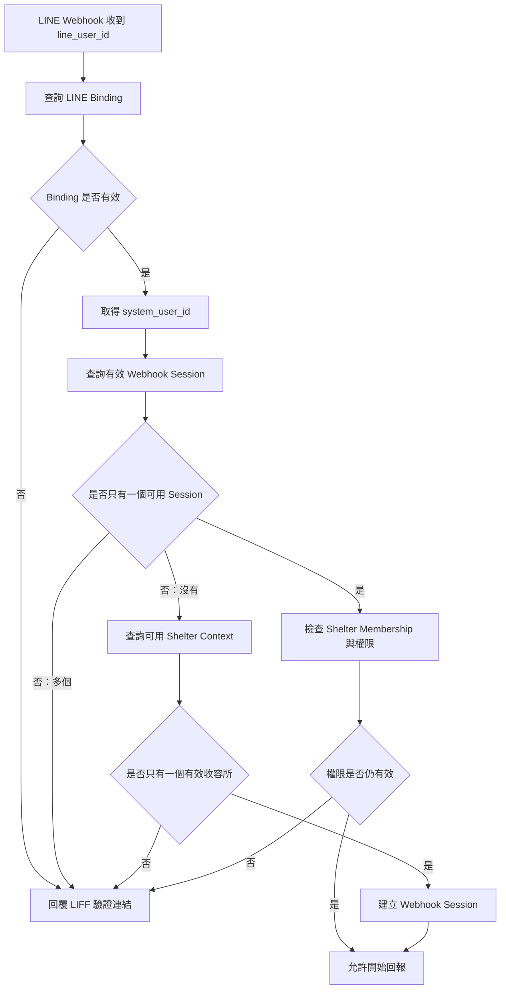

# 實作計畫：志工日常照護回報與動物近期歷程

**分支**：`001-volunteer-care-report` | **日期**：2026-08-07 | **規格**：[spec.md](spec.md)

**輸入**：來自 `specs/001-volunteer-care-report/spec.md` 的功能規格，以及使用者提供的「開發與部署階段」約束。

## 摘要

本功能規劃為一個本機優先的多收容所 Web 應用程式，包含 Next.js 手機回報與管理介面、FastAPI CRM 邊界服務、Background Worker，以及由 PostgreSQL 保存的正式業務資料。開發與整合測試使用 Docker Compose 啟動 PostgreSQL、MinIO 與必要的本機基礎服務；Next.js 與 FastAPI 直接以開發模式執行，以保留 Hot Reload。

所有動物、收容所、使用者、照護回報、照片、AI 結果與稽核資料透過 CRM 邊界管理。每一次資料存取都先依已驗證身分判定 Shelter 範圍。AI 以非同步 Job 處理，不能阻塞人工回報，也不能覆蓋原始資料。

GCP 只在本機品質門檻全部通過後建立 Demo 環境。Demo 使用 Cloud Run、Cloud SQL for PostgreSQL、Cloud Storage、Secret Manager、Artifact Registry 與 Cloud Logging；MinIO 僅供本機開發與整合測試使用。正式部署不在本 feature 的交付範圍內。

## 技術脈絡

**語言／版本**：Next.js 使用 TypeScript；FastAPI 與 Background Worker 使用 Python。Python 與 Node.js 的精確版本在實作階段依專案工具鏈鎖定，但必須可在本機與 Demo 環境重現。

**主要依賴**：Next.js Development Server、FastAPI Development Server、SQLAlchemy 2.x、Alembic、`asyncpg`、PostgreSQL Container、MinIO Container、Background Worker、Docker Compose、Mock LINE／LIFF Context、Mock LINE Adapter、Mock AI Service 或測試用 AI Adapter。GCP Demo 依賴 Cloud Run、Cloud SQL for PostgreSQL、Cloud Storage、Secret Manager、Artifact Registry 與 Cloud Logging。

**儲存**：PostgreSQL 保存 CRM 正式資料、權限範圍、回報、AI 狀態與稽核資料；本機物件檔案使用 MinIO；Demo 物件檔案使用 Cloud Storage。Application Layer 只能透過共通 Object Storage Interface 存取檔案。

**測試**：Python 使用 Ruff 與 Pytest；前端測試工具與命令必須在 `apps/web/package.json` 固定；另需提供 contract、unit、integration、資料隔離、Repository、SQLAlchemy／`AsyncSession`、Alembic migration、Object Storage Adapter、LINE Webhook Signature、Event Idempotency、Rich Menu、Postback State Machine、LIFF、QR Code、Authentication、EXIF 清理與 AI 失敗降級驗證。

**目標平台**：本機 Docker Compose 加直接執行的 Next.js／FastAPI／Worker；GCP Demo 使用 Cloud Run、Cloud SQL、Cloud Storage、Secret Manager、Artifact Registry 與 Cloud Logging。

**專案類型**：多租戶 Web application，包含手機優先前端、CRM API、非同步 Worker 與本機／GCP 基礎服務。

**效能目標**：至少 80% 測試志工在 90 秒內完成標準回報；工作人員在兩秒內看到近 14 天主要摘要；前端主要流程與隔離驗收以使用者可觀察結果為準，不以單一 API 延遲取代使用者成功條件。

**限制**：本機日常開發、單元測試與主要整合測試不得要求連接 GCP 正式資源；所有正式資料必須歸屬單一 Shelter；資料隔離不得只靠前端；AI 不得診斷、計分、排序、修改正式狀態或阻塞人工回報；Demo 不得包含真實個資或正式收容所敏感資料。

**規模／範圍**：第一階段支援多個台灣收容所或中途機構、相同 Shelter Number 在不同 Shelter 並存、`PLATFORM_ADMIN` 使用平台級 `PLATFORM` Scope 且不建立 Shelter Membership、一般角色依授權 Shelter 範圍操作、志工可被授權多個 Shelter 但同一時間只有一個目前服務中的 Shelter，以及同日多筆 Daily Care Report。精確使用者數、動物數與併發容量不是本 feature 的已知驗收數字，實作任務需保留可調整設定，不得把未確認容量誤寫成產品承諾。

## Constitution Check

### Gate：Phase 0 前

- **I. CRM 為唯一事實來源：通過。** PostgreSQL CRM 是正式資料來源；Next.js、LINE Bot、LIFF、QR Code、AI 與 Worker 不保存獨立正式業務副本。
- **II. 原始資料不得被衍生結果取代：通過。** Daily Care Report、Volunteer Note、Photo、原始 AI 輸出與人工覆核分開保存。
- **III. AI 不負責計算、診斷或最終判定：通過。** AI Job 只產生描述性觀察，所有限制與人工確認邊界列入 contract。
- **IV. AI 結果必須驗證、標示與追溯：通過。** AI 結果必須保留來源、Provider、Model Name／Version、Prompt Template／Version、Schema Version、原始輸出、處理狀態與人工修正。
- **V. 志工回填必須低摩擦：通過。** LINE Bot 的單題 Quick Reply／Postback、90 秒目標、圖片訊息、Mock LINE Adapter 與 AI 非同步均列入設計；LIFF 只作為輔助介面。
- **VI. 歷史紀錄必須完整且可追溯：通過。** 同日多筆保存、近 14 日逐日檢視、無回報日期與更早歷史查詢列入資料模型與 quickstart。
- **VII. LINE Bot 是主要輸入通道：通過。** Rich Menu、Quick Reply、Postback、Message／Image Event 與 Webhook 是本 Feature 範圍；Webhook 必須先驗證原始 Body 簽章並依 `webhookEventId` 冪等處理。LIFF 負責身分綁定、完整確認、答案修改、長文字與 Bot 備援，FastAPI 仍是唯一正式權限與 CRM 邊界。
- **VIII. 權限、隱私與稽核預設啟用：通過。** 一般角色的每一個資料操作均帶有已驗證的 Shelter 範圍；`PLATFORM_ADMIN` 以平台級 `PLATFORM` Scope 執行明確的跨機構管理；跨機構作業與公開資料採白名單並留下 Audit Record。
- **IX. P0 不得依賴 P1 或 P2：通過。** US1、LINE Bot US2 與歷程 US3 不依賴 AI；本機流程不依賴 GCP；真實 LINE 行為以 Mock Adapter 與受控 HTTPS 測試路徑隔離。
- **X. 正體中文與 Python 品質門檻：通過。** 本計畫與產物使用台灣正體中文；Python 品質門檻為 `ruff check .`、`ruff format --check .` 與 `pytest`。
- **XI. 多收容所資料隔離：通過。** 所有 query、command、圖片存取與修改都在後端依 Shelter 授權範圍強制判定；本 Feature 不提供批次匯出；A／B 隔離測試為 Demo 門檻。

**Gate 結論**：D-001～D-010 與本輪 LINE Bot、平台級 `PLATFORM_ADMIN` Scope、Webhook Session 解析及 Active Shelter Context 決策已同步至本計畫與 Phase 1 設計方向。重新產生 `tasks.md` 與執行 `/speckit-analyze` 是本計畫完成後的必要步驟；本文件不預先宣稱尚未執行的 Analyze 結果。沒有以降低 Constitution 要求方式處理的例外。

### Gate：Phase 1 後

**重新檢查結果：待重新執行。** 本輪設計將同步 LINE Bot／LIFF 邊界、Webhook Signature、Event Idempotency、Bot State Machine、圖片訊息、平台級 `PLATFORM_ADMIN` Scope、Webhook Session 解析、OpenAPI Contract、AI 版本追溯、EXIF 清理、Draft／Media 刪除與 Care Report Archive；完成後必須重新產生 `tasks.md` 並執行 `/speckit-analyze`。

## Database Access

後端使用 SQLAlchemy 2.x 作為 PostgreSQL ORM 與資料存取工具，使用 Alembic 管理所有 Database Migration。FastAPI API 與 Background Worker 使用 SQLAlchemy `AsyncSession`；PostgreSQL 非同步 Driver 採用 `asyncpg`。

Pydantic Model 與 SQLAlchemy Model 分離：

- Pydantic 負責 API Request／Response 驗證。
- SQLAlchemy 負責 Database Mapping。
- Domain／Application Layer 負責業務規則與交易流程。

不使用 SQLModel，避免 API Schema、Database Model 與複雜多租戶關係過度耦合。

所有租戶資料查詢必須經過受控 Repository，並強制套用 `Organization Scope`；本計畫中的 `Organization` 是資料存取層對收容所／Shelter 租戶的技術稱呼。租戶隔離另以 Composite Constraint、PostgreSQL Row-Level Security／交易層防護與跨租戶自動化測試提供 Defense in Depth。

資料表與 Schema 變更只能透過 Alembic Migration 管理，不得以手動操作資料庫介面作為唯一建置方式。空資料庫 migration、升級、必要的回復驗證與 GCP Cloud SQL migration 驗證都必須納入測試與 Demo 門檻。

## 實作前技術與範圍決策同步

### Authentication 與 Session

FastAPI 是唯一的 Authentication／Authorization 執行邊界。`PLATFORM_ADMIN`、`SHELTER_ADMIN` 與 `STAFF` 使用帳號密碼；Volunteer 透過 LIFF 身分交換後，由 FastAPI 對應既有 User 與 Membership。系統使用短效 Access Token、可輪替 Refresh Token 與可立即撤銷的 Server-side Session Record；每個受保護 Request 都重新驗證 Session、User、Organization、Membership、角色與 Active Shelter Context。Access Token 的 `org_id` 與角色不得作為最終授權依據。

`PLATFORM_ADMIN` 使用平台級 `PLATFORM` Scope，不建立任何 Shelter Membership，也不需要逐次額外授權；其跨 Shelter 管理能力由內建最高權限角色提供，但每一項跨機構操作仍須由後端記錄完整 Audit Record。一般 Shelter 使用者才透過有效 Membership 取得 Shelter Scope。

`active_org_id` 必須由使用者明確切換、由後端驗證並綁定 Session；QR Code 不得自動切換。系統不以 GPS、IP、裝置、時間重疊或地理距離推測志工地點。Worker 使用獨立 Credential／Service Account，但每次 Job 處理仍驗證 Job、Report、Organization 與狀態一致。

### LINE Webhook Session 與 Active Shelter Context 解析

LINE Webhook 收到 `line_user_id` 後，FastAPI 依序查詢有效 LINE Binding、取得 `system_user_id`，再查詢有效 Webhook Session。只有一個可用 Webhook Session 時，重新檢查其 Shelter Membership 與權限；權限失效不得開始回報。沒有可用 Webhook Session 時，系統查詢可用 Shelter Context，只有一個有效收容所時才建立綁定該 Context 的 Webhook Session。有多個可用 Webhook Session 或多個有效收容所時，系統不得自動選擇，應回覆 LIFF 連結要求明確選擇。LINE Binding 無效時同樣回覆 LIFF 驗證連結，不建立正式 Draft 或 Care Report。



### LINE Bot／LIFF 邊界

LINE Bot 是志工日常回報的主要介面，使用 Rich Menu、Quick Reply、Postback、文字訊息、圖片訊息與 LINE Messaging API Webhook。Bot 只能執行受控 Conversation State Machine，不以自然語言自由對話取代結構化選項。LIFF 是輔助介面，提供第一次 LINE 身分綁定、QR／Deep Link 識別、完整動物確認、答案修改、長文字與 Bot 備援；不要求每次回報開啟完整 LIFF 表單。

FastAPI 是唯一 Authentication、Authorization、Organization Scope 與 CRM 業務邊界。LINE Webhook Request 必須以未修改的原始 Request Body 與 `X-Line-Signature` 完成驗證，再解析事件；每個 `webhookEventId` 必須冪等。LINE Webhook 事件中的使用者、Postback、`draft_token`、`step`、`value` 與圖片 Message ID 都只是候選輸入，後端必須重新驗證 Session、LINE User Binding、Membership、Active Shelter Context、Draft 與 CRM 關聯。

Rich Menu 只作為入口，不承載完整問卷；Rich Menu 的環境版本與 Action 設定由受控設定管理。Quick Reply 通常提供 3 至 6 個選項，顯示名稱與穩定 Observation Option Code 分離。

### AI 版本與原始輸出

每一筆 AI Job 必須保存非空的 Provider、Model Name、Model Version／Snapshot、Prompt Template ID、Prompt Version、Output Schema Version、時間、原始輸出、驗證結果、失敗原因與 Retry Count。`raw_ai_output`、`validated_ai_observation` 與 `human_review_result` 分開保存。

### EXIF 與媒體

照片在成為正式 `media_asset` 前完成大小／MIME／格式驗證、解碼、EXIF 清理、重新編碼與 Checksum。含原始 EXIF 的檔案不得進入正式 Object Storage；AI 只能讀取已清理圖片。MinIO 與 GCS 使用相同政策，Storage Adapter 只儲存已清理資料。

### 公開資料與批次 Export

本 Feature 不建立公開動物頁面、公開欄位 Allowlist 或批次 Export；只驗證未登入／未授權者不能取得內部照護資料。這些能力另立 Specification。

### Delete 與 Archive

正式 Care Report 不允許 Hard Delete，只能 Correction 或 Archive 並保留 Audit。Draft 與未提交 Temporary Media 可由建立者刪除或過期清理；正式 Media 不 Hard Delete，只能標記不可使用或封存。

## 開發與部署階段

本專案採本機優先開發策略。第一階段所有日常開發、單元測試與主要整合測試，必須能在開發者本機完成，不要求連接 GCP 正式資源。

### 本機開發環境

本機環境包含：

- Next.js Development Server
- FastAPI Development Server
- PostgreSQL Container
- MinIO Container
- Background Worker
- Mock LINE／LIFF Context
- Mock AI Service 或測試用 AI Adapter
- 虛構 Seed Data

Docker Compose 用於啟動 PostgreSQL、MinIO 及其他必要的本機基礎服務。Next.js 與 FastAPI 可直接以開發模式執行，以保留 Hot Reload。

### 本機儲存策略

本機開發及整合測試使用 MinIO 作為物件儲存；Demo 與正式 GCP 環境使用 Cloud Storage。Application Layer 必須透過共通 Object Storage Interface 存取檔案，不得直接依賴 MinIO 或 Cloud Storage SDK。

至少提供以下替代實作：

- `MinioStorageAdapter`
- `GcsStorageAdapter`
- `InMemoryStorageFake`

資料庫只保存穩定的 Object Key 與 Metadata，不得將 MinIO URL 或 Cloud Storage Signed URL 作為永久識別。

### 本機測試要求

在部署 GCP 前，本機必須能完成：

1. 建立多個收容所。
2. 建立不同收容所的使用者。
3. 建立動物與收容編號。
4. 產生或解析 QR Token。
5. 建立照護回報。
6. 上傳及處理照片。
7. 建立非同步 AI Job。
8. 查看近 14 天歷程。
9. 驗證跨收容所資料隔離。
10. 執行 Ruff 與 Pytest。
11. 驗證同一志工可有多個授權 Shelter，但同一時間只有 Session 明確選定的 Active Shelter Context；Organization 不一致時阻擋送出並保留 Draft。
12. 驗證志工可在 24 小時內修改自己的回報內容、照片與心得，但不能修改動物綁定。

### LINE Bot／LIFF 本機整合

一般 LIFF 與 Bot 流程開發使用 Mock LIFF Context、Mock LINE Webhook Payload、Signature Test Helper、Mock LINE Adapter、Postback／Image／Redelivery Fixture。需要驗證真正 LINE 身分、Webhook、Rich Menu、LIFF URL 或 LIFF Browser 行為時，使用 LINE 官方建議的 HTTPS 本機開發環境或受控測試入口。Webhook 事件處理不得在一般單元測試呼叫真實 LINE API；圖片內容取得、Reply Token 與 Rich Menu API 以 Adapter／Contract Test 隔離。不得要求所有日常前端開發都透過已部署的 GCP 環境進行。

### Demo 部署門檻

只有在以下條件全部滿足後，才部署至 GCP Demo：

- `ruff check .` 通過。
- `ruff format --check .` 通過。
- `pytest` 通過。
- Frontend 測試通過。
- Database Migration 可由空資料庫完整執行。
- 本機關鍵流程測試通過。
- Organization A／B 資料隔離測試通過。
- MinIO Storage Adapter 測試通過。
- GCS Storage Adapter Contract Test 通過。
- 不含真實個資或正式收容所敏感資料。

### GCP Demo 環境

Demo 前才建立：

- Next.js Cloud Run Service
- FastAPI Cloud Run Service
- Background Worker／Job
- Cloud SQL for PostgreSQL
- Cloud Storage
- Secret Manager
- Artifact Registry
- Cloud Logging

GCP Demo 只使用虛構資料或合法公開資料。

部署後必須重新執行：

- Database Migration 驗證
- Cloud Storage 權限驗證
- Signed URL 驗證
- LIFF HTTPS 驗證
- QR Code 流程驗證
- Organization A／B 資料隔離驗證
- AI 失敗降級驗證

本機測試通過不代表 GCP 整合已完成；GCP 專屬的 IAM、Signed URL、Cloud SQL 連線及 Service Account 行為必須在 Demo 環境另外驗證。

## 專案結構

### 本功能文件

```text
specs/001-volunteer-care-report/
├── plan.md              # 本文件
├── research.md          # Phase 0 研究與決策
├── data-model.md        # Phase 1 業務資料模型與驗證規則
├── quickstart.md        # 本機與 Demo 驗證指南
├── contracts/           # CRM、租戶、儲存、LINE Bot／LIFF／Webhook 與 AI 邊界契約
│   └── openapi.yaml     # 前後端正式 API Contract
└── tasks.md             # $speckit-tasks 產生，不由本命令建立
```

### 原始碼與測試

```text
apps/
└── web/                         # Next.js 手機回報與管理介面

services/
├── api/                         # FastAPI CRM 邊界與業務規則
│   └── app/
│       ├── api/                 # Pydantic Request／Response 與通道邊界
│       ├── domain/              # 業務規則與交易流程
│       ├── persistence/         # SQLAlchemy Mapping、AsyncSession 與受控 Repository
│       └── migrations/          # Alembic Migration
└── worker/                      # 非同步 AI、圖片與其他背景工作

packages/
└── contracts/                   # 由 Feature OpenAPI 產生的前後端契約型別（不取代正式 Feature Contract）

infra/
├── local/                       # Docker Compose、MinIO 與本機設定
└── gcp-demo/                    # Demo 環境設定與驗證文件

tests/
├── contract/                    # 外部與內部邊界契約測試
├── integration/                 # PostgreSQL、MinIO、Worker 與 CRM 流程
├── isolation/                   # Organization A／B 資料隔離
├── frontend/                    # Next.js 使用者流程
└── unit/                        # FastAPI、Worker 與領域規則
```

**結構決策**：採 `apps/web`、`services/api`、`services/worker` 的分離結構，讓前端、CRM 與非同步處理可獨立測試與部署；FastAPI 的 API、Domain／Application、Persistence 與 Alembic 邊界分離，Pydantic Model 不與 SQLAlchemy Model 共用；`contracts/openapi.yaml` 是前後端正式 API Contract；`infra/local` 服務本機優先策略，`infra/gcp-demo` 只承載 Demo 部署與驗證；`tests/isolation` 為多收容所資料隔離的獨立測試領域。此結構不預先決定 Python 類別或模組內部細節。

## 複雜度追蹤

無。上述分離是由多收容所隔離、前端／後端／Worker 獨立生命週期、本機 MinIO 與 GCP Cloud Storage 差異，以及 Constitution 的 CRM 與非同步邊界所要求；不構成未合理化的 Constitution 例外。
