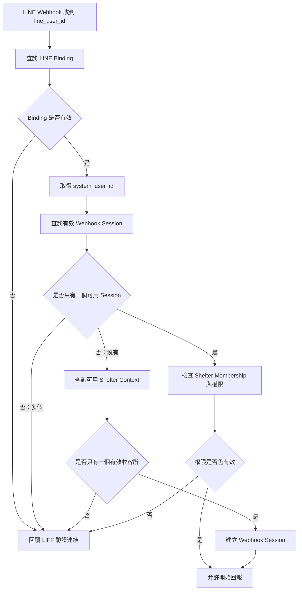

# Feature Specification: 志工日常照護回報與動物近期歷程

**Feature Branch**: `001-volunteer-care-report`

**Created**: 2026-08-05

**Status**: Blocked — QR 與成功條件修訂已完成，仍待處理最新 Analyze 的 Plan／Tasks 高嚴重度問題並重新分析

**Input**: User description: 建立「浪浪森友會」第一個功能規格：志工日常照護回報與動物近期歷程。

## Feature Overview

本系統服務全台灣多個動物收容所、私人動物之家及中途機構。各機構共用同一平台，
但每個機構的非公開資料都必須彼此隔離，並被視為獨立的機構資料範圍。私人動物之家與
中途之家需要把散落在 LINE 群組、紙本與口頭交接中的日常照護資訊，轉為可依單一動物
追溯的正式紀錄。志工需要在照護現場以手機完成低輸入量的回報；工作人員需要在一個動物
檔案中查看至少近 14 個曆日的完整時間序列，明確區分「沒有回報」與「沒有觀察到特殊訊號」。

本功能服務志工、工作人員與管理員，涵蓋動物選擇、人工照護回報、回報草稿、近期歷程、標準化觀察語彙與 AI 描述性觀察擷取。所有正式動物資料、照護紀錄、照片、心得、觀察訊號與人工修正結果的唯一事實來源為動物 CRM。LINE Bot、LIFF、網頁後台、QR Code 與 AI 模組只能作為輸入、呈現或衍生處理，不得建立獨立的正式業務資料副本。

本規格遵循 Constitution：

- CRM 是唯一事實來源，正式回報永遠關聯 CRM 中不可變的動物識別。
- 志工原始表單值、文字、照片、建立者與時間不得被 AI 或人工修正取代。
- AI 僅能擷取描述性訊號，不得診斷、計分、排序、變更狀態或決定最終結果。
- 所有重要異動、動物綁定更正與 AI 人工覆核都必須可追溯。
- P1、P2、P3 可獨立測試與展示，且不以 AI 成功為前提。
- 每筆非公開業務資料都必須具有單一收容所或平台級 `PLATFORM` Scope 歸屬；`PLATFORM_ADMIN` 的平台級角色本身即構成跨機構管理的明確授權，不需逐次額外授權，但所有操作都必須由後端執行範圍驗證並留下 Audit Record。
- 規格不決定程式語言、框架、資料表、API、套件、部署或其他技術實作。

## Clarifications

### Session 2026-08-06

- Q: 建立新收容所時，哪些資訊必須填寫，以及收容所何時可以開始建立一般業務資料？ → A: 收容所名稱、機構代碼、啟用狀態與初始管理員為必填；地址／服務區域與聯絡資訊可選；建立後須由平台管理員明確啟用，才能建立一般業務資料。
- Q: 第一階段志工應只能服務一個收容所，還是可以被授權服務多個收容所？ → A: 志工可以被授權服務多個收容所，但同一時間只能透過 Session 明確選擇一個 Active Shelter Context；系統不以 GPS、IP、裝置、時間重疊或地理距離推測地點，只有 Draft、Animal、QR Token、Reportable Scope 與 Active Shelter Context 的 Organization 不一致時，才阻擋送出並保留 Draft。
- Q: 誰可以設定志工每日可回報範圍，以及第一階段應支援哪些範圍設定方式？ → A: 收容所管理員或被授權的工作人員可以設定；第一階段支援個別動物、籠舍／區域與指定志工，不納入完整班次排班。
- Q: 第一階段 QR Code 應使用哪種查詢內容？ → A: 使用不含業務資料的非祕密 QR Token 或系統深層連結，由 CRM 依 Token、目前使用者與收容所範圍重新查詢動物。
- Q: 志工送出回報後，應在什麼期限與範圍內可以自行修改？ → A: 志工可在 24 小時內修改自己回報的內容、照片與心得，但不能自行修改動物綁定；動物綁定更正由收容所管理員或授權工作人員處理，所有修改保留稽核紀錄。
- Q: 平台管理員是否可以直接存取所有收容所的非公開業務資料？ → A: 可以。`PLATFORM_ADMIN` 是平台內建最高權限角色，不需逐次額外授權即可查看、建立、修改、封存或管理所有收容所的動物、照護回報、照片、心得與 AI 結果；正式 Care Report 與正式 Media 仍不得 Hard Delete，所有操作都必須留下完整 Audit Record。
- Q: `PLATFORM_ADMIN` 是否需要收容所 Membership 才能管理各收容所？ → A: 不需要。`PLATFORM_ADMIN` 使用獨立的平台級 `PLATFORM` Scope，不建立任何收容所 Membership；平台內建最高權限角色本身即授予所有收容所的管理與資料存取能力，不需逐次額外授權，但仍須由後端驗證平台 Scope 並留下完整 Audit Record。
- Q: LINE Webhook 收到 `line_user_id` 時，系統應如何取得可用的 Webhook Session 與 Active Shelter Context？ → A: 先查詢有效的 LINE Binding；Binding 無效時回覆 LIFF 驗證連結。Binding 有效後取得 `system_user_id`，查詢有效 Webhook Session。只有一個可用 Session 時檢查 Shelter Membership 與權限；沒有可用 Session 時查詢可用 Shelter Context，只有一個有效收容所才建立 Webhook Session；有多個可用 Session 或多個有效收容所時，不自動選擇，回覆 LIFF 連結要求明確選擇。權限失效時不得開始回報。

## 實作前技術與範圍決策

本 Feature 在完成本節決策同步、重新產生 `tasks.md` 並再次通過 `/speckit.analyze` 前，不得開始實作。

- **Authentication 與 Session**：FastAPI 是唯一的 Authentication／Authorization 執行邊界。`PLATFORM_ADMIN`、`SHELTER_ADMIN` 與 `STAFF` 使用帳號密碼；Volunteer 透過 LIFF 身分交換後，由 FastAPI 對應既有 User 與 Membership。系統使用短效 Access Token、可輪替 Refresh Token 與可立即撤銷的 Server-side Session Record；每個受保護 Request 都重新驗證 Session、User、Organization、Membership、角色與 Active Shelter Context。Access Token 的 `org_id` 與角色不得作為最終授權依據。
- **LINE Webhook Session 解析**：LINE Webhook 收到 `line_user_id` 後，系統先查詢 LINE Binding；Binding 無效時回覆 LIFF 驗證連結，不建立正式 Draft 或 Care Report。Binding 有效時取得 `system_user_id` 並查詢有效 Webhook Session；只有一個可用 Session 時檢查 Shelter Membership 與權限，沒有可用 Session 時只有在可用 Shelter Context 恰好一個時建立 Webhook Session；若有多個可用 Session 或多個有效收容所，系統不得自動選擇，應回覆 LIFF 連結要求明確選擇。權限失效時不得開始回報。


- **Active Shelter Context**：`active_org_id` 必須來自有效 Membership、由後端驗證、綁定目前 Session 並透過明確操作切換；QR Code 不得自動切換。系統不以 GPS、IP、裝置、時間重疊或地理距離推測志工地點。Draft、Animal、QR Token、Reportable Scope 與 Active Context 的 Organization 不一致時，阻擋送出並保留 Draft。
- **LINE Bot／LIFF 邊界**：LINE Bot 是日常回報的主要操作介面，透過 Rich Menu、Quick Reply、Postback、文字訊息、圖片訊息與 LINE Messaging API Webhook 完成受控狀態機；LIFF 僅作為第一次身分綁定、QR／Deep Link 識別、完整動物確認、答案修改、長文字與 Bot 備援介面。FastAPI 仍是唯一正式 Authentication、Authorization、租戶隔離與 CRM 業務邊界。
- **Webhook 安全**：每個 Webhook Request 必須先以原始 Request Body 與 `X-Line-Signature` 完成簽章驗證，再解析及處理事件；每個事件依 `webhookEventId` 冪等處理，非法簽章不得查詢或修改 CRM。
- **AI 版本追溯**：每一筆 AI Job 必須保存非空的 Provider、Model Name、Model Version／Snapshot、Prompt Template ID、Prompt Version、Output Schema Version、時間、原始輸出、驗證結果、失敗原因與 Retry Count；`raw_ai_output`、`validated_ai_observation` 與 `human_review_result` 分開保存。
- **EXIF 與圖片安全**：照片在成為正式 `media_asset` 前必須完成大小／MIME／實際格式驗證、解碼、EXIF 清理、重新編碼與 Checksum。含原始 EXIF 的檔案不得進入正式 Object Storage，AI 只能讀取已清理圖片。
- **公開資料與 Export**：本 Feature 不建立公開動物頁面、公開欄位 Allowlist 或批次 Export；只驗證未登入／未授權者不能取得內部照護資料，後續能力另立 Specification。
- **Delete 與 Archive**：正式 Care Report 不允許 Hard Delete，只能 Correction 或 Archive 並保留 Audit。Draft 與未提交 Temporary Media 可由建立者刪除或過期清理；正式 Media 不 Hard Delete，只能標記不可使用或封存。

## 主要使用者

- **平台管理員**：具備平台內建最高權限，管理所有收容所、初始管理員、帳號服務狀態、動物、照護回報、照片、心得、AI 結果與機構設定；不需逐次額外授權即可執行跨收容所操作，但所有操作都必須留下 Audit Record。
- **收容所管理員**：管理自己所屬收容所的工作人員、志工、動物、收容編號、籠舍、區域、QR Code、今日可回報範圍與機構設定。
- **工作人員**：查看與管理被授權收容所的動物、照護回報、近期歷程、照片、心得與 AI 結果。
- **志工**：在被授權的收容所範圍內，以手機選擇動物並建立日常照護回報。
- **一般民眾**：本 Feature 不提供公開動物頁面，也不能查看內部照護資料。

所有平台角色都必須先經過身分驗證與收容所範圍判定。使用者提交的機構識別、動物識別、
收容編號、QR Code、網址或其他查詢條件，不得直接決定可存取範圍。

## 多收容所管理與資料隔離

### 平台適用範圍

本系統支援多個動物收容所、私人動物之家及中途機構共用同一平台；每個收容所都是獨立的
機構資料範圍。下列非公開資料都必須歸屬至特定收容所：

- 收容所基本資訊、機構使用者與志工
- 動物、收容編號、籠舍與區域
- 今日可回報名單、日常照護回報、照片、心得與歷史紀錄
- AI 觀察結果、QR Code 與機構內部設定
- 稽核紀錄及其他非公開業務資料

### 平台管理員

`PLATFORM_ADMIN` 是平台內建最高權限角色，具有平台級 Scope，不需逐次額外授權或逐一建立收容所 Membership，
即可新增、修改、啟用或停用收容所，建立該收容所的初始管理員帳號、協助重設收容所管理員帳號、
查看收容所帳號與服務狀態，並查看、建立、修改、封存或管理所有收容所的動物、照護回報、照片、心得、
AI 結果與機構設定。正式 Care Report 與正式 Media 仍不得 Hard Delete；所有平台管理員操作都必須由後端
留下操作者、時間、目標收容所、操作範圍、原因（適用時）與結果的完整 Audit Record。
建立收容所時，收容所名稱、機構代碼、啟用狀態與初始管理員為必填；地址或服務區域、
聯絡資訊為可選。收容所建立後預設尚未啟用，必須由平台管理員明確啟用，才能建立一般業務資料。

### 收容所管理員

每個收容所可以有一名或多名收容所管理員。收容所管理員只能管理自己所屬收容所，依權限
建立或停用工作人員帳號、管理志工、動物、收容編號、籠舍、區域、動物 QR Code、今日可
回報名單與機構內部設定，也可以查看所屬收容所的日常照護歷程。收容所管理員或被授權的
工作人員可以設定今日可回報範圍，第一階段支援個別動物、籠舍／區域與指定志工，不包含
完整班次排班。收容所管理員不得查看或管理其他收容所的帳號、動物、照片、回報或內部資訊。

### 工作人員

工作人員帳號必須歸屬至特定收容所。登入後只能查看所屬或明確授權收容所的動物、搜尋其
收容編號、查看其照護歷程、建立或管理其回報及使用被授權的機構功能。知道其他收容所的
動物識別、收容編號、QR Code、網址或使用者識別，不會取得其他收容所的非公開資料。

### 志工

志工可以被授權服務多個收容所，但同一時間只能透過 Session 明確選擇一個目前服務中的收容所。系統必須清楚
顯示目前操作中的收容所，且每次回報只能歸屬至一個收容所。系統不以 GPS、IP、裝置、時間重疊或地理距離推測志工地點；只有 Draft、Animal、QR Token、Reportable Scope 與 Active Shelter Context 的 Organization 不一致時，才阻擋送出並保留 Draft。志工只能查看授權收容所內完成照護回報所需的
最少動物資訊、掃描授權收容所 QR Code、搜尋授權收容所內的收容編號及回報被授權的動物。

### 收容編號唯一性與 QR Code

收容編號只要求在同一收容所內唯一，不同收容所可以同時使用相同收容編號，例如：

```text
A 收容所：VAAAG114080610
B 收容所：VAAAG114080610
```

任何收容編號查詢都必須先限制於使用者有權存取的收容所，不得先在全平台搜尋後再由前端
過濾。第一階段 QR Code 使用不含業務資料的非祕密 QR Token 或系統深層連結；沒有 Shelter
Number 的 Animal 仍可透過 CRM 正式識別建立候選查詢。QR Code 掃描後必須同時確認 QR Code
所屬收容所、使用者可存取的收容所及動物所屬收容所；三者一致且動物仍可回報，才可進入
回報流程。QR Code 不代表授權，修改 QR Code 內容不得繞過此檢查。

### 資料隔離與 CRM 唯一事實來源

每一次讀取、新增、修改、搜尋、Draft／Temporary Media 刪除、Care Report Archive 及圖片存取，都必須確認資料屬於使用者被授權的
收容所。資料隔離必須由後端及資料存取層強制執行，不得只依靠前端隱藏選單、不公開網址、
使用者不知道識別碼或 LIFF 畫面限制。本 Feature 不提供批次 Export。

若使用者嘗試存取其他收容所資料，系統不得洩漏動物、收容編號、使用者、照片、紀錄筆數或
收容所內部設定是否存在；應回傳一致的無權限或無法存取結果，並依安全政策留下紀錄。平台
可以服務多個收容所，但每筆資料都必須在 CRM 中具有明確收容所歸屬。LIFF、QR Code、AI
模組及管理後台不得各自建立獨立的收容所或動物名單，所有管道都必須依 CRM 中的
收容所、使用者及動物關係進行授權與查詢。

## User Scenarios & Testing

### User Story 0 - 管理收容所並維持機構資料隔離（Priority: P1）

平台管理員能建立與管理收容所及初始管理員；收容所管理員、工作人員與志工只能在被授權
的收容所範圍內使用功能。不同收容所可以有相同收容編號，但任何查詢、QR Code 掃描或正式
回報都必須保留正確的收容所歸屬。

**為什麼是此優先順序**：若機構邊界未先成立，動物、照護回報、照片與歷史資料都可能被
錯誤混用；資料隔離是所有後續回報功能的安全與正確性前提。

**獨立測試**：建立 A、B 兩個收容所，分別建立管理員、工作人員、志工、相同收容編號的動物
與 QR Code，驗證各角色只可在授權機構內操作，平台管理員的跨機構操作可被稽核。

**驗收情境**：

1. **Given** 平台管理員提供收容所名稱、機構代碼、啟用狀態與初始管理員，**When** 建立收容所，**Then** 收容所具有獨立機構範圍且預設尚未啟用；**When** 平台管理員明確啟用，**Then** 才能建立一般業務資料。
2. **Given** A 收容所管理員已登入，**When** 建立工作人員或志工，**Then** 新帳號歸屬 A 收容所，且不能建立 B 收容所帳號。
3. **Given** A、B 收容所各有一隻收容編號為 `VAAAG114080610` 的動物，**When** 各自於授權範圍內搜尋，**Then** 能分別取得本收容所動物且不產生編號衝突。
4. **Given** A 收容所工作人員使用 B 收容所的動物識別、收容編號、QR Code 或網址，**When** 嘗試查看、搜尋或修改，**Then** 系統拒絕存取且不洩漏 B 資料是否存在。
5. **Given** 平台管理員以平台內建最高權限執行跨機構管理操作，**When** 操作完成，**Then** 系統不要求逐次額外授權，但留下完整稽核紀錄。
6. **Given** 志工具有 A、B 收容所 Membership 且目前 Session 的 Active Shelter Context 為 A，**When** 志工嘗試以 B 的 Animal、QR Token、Draft 或 Reportable Scope 送出回報，**Then** 系統阻擋送出、保留 Draft、顯示需要切換目前收容所的原因，且不得由 QR Code 自動切換。
7. **Given** A 收容所管理員或被授權工作人員設定今日可回報範圍，**When** 選擇個別動物、籠舍／區域或指定志工，**Then** 只有符合該範圍與志工授權的動物可建立正式回報，且不會建立完整班次排班資料。

### User Story 1 - 透過名單、QR Code 或收容編號正確選擇動物（Priority: P1）

志工可以掃描籠位 QR Code、從 Rich Menu 的「今日照護毛孩」進入 LINE Bot 清單、使用收容編號搜尋，或在需要時開啟 LIFF 動物確認畫面找到本次照護的動物。每個候選項目與確認卡都必須同時呈現目前照片、名稱、完整收容編號及區域或籠位（若有），並在志工明確確認前不建立正式回報。

**為什麼是此優先順序**：選錯動物會污染後續歷史與照護判斷。正確的不可變動物關聯是所有人工回報、歷程與 AI 衍生資料的前置條件。

**獨立測試**：使用已綁定志工、至少兩隻同名或照片相似動物與一個有效 QR Code，驗證志工能在不依賴 AI 的情況下完成正確動物確認；驗證不存在、重複、失效或未授權的候選不會產生正式紀錄。

**驗收情境**：

1. **Given** 志工已完成身分綁定，**When** 進入回報功能，**Then** 只顯示其當日被授權回報的動物，且每個選項顯示照片、名稱與完整收容編號。
2. **Given** 兩隻動物名稱相同，**When** 志工查看選擇畫面，**Then** 可透過照片、完整收容編號及可用的區域或籠位區分，不會只看到名稱。
3. **Given** 有效 QR Code 對應 CRM 中唯一且可回報的動物，**When** 志工掃描並確認，**Then** 系統顯示動物確認卡，確認後才進入該動物的回報畫面。
4. **Given** QR Code 不存在、重複、格式錯誤、跨機構、已封存或未授權，**When** 志工掃描，**Then** 系統不建立回報，顯示可理解的原因，並提供重新掃描、收容編號搜尋、今日名單或聯繫工作人員的選項。
5. **Given** 志工使用完整或部分收容編號搜尋，**When** 搜尋結果有多筆，**Then** 系統不得自動選定任何一筆；**When** 結果只有一筆，**Then** 仍顯示確認卡並要求志工明確確認。

### User Story 2 - 透過 LINE Bot 快速完成照護回報（Priority: P2）

志工確認動物後，主要透過 LINE Quick Reply 與 Postback Action，逐題完成進食、飲水、活動、排泄、護食或資源防衛、人際互動、動物互動與特殊狀態。志工可以用 LINE 相機、相簿或圖片訊息附加照片；心得為選填，只有選擇「其他」、需要詳細說明或主動補充時才要求文字或開啟 LIFF。Bot 流程無法完成時，志工可以使用 LIFF 輔助介面。即使 AI 或其他外部服務不可用，原始回報仍能正式保存並立即得到保存成功的確認。

**為什麼是此優先順序**：現場照護資料的即時保存是本功能的核心價值；AI 是後續輔助，不得阻塞人工回報。

**獨立測試**：停用 AI 處理，使用已綁定且已授權志工從 Rich Menu 開始 Bot 流程，以 Quick Reply／Postback 完成結構化答案，選擇略過照片與心得後確認送出，驗證 CRM 有保存原始資料、回報者、時間、LINE Webhook 來源、動物識別，且送出後可以立即查到。

**驗收情境**：

1. **Given** 志工已確認可回報動物，**When** 填入必需的人工照護選項並送出，**Then** 系統保存一筆可辨識回報，並立即顯示原始回報保存成功。
2. **Given** AI 服務不可用或逾時，**When** 志工送出人工回報，**Then** 人工回報仍成功保存；AI 狀態另顯示為待處理或失敗，不顯示為正常或無特殊訊號。
3. **Given** 同一動物同日由同一或不同志工回報多次，**When** 各回報成功送出，**Then** 所有回報都保留並可個別辨識，不互相覆蓋。
4. **Given** 志工在送出前中斷或網路中斷，**When** 重新開啟回報，**Then** 系統盡可能呈現已確認動物、已填選項、心得、照片上傳狀態與最後操作時間，並重新驗證權限後才允許送出。
5. **Given** 志工送出前發現動物選錯，**When** 返回重新選擇，**Then** 系統再次顯示確認卡並明確告知哪些已填內容會保留。
6. **Given** 志工修改自己建立且未超過 24 小時的回報，**When** 修改內容、照片或心得，**Then** 系統允許修改並保留前後內容；**When** 嘗試修改動物綁定，**Then** 系統要求由收容所管理員或授權工作人員處理。
7. **Given** 志工修改他人回報或已超過 24 小時的自己的回報，**When** 嘗試修改，**Then** 系統拒絕志工修改；授權人員仍可依權限更正並留下稽核紀錄。
8. **Given** 志工從 Rich Menu 選擇「開始照護回報」，**When** 身分、Session、Active Shelter Context 與目前授權範圍有效，**Then** Bot 建立或恢復 Server-side Draft，且一次只詢問一個問題。
9. **Given** Bot 顯示觀察問題，**When** 志工點選 Quick Reply，**Then** Postback 傳送穩定內部 Code，後端依 Draft 的目前狀態驗證並保存答案，不以顯示文字或傳入 `step` 作為正式依據。
10. **Given** 志工完成結構化答案，**When** Bot 顯示摘要，**Then** 志工可以送出、修改、取消或開啟 LIFF；最終確認前不得建立正式 Care Report。
11. **Given** 志工傳送圖片訊息，**When** Webhook 簽章、事件冪等、身分、Draft 狀態與圖片清理均通過，**Then** 圖片只附加至目前 Draft；清理失敗時不得建立正式 Media，且文字與結構化答案仍可送出。
12. **Given** Webhook Event 重送或 Postback 被竄改，**When** 系統處理事件，**Then** 重送不重複寫入，竄改內容不會跳過狀態、權限或動物確認。
13. **Given** LINE Binding 無效，**When** LINE Webhook 收到事件，**Then** 系統不建立 Draft 或 Care Report，並回覆 LIFF 驗證連結。
14. **Given** LINE Binding 有效且只有一個可用 Webhook Session，**When** Webhook 開始處理回報，**Then** 系統重新檢查 Shelter Membership 與權限；權限有效才允許開始回報。
15. **Given** LINE Binding 有效但沒有可用 Webhook Session，且只有一個有效 Shelter Context，**When** Webhook 開始處理回報，**Then** 系統建立綁定該 Context 的 Webhook Session 後允許開始回報。
16. **Given** LINE Binding 有效但有多個可用 Webhook Session，或沒有 Session 且有多個有效 Shelter Context，**When** Webhook 開始處理回報，**Then** 系統不得自動選擇收容所或 Session，並回覆 LIFF 連結要求明確選擇。

### User Story 3 - 查看單一動物近 14 天歷程（Priority: P3）

工作人員進入單一動物檔案後，能看到近 14 個曆日的每日摘要、每筆回報與指定日期的完整內容；同日多筆全部保留，無回報日期明確顯示「當日無回報」，並能回溯更早資料。

**為什麼是此優先順序**：歷程能讓工作人員辨識變化、接續照護與發現資料缺口，是人工回報產生實際工作價值的主要方式。

**獨立測試**：準備近 14 日包含有回報、同日多筆、無回報及 AI 失敗狀態的動物資料，驗證工作人員能在三次主要操作內進入近期歷程、在兩秒內看到主要摘要，並展開原始內容。

**驗收情境**：

1. **Given** 工作人員有查看權限，**When** 進入指定動物檔案，**Then** 預設顯示近 14 個曆日，包含每日是否有回報、回報筆數與主要狀態。
2. **Given** 某一日期沒有任何回報，**When** 工作人員查看該日，**Then** 明確顯示「當日無回報」或語意相同文字，不顯示正常、沒有異常或 AI 未發現問題。
3. **Given** 同日有多筆回報，**When** 工作人員展開該日，**Then** 能查看每筆時間、回報者、原始選項、照片、心得、AI 狀態與人工修正狀態。
4. **Given** 工作人員指定較早日期，**When** 進行查詢，**Then** 能查看超過近 14 日的歷史資料。
5. **Given** 歷史紀錄使用的觀察選項已停用，**When** 工作人員查看該筆紀錄，**Then** 歷史內容仍正確顯示。

### User Story 4 - 使用與維護標準化觀察語彙（Priority: P4）

志工以一致的非診斷性選項回報進食、飲水、活動力、排泄、護食或資源防衛、情緒、互動、外觀與其他特殊狀態；工作人員或管理員可以維護顯示名稱、說明、順序與啟用狀態，且不破壞歷史內容。

**為什麼是此優先順序**：一致詞彙降低不同志工的描述差異，讓工作人員能比較多日變化；但它建立在 P1 至 P3 的回報與歷程之上。

**獨立測試**：以管理員新增、改名、排序與停用觀察選項，再以志工建立回報並由工作人員查看新舊紀錄，驗證可用選項與歷史顯示均符合規則。

**驗收情境**：

1. **Given** 管理員維護一個觀察選項，**When** 修改顯示名稱、說明、順序或啟用狀態，**Then** 後續回報依最新啟用規則呈現。
2. **Given** 已停用選項曾被歷史回報使用，**When** 查看該歷史回報，**Then** 仍能看到原本的觀察內容與可理解的顯示名稱。
3. **Given** 志工記錄排泄或護食，**When** 選擇觀察內容，**Then** 系統使用可直接觀察、非診斷性描述，不要求志工判定疾病、攻擊性診斷或危險等級。

### User Story 5 - 取得可追溯的 AI 描述性觀察（Priority: P5）

人工回報保存後，AI 可非同步從心得與照片擷取描述性觀察訊號，例如照片模糊、光線不足、排泄物偏軟或局部毛髮減少。工作人員能分辨原始資料、AI 輸出與人工確認或修正；AI 失敗不影響人工回報與歷史查詢。

**為什麼是此優先順序**：AI 可減少整理成本，但涉及額外治理與人工覆核，不能成為 P1 至 P3 的必要條件，也不能取代現場紀錄。

**獨立測試**：在人工回報已保存的前提下，分別測試 AI 成功、失敗、逾時、無效內容、出現診斷語意與與志工選項不一致的結果，驗證原始資料不變、結果有標示且可追溯。

**驗收情境**：

1. **Given** 已保存含心得或照片的原始回報，**When** AI 完成擷取，**Then** 結果明確標示為 AI 輔助擷取，且可追溯到來源文字或照片。
2. **Given** AI 服務中斷、逾時或回傳無效內容，**When** 工作人員查看回報，**Then** 原始資料與歷史查詢可用，AI 顯示處理失敗或待處理，不顯示正常或無特殊訊號。
3. **Given** AI 輸出醫療診斷、健康正常、就醫建議、關注分數、等級、排序、正式狀態或正式識別碼，**When** 系統處理該輸出，**Then** 不得將其當作正式觀察結果或變更正式資料。
4. **Given** 授權工作人員檢視 AI 結果，**When** 確認或修正結果，**Then** 保留原始 AI 輸出、人工決定者、時間與前後內容，且不覆蓋原始回報。

## Acceptance Scenarios

以下情境為跨 User Story 的必要驗收基準。每一項都應能以可觀察的使用者行為、顯示內容與保存結果驗證。

### 動物選擇與 QR Code

1. 志工進入回報功能時，只看到今日被授權回報的動物。
2. 每個動物選項同時顯示照片、名稱與完整收容編號。
3. 兩隻動物名稱相同時，志工仍能透過照片與收容編號區分。
4. 志工掃描不含業務資料的有效 QR Token 後，系統依目前收容所與權限解析唯一候選動物，並在確認卡顯示該動物的完整收容編號 `VAAAG114080610`；QR Code 原始內容不得直接包含或信任該收容編號。
5. 志工未按下確認前，系統不建立正式回報。
6. 收容編號不存在時，系統不建立空白或匿名紀錄。
7. 同一收容編號符合多筆資料時，系統阻擋選擇、顯示資料異常並要求授權工作人員處理。
8. 志工可以透過完整收容編號搜尋動物。
9. 部分收容編號符合多筆資料時，系統不得自動選定。
10. QR Code 損壞時，志工可以改用收容編號搜尋。
11. 志工嘗試回報未被授權的動物時，系統拒絕建立紀錄。
12. 修改 QR Code 查詢內容不能繞過志工權限。
13. 動物名稱被修改後，既有回報仍正確關聯同一動物。
14. 動物更換籠位後，既有回報仍正確關聯同一動物。
15. 動物在填寫期間被封存時，系統阻止送出並保留已填內容。
16. 志工帳號在填寫期間被停用時，系統阻止正式送出。
17. LINE 顯示資料與 CRM 不一致時，以 CRM 即時資料為準。

### 人工回報

18. 已綁定志工成功建立一筆完整回報。
19. 志工在沒有 AI 服務時仍能成功送出回報。
20. 志工上傳照片與心得後，立即收到原始回報保存成功的確認。
21. 沒有照片時，只要結構化答案有效，系統仍允許送出；志工可選擇略過或稍後處理照片。
22. 沒有心得時，只要結構化答案有效，系統仍允許送出；只有選擇「其他」、需詳細說明或主動補充時才要求文字。
23. 同一動物同一天建立兩筆回報，兩筆都被保留。
24. 多名志工同一天回報同一動物，所有紀錄都被保留。
25. 同一回報被重複送出時，不得產生無法辨識的重複資料；系統應呈現送出結果，並在狀態不明時允許查回原始回報後再決定是否新增。
26. 志工只能修改自己在允許期限內建立的紀錄。
27. 志工不能修改其他人的紀錄。
28. 志工選錯動物並在送出前更換時，系統要求重新確認。
29. 工作人員更正已送出紀錄的動物綁定時，系統保留完整更正歷程。

### 近期歷程

30. 工作人員可以查看單一動物近 14 天的每日狀態。
31. 某日沒有回報時，系統明確顯示「當日無回報」。
32. 工作人員可以展開指定日期的完整回報、原始照片與心得。
33. 同一天有多筆回報時，工作人員可以查看所有紀錄。
34. 工作人員可以查詢超過 14 天以前的歷史紀錄。
35. 歷史紀錄使用的觀察選項已停用時，仍能正確顯示原內容。

### AI 與原始資料

36. AI 摘要或標籤不會覆蓋原始文字。
37. AI 處理失敗時，系統保留原始資料並顯示失敗狀態。
38. AI 擷取結果出現醫療診斷語意時，不得成為正式觀察結果。
39. AI 不能變更志工選擇的動物。
40. AI 不能產生正式動物識別碼。
41. AI 結果可以追溯至原始照片或心得。
42. AI 服務中斷時，人工回報與歷史查詢仍可使用。

### 權限與公開限制

43. 未綁定使用者嘗試回報時，系統不建立匿名正式紀錄。
44. 一般民眾無法查看內部照護回報。
45. 志工無法查看未授權動物的完整歷程。
46. QR Code 掃描後仍必須通過身分與權限驗證。
47. LINE、LIFF、公開頁面及 AI 模組均不得建立獨立於 CRM 的正式業務紀錄。

### 多收容所管理與資料隔離

48. **Given** 平台管理員提供新收容所的必要資料，**When** 成功建立收容所，**Then** 系統建立獨立的機構資料範圍，並能關聯初始管理員與啟用狀態。
49. **Given** 新收容所已建立，**When** 平台管理員建立初始管理員帳號，**Then** 該帳號只能管理指定收容所，且建立行為可被稽核。
50. **Given** A 收容所管理員已登入，**When** 建立工作人員帳號，**Then** 帳號歸屬 A 收容所；**When** 嘗試建立 B 收容所帳號，**Then** 系統拒絕。
51. **Given** A 收容所工作人員已登入，**When** 查看動物、搜尋收容編號或查看近期歷程，**Then** 所有結果只來自 A 收容所或其明確授權範圍。
52. **Given** A 收容所工作人員知道 B 收容所的動物識別，**When** 以搜尋、網址或動物識別嘗試存取，**Then** 系統拒絕且不洩漏 B 收容所資料是否存在。
53. **Given** A 收容所工作人員嘗試查看 B 收容所照片或照護歷程，**When** 發出存取要求，**Then** 系統拒絕，且不回傳照片存在、紀錄筆數或其他可推測資訊。
54. **Given** A 收容所工作人員嘗試修改 B 收容所動物或回報，**When** 送出修改，**Then** 系統拒絕且 B 收容所資料保持不變。
55. **Given** A、B 收容所各自有收容編號 `VAAAG114080610`，**When** 各收容所使用者在授權範圍內搜尋，**Then** 兩筆資料可同時存在並正確歸屬，不互相衝突。
56. **Given** 使用者搜尋收容編號，**When** 系統產生搜尋結果，**Then** 結果只來自使用者被授權的收容所，不先在全平台搜尋後再由介面過濾。
57. **Given** A 收容所志工掃描 B 收容所 QR Code，**When** 系統驗證 QR Code 所屬收容所、使用者範圍與動物所屬收容所，**Then** 三者不一致，系統拒絕進入回報流程。
58. **Given** 使用者修改 QR Code 內容，**When** 嘗試查詢或建立回報，**Then** 修改內容不能繞過收容所範圍、身分與動物狀態驗證。
59. **Given** 收容所已被平台管理員停用，**When** 該收容所一般帳號登入或建立業務資料，**Then** 系統拒絕操作；既有資料仍依權限與保存政策處理。
60. **Given** 工作人員帳號已被收容所管理員停用，**When** 該帳號嘗試存取收容所資料，**Then** 系統拒絕存取。
61. **Given** 平台管理員以平台內建最高權限查看或修改跨機構資料，**When** 操作完成，**Then** 系統不要求逐次額外授權，但留下操作者、時間、範圍、原因與操作結果的完整稽核紀錄；本 Feature 不提供批次匯出。
62. **Given** 未登入或未授權使用者嘗試取得內部照護資料，**When** 請求 Care Report、Volunteer Note、照片、AI Observation、Timeline 或 Signed URL，**Then** 系統拒絕且不洩漏資料是否存在。
63. **Given** 前端傳入其他收容所識別、動物識別、收容編號或查詢條件，**When** 系統處理讀取、新增、修改、搜尋、Draft／Temporary Media 刪除、Care Report Archive 或圖片存取，**Then** 系統依已驗證身分重新判定可存取範圍，不信任前端提供的收容所範圍。
64. **Given** A 收容所管理員或工作人員嘗試推測 B 收容所的使用者、動物、照片、回報、紀錄筆數或內部設定，**When** 發出查詢，**Then** 系統回傳一致的無權限或無法存取結果，且不洩漏資料存在性。

### LINE Bot、Webhook 與 Draft

65. **Given** 已綁定志工開啟 Rich Menu 的「開始照護回報」，**When** Session、Active Shelter Context 與 Membership 有效，**Then** 系統建立或恢復單一 Organization 內的 Server-side Draft，並顯示第一個合法步驟。
66. **Given** Rich Menu Action 含有任意 `org_id`、角色或 `animal_id`，**When** Webhook 處理該 Action，**Then** 後端不信任傳入值，重新依 LINE User ID、Session、Membership、Active Shelter Context 與 CRM 查詢結果判定。
67. **Given** Bot 正在詢問某一個 Draft Step，**When** 志工送出其他 Step 的 Postback 或修改 `draft_token`，**Then** 系統拒絕無效轉移，不跳過必要問題，也不修改其他 Draft。
68. **Given** Webhook Request 的 `X-Line-Signature` 缺少或錯誤，**When** 系統收到 Request，**Then** 不解析或處理事件、不查詢 CRM、不下載圖片、不建立或更新業務資料，並留下不含敏感內容的 Security Event。
69. **Given** 同一 `webhookEventId` 被 LINE 重送，**When** 系統再次收到事件，**Then** 不重複建立 Draft、答案、照片關聯、Care Report、AI Job 或業務 Audit Event。
70. **Given** 志工送出 LINE Image Message 且目前 Draft 允許照片，**When** 系統取得圖片並完成大小、MIME、格式、解碼、EXIF 移除、重新編碼與 Checksum 驗證，**Then** 只將清理後圖片附加至該 Draft。
71. **Given** LINE 圖片取得或清理失敗，**When** 志工選擇略過或重新傳送，**Then** 不建立正式 Media，文字與結構化答案仍可完成送出，且不顯示內部錯誤內容。
72. **Given** 志工完成所有結構化答案，**When** Bot 顯示完整摘要，**Then** 志工可以修改、取消或最終確認；最終確認前 CRM 不存在正式 Care Report。
73. **Given** 志工中斷流程後重新開啟 Rich Menu，**When** 有效 Draft 存在，**Then** 系統提供繼續、放棄或建立新回報；取消或過期 Draft 不可送出成正式回報。
74. **Given** 未綁定 LINE User 或 Membership 已停用，**When** Webhook 收到回報事件，**Then** 系統不建立正式 Draft 或 Care Report，並引導綁定或聯繫工作人員。

## Edge Cases

系統必須針對下列邊界條件呈現明確結果，且不得靜默改綁、丟失已填內容或把未知狀態當作正常：

- 同一天多名志工或同一志工多次回報同一動物時，所有回報獨立保存。
- 兩隻動物名稱完全相同或照片非常相似時，選擇畫面仍顯示完整收容編號與其他可用辨識資訊。
- 收容編號重複、不存在、被修正或動物沒有收容編號時，不得猜測或自動選擇；須顯示資料異常並依授權流程處理。
- QR Code 遺失、損壞、貼錯籠位、內容被修改、指向其他機構或指向已封存動物時，不建立正式回報，並提供替代選擇與聯繫工作人員。
- 志工不在今日名單、動物不在志工範圍或權限在填寫期間改變時，送出前重新驗證並保留已填內容。
- 志工送出後才發現選錯動物時，不覆蓋原紀錄；由有權限人員依更正流程保留原綁定、修正後綁定、原因、時間與操作者。
- 回報流程因 LIFF 關閉、切換畫面、手機鎖定、誤觸返回或網路中斷而停止時，盡可能保存草稿與照片上傳狀態。
- 照片上傳失敗、沒有照片、心得過短或過長時，顯示可理解原因並依已確認的必填規則允許修正或送出。
- 志工對某項狀況無法觀察或無法判斷時，能選擇「未觀察」或「無法判斷」，且此狀態不被解讀為沒有異常。
- 動物在填寫期間狀態改變、被封存或志工帳號被停用時，阻止正式寫入其他動物，並保留已填內容。
- AI 處理逾時、回傳無效內容、與志工選項不一致、包含診斷語意或無法判讀照片時，保留原始資料並以待處理或失敗狀態呈現。
- 歷史使用的觀察選項停用後仍可顯示；指定日期無紀錄或近 14 天完全無回報時，每個日期均顯示「當日無回報」。
- 使用者沒有查看完整歷程權限、LINE／LIFF 顯示舊資料或 CRM 在填寫期間更新時，依最新 CRM 與角色權限重新驗證，不以通道舊畫面或快取作為正式依據。
- 平台同時服務多個收容所時，每個收容所的使用者、動物、收容編號、籠舍、區域、回報、照片、心得、AI 結果、QR Code、設定與稽核紀錄都必須維持機構歸屬。
- 不同收容所使用相同收容編號時，查詢與正式回報仍以機構範圍共同判定，不得在全平台範圍猜測唯一動物。
- 使用者使用其他收容所的動物識別、收容編號、QR Code、網址或使用者識別時，系統不得洩漏資料是否存在、紀錄筆數或圖片是否存在。
- 收容所被停用時，一般帳號不得繼續登入或建立新業務資料；既有資料不得因停用而失去可追溯性。
- 工作人員或志工帳號被停用時，該帳號即使持有舊畫面、QR Code 或網址，也不得繼續存取或建立資料。
- `PLATFORM_ADMIN` 的平台級角色本身即提供跨機構管理的明確授權；平台管理員不需逐次額外授權，但所有跨機構操作都必須留下完整 Audit Record；一般工作人員不得取得預設跨機構能力。
- 同一志工若被授權服務多個收容所，操作畫面必須清楚顯示 Session 的 Active Shelter Context；若 Draft、Animal、QR Token、Scope 與 Active Context 的 Organization 不一致，系統必須阻擋送出並保留 Draft，不得以 GPS、IP、裝置或時間重疊推測地點。

## Requirements

### Functional Requirements

#### 動物識別、選擇與權限

- **FR-001**：系統 MUST 將每隻動物關聯至 CRM 中不可變的正式動物識別；正式回報不得只以名稱、照片、收容編號、籠位、區域或顯示順序作為關聯依據。
- **FR-002**：系統 MUST 在所有動物選擇畫面、確認卡與回報頁面明顯位置同時顯示目前照片、名稱與完整收容編號；有維護時也顯示區域或籠位。
- **FR-003**：系統 MUST 優先呈現志工當日被授權可回報的動物，且不得把完整機構名冊作為預設選擇方式。
- **FR-004**：收容所管理員或被授權的工作人員 MUST 能設定志工當日可回報範圍；第一階段至少支援個別動物、籠舍／區域與指定志工；設定結果 MUST 只允許符合範圍與權限的動物建立正式回報，且不得擴大成完整班次排班系統。
- **FR-005**：系統 MUST 支援今日名單、QR Code 與收容編號搜尋作為動物候選來源，且三者均 MUST 查詢 CRM 的同一份現行動物資料。
- **FR-006**：系統 MUST 支援完整收容編號搜尋，並可支援部分字串或末幾碼；多筆結果不得自動選擇。
- **FR-007**：收容編號在同一機構發生重複時，系統 MUST 阻擋新的正式回報綁定、顯示資料異常並要求授權工作人員處理，不得自行挑選其中一隻。
- **FR-008**：QR Code MUST 使用不含業務資料的非祕密 QR Token 或系統深層連結，僅承載候選動物查詢所需的穩定參考資訊；不得承載醫療內容、照護紀錄、個資、內部關注資訊或可被視為長效授權祕密；掃描本身不得代表已通過身分或權限驗證。
- **FR-009**：志工掃描 QR Code 或選擇搜尋結果後，系統 MUST 依目前機構與 CRM 查詢，確認結果唯一、動物仍可回報、志工身分有效且具有權限，然後顯示確認卡。
- **FR-010**：志工未明確按下「確認是這隻」或語意相同的動作前，系統 MUST 不建立正式照護紀錄。
- **FR-011**：QR Code 無法辨識、查無結果、符合多筆、格式錯誤、跨機構、動物已封存、動物狀態不允許回報或志工無權限時，系統 MUST 不建立空白、匿名或猜測綁定的紀錄，並顯示原因與替代操作。
- **FR-012**：送出時系統 MUST 再次驗證動物存在、未封存、狀態允許回報、志工帳號有效、志工仍有權限、當日範圍仍有效、收容編號無衝突及草稿仍關聯原確認動物。
- **FR-013**：送出前驗證失敗時，系統 MUST 阻止正式寫入、保留已填內容、顯示失敗原因，且不得靜默改綁其他動物、依相似名稱改選或寫入匿名紀錄。
- **FR-014**：名稱、照片、收容編號、籠位或區域修正後，既有回報 MUST 仍關聯原本的正式動物識別，並保留回報當時看見的名稱與收容編號快照。

#### 人工回報與草稿

- **FR-015**：已綁定且有權限的志工 MUST 能建立日常照護回報，內容至少包括動物、動物收容編號快照、回報日期與時間、回報者、來源、照護或散步是否完成、原始建立時間與最後修改時間。
- **FR-016**：回報 MUST 以 LINE Bot 的結構化選項為主，至少涵蓋進食、飲水、活動、排泄、護食或資源防衛、人際互動、動物互動、外觀與特殊狀態；Quick Reply 顯示名稱與穩定內部 Code 分離，自由文字與照片作為補充，LIFF 只作為輔助介面。
- **FR-017**：進食選項 MUST 至少能表達正常進食、進食較少、幾乎未進食、未提供食物、未觀察與無法判斷；系統不得將未觀察等同於完全未進食。
- **FR-018**：飲水選項 MUST 至少能表達有觀察到飲水、飲水較平常少、未觀察到飲水、未提供飲水、未觀察與無法判斷；未觀察到飲水不得被解讀為當日完全沒有飲水。
- **FR-019**：活動選項 MUST 至少能表達與平常相近、活動力較低、活動力較高、不願活動、未觀察與無法判斷。
- **FR-020**：排泄回報 MUST 能記錄排尿、排便、可觀察的非診斷性描述、可選的照片、未觀察與無法判斷；排泄照片不是送出必要條件，不得要求志工判定疾病或感染。
- **FR-021**：行為與互動回報 MUST 能記錄護食或資源防衛、對人的互動、對其他動物的互動、情緒、散步反應及其他特殊行為，且以直接觀察事件或非診斷性描述呈現。
- **FR-022**：外觀與特殊狀態 MUST 能記錄毛髮或外觀差異、持續抓咬某部位、可見紅色區塊、局部毛髮減少、長時間趴臥、行走狀態差異、其他特殊狀況、未觀察到明顯訊號與無法判斷。
- **FR-023**：系統 MUST 接收來自 LINE 相機、相簿或圖片訊息的一張或多張照片，標示照片用途並保存原始心得；照片與心得均為選填，沒有照片或心得時，只要結構化答案有效仍可送出；「其他」或被設定為需補充的選項才要求文字或開啟 LIFF。
- **FR-024**：系統 MUST 在志工預覽或確認後送出前保留原始輸入，送出成功後立即告知原始回報已保存；AI 或其他外部服務不可用不得阻止保存人工回報。
- **FR-025**：同一動物同日的多筆回報 MUST 全部保留；同一回報的重複送出 MUST 可被辨識，且不得產生無法追溯的重複資料。
- **FR-026**：志工在填寫中斷時，系統 MUST 盡可能保存已確認動物、已填選項、尚未成功上傳的照片狀態、心得文字與最後操作時間；重新開啟草稿時 MUST 重新驗證動物與權限。
- **FR-027**：志工在送出前更換動物時，系統 MUST 再次要求動物確認，並明確告知原填內容哪些保留、哪些需要重填。
- **FR-028**：志工 MUST 能在建立後 24 小時內修改自己建立的回報內容、照片與心得，但不得修改動物綁定；志工不得修改他人回報或超過 24 小時的自己的回報。動物綁定更正由收容所管理員或授權工作人員依權限處理，所有修改 MUST 保留原始內容、前後內容、修改人、時間與原因。
- **FR-029**：工作人員或管理員更正動物綁定或其他重要內容時，系統 MUST 保留原始內容、修正後內容、修改人、修改時間、修改原因、原始動物關聯及修正後關聯（若有）。

#### 近期歷程

- **FR-030**：工作人員有權限時 MUST 能從單一動物檔案查看至少近 14 個曆日；近 14 日為預設近期視圖，不是資料保存期限。
- **FR-031**：近期歷程 MUST 逐日顯示日期、是否有回報、回報筆數與主要狀態；沒有回報的日期 MUST 明確顯示「當日無回報」或語意相同文字。
- **FR-032**：工作人員 MUST 能展開單筆完整回報，查看時間、回報者、進食、飲水、活動、排泄、行為與特殊狀態、照片縮圖、原始照片、心得、AI 狀態、人工確認或修正狀態，以及當時的名稱與收容編號快照。
- **FR-033**：工作人員 MUST 能查看同日所有回報、指定日期、指定類型及超過 14 日的歷史資料。
- **FR-034**：歷史畫面 MUST 清楚區分原始資料、AI 擷取結果、人工確認結果、修改紀錄與無回報日期；不得用沒有特殊訊號、正常或 AI 未發現問題代表無回報。
- **FR-035**：觀察選項停用後，已使用該選項的歷史回報 MUST 仍能顯示原內容。

#### 標準化觀察語彙

- **FR-036**：系統 MUST 提供可維護、可擴充的觀察類別，第一階段至少涵蓋進食、飲水、活動力、排泄、護食或資源防衛、情緒、人際互動、動物互動、毛髮與外觀及其他特殊狀態。
- **FR-037**：每個觀察選項 MUST 有穩定識別、顯示名稱、說明、啟用或停用狀態與顯示順序；本規格不決定其資料實作形式。
- **FR-038**：管理員或授權工作人員 MUST 能新增選項、修改顯示名稱與說明、調整順序及停用選項；停用不得改寫或刪除歷史使用內容。

#### AI 輔助擷取

- **FR-039**：AI MAY 在原始回報保存後，從志工心得與照片擷取描述性觀察訊號，且處理不得阻塞人工送出。
- **FR-040**：AI 結果 MUST 明確標示為 AI 輔助擷取，與原始回報分開呈現，並可追溯至來源文字或照片；每一筆 AI Job MUST 保存非空的 Provider、Model Name、Model Version／Snapshot、Prompt Template ID、Prompt Version、Output Schema Version、處理時間、原始輸出、驗證結果、失敗原因與 Retry Count；`raw_ai_output`、`validated_ai_observation` 與 `human_review_result` MUST 分開保存，人工修正不得覆蓋原始 AI 輸出。
- **FR-041**：AI MUST NOT 診斷疾病、推測病因、宣稱健康正常或無外傷、決定是否就醫、改變正式狀態、核准或拒絕事項、產生或修改正式動物識別、計算關注分數、決定等級或排序，或改變志工選擇的動物。
- **FR-042**：AI 輸出出現醫療診斷、健康判定、關注分數、等級、排序、正式狀態或正式識別碼時，系統 MUST 不將其作為正式結果，並保留可供授權人員查核的原始輸出與處理狀態。
- **FR-043**：授權工作人員 MUST 能確認或修正 AI 描述性結果，且系統 MUST 保留確認或修正人、時間、原因及修正前後內容。
- **FR-044**：AI 失敗、逾時、無效、無法判讀或服務中斷時，系統 MUST 顯示待處理或失敗，不得顯示正常、沒有異常、沒有特殊訊號或分析完成；人工回報與歷史查詢 MUST 仍可使用。

#### CRM、權限、隱私與稽核

- **FR-045**：所有正式動物資料、照護回報、照片、心得、觀察訊號與人工修正結果 MUST 寫入 CRM，且 LINE、LIFF、網頁後台、QR Code 與 AI 模組不得建立獨立正式業務資料副本。
- **FR-046**：未完成身分綁定的使用者 MUST 被引導完成綁定或聯繫管理員，不得建立無法辨識回報者的正式紀錄。
- **FR-047**：志工只能查看完成回報所需的最少動物資訊、授權範圍內名單與自己允許修改的紀錄；不得查看未授權動物完整歷程、其他志工完整私人紀錄、完整醫療內容、內部關注資訊或未確認 AI 結果。
- **FR-048**：工作人員與管理員依角色權限查看或管理動物、範圍、QR Code、歷程、原始資料、AI 結果、標準語彙與異動紀錄；權限不足者 MUST 被拒絕並看不到受限內容。
- **FR-049**：照護照片、心得與內部紀錄 MUST 預設為內部資料，不得出現在未登入頁面、一般民眾搜尋、QR Code 原始內容或未授權 LIFF／LINE 對話；本 Feature 不建立公開動物頁面，公開頁面由獨立 Specification 定義。
- **FR-050**：重要建立、修改、動物綁定更正、AI 確認或修正、權限與範圍異動 MUST 保留操作者、時間、變更內容、原因（適用時）、原始關聯、修正後關聯（適用時）與來源通道。
- **FR-051**：LINE 或 LIFF 顯示與 CRM 不一致時，系統 MUST 以 CRM 即時資料與權限判斷為準；通道畫面不得覆蓋 CRM 正式資料。
- **FR-052**：系統 MUST 支援多個收容所或中途機構共用平台，且每筆非公開業務資料 MUST 明確歸屬至單一收容所，包括使用者、動物、收容編號、籠舍、區域、志工、今日可回報範圍、回報、照片、心得、AI 結果、歷史、QR Code、設定與 Audit Record。
- **FR-053**：`PLATFORM_ADMIN` MUST 作為平台內建最高權限角色，以平台級 Scope 管理所有收容所，不需逐次額外授權或逐一建立收容所 Membership；平台管理員 MUST 能以收容所名稱、機構代碼、啟用狀態與初始管理員建立收容所，並能修改、啟用或停用收容所，建立或協助重設初始收容所管理員，查看收容所帳號與服務狀態，以及查看、建立、修改或封存所有收容所的非公開業務資料；正式 Care Report 與正式 Media 不得 Hard Delete；所有操作 MUST 留下完整稽核紀錄；收容所未啟用前 MUST 不得建立一般業務資料。
- **FR-054**：收容所管理員 MUST 只能管理自己所屬收容所的帳號、志工、動物、收容編號、籠舍、區域、QR Code、今日可回報範圍、歷程與內部設定，不得管理其他收容所資料。
- **FR-055**：工作人員帳號 MUST 歸屬至特定收容所；工作人員只能查看、搜尋、建立或修改所屬或被明確授權收容所的資料，並依規則執行 Draft／Temporary Media 刪除或 Care Report Archive；不得 Hard Delete 正式 Care Report 或正式 Media。
- **FR-056**：志工 MUST 被記錄明確授權的收容所範圍；志工可以被授權服務多個收容所，但同一時間 MUST 只有一個目前服務中的收容所，且只能查看完成回報所需的最少資訊與回報被授權的動物。
- **FR-064**：系統 MUST 清楚顯示 Session 綁定的志工目前操作中的收容所；若 Draft、Animal、QR Token、Reportable Scope 與 Active Shelter Context 的 Organization 不一致，系統 MUST 阻擋送出、保留 Draft 並顯示原因；不得以 GPS、IP、裝置、時間重疊或地理距離推測志工地點，且不得讓單筆回報同時歸屬至多個收容所。
- **FR-057**：每一次讀取、新增、修改、搜尋、Draft／Temporary Media 刪除、Care Report Archive 及圖片存取 MUST 依已驗證的使用者身分重新判定收容所範圍；不得只依賴前端選單、網址、LIFF 畫面或使用者提交的機構識別。本 Feature 不提供批次 Export。
- **FR-058**：收容編號 MUST 只在同一收容所內唯一；不同收容所可以有相同收容編號，但所有查詢與正式資料關聯 MUST 同時包含且驗證收容所範圍。
- **FR-059**：QR Code 掃描時 MUST 同時驗證 QR Code 所屬收容所、使用者可存取的收容所與動物所屬收容所；三者不一致時不得進入回報流程。
- **FR-060**：使用者嘗試存取未授權收容所資料時，系統 MUST 回傳一致的無權限或無法存取結果，不得洩漏動物、收容編號、使用者、照片、紀錄筆數或內部設定是否存在。
- **FR-061**：收容所停用後，該收容所一般帳號 MUST 不能繼續登入或建立新的業務資料；停用工作人員帳號後，該帳號 MUST 不能繼續存取收容所資料。
- **FR-062**：本 Feature 不建立公開動物頁面；未登入或未授權使用者 MUST 無法取得 Care Report、Volunteer Note、照護照片、AI Observation、Animal Timeline 或 Signed URL。公開動物頁面與欄位 Allowlist MUST 由獨立 Specification 定義。
- **FR-063**：LINE Bot、LIFF、QR Code、AI 模組與管理後台 MUST 不得建立獨立的收容所或動物正式資料副本，所有授權與查詢 MUST 依 CRM 的收容所、使用者與動物關係執行；LINE Webhook 是本 Feature 的正式輸入邊界。
- **FR-065**：LINE Bot MUST 提供 Rich Menu 入口，至少包含開始照護回報、掃描 QR Code、今日照護毛孩、繼續未完成回報與聯絡工作人員；Rich Menu 只作入口，不承載完整問卷，所有 Action MUST 導向可由後端驗證的流程入口。
- **FR-066**：每一個 Bot 問題原則上 MUST 一次只詢問一個問題，Quick Reply 選項通常為 3 至 6 個，適用時包含未觀察、無法判斷、略過或其他；Postback 只傳穩定內部 Code，顯示名稱修改不得改變 Code。
- **FR-067**：Bot 流程 MUST 使用 Server-side Draft 與明確狀態機：`selecting_animal`、`confirming_animal`、`answering_feeding`、`answering_water`、`answering_activity`、`answering_elimination`、`answering_behavior`、`answering_special_status`、`awaiting_media`、`awaiting_note`、`reviewing`、`submitting`、`submitted`、`cancelled`、`expired`。無效狀態轉移 MUST 被拒絕，後端 MUST 依 Draft 目前狀態判定合法操作。
- **FR-068**：Draft MUST 固定歸屬單一 Organization、Volunteer、Membership 與 Animal，保存 `opaque_token`、目前步驟、已完成答案、媒體關聯、最後互動時間、到期時間與狀態；切換 Active Shelter Context、掃描其他 QR Code、竄改 Postback 或 Webhook 重送都不得移動或改綁 Draft。
- **FR-069**：同一志工在單一 Organization 同時間只保留一筆 active Draft；再次進入時 MUST 提供繼續、放棄或建立新回報，Draft 有效期限由設定控制；取消或過期 Draft 不得建立正式 Care Report。
- **FR-070**：LINE Webhook MUST 在解析及處理事件前，以原始 Request Body 與 `X-Line-Signature` 驗證簽章；簽章缺少或不正確時 MUST 不查詢 CRM、不建立或更新 Draft、不下載圖片、不建立 Care Report 或 AI Job，並留下不含敏感資料的 Security Event。
- **FR-071**：每一個 LINE Webhook Event MUST 依 `webhookEventId` 冪等處理並保存 Event Type、Processing Status、Received At、Processed At、Failure Reason 與 Redelivery Flag；重送不得重複建立 Draft、答案、媒體、Care Report、AI Job 或業務 Audit Event。
- **FR-072**：Postback Payload 中的 `action`、`draft_token`、`step` 與 `value` 都是候選輸入；後端 MUST 依已驗證 LINE User ID、Session、Active Shelter Context、Membership、Server-side Draft、Draft Organization、Draft Animal 與 Draft Current Step 重新判定，不得信任 `org_id`、Role、Membership、`animal_id`、User ID 或 Draft Owner。
- **FR-073**：LINE Image Message MUST 先驗證事件與目前有效 Draft，再即時取得圖片內容，完成大小、MIME、實際格式、解碼、EXIF 移除、重新編碼與 Checksum 後才可建立 Draft Media；LINE 原始圖片不得進入正式儲存或供 AI 讀取。
- **FR-074**：LINE Bot 事件、LIFF 與 Next.js MUST 共用 CRM 的使用者、Organization、Animal、Observation Option、Draft 與 Care Report 業務規則，不得建立通道專屬正式副本。
- **FR-075**：LINE Webhook 依 `line_user_id` 處理事件時 MUST 先解析有效 LINE Binding；Binding 無效不得建立正式資料。Binding 有效但有多個可用 Webhook Session，或沒有 Session 且有多個有效 Shelter Context 時，系統 MUST 不自動選擇並要求透過 LIFF 明確選擇；只有唯一有效 Session 或唯一有效 Shelter Context 且 Membership 與權限通過重新驗證時，才可開始回報。

## Key Entities

- **Shelter / Tenant**：平台中的獨立收容所或中途機構資料範圍；所有非公開業務資料都必須歸屬至一個 Shelter。
- **Platform Administrator**：具備平台內建最高權限與平台級 Scope，可直接管理所有收容所及其非公開業務資料；不需逐次額外授權，但所有跨機構操作都必須留下 Audit Record。
- **Shelter Administrator**：只能管理所屬 Shelter 的帳號、動物、照護範圍、設定與資料異動的角色。
- **Shelter Membership / Authorization Scope**：記錄使用者所屬或被明確授權的 Shelter 範圍，供每次資料存取重新判定。
- **Session Record / Active Shelter Context**：Session Record 記錄短效 Access Token、Refresh Token 輪替與伺服器撤銷狀態；Active Shelter Context 記錄使用者目前明確選擇的 Organization，必須來自有效 Membership 並綁定 Session。
- **Cage / Area**：Shelter 內供人員辨識動物位置的籠舍與區域，不能取代 Animal 的正式識別或 Shelter 範圍。
- **Animal**：CRM 中代表一隻動物的正式業務對象，具有不可變正式識別；可連結名稱、目前照片、收容編號、籠位、區域、狀態與歷史回報。
- **Shelter Number**：機構用於人員辨識、搜尋、QR Code 與籠位標示的收容編號；在同一機構內應唯一，但不是正式關聯識別；回報另保存當時顯示的快照。
- **Volunteer**：執行日常照護並建立回報的使用者；需完成身分綁定，受動物範圍與修改期限限制。
- **Staff Member**：處理日常照護、近期歷程、資料異常、AI 覆核與回報修正的授權人員。
- **Daily Care Report**：一次針對特定 Animal 的人工照護回報，包含結構化觀察、照片、心得、回報者、時間、來源、原始內容及修改歷程。
- **Report Draft**：尚未送出的回報內容，包含已確認 Animal、已填選項、心得、照片上傳狀態與最後操作時間；送出後不取代正式回報。
- **Observation Category**：可維護的觀察主題，例如進食、排泄或活動力，組織志工填寫與工作人員查詢。
- **Observation Option**：某 Observation Category 下可選的非診斷性描述，具有穩定識別、顯示名稱、說明、順序與啟用狀態。
- **Photo / Temporary Media**：回報附加的影像。Temporary Media 在送出前可刪除或過期清理；正式 Photo 必須完成格式驗證、EXIF 清理、重新編碼與 Checksum 後保存，且只有清理後影像可成為 AI 擷取來源。
- **Volunteer Note**：志工輸入的原始心得文字，屬於不可被 AI 摘要取代的現場資料。
- **AI Processing Job / AI Observation**：AI Job 保存 Provider、Model、Prompt、Schema 版本、時間、原始輸出、驗證與失敗資訊；AI Observation 是從已清理 Photo 或 Volunteer Note 擷取的描述性衍生結果，需標示、追溯並可由授權人員確認或修正。
- **Animal Assignment**：將志工、日期、個別 Animal、Cage／Area 或指定 Volunteer 與可回報 Animal 關聯的業務概念，用來限制今日可回報範圍；不包含完整班次排班。
- **Daily Reportable Scope**：某日某志工或某群組可建立回報的動物集合，必須能在送出時重新確認是否仍有效。
- **QR Code**：貼於籠位或資料卡的候選動物查詢標示，只負責帶出候選，不代表身分驗證或回報授權。
- **LINE User Binding**：將經 LINE 驗證的 `line_user_id` 對應至既有 User 與有效 Membership；LINE 身分驗證成功不代表自動建立正式權限。Webhook 需先以 Binding 取得 `system_user_id`，再依唯一有效 Webhook Session 或唯一有效 Shelter Context 建立可用回報上下文；多個候選不得自動選擇。
- **Rich Menu**：LINE Bot 的主要功能入口，提供開始回報、QR Code、今日動物、未完成回報與聯絡工作人員等可驗證 Action。
- **Quick Reply / Postback Action**：Bot 逐題回報的顯示選項與穩定內部操作代碼；顯示名稱可變更，正式答案不以顯示文字作為唯一值。
- **LINE Webhook Event**：LINE Messaging API 傳送的 Message、Image、Postback 或必要綁定事件；以簽章與 `webhookEventId` 驗證來源及冪等性。
- **Conversation State**：Draft 目前允許的 Bot 狀態與合法轉移規則；後端依 Server-side Draft 判斷下一個操作，不信任 Postback 的 `step`。
- **Animal Timeline**：以單一 Animal 為中心、按日期與時間排列的回報檢視，包含有回報日、無回報日、原始資料、AI 資料、人工修正與異動資訊。
- **Audit Record**：記錄重要建立、修改、權限、動物綁定更正與 AI 覆核的操作者、時間、內容、原因與來源，以維持可追溯性。

主要關係如下：Shelter 擁有多個使用者、Animal、Shelter Number、Cage / Area、Daily Reportable Scope、QR Code、Rich Menu 設定與 Audit Record。LINE User Binding 將經驗證的 LINE 身分對應既有 User 與 Membership；Session Record 綁定目前 Active Shelter Context。Rich Menu Action 進入 Bot 流程，LINE Webhook Event 經驗證後驅動 Conversation State。Conversation State 操作單一 Server-side Report Draft；Draft 可包含 Draft Answer、Draft Media、零或一個 Volunteer Note，確認後才建立 Daily Care Report。Animal 擁有多筆 Daily Care Report；每筆回報可包含正式 Photo、結構化 Observation Option 與零或多個 AI Observation。QR Code 提供指定 Shelter 內的候選 Animal 查詢資訊；Animal Timeline 聚合同一 Shelter 內同一 Animal 的歷史；Audit Record 記錄上述實體的重要異動與跨機構授權。Staff Member 可依權限覆核、修正、封存或管理上述內容。

## Assumptions

以下為本階段採用的工作假設；若沒有專案依據，標為「待確認」，不視為永久業務決策。

- 每位志工在建立正式回報前都已完成 LINE 或系統身分綁定；未綁定者只能進入綁定或求助流程。
- 平台服務多個收容所，每個收容所都是獨立的機構資料範圍；非公開資料不因共用平台而互相可見。
- 建立收容所時，名稱、機構代碼、啟用狀態與初始管理員為必填；地址／服務區域與聯絡資訊可選；新收容所預設未啟用，只有平台管理員明確啟用後才能建立一般業務資料。
- 收容所使用者帳號、動物、收容編號、籠舍、區域、志工、今日可回報範圍、回報、照片、心得、AI 結果、歷史、QR Code、內部設定與 Audit Record 都具有明確 Shelter 歸屬；平台管理員帳號、Session 與平台治理資料歸屬平台級 `PLATFORM` Scope。
- `PLATFORM_ADMIN` 的平台級角色本身即提供所有收容所的管理與資料存取授權，不需逐次額外授權；一般收容所管理員、工作人員與志工不具備預設跨機構能力。
- 志工可以被授權服務多個收容所，但同一時間只能透過 Session 明確選擇一個目前服務中的收容所；系統不以 GPS、IP、裝置、時間重疊或地理距離推測所在位置。Draft、Animal、QR Token、Scope 與 Active Context 的 Organization 不一致時，系統阻擋送出並保留 Draft。
- 志工可在建立後 24 小時內修改自己回報的內容、照片與心得，但不能自行修改動物綁定；動物綁定更正由收容所管理員或授權工作人員處理，並保留完整稽核紀錄。
- 收容編號只在同一收容所內唯一；不同收容所可使用相同收容編號，查詢與正式關聯都以 Shelter 範圍共同判定。
- 收容所停用後，一般帳號不能登入或建立新的業務資料；既有資料仍依權限與保存政策保留可追溯性。
- LINE Webhook 只有在 LINE Binding 有效、唯一的 Webhook Session 或唯一的有效 Shelter Context 已解析，且 Membership 與權限重新驗證成功後，才能開始回報；多個 Session 或多個有效收容所不得自動選擇，應要求透過 LIFF 明確選擇。
- 每隻 Animal 在 CRM 中都有不可變正式識別；沒有 Shelter Number 的 Animal 使用不可預測且可撤銷的 QR Token 建立候選查詢，不依賴 Shelter Number。
- Shelter Number 預設在同一機構內唯一；發現重複時視為資料異常，不由系統猜測。
- QR Code 使用不含業務資料的非祕密 QR Token 或系統深層連結，只用於查詢候選 Animal，不代表身分驗證、回報授權或長效祕密；沒有 Shelter Number 的 Animal 仍可使用 CRM 正式識別建立候選查詢。
- 正式回報關聯 CRM 的 Animal，不關聯 QR Code 原始文字或當時顯示名稱。
- 志工可能不記得動物名稱，但可以使用照片、籠位、區域或 Shelter Number 辨識。
- 工作人員或收容所管理員能在管理入口設定所屬 Shelter 的 Daily Reportable Scope；第一階段支援個別動物、籠舍／區域與指定志工，不包含完整班次排班。
- 本 Feature 不建立公開動物頁面或公開欄位 Allowlist；未登入或未授權者不能取得內部照護資料，公開資料規則由獨立 Specification 定義。
- 一般工作人員與志工無法透過前端、網址、QR Code、收容編號或其他使用者輸入繞過 Shelter 授權。
- 動物名稱可以重複，照片相似也不能作為唯一識別。
- AI 分析採人工回報保存後的非同步處理；AI 失敗不會阻止人工保存。
- 近 14 個曆日是預設近期檢視範圍，不是資料保存期限；更早歷史可查詢。
- 正式 Care Report 不允許 Hard Delete，只能 Correction 或 Archive 並保留 Audit；Draft 與未提交 Temporary Media 可刪除或過期清理；正式 Media 不 Hard Delete，只能標記不可使用或封存。
- 第一階段的預設錯誤處理是顯示原因、保留已填內容、提供替代操作或聯繫工作人員；不以相似名稱或舊通道資料猜測。
- 依 Constitution，AI 結果不會自動成為醫療、健康、關注等級、排序或正式狀態判定。

## Dependencies

本功能依賴：

- 可用且可查詢的動物 CRM 基本資料與不可變 Animal 識別。
- Shelter Number 管理與異常處理能力。
- Volunteer 身分綁定與基本角色權限。
- Photo 上傳與內部資料存取能力。
- LINE Messaging API Webhook、LINE Official Account、Rich Menu、Quick Reply、Postback、圖片訊息與 LIFF 輔助介面。
- 工作人員與管理員的管理入口。
- 可選用的 AI 描述性擷取服務；其失敗不得阻塞 P1、P2、P3。

本功能不得依賴：

- AI 成功或關注優先度完成。
- 關注優先度計算與今日排序。
- 公開島民檔案、領養申請、志工智慧排班或其他後續功能。
- 以政府公告頁面作為正式回報資料庫。
- 公開動物頁面、批次 Export、Notification 或公開欄位 Allowlist。

## Out of Scope

本功能不包含完整志工排班、換班與請假、排班最佳化、動物入所影像辨識、完整醫療紀錄、疫苗管理、關注優先度最終計分或排序、領養申請與審核、領養適配評估、公開島民檔案、公開動物頁面與公開欄位 Allowlist、批次 Export、Notification、以自然語言自由對話取代結構化選項、由 AI 自動判斷志工想回答哪一題、語音辨識、Q 版角色與故事生成、送養文案、認養後任務與成就、捐贈物資管理、社群發布、醫療診斷、健康評估、自動就醫建議、與政府收容系統雙向同步，以及資料庫設計、Endpoint、技術架構、套件或框架選型與部署方案。OpenAPI Contract 依 D-004 建立，但不延伸為本段未列的 API 功能。

## Measurable Success Criteria

- **SC-001**：在未接受專門系統訓練的測試志工中，至少 80% 能獨立完成一筆標準人工回報，且不需工作人員代填。
- **SC-002**：至少 80% 的測試參與者能在 90 秒內完成一筆標準 LINE Bot 回報；標準回報定義為動物已確認、填寫必要結構化選項，計時從 Bot 顯示第一個可操作問題開始，到系統顯示正式 Care Report 保存成功為止，AI 處理時間不計入。
- **SC-003**：志工掃描正確籠位 QR Code 後，最多經過兩個明確確認步驟即可進入該動物回報畫面。
- **SC-004**：志工完成動物選擇時，不需逐筆瀏覽全機構動物名單；測試中所有選擇畫面均顯示照片與完整收容編號。
- **SC-005**：兩隻同名動物的測試中，志工不會因選擇畫面只顯示名稱而誤選；每個選擇結果都可回溯至正式 Animal 識別。
- **SC-006**：工作人員在最多三次主要操作內進入指定 Animal 的近期歷程，且進入後兩秒內看到近 14 天主要紀錄摘要。
- **SC-007**：近 14 天每一個曆日均可判斷為有回報或「當日無回報」；同日多筆回報在測試中 100% 可個別查看且沒有互相覆蓋。
- **SC-008**：工作人員能從 100% 的 AI 觀察結果追溯至至少一個原始心得或照片，並分辨原始、AI 與人工修正內容。
- **SC-009**：在 AI 服務完全中斷的測試期間，人工回報建立、保存確認及歷史查詢仍可完成，且不產生 AI 偽造的正常或無異常結果。
- **SC-010**：動物名稱、籠位或收容編號修正的測試資料中，100% 的既有回報仍關聯原 Animal，並能看到當時的識別快照。
- **SC-011**：所有正式日常照護資料、原始照片、心得、AI 衍生結果與人工修正結果都能在 CRM 中查得，且不存在通道或 AI 模組獨立保存的正式業務紀錄。
- **SC-012**：未授權、未綁定、重複收容編號、QR Code 被竄改或動物於送出前失去資格的測試情境中，100% 不會將回報寫入錯誤動物或匿名紀錄。
- **SC-013**：未登入或未授權角色無法查看內部照護照片、心得與完整歷程；測試中不會在公開或未授權介面顯示內部照護資料。
- **SC-014**：至少 90% 的工作人員測試者能在歷程中區分「當日無回報」、「未觀察」、「無法判斷」與「AI 處理失敗」四種狀態。
- **SC-015**：100% 的動物綁定更正、AI 人工修正與重要資料異動都能顯示操作者、時間、原因（適用時）及修改前後內容。
- **SC-016**：一般工作人員與志工的所有動物搜尋結果，100% 限制於其所屬或被明確授權的收容所。
- **SC-017**：在使用其他收容所的動物識別、收容編號、QR Code 或網址的測試中，100% 無法取得非公開資料，也無法推測資料是否存在。
- **SC-018**：不同收容所使用相同收容編號的測試資料中，100% 能依收容所範圍正確區分動物、回報、照片與 AI 結果。
- **SC-019**：100% 的日常回報、照片與 AI 結果都能追溯至唯一所屬收容所；LINE、LIFF、QR Code、AI 模組與管理後台沒有獨立正式收容所或動物資料副本。
- **SC-020**：收容所或一般帳號停用後，100% 的測試操作無法建立新的非公開業務資料；平台管理員的跨機構操作 100% 可追溯至完整 Audit Record。
- **SC-022**：標準 Bot 流程除心得或「其他」補充外，文字輸入次數為 0，且不需要開啟完整 LIFF 表單。
- **SC-023**：以至少 15 組固定中斷驗收案例進行測試，案例 MUST 涵蓋關閉回報畫面、切換畫面、網路中斷、手機鎖定及誤觸返回，並分布於結構化答案填寫、照片處理及送出前確認等階段；仍有效且未過期的 Draft 在 100% 案例中都能恢復已確認動物、已成功保存的答案、心得、照片處理狀態與最後操作時間。尚未送達系統的裝置端輸入不列入恢復承諾；取消或過期 Draft 在 100% 案例中不得建立正式 Care Report。
- **SC-024**：Webhook 重送的測試中，100% 不會重複建立答案、圖片關聯、Care Report 或 AI Job；非法 `X-Line-Signature` 的測試中，100% 不建立任何業務資料。
- **SC-025**：A Organization 志工使用 B 的 Draft、Postback、QR Token、Animal ID 或圖片事件時，100% 無法取得或修改 B 的非公開資料，且不得自動切換 Active Shelter Context。
- **SC-026**：Bot Quick Reply 的顯示名稱調整後，歷史答案與後端穩定 Code 在 100% 測試中仍可正確追溯；Bot 選項來源與管理語彙一致，不存在第二套硬編碼業務選項。

## Clarification Items

本次高影響待釐清事項均已完成。照片、排泄照片與心得均採選填；有效結構化答案即可送出。每名志工在單一 Organization 同時間只保留一筆 active Draft，Draft 有效期限由設定控制，建立新回報時提示繼續或放棄既有 Draft；跨裝置恢復與重複送出文案由實作依同一 CRM Draft／Idempotency 規則處理。正式 Care Report 的 Archive、Draft／Temporary Media 刪除政策已由實作前決策紀錄確定。公開頁面、批次 Export 與 Notification 不屬本 Feature。


## Constitution Compliance Notes

- **符合 I、VII**：所有正式業務資料以 CRM 為唯一事實來源，LINE、LIFF、後台與 AI 不建立獨立正式副本。
- **符合 II、VI**：原始回報與完整時間序列保存；同日多筆並存；無回報與未觀察明確分開。
- **符合 III、IV**：AI 僅產生描述性衍生觀察，明確標示、可追溯、可人工確認或修正，不能診斷或做最終判定。
- **符合 V、IX**：手機回報以 90 秒目標驗收，AI 不阻塞人工回報；P1 至 P3 可獨立測試與展示。
- **符合 VIII、XI**：依最小權限、內部資料預設不公開、每個收容所獨立隔離；`PLATFORM_ADMIN` 的平台級角色提供跨機構明確授權，但所有操作仍受後端範圍驗證與重要異動稽核。
- **符合 X**：本規格使用台灣正體中文，未提前決定程式或測試實作。
- 本規格未發現與 Constitution 的衝突；Constitution 中尚未補上的批准日期不影響本功能需求內容。
