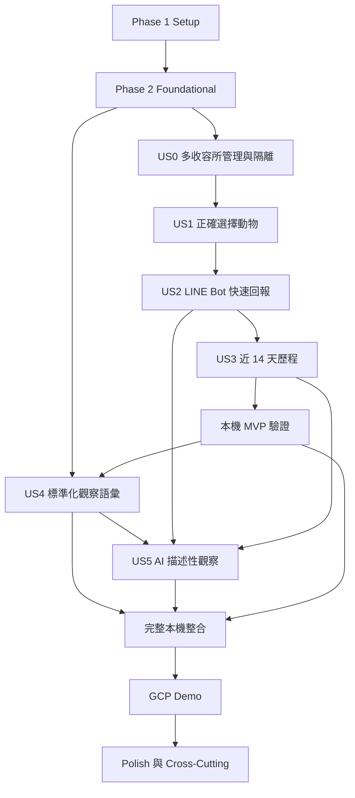

# Tasks：志工日常照護回報與動物近期歷程

## 輸入文件

- [constitution.md](../../.specify/memory/constitution.md)：CRM 唯一事實來源、原始資料保存、AI 邊界、稽核、Python 品質門檻與多收容所資料隔離。
- [spec.md](./spec.md)：LINE Bot 主要回報流程、LIFF 輔助介面、User Stories、FR、Acceptance Scenarios、Edge Cases、成功條件與已完成 Clarification。
- [plan.md](./plan.md)：Next.js、FastAPI、SQLAlchemy 2.x、Alembic、`asyncpg`、本機優先策略、LINE Bot／LIFF 邊界與 GCP Demo 門檻。
- [research.md](./research.md)：Authentication、LINE Webhook、Rich Menu、Quick Reply、Postback、圖片內容、Draft State Machine、Storage 與 AI 決策。
- [data-model.md](./data-model.md)：Organization Scope、LINE User Binding、Webhook Event、Draft、Draft Answer、Draft Media、Care Report 與 AI 關係。
- [contracts/](./contracts/)：`line-liff.md`、`object-storage.md`、`async-ai.md`、`crm-shelter-access.md`、`gcp-demo.md` 與 `openapi.yaml`。
- [quickstart.md](./quickstart.md)：本機 Mock LINE Bot、MinIO、AI 降級、A／B 隔離與 GCP Demo 驗證路徑。
- 最新 `/speckit.analyze` 報告：本輪以 LINE Bot 邊界修訂後重新分析，結果為 `CRITICAL = 0`、`HIGH = 0`；`spec.md` 已更新為 `Ready for Implementation`。

## 阻擋實作的未決事項

目前沒有新的業務阻擋事項。Authentication、OpenAPI Contract、AI 版本追溯、EXIF 政策、LINE Bot／LIFF 邊界、Webhook Signature、Event Idempotency、Draft 狀態機與志工多收容所 Context 均已有核准決策。

以下是實作門檻，不是待釐清事項：新 `tasks.md` 必須先完成 OpenAPI Contract Test、Webhook Signature Test、Event Idempotency Test、真實 PostgreSQL 多租戶隔離 Test、EXIF Pipeline Test 與 Bot State Machine Test；US1、US2、US3 完成後即可建立不依賴 US4／US5 的本機 MVP。不得還原舊版的 Webhook 排除邊界、僅使用 LIFF 的流程、位置推測、公開頁面、Notification、Export 或跨收容所資料共享。

## 任務格式說明

- 每項任務均使用連續的 `Txxx`、`- [ ]`、必要的 `[P]` 與 User Story 標籤。
- `[P]` 只表示不修改相同檔案、不依賴未完成結果且可安全平行處理的任務。
- 每項任務都指定一個精確檔案路徑，並以動作開頭。
- 每個 User Story 遵守：Contract／Acceptance Test → Integration／Security Test → Unit Test → Implementation → Regression／Independent Test。
- 測試任務必須先確認在功能尚未實作時失敗；不得使用 `skip`、刪除 assertion 或放寬條件讓測試通過。
- Repository 不得自行任意 `commit()`；交易邊界由 Application Service 控制。

## Phase 1：Setup

**目的**：建立可在本機啟動、測試與重設的 Next.js、FastAPI、Worker、PostgreSQL、MinIO、Mock LINE 與品質工具基礎。

- [ ] T001 [P] 在 `apps/web/README.md` 建立符合 `plan.md` 的 Next.js 前端目錄、開發入口與本機執行說明
- [ ] T002 [P] 在 `pyproject.toml` 建立 Python 專案工具、Ruff、Pytest、YAML 解析與 FastAPI／SQLAlchemy／Alembic／`asyncpg` 依賴邊界
- [ ] T003 [P] 在 `apps/web/package.json` 建立 Next.js、TypeScript、前端格式化與測試命令
- [ ] T004 [P] 在 `apps/web/tsconfig.json` 與 `apps/web/next.config.ts` 設定前端編譯、路徑與開發模式基礎
- [ ] T005 [P] 在 `services/api/app/main.py` 建立 FastAPI 應用程式入口與健康檢查路由骨架
- [ ] T006 [P] 在 `services/worker/worker.py` 建立 Background Worker 本機啟動入口與可停止處理迴圈骨架
- [ ] T007 [P] 在 `.env.example` 建立 PostgreSQL、MinIO、GCS、LINE、AI、Session 與 Worker 設定範例並遮罩祕密值
- [ ] T008 在 `infra/local/docker-compose.yml` 建立 PostgreSQL、MinIO 與本機必要服務的可重複啟動設定
- [ ] T009 在 `infra/local/init-minio.sh` 建立私人 Bucket 初始化與本機測試前綴設定
- [ ] T010 [P] 在 `scripts/seed_local.py` 建立 Organization A／B、不同角色、相同 Shelter Number、Animal、QR Token 與虛構資料 Seed 流程
- [ ] T011 [P] 在 `scripts/reset_local.py` 建立可安全重設本機資料、Storage 物件與 Webhook Event Fixture 的流程
- [ ] T012 [P] 在 `tests/fixtures/line_webhook.py` 建立 Mock LINE User、Rich Menu、Postback、Image Message、Redelivery Payload 與 Signature Helper Fixture
- [ ] T013 [P] 在 `.github/workflows/ci.yml` 建立 Ruff、Pytest、前端測試、OpenAPI 解析與本機 Contract 檢查 Workflow
- [ ] T014 在 `README.md` 建立專案入口、文件索引與 `specs/001-volunteer-care-report/quickstart.md` 連結 (depends on T001, T002, T003)

**Setup Checkpoint**：T014 通過後，必須能啟動 PostgreSQL、MinIO、Next.js、FastAPI 與 Worker，執行空 Migration、Ruff、Pytest 並載入虛構 Seed。

## Phase 2：Foundational

**目的**：完成所有 User Story 共用且會阻擋後續實作的設定、資料存取、Authentication、租戶隔離、Storage、LINE Boundary、錯誤與稽核基礎。

- [ ] T015 在 `specs/001-volunteer-care-report/contracts/openapi.yaml` 完成 Authentication、Organization Scope、Draft、Media、Care Report、Timeline、Observation、AI 與 LINE Bot 路徑及 Schema 契約
- [ ] T016 在 `tests/contract/test_openapi_contract.py` 建立 YAML 解析、必要路徑、受保護 Endpoint、`X-Line-Signature`、Idempotency Header、統一錯誤與不得由 Request 控制 `org_id` 的 Contract Test (depends on T015)
- [ ] T017 在 `services/api/app/config/settings.py` 建立 Pydantic Settings、Database URL、Session、MinIO、GCS、LINE Channel Secret、LINE Access Token、AI 與祕密遮罩設定
- [ ] T018 [P] 在 `services/api/app/observability/logging.py` 建立結構化 Logging、Request ID、Security Event、Audit Event 與 Secret／Token／Signed URL 遮罩
- [ ] T019 [P] 在 `services/api/app/persistence/database/base.py` 建立 SQLAlchemy Declarative Base、共通 Audit 欄位與 Pydantic／SQLAlchemy 分離邊界
- [ ] T020 在 `services/api/app/persistence/database/engine.py` 建立 SQLAlchemy 2.x Async Engine、`asyncpg` 連線與 API `AsyncSession` Factory (depends on T017, T019)
- [ ] T021 在 `services/worker/persistence/session.py` 建立 Worker 專用 `AsyncSession` Factory、生命週期與失敗關閉規則 (depends on T017, T019)
- [ ] T022 在 `services/api/migrations/env.py` 建立 Alembic Async Configuration、metadata 載入與空資料庫 Migration 入口 (depends on T019, T020)
- [ ] T023 在 `tests/integration/test_migrations.py` 建立從空 PostgreSQL 執行、升級與必要回復的 Alembic Migration Test (depends on T022)
- [ ] T024 在 `services/api/app/api/dependencies.py` 建立 Request `AsyncSession`、Current User Context 與交易生命週期 Dependency (depends on T020)
- [ ] T025 在 `services/api/app/domain/transactions.py` 建立由 Application Service 控制的交易協調規則，禁止 Repository 自行任意 `commit()` (depends on T020, T024)
- [ ] T026 在 `services/api/app/persistence/models/organization.py` 建立 `organizations`、`users`、`organization_memberships`、`sessions` 與 Refresh Token 狀態 Mapping 及 Migration
- [ ] T027 在 `services/api/app/persistence/constraints.py` 建立角色、帳號狀態、Organization 狀態、Audit 欄位與 Composite Constraint 規則 (depends on T026)
- [ ] T028 在 `services/api/app/domain/tenant_context.py` 建立 Current User Context、Current Organization Context、Membership 驗證與不可由 Request 覆寫的 Scope 物件 (depends on T024, T026)
- [ ] T029 在 `services/api/app/persistence/repositories/base.py` 建立強制接收 Organization Scope 的 Controlled Repository 基底 (depends on T025, T028)
- [ ] T030 在 `services/api/migrations/versions/0002_tenant_defense.py` 建立同租戶關聯防護、Composite Foreign Key／Constraint 與 PostgreSQL Scope 防護 (depends on T026, T027, T028, T029)
- [ ] T031 在 `services/api/app/domain/authentication.py` 實作帳號密碼登入、LIFF／LINE Identity Exchange、短效 Access Token、Refresh Token 輪替、Server-side Session 與立即撤銷 (depends on T017, T026, T028)
- [ ] T032 在 `services/api/app/domain/line_identity.py` 實作 LINE User Binding；LINE 驗證成功不得自動建立正式 Membership，未綁定不得建立正式 Draft 或 Care Report (depends on T031)
- [ ] T033 在 `services/api/app/api/authorization.py` 建立 Platform Admin、Shelter Admin、Staff、Volunteer 角色政策與一致拒絕結果 (depends on T031, T032)
- [ ] T034 在 `services/api/app/infrastructure/storage/ports.py` 建立共通 Object Storage Interface，定義 Object Key、Metadata、Scope 與 Signed URL 生命週期 (depends on T017)
- [ ] T035 [P] 在 `services/api/app/infrastructure/storage/minio.py` 建立 `MinioStorageAdapter`，只接受已清理位元資料
- [ ] T036 [P] 在 `services/api/app/infrastructure/storage/gcs.py` 建立 `GcsStorageAdapter` 契約骨架，不使本機流程依賴 GCP
- [ ] T037 [P] 在 `services/api/app/infrastructure/storage/memory.py` 建立 `InMemoryStorageFake` 與跨租戶測試隔離規則
- [ ] T038 在 `services/api/app/api/errors.py` 建立統一 API Error Schema、Exception Handler、無權限／無法存取的一致結果與不存在性防護 (depends on T016, T033)
- [ ] T039 在 `services/api/app/domain/audit.py` 建立 Audit Record Service、跨租戶拒絕事件、Platform Admin 授權事件、來源通道與個資遮罩 (depends on T018, T025, T038)
- [ ] T040 在 `tests/security/test_unauthenticated_internal_data.py` 建立未登入者不能取得 Care Report、Volunteer Note、照片、AI Observation、Timeline 或 Signed URL 的 Security Test (depends on T033, T034, T038)
- [ ] T041 在 `tests/isolation/test_foundational_tenant_matrix.py` 以真實 PostgreSQL 建立 A／B Organization 讀取、修改、Request `org_id` 越權、停用 Membership、停用 Organization 與 Platform Admin Audit Test (depends on T026, T027, T028, T029, T030, T033, T039)
- [ ] T042 在 `tests/integration/test_storage_adapters.py` 建立 MinIO、GCS Contract Stub、InMemory Fake、Object Key、Metadata、Private Object 與跨租戶讀取拒絕 Test (depends on T034, T035, T036, T037)
- [ ] T043 在 `scripts/check_foundational.sh` 建立 Foundational Checkpoint，驗證 Migration、Organization A／B、相同 Shelter Number、私人 MinIO Object、Ruff 與 Pytest (depends on T023, T040, T041, T042)

**Foundational Checkpoint**：T043 通過後，才能開始 User Story。必須能建立多個 Organization、不同角色 Membership、相同 Shelter Number，並在真實 PostgreSQL 與 MinIO 驗證隔離與私人 Object 存取。

## Phase 3：User Story 0－管理收容所並維持機構資料隔離

**Story Goal**：平台管理員能建立收容所與初始管理員；收容所管理員、工作人員與志工只能在授權 Organization 內操作，且 Volunteer 的目前 Shelter 由 Session 明確選定。

**Requirement／Acceptance Criteria 對應**：`spec.md` US0、FR-045～FR-064、收容所管理、停用、相同 Shelter Number、A／B 隔離、Active Shelter Context 與 Audit Scenarios。

**Independent Test**：建立 Organization A／B、各角色與相同 Shelter Number；驗證一般角色不能查看、搜尋、修改 B，平台管理員跨機構操作可稽核，Active Shelter Context 不一致時阻擋送出並保留 Draft。

### Tests First

- [ ] T044 [US0] 在 `tests/contract/test_organization_management_contract.py` 建立 Shelter、初始管理員、Membership、啟用／停用與 Scope API Contract Test，先確認未實作時失敗 (depends on T016, T033)
- [ ] T045 [US0] 在 `tests/integration/test_organization_management.py` 建立 Platform Admin 建立 Shelter、初始管理員與 Shelter Admin 建立 Staff／Volunteer 的 PostgreSQL Test (depends on T026, T031)
- [ ] T046 [US0] 在 `tests/isolation/test_organization_management_isolation.py` 建立 A 使用者以識別碼、網址、搜尋條件或 `org_id` 存取 B 的拒絕與不存在性防護 Test (depends on T041)
- [ ] T047 [US0] 在 `tests/integration/test_shelter_status_and_membership.py` 建立停用 Organization、Membership、User 後不能登入、讀取或建立資料的 Test (depends on T031)
- [ ] T048 [US0] 在 `tests/integration/test_active_shelter_context.py` 建立多 Membership、明確切換、Draft 固定原 Organization 與不使用 GPS／IP／裝置推測地點的 Test (depends on T028, T031)
- [ ] T049 [US0] 在 `tests/security/test_platform_admin_audit.py` 建立跨 Organization 管理操作必須授權且留下完整 Audit Record 的 Test (depends on T039)

### Implementation

- [ ] T050 [US0] 在 `services/api/app/persistence/models/shelter_access.py` 建立 Shelter Admin、Cage／Area、Active Shelter Context 與 Membership Mapping 及 Alembic Migration (depends on T026, T027, T030)
- [ ] T051 [US0] 在 `services/api/app/domain/shelter_management.py` 實作 Shelter 必要欄位、預設未啟用、明確啟用、初始管理員與停用規則 (depends on T044, T050)
- [ ] T052 [US0] 在 `services/api/app/domain/active_shelter_context.py` 實作 Session 綁定的 Active Shelter Context、明確切換、QR 不自動切換與不一致阻擋／Audit (depends on T048, T050, T051)
- [ ] T053 [US0] 在 `services/api/app/api/organization_management.py` 實作 Organization、Membership、Cage／Area、Active Shelter Context 與服務狀態 API (depends on T045, T051, T052)
- [ ] T054 [US0] 在 `apps/web/app/(management)/shelters/page.tsx` 建立平台／收容所管理畫面與授權錯誤狀態 (depends on T053)
- [ ] T055 [US0] 在 `apps/web/features/shelter-context/ActiveShelterContext.tsx` 建立目前 Shelter 顯示、明確切換與 Context 不一致阻擋畫面 (depends on T052, T053)
- [ ] T056 [US0] 在 `tests/e2e/test_us0_shelter_isolation.py` 執行 US0 Independent Test、Acceptance Scenarios 與 API／Repository／Database Constraint 回歸驗證 (depends on T046, T047, T049, T053, T054, T055)

**Story Checkpoint**：T056 通過後，US0 可獨立展示 Organization、帳號與範圍管理、停用、A／B 隔離、相同 Shelter Number 與 Active Shelter Context。

## Phase 4：User Story 1－正確選擇動物

**Story Goal**：志工可從 Rich Menu 的今日清單、QR Code、Shelter Number 搜尋或 LIFF 確認畫面找到正確 Animal；確認前不建立正式回報。

**Requirement／Acceptance Criteria 對應**：`spec.md` US1、FR-001～FR-014、FR-059、FR-065、Acceptance Scenarios 1～17 與 QR／同名／重複編號 Edge Cases。

**Independent Test**：Volunteer A 從 Rich Menu 看到 A 清單、掃描 A QR Token、看到照片／名稱／完整 Shelter Number／Cage 並確認；B Token、重複編號、封存、錯誤或竄改 Token 均拒絕。

### Tests First

- [ ] T057 [US1] 在 `tests/contract/test_animal_selection_contract.py` 建立 Rich Menu 入口、今日清單、Shelter Number Search、QR Resolve、Animal Confirmation 與錯誤 Contract Test，先確認未實作時失敗 (depends on T016, T056)
- [ ] T058 [US1] 在 `tests/integration/test_shelter_number_constraints.py` 建立同一 `org_id` 不可重複、不同 `org_id` 可相同、無 Shelter Number Animal 與快照 Test (depends on T030, T050)
- [ ] T059 [US1] 在 `tests/security/test_qr_token_tampering.py` 建立 A Volunteer 使用 B Token、修改 Token、`org_id`、Shelter Number、Deep Link 或貼錯 Cage 不能越權的 Test (depends on T041, T052)
- [ ] T060 [US1] 在 `tests/integration/test_reportable_animal_selection.py` 建立今日 Scope、封存／不可回報、唯一確認卡、未確認不建立正式回報與送出前 Scope 失效 Test (depends on T048, T052)
- [ ] T061 [US1] 在 `tests/frontend/test_animal_disambiguation.tsx` 建立同名、相似照片、多筆搜尋與照片／名稱／完整 Shelter Number／Cage 顯示 Test (depends on T057)
- [ ] T062 [US1] 在 `tests/frontend/test_line_rich_menu_animal_selection.tsx` 建立 Mock Rich Menu、Mock LIFF、QR Deep Link、掃描失敗、搜尋替代與確認流程 Test (depends on T057, T061)

### Implementation

- [ ] T063 [US1] 在 `services/api/app/persistence/models/animal.py` 建立 Animal、Shelter Number、Cage／Area Mapping 與 Alembic Migration (depends on T058, T060)
- [ ] T064 [US1] 在 `services/api/app/persistence/repositories/animal_repository.py` 建立 Organization-scoped Animal、Shelter Number Search、多筆結果與快照查詢 (depends on T029, T063)
- [ ] T065 [US1] 在 `services/api/app/persistence/models/qr_code.py` 建立 QR Token 狀態、撤銷、Organization 與 Animal 關聯 Mapping 及 Migration (depends on T063)
- [ ] T066 [US1] 在 `services/api/app/domain/qr_token.py` 實作不可預測非祕密 Token、撤銷、唯一解析與三方 Organization Scope 驗證 (depends on T059, T065)
- [ ] T067 [US1] 在 `services/api/app/domain/reportable_scope.py` 實作個別 Animal、Cage／Area、指定 Volunteer 範圍的查詢與送出前驗證 (depends on T052, T063)
- [ ] T068 [US1] 在 `services/api/app/application/animal_selection.py` 實作 Rich Menu 今日清單、Shelter Number Search、QR Resolve、Animal Confirmation 與 Draft 入口 (depends on T064, T066, T067)
- [ ] T069 [US1] 在 `services/api/app/api/animal_selection.py` 實作清單、搜尋、QR Resolve、Confirmation 與一致拒絕錯誤 API (depends on T057, T068)
- [ ] T070 [US1] 在 `apps/web/features/animal-selection/AnimalConfirmationCard.tsx` 建立照片、名稱、完整 Shelter Number、Cage／Area、狀態與確認按鈕 (depends on T061, T069)
- [ ] T071 [US1] 在 `apps/web/features/line-bot/RichMenuEntry.tsx` 建立 Rich Menu 入口、今日清單、QR Deep Link 與 LIFF 輔助確認入口 (depends on T062, T069, T070)
- [ ] T072 [US1] 在 `apps/web/features/care-report/create-draft.ts` 建立確認後建立 Server-side Draft 的入口並固定 Animal 顯示 (depends on T068, T070, T071)
- [ ] T073 [US1] 在 `tests/e2e/test_us1_animal_selection.py` 執行 US1 Independent Test、Acceptance Scenarios 1～17、Rich Menu／QR／LIFF、兩個確認步驟上限與跨租戶回歸 (depends on T056, T069, T072)

**Story Checkpoint**：T073 通過後，可完成 Rich Menu／今日名單／QR／Shelter Number／LIFF → 確認卡 → Draft，且不會誤綁 Animal。

## Phase 5：User Story 2－透過 LINE Bot 快速完成照護回報

**Story Goal**：志工主要以 LINE Bot Quick Reply／Postback 逐題完成結構化回報，以圖片訊息附加照片；LIFF 只在修改、長文字、完整確認或 Bot 備援時使用。最終確認前不得建立正式 Care Report。

**Requirement／Acceptance Criteria 對應**：`spec.md` US2、FR-015～FR-029、FR-065～FR-074、Acceptance Scenarios 18～29 與 65～74、Webhook／Draft／圖片／EXIF／冪等／跨租戶 Edge Cases。

**Independent Test**：停用 AI Worker；Volunteer A 從 Rich Menu 建立 Draft，以 Quick Reply／Postback 完成所有結構化答案，選擇略過照片與心得後看摘要並送出；CRM 保存原始回報。重送 Event 不重複寫入，AI 不可用不影響回報。

### Tests First

- [ ] T074 [US2] 在 `tests/contract/test_line_care_report_contract.py` 建立 Rich Menu、Quick Reply、Postback、Draft、摘要、送出、Resume、Cancel 與統一錯誤 Contract Test，先確認未實作時失敗 (depends on T016, T073)
- [ ] T075 [US2] 在 `tests/security/test_line_webhook_signature.py` 建立合法、缺少與錯誤 `X-Line-Signature` Test；非法事件不得查詢 CRM、下載圖片或建立任何業務資料 (depends on T017, T074)
- [ ] T076 [US2] 在 `tests/integration/test_line_webhook_idempotency.py` 建立同一 `webhookEventId` 重送不重複 Draft、答案、媒體、Care Report、AI Job 或業務 Audit 的 Test (depends on T075)
- [ ] T077 [US2] 在 `tests/unit/test_line_care_report_state_machine.py` 建立所有 Draft 狀態、合法轉移、無效轉移、不可信任傳入 `step` 與取消／過期規則 Test (depends on T074)
- [ ] T078 [US2] 在 `tests/integration/test_line_postback_flow.py` 建立 Rich Menu → 動物確認 → Quick Reply／Postback 逐題答案 → Summary 的 Integration Test (depends on T076, T077)
- [ ] T079 [US2] 在 `tests/security/test_line_cross_tenant_postback.py` 建立 A Volunteer 使用 B Draft Token、Animal ID、Postback Payload、QR Token 或 `org_id` 不能越權的 Test (depends on T041, T077)
- [ ] T080 [US2] 在 `tests/integration/test_line_draft_resume.py` 建立中斷、有效 Draft Resume、同 Organization 單一 active Draft、放棄與到期清理 Test (depends on T077)
- [ ] T081 [US2] 在 `tests/integration/test_line_duplicate_submit.py` 建立重複點擊、重送 Postback、重送 Idempotency Key 只建立一筆 Care Report 的 Test (depends on T076, T078)
- [ ] T082 [US2] 在 `tests/integration/test_line_unbound_user.py` 建立未綁定 LINE User、停用 Membership、停用 Organization 不建立正式 Draft／Care Report 的 Test (depends on T032, T075)
- [ ] T083 [US2] 在 `tests/integration/test_line_image_message.py` 建立 Image Message 取得、目前 Draft 關聯、MIME／格式／大小、EXIF 移除、重新編碼、Checksum 與失敗可略過 Test (depends on T034, T075)
- [ ] T084 [US2] 在 `tests/integration/test_media_validation.py` 建立 MinIO／GCS 共通檔案安全規則、原始檔不保留、Temporary Object 清理與 AI 只能讀取清理後圖片 Test (depends on T083)
- [ ] T085 [US2] 在 `tests/integration/test_report_submission_revalidation.py` 建立送出時重新驗證 Session、Membership、Organization、Animal、Reportable Scope、Option、Media 與 Draft 關聯 Test (depends on T077, T083)
- [ ] T086 [US2] 在 `tests/integration/test_multiple_care_reports.py` 建立同日同 Animal 多筆、多人同日回報、原始資料保存與交易回滾 Test (depends on T074)
- [ ] T087 [US2] 在 `tests/security/test_report_observation_scope.py` 建立 Observation Option 越權、跨 Organization Animal Association、Volunteer 修改他人與 Animal Binding 拒絕 Test (depends on T041, T085)
- [ ] T088 [US2] 在 `tests/integration/test_line_ai_failure_fallback.py` 建立 AI Worker 停止、AI Job 建立失敗時 Bot 原始回報仍保存的 Test (depends on T074, T086)
- [ ] T089 [US2] 在 `tests/frontend/test_line_quick_reply_flow.tsx` 建立單題 Quick Reply、3～6 選項、顯示名稱／穩定 Code、略過／其他、無完整 LIFF 表單與摘要 Test (depends on T078)
- [ ] T090 [US2] 在 `tests/frontend/test_line_image_and_liff_fallback.tsx` 建立相機／相簿入口、圖片失敗、長文字開啟 LIFF、答案修改與中斷恢復 Test (depends on T080, T083)
- [ ] T091 [US2] 在 `tests/security/test_report_edit_window.py` 建立本人 24 小時內容／照片／心得修改、他人與超時拒絕、正式 Report 不 Hard Delete Test (depends on T085)

### Implementation

- [ ] T092 [US2] 在 `services/api/app/persistence/models/line_webhook.py` 建立 `line_webhook_events` 與 `line_user_bindings` Mapping、Processing Status、Redelivery Flag 與 Migration (depends on T075, T076)
- [ ] T093 [US2] 在 `services/api/app/persistence/models/care_report_draft.py` 建立 `care_report_drafts`、`care_report_draft_answers`、`draft_media_assets` Mapping、active Draft Constraint 與 Migration (depends on T077, T092)
- [ ] T094 [US2] 在 `services/api/app/persistence/models/care_report.py` 建立 `care_reports`、`care_report_observations`、`media_assets`、`idempotency_keys` Mapping 與 Migration (depends on T085, T086, T093)
- [ ] T095 [US2] 在 `services/api/app/persistence/repositories/line_webhook_repository.py` 建立 `webhookEventId` 冪等查詢、鎖定、狀態更新與最小 Metadata 保存 Repository (depends on T025, T092)
- [ ] T096 [US2] 在 `services/api/app/persistence/repositories/care_report_repository.py` 建立 Draft、Draft Answer、Draft Media、Care Report、Observation、Media 與 Idempotency 的 Organization-scoped Repository (depends on T025, T093, T094)
- [ ] T097 [US2] 在 `services/api/app/domain/line_webhook_security.py` 實作 raw Body、HMAC Signature、事件冪等、Security Event 與安全重試邊界 (depends on T075, T095)
- [ ] T098 [US2] 在 `services/api/app/domain/line_care_report_state.py` 實作 Draft 狀態機、Postback Code、答案 Schema、合法轉移、單一 active Draft 與到期規則 (depends on T077, T093, T096)
- [ ] T099 [US2] 在 `services/api/app/application/line_draft_service.py` 實作 Bot Draft 建立、Resume、Cancel、Expire、Active Shelter Context 固定與每次操作重新驗證 (depends on T080, T098)
- [ ] T100 [US2] 在 `services/api/app/infrastructure/line/mock_adapter.py` 建立 Mock LINE Adapter、Rich Menu Fixture、Postback／Image／Redelivery 與 Signature Helper 邊界 (depends on T012, T097)
- [ ] T101 [US2] 在 `services/api/app/infrastructure/line/line_adapter.py` 建立正式 LINE Adapter 介面，隔離 Reply、Rich Menu、User Identity、Content API 與回覆失敗補償／Resume 呼叫 (depends on T100)
- [ ] T102 [US2] 在 `services/api/app/application/line_postback_service.py` 實作 Rich Menu、Quick Reply、Postback、單題流程、穩定 Code、Summary、修改與最終確認邊界 (depends on T078, T098, T099, T101)
- [ ] T103 [US2] 在 `services/api/app/application/line_image_service.py` 實作 Image Message Event 驗證、Content API 取得、EXIF Pipeline、Draft Media 關聯與失敗可略過規則 (depends on T083, T084, T101)
- [ ] T104 [US2] 在 `services/api/app/application/media_service.py` 實作大小／MIME／格式／解碼、EXIF 移除、重新編碼、Checksum、Temporary Storage 與正式 Media 生命週期 (depends on T084, T103)
- [ ] T105 [US2] 在 `services/api/app/application/report_submission.py` 實作最終確認交易，涵蓋 Scope、Animal、Option、Media、Care Report、Audit、Draft 完成、Idempotency 與 AI Job 紀錄；不得在交易內呼叫 AI (depends on T081, T085, T096, T102, T104)
- [ ] T106 [US2] 在 `services/api/app/application/report_correction.py` 實作志工 24 小時內容修改、Staff／Shelter Admin Animal Binding Correction、Archive 與完整 Audit，禁止 Hard Delete (depends on T091, T105)
- [ ] T107 [US2] 在 `services/api/app/api/line_webhook.py` 實作 `/v1/line/webhook`、Signature 驗證前置順序、Event Dispatch、Postback／Image／Message Handler 與一致安全回應 (depends on T097, T100, T102, T103)
- [ ] T108 [US2] 在 `services/api/app/api/line_binding.py` 實作 `/v1/line/bind`、既有 User／Membership 對應與未綁定引導 (depends on T032, T101)
- [ ] T109 [US2] 在 `services/api/app/api/line_drafts.py` 實作 Rich Menu Context、Current Draft、Resume、Cancel 與 Draft 狀態錯誤 API (depends on T099, T107)
- [ ] T110 [US2] 在 `services/api/app/api/care_reports.py` 實作 Draft、Media、Care Report、Correction、Archive API，套用 OpenAPI、Authentication、Idempotency 與 Organization Scope (depends on T105, T106)
- [ ] T111 [US2] 在 `apps/web/features/line-bot/RichMenu.tsx` 建立開始回報、掃描 QR、今日動物、繼續 Draft 與聯絡工作人員入口 (depends on T089, T109)
- [ ] T112 [US2] 在 `apps/web/features/line-bot/QuickReplyQuestion.tsx` 建立單題 Quick Reply、穩定 Code、略過／其他、相機／相簿與 Postback UI (depends on T089, T102)
- [ ] T113 [US2] 在 `apps/web/features/line-bot/CareReportSummary.tsx` 建立摘要、修改、取消、最終確認與保存成功狀態 (depends on T089, T102, T109)
- [ ] T114 [US2] 在 `apps/web/features/line-bot/LiffFallback.tsx` 建立長文字、答案批次修改、完整動物確認與 Bot 無法完成時的 LIFF 輔助介面 (depends on T090, T111)
- [ ] T115 [US2] 在 `apps/web/app/(volunteer)/care-report/page.tsx` 串接 Draft Resume、Bot／LIFF 入口、圖片狀態、網路中斷與成功保存流程 (depends on T110, T111, T113, T114)
- [ ] T116 [US2] 在 `tests/e2e/test_us2_line_bot_report.py` 執行 US2 Independent Test、Acceptance Scenarios 18～29 與 65～74、AI 失敗降級、跨租戶與 US1 回歸 (depends on T073, T088, T107, T110, T115)

**Story Checkpoint**：T116 通過後，US2 可在不開啟完整 LIFF 表單、不依賴 AI 的情況下完成 LINE Bot 結構化回報；最終確認前沒有正式 Care Report，Webhook 重送與非法 Postback 不會重複或越權。

## Phase 6：User Story 3－查看單一動物近 14 天歷程

**Story Goal**：Staff 或有權限的 Shelter Admin 能查看近 14 個曆日、同日多筆、指定日期、更早歷史、原始照片／心得、AI／人工狀態與更正歷程。

**Requirement／Acceptance Criteria 對應**：`spec.md` US3、FR-030～FR-035、Acceptance Scenarios 30～35、無回報日期、停用 Option、Media 權限與超過 14 日查詢。

**Independent Test**：Staff A 查看 A Animal 近 14 天，看到每日摘要、明確「當日無回報」、同日全部回報與受權限控制的照片；不能查看 B Timeline 或 Signed URL。

### Tests First

- [ ] T117 [US3] 在 `tests/contract/test_animal_timeline_contract.py` 建立近 14 日、指定日期、逐筆展開、無回報、原始資料與權限錯誤 Contract Test，先確認未實作時失敗 (depends on T016, T116)
- [ ] T118 [US3] 在 `tests/integration/test_animal_timeline.py` 建立 14 個曆日補齊、指定日期、同日多筆、超過 14 日與停用 Option 歷史顯示 Test (depends on T116)
- [ ] T119 [US3] 在 `tests/isolation/test_timeline_and_media_isolation.py` 建立 A Staff 無法查看 B Timeline、照片、心得與 Signed URL 的 Test (depends on T041, T084)
- [ ] T120 [US3] 在 `tests/integration/test_timeline_correction_history.py` 建立原始 Report、AI、人工修正、Animal Binding Correction 與 Audit History 分離 Test (depends on T106, T116)
- [ ] T121 [US3] 在 `tests/integration/test_timeline_query_count.py` 建立查詢數量防護、近 14 日兩秒摘要目標與指定日期查詢 Test (depends on T118)
- [ ] T122 [US3] 在 `tests/frontend/test_animal_timeline.tsx` 建立每日摘要、無回報、同日展開、照片權限、原始心得、AI 區域與 Loading／Empty／Error Test (depends on T117)

### Implementation

- [ ] T123 [US3] 在 `services/api/app/application/timeline_query.py` 建立 Organization-scoped Timeline Query、14 日序列補齊、每日摘要、逐筆 DTO 與日期區間驗證 (depends on T117, T118, T121)
- [ ] T124 [US3] 在 `services/api/app/application/media_access.py` 建立 Organization Scope、角色權限、到期與一致拒絕結果的 Signed Media URL Service (depends on T119, T123)
- [ ] T125 [US3] 在 `services/api/app/api/animal_timeline.py` 實作近 14 日、指定日期、歷史區間、Filter 與受控 Media API (depends on T117, T123, T124)
- [ ] T126 [US3] 在 `apps/web/features/animal-timeline/AnimalTimeline.tsx` 建立近 14 日摘要、當日無回報、同日多筆、原始心得、照片與 AI／人工分區 (depends on T122, T125)
- [ ] T127 [US3] 在 `apps/web/features/animal-timeline/TimelineFilters.tsx` 建立日期、區間、類型、Loading、Empty 與 Error State (depends on T122, T125)
- [ ] T128 [US3] 在 `apps/web/app/(management)/animals/[animalId]/timeline/page.tsx` 建立 Staff 進入 Timeline、展開內容與權限拒絕流程 (depends on T125, T126, T127)
- [ ] T129 [US3] 在 `tests/e2e/test_us3_animal_timeline.py` 執行 US3 Independent Test、Acceptance Scenarios 30～35 與 US1／US2 回歸 (depends on T116, T128)

**Story Checkpoint**：T129 通過後，工作人員可查看完整近 14 天時間序列；缺少回報的日期不會呈現為正常或沒有特殊訊號。

## Phase 7：本機 MVP 驗證

**目的**：US0＋US1＋US2＋US3 形成第一個可展示的垂直 MVP；US4、US5 不得阻擋本機 MVP。

- [ ] T130 在 `tests/integration/test_empty_database_bootstrap.py` 從空 PostgreSQL 執行全部 Alembic Migration、Seed、Reset 與升級驗證 (depends on T023, T043, T129)
- [ ] T131 在 `tests/isolation/test_cross_tenant_resource_matrix.py` 建立 Organization、Membership、Animal、Shelter Number、QR Token、Reportable Scope、Draft、Care Report、Timeline、Media 與 Signed URL 測試矩陣 (depends on T041, T073, T116, T129)
- [ ] T132 在 `tests/integration/test_local_line_bot_vertical_flow.py` 執行建立 Shelter、User、Animal、QR Token、Rich Menu、Bot Draft、Quick Reply、Image Message、Care Report 與 Timeline 完整流程 (depends on T056, T073, T116, T129)
- [ ] T133 在 `tests/integration/test_local_failure_degradation.py` 執行非法 Signature、Webhook 重送、網路中斷、圖片清理失敗、AI 失敗、Worker 停止、停用 Scope 與送出前資格失效驗證 (depends on T075, T076, T083, T088, T129)
- [ ] T134 在 `tests/frontend/test_local_bot_mvp.tsx` 使用 Mock LINE Adapter 執行 Rich Menu、單題 Quick Reply、摘要、Draft Resume、LIFF 輔助與保存成功流程 (depends on T089, T090, T115)
- [ ] T135 在 `tests/contract/test_contract_documents.py` 驗證 OpenAPI、LINE／Storage／AI contracts 與 quickstart 的路徑、狀態、錯誤與本機指令一致 (depends on T015, T016, T132)
- [ ] T136 在 `scripts/verify_local_mvp.sh` 建立 Docker Compose、Migration、Seed、Worker、LINE Bot E2E、Ruff、Pytest 與前端測試命令 (depends on T130, T131, T132, T133, T134, T135)

**本機 MVP Checkpoint**：T136 通過後，US0＋US1＋US2＋US3 可在本機展示；AI 未完成或完全失敗仍不影響 MVP。

## Phase 8：User Story 4－管理標準化觀察語彙

**Story Goal**：Volunteer 使用由 CRM Vocabulary 產生的 Quick Reply／Postback 選項；Shelter Admin 或授權 Staff 可維護顯示名稱、說明、順序與啟用狀態，停用不破壞歷史。

**Requirement／Acceptance Criteria 對應**：`spec.md` US4、FR-036～FR-038、FR-066、Acceptance Scenarios 35、Option 來源與跨租戶管理權限。

**Independent Test**：Shelter Admin A 可新增／修改／排序／停用 A Option，不能修改 B；Volunteer 不能管理；Bot 選項映射有效 Code，歷史 Report 仍可顯示停用 Option。

### Tests First

- [ ] T137 [US4] 在 `tests/contract/test_observation_options_contract.py` 建立 Category／Option 查詢、建立、修改、排序、停用與權限 Contract Test，先確認未實作時失敗 (depends on T016, T136)
- [ ] T138 [US4] 在 `tests/integration/test_observation_options.py` 建立 Platform Default、Organization Extension、穩定 Code、停用後新回報不可選與歷史仍顯示 Test (depends on T094, T136)
- [ ] T139 [US4] 在 `tests/isolation/test_observation_option_isolation.py` 建立 A／B Option 查詢與修改隔離、Volunteer 無管理權限、Shelter Admin 角色 Test (depends on T041)
- [ ] T140 [US4] 在 `tests/unit/test_bot_option_mapping.py` 建立 Quick Reply／Postback 顯示名稱與穩定 Code、有效 Option 白名單與停用拒絕 Test (depends on T077, T138)
- [ ] T141 [US4] 在 `tests/frontend/test_observation_admin.tsx` 建立管理頁、來源顯示、停用、權限錯誤與歷史使用狀態 Test (depends on T137)

### Implementation

- [ ] T142 [US4] 在 `services/api/app/persistence/models/observation_option.py` 建立 `observation_categories`、`observation_options`、Platform Default／Organization Extension Mapping 與 Migration (depends on T137, T138)
- [ ] T143 [US4] 在 `services/api/app/persistence/repositories/observation_option_repository.py` 建立有效 Option、歷史 Option 與 Organization Scope 查詢，禁止 Hard Delete (depends on T029, T142)
- [ ] T144 [US4] 在 `services/api/app/application/observation_option_service.py` 實作新增、改名、說明、排序、停用、Audit 與 Bot Option 映射規則 (depends on T138, T139, T140, T143)
- [ ] T145 [US4] 在 `services/api/app/api/observation_options.py` 實作查詢、管理 API 與統一權限錯誤 (depends on T137, T144)
- [ ] T146 [US4] 在 `apps/web/app/(management)/settings/observation-options/page.tsx` 建立觀察語彙管理頁、來源、排序、停用與權限處理 (depends on T141, T145)
- [ ] T147 [US4] 在 `tests/e2e/test_us4_observation_options.py` 執行 US4 Independent Test、Acceptance Scenarios 與 US2／US3／Bot Option 回歸 (depends on T129, T144, T146)

**Story Checkpoint**：T147 通過後，標準化觀察語彙可維護且 Bot 不會產生第二套硬編碼業務選項。

## Phase 9：User Story 5－AI 擷取描述性觀察訊號

**Story Goal**：AI 在正式回報保存後非同步分析心得與已清理圖片；原始資料、AI 原始輸出、驗證結果與人工結果分開保存，AI 失敗不影響 Bot 回報與 Timeline。

**Requirement／Acceptance Criteria 對應**：`spec.md` US5、FR-039～FR-044、AI 版本追溯、EXIF、禁用詞、不可診斷／計分／排序／改 Animal 與失敗降級 Scenarios。

**Independent Test**：原始 Report 保存後，Worker 取得 Job、Mock AI 回傳描述性觀察、完成 Schema／白名單／禁用詞驗證，Staff 可 Confirm／Reject／Correct；失敗時原始 Report 與 Timeline 仍可用。

### Tests First

- [ ] T148 [US5] 在 `tests/contract/test_ai_observation_contract.py` 建立 AI 狀態、版本欄位、來源追溯、Confirm／Reject／Correct 與統一錯誤 Contract Test，先確認未實作時失敗 (depends on T016, T147)
- [ ] T149 [US5] 在 `tests/integration/test_ai_job_version_trace.py` 建立 Job 建立與呼叫時保存 Provider、Model Name、Model Version／Snapshot、Prompt Template／Version、Schema Version、時間與 Retry Count Test (depends on T105, T148)
- [ ] T150 [US5] 在 `tests/integration/test_ai_worker_lifecycle.py` 建立 Job Claim、Idempotency、Crash Recovery、Retry、Timeout、Invalid JSON 與跨租戶 Job Test (depends on T149)
- [ ] T151 [US5] 在 `tests/unit/test_ai_output_validation.py` 建立結構驗證、Observation Option 白名單、醫療禁用詞、不能產生 `animal_id`、分數、等級或正式狀態 Test (depends on T140, T148)
- [ ] T152 [US5] 在 `tests/integration/test_ai_raw_output_preservation.py` 建立成功保存 `raw_ai_output`、驗證結果與人工修正不覆蓋原始輸出的 Test (depends on T149, T151)
- [ ] T153 [US5] 在 `tests/integration/test_ai_failure_timeline_status.py` 建立 AI 逾時、服務中斷、無效內容時 Report／Timeline 保留且顯示 failed／pending，不顯示正常或沒有異常的 Test (depends on T150)
- [ ] T154 [US5] 在 `tests/security/test_ai_cross_tenant_and_source.py` 建立 AI 不得跨 Organization、不得讀取原始 EXIF 圖片、只能讀取清理後圖片與來源可追溯 Test (depends on T041, T084)
- [ ] T155 [US5] 在 `tests/frontend/test_ai_observation_review.tsx` 建立 AI 輔助標示、處理失敗、來源連結、Confirm／Reject／Correct 與原始資料分區 Test (depends on T148)

### Implementation

- [ ] T156 [US5] 在 `services/api/app/persistence/models/ai_job.py` 建立 `jobs`、`ai_observations`、`ai_call_logs` Mapping、版本欄位與 Migration (depends on T149, T150)
- [ ] T157 [US5] 在 `services/worker/app/job_repository.py` 建立 Organization-scoped Job Repository、Claim、Idempotency、Retry 與 Crash Recovery 狀態 (depends on T150, T156)
- [ ] T158 [US5] 在 `services/worker/app/ai_adapter.py` 建立 Mock AI Adapter、正式 AI Adapter Port 與指定 Model／Prompt／Schema Version 傳遞 (depends on T149, T156)
- [ ] T159 [US5] 在 `services/worker/app/ai_validation.py` 建立 Structured Output、Observation Option 白名單、醫療禁用詞與禁止正式決定 Validator (depends on T151, T158)
- [ ] T160 [US5] 在 `services/worker/app/ai_handler.py` 建立 Worker Handler，驗證 Job／Report／Organization／Media 狀態，保存 raw／validated／human 分離結果並處理失敗 (depends on T152, T153, T154, T157, T159)
- [ ] T161 [US5] 在 `services/api/app/application/ai_review.py` 建立授權人員 Confirm／Reject／Correct、來源追溯、Audit 與不可覆蓋原始輸出規則 (depends on T152, T160)
- [ ] T162 [US5] 在 `services/api/app/api/ai_observations.py` 實作 AI Status、Observation、Confirm、Reject、Correct API (depends on T148, T161)
- [ ] T163 [US5] 在 `apps/web/features/ai-observation/AIObservationPanel.tsx` 建立 AI 標示、待處理／失敗狀態、來源照片／心得與人工結果 UI (depends on T155, T162)
- [ ] T164 [US5] 在 `tests/e2e/test_us5_ai_observation.py` 執行 US5 Independent Test、AI 失敗降級、版本追溯、原始輸出保存與 US2／US3 回歸 (depends on T116, T129, T160, T162, T163)

**Story Checkpoint**：T164 通過後，AI 只提供可追溯的描述性衍生觀察；原始 Report、照片、心得、Animal Binding 與人工結果保持獨立。

## Phase 10：本機整合驗證

**目的**：在任何 GCP 資源建立前，完成全部主要 User Story 的本機端到端驗證。

- [ ] T165 在 `tests/integration/test_full_local_flow.py` 執行建立 Shelter、Staff／Volunteer、Animal、QR Token、Rich Menu、Bot Draft、Image Message、MinIO、Care Report、AI Job 與 Timeline 完整流程 (depends on T136, T147, T164)
- [ ] T166 在 `tests/isolation/test_full_cross_tenant_matrix.py` 直接驗證 Organization、Membership、Animal、Shelter Number、QR Token、Scope、Draft、Care Report、Timeline、Media、Signed URL、AI Job、AI Observation、Option 與 Audit Log 矩陣 (depends on T131, T147, T164)
- [ ] T167 在 `tests/integration/test_full_local_failure_matrix.py` 執行非法 Signature、Webhook Redelivery、Postback Tampering、圖片失敗、AI 失敗、Session／Membership／Organization 停用與送出前資格失效 (depends on T133, T153, T164)
- [ ] T168 在 `scripts/verify_local.sh` 建立 Docker Compose、空 Migration、Seed、Worker、Bot E2E、Ruff、Pytest 與前端測試的一鍵驗證命令 (depends on T165, T166, T167)
- [ ] T169 在 `tests/contract/test_contract_documents.py` 驗證 OpenAPI、Markdown Contracts、data-model 與 quickstart 的 API、狀態、Storage、AI、Webhook 與本機命令一致 (depends on T016, T135, T168)
- [ ] T170 在 `specs/001-volunteer-care-report/quickstart.md` 記錄實際本機 Bot、Webhook、MinIO、MVP、失敗降級與排查證據 (depends on T168, T169)
- [ ] T171 在 `tests/integration/test_local_quality_gate.py` 執行 `ruff check .`、`ruff format --check .`、`pytest`、前端測試、Migration Test、MinIO Test、跨租戶 Test 與 Docker Build 前檢查 (depends on T168, T170)

## Phase 11：GCP Demo 部署

**目的**：僅在本機品質門檻、Migration、MinIO、A／B 隔離、LINE Bot Contract 與主要流程全部通過後，建立虛構資料 GCP Demo。

- [ ] T172 在 `infra/gcp-demo/project.md` 建立 GCP Project、區域、虛構資料、服務清單、LINE Channel 設定與禁止正式個資規則 (depends on T171)
- [ ] T173 在 `infra/gcp-demo/terraform/main.tf` 建立 Artifact Registry、Cloud SQL、Cloud Storage Private Bucket、Secret Manager 與 Cloud Logging 基礎資源 (depends on T172)
- [ ] T174 在 `infra/gcp-demo/terraform/iam.tf` 建立 Cloud Run／Worker Service Account、最小 IAM、GCS Object 權限與 GitHub OIDC (depends on T173)
- [ ] T175 在 `services/api/app/infrastructure/storage/gcs.py` 完成 `GcsStorageAdapter`、EXIF 後位元資料、Private Bucket、Object Key、Signed URL 與跨租戶拒絕 (depends on T036, T084, T174)
- [ ] T176 在 `tests/contract/test_gcs_storage_contract.py` 對 GCS 執行與 MinIO／InMemory 相同的清理、Private Object、Signed URL 與跨租戶 Contract Test (depends on T175)
- [ ] T177 在 `infra/gcp-demo/cloud-run-web.yaml` 建立 Next.js Cloud Run Service Demo 設定 (depends on T173, T174)
- [ ] T178 在 `infra/gcp-demo/cloud-run-api.yaml` 建立 FastAPI Cloud Run Service、Cloud SQL、LINE Secret 與 GCS 設定 (depends on T173, T174)
- [ ] T179 在 `infra/gcp-demo/cloud-run-worker.yaml` 建立 Worker／Job、AI Adapter、Cloud SQL、GCS 與 Secret Manager 設定 (depends on T173, T174)
- [ ] T180 在 `infra/gcp-demo/migrate.sh` 建立 Cloud SQL 空資料庫 Migration、版本驗證與失敗停止流程 (depends on T178)
- [ ] T181 在 `infra/gcp-demo/line-rich-menu.yaml` 建立 Demo Rich Menu 環境版本、Action、Webhook URL、LIFF URL 與不承載授權資料的設定範本 (depends on T172, T178)
- [ ] T182 在 `infra/gcp-demo/seed-demo.sh` 建立虛構 A／B Organization、相同 Shelter Number、Mock／合法測試 LINE User 與 Demo Seed (depends on T180, T181)
- [ ] T183 在 `tests/integration/test_gcp_demo_smoke.py` 執行 Cloud SQL、GCS、Signed URL、Webhook HTTPS、Signature、Rich Menu、QR、A／B 隔離與 AI 失敗降級 Smoke Test (depends on T176, T177, T178, T179, T180, T181, T182)
- [ ] T184 在 `infra/gcp-demo/deploy-gate.sh` 固化 GCP Deployment Gate、Secret Scan、Docker Build、Migration、Frontend Test、Local Integration、Multi-tenant Security、MinIO／GCS Contract 與 Demo Seed 檢查 (depends on T171, T183)

**GCP Deployment Gate**：T172 前必須通過 `ruff check .`、`ruff format --check .`、`pytest`、前端測試、空 Migration、本機 MVP、完整 Local Integration、Multi-tenant Security、MinIO Contract、Secret Scan 與 Docker Build；本機通過不代表 GCP IAM、Signed URL、Cloud SQL、Service Account、LINE HTTPS 或 Rich Menu 已驗證。

## Final Phase：Polish 與 Cross-Cutting

**目的**：只處理已存在於 spec／plan 的跨 User Story 品質、可觀測性、效能、可用性與文件收尾，不新增規格外功能。

- [ ] T185 在 `pyproject.toml` 與 `services/api/` 清理 Ruff、Type Check、AsyncSession 使用、Repository Scope 與交易邊界違規 (depends on T184)
- [ ] T186 在 `tests/test_feature_quality.py` 執行完整 Pytest、Cross-tenant Regression、Migration Validation、Webhook Security、State Machine、EXIF 與無未說明 Skip 檢查 (depends on T184)
- [ ] T187 在 `apps/web/package.json` 執行完整 Frontend Test、E2E、Mobile／LIFF Viewport 與 Accessibility 基本檢查 (depends on T184)
- [ ] T188 在 `tests/integration/test_performance_targets.py` 以未接受專門系統訓練的測試志工驗證 80%／90 秒 LINE Bot 回報目標、Timeline 兩秒主要摘要與 Webhook 重送不重複的可觀測資料 (depends on T184)
- [ ] T189 在 `services/api/app/observability/logging.py` 檢查 Error Message、Security Event、Audit Log 遮罩與 Secret／Token／Signed URL 不進 Log (depends on T184)
- [ ] T190 在 `specs/001-volunteer-care-report/quickstart.md` 與 `README.md` 更新最終本機 MVP、LINE Bot、Webhook、GCP Demo、失敗降級與驗證命令 (depends on T184)
- [ ] T191 在 `scripts/demo.sh` 建立虛構資料 Demo Script，涵蓋 US0、US1、LINE Bot US2、US3 與 AI 未完成時的 MVP (depends on T190)
- [ ] T192 在 `infra/gcp-demo/smoke-test.sh` 執行最終 GCP Webhook、Rich Menu、QR、Signed URL、A／B 隔離、AI Failure 與 Cloud Logging 驗證 (depends on T183, T191)
- [ ] T193 在 `specs/001-volunteer-care-report/tasks.md` 記錄 Checkpoint、測試命令、阻擋事項處理、未完成範圍與 Completion Evidence (depends on T185, T186, T187, T188, T189, T190, T191, T192)

## Dependencies & Execution Order

### Phase Dependencies

1. Setup T001-T014 可先行；T014 是 Setup Checkpoint。
2. Foundational T015-T043 完成前不得開始任何 User Story；T016 OpenAPI、T032 LINE Binding、T040 未登入資料防護與 T041 真實 PostgreSQL 隔離是阻擋條件。
3. US0 T044-T056 建立 Organization、Membership、Active Shelter Context 與 Scope 管理；US1 依賴 US0。
4. US1 T057-T073 建立 Rich Menu／今日清單／QR／搜尋／確認與 Draft 入口；US2 依賴 US1。
5. US2 T074-T116 先驗證 Signature、Idempotency、State Machine、Postback、Image Message、EXIF、Draft 與送出，再實作 Bot；US3 依賴正式 Report／Media／Note。
6. US3 T117-T129 完成 Timeline 後，T130-T136 立即執行本機 MVP；US4、US5 不阻擋 MVP。
7. US4 T137-T147 可在本機 MVP 後完成 Vocabulary 與 Bot Code Mapping；US5 T148-T164 依賴 US2／US4，但 AI 不反向阻擋 MVP。
8. 完整本機整合 T165-T171 必須在 US0～US5 Checkpoint 通過後執行；GCP T172-T184 必須在本機 Gate 通過後執行。
9. Polish T185-T193 依賴本機與 GCP Demo 的目標交付範圍。

### User Story Dependencies

- **US0（P1）**：依賴 Foundational；是所有一般角色租戶操作的前置能力。
- **US1（P1）**：依賴 US0 的 Organization Scope、Membership、Active Shelter Context 與 Reportable Scope。
- **US2（P2）**：依賴 US1 的 Animal Confirmation／Draft 入口與 Foundational LINE／Storage；不依賴 AI。
- **US3（P3）**：依賴 US2 的正式 Care Report、Media、Volunteer Note 與 Audit。
- **US4（P4）**：依賴 Foundational 與 US2 的選項契約；可在本機 MVP 後完成，不阻擋 US1～US3 展示。
- **US5（P5）**：依賴 US2 的原始 Report／Media／Note 與 US4 的 Option 白名單；不得成為 MVP 必要條件。

### 每個 User Story 內的執行順序

每個 Story 均遵守：Contract／Acceptance Test → Integration／Security Test → Unit Test → Model／Migration → Repository → Domain／Application Service → API → Frontend → Regression／Independent Test。測試必須先於對應實作，且每個 Checkpoint 要保留通過證據。

### Mermaid Dependency Graph

### Parallel Opportunities

- Setup T001-T013 可依檔案邊界平行；T014 必須等待服務、工具與 Seed。
- Foundational 的 Settings、Logging、Base Model、Worker Session、Storage Adapter 骨架與 OpenAPI Contract Test 可平行；Model、Repository、Authentication、Migration 仍依相依順序合併。
- Foundational 完成後，US0 管理後端、US1 Contract／前端測試準備、US4 Option Contract／測試與本機 Fixture 可平行；不得共改同一核心 Model 或 Migration。
- US2 的 Signature／Idempotency／State Machine／Image Test 可依不同檔案平行建立，但 API 與 Application Service 必須等待其 Contract。
- US3 的 Timeline Frontend 與 Query Test 可在不同檔案平行；US3 必須等待 US2 Checkpoint。
- 本機 MVP 的 Migration、跨租戶矩陣、Frontend Mock LINE 與失敗降級 Test 可平行，T136 必須等待全部結果。
- GCP 的 Project 文件、IAM、Cloud Run YAML 與 Rich Menu environment template 可平行；GCS Adapter、Migration、Seed 與 Smoke Test 依序合併。

## Implementation Strategy

### 本機優先

先完成 Docker Compose 的 PostgreSQL／MinIO、Next.js／FastAPI／Worker、Mock LINE Webhook、Mock LINE Adapter、Mock LIFF、Mock AI、虛構 Seed 與 `InMemoryStorageFake`。日常開發與主要整合測試不得依賴 GCP 或真實 LINE API。

### MVP First

第一個可展示垂直 MVP 必須包含 US0 的多租戶與權限前置能力，加上 US1 正確選擇 Animal、US2 LINE Bot 人工回報、US3 近 14 天 Timeline。MVP 不依賴 US4 管理頁完成，也不依賴 US5 AI 成功；US2 的有效 Observation Vocabulary 可由已核准 Seed／Contract 提供，但不得在 Bot 內硬編碼第二套語彙。

### Incremental Delivery

依序完成 Setup → Foundational → US0 → US1 → US2 → US3 → 本機 MVP 驗證，再完成 US4 → US5 → 完整本機整合 → GCP Demo → Polish。每個 Story 在 Independent Test、Acceptance Scenario、Cross-tenant Test 與既有 Regression Test 通過後才進入下一個主要交付點。

### 七人團隊平行策略

不永久指派姓名，僅按工作流分組：

- **Backend／Database**：Foundational Database、Organization／Membership、Animal、Draft、Care Report、Timeline 的 SQLAlchemy Mapping、Alembic、Repository 與 Application Service；不得讓兩人同時修改同一 Migration 或核心 Repository。
- **Backend／Worker／AI**：LINE Webhook、State Machine、Storage／EXIF、Job、Worker、AI Adapter、Validation 與 Review；等待 US2 Contract 後串接 Worker。
- **Frontend／Management**：US0 Shelter、Membership、Daily Scope、Observation Option 與 Timeline 管理畫面；只依 OpenAPI Contract 呼叫 API。
- **Frontend／LINE Bot／LIFF**：Mock LINE、Rich Menu、Quick Reply、QR／Search／Confirmation、Bot Draft、Summary 與 LIFF 輔助流程；不得把租戶規則放在前端。
- **Data／Testing**：Contract、Integration、Isolation、Migration、Webhook、Image、EXIF、Seed、E2E 與效能目標；跨租戶測試必須使用真實 PostgreSQL。
- **Infrastructure／CI**：Docker Compose、MinIO、CI、GCP Demo、IAM、Cloud SQL、Cloud Storage、Cloud Run、Rich Menu environment 與 Smoke Test；GCP 等待本機 Gate。
- **Documentation／Demo**：README、quickstart、Demo Script、Checkpoint Evidence、LINE 官方依據、錯誤排查與最終驗收紀錄；不得建立規格外功能。

Foundational 完成後可平行啟動 US0 後端、US1 Contract／前端、US4 Option 測試與 Mock LINE Fixture；US2、US3、US5 仍遵守資料與 Contract 相依，不能為增加平行度而共改未完成核心檔案。

### GCP Deployment Gate

只有在 `ruff check .`、`ruff format --check .`、`pytest`、前端測試、空資料庫 Migration、本機 MVP、完整 Local Integration、Multi-tenant Security、MinIO／GCS Contract、Secret Scan 與 Docker Build 全部通過後，才執行 T172-T184。GCP Demo 只使用虛構或合法公開資料。

## Requirement Traceability

| 規格範圍 | 主要實作任務 | 主要驗證任務 |
|---|---|---|
| US0、FR-045～FR-064 | T050-T055 | T044-T049、T056 |
| US1、FR-001～FR-014、FR-059、FR-065 | T063-T072 | T057-T062、T073 |
| US2、FR-015～FR-029、FR-065～FR-074 | T092-T115 | T074-T091、T116 |
| US3、FR-030～FR-035 | T123-T128 | T117-T122、T129 |
| US4、FR-036～FR-038、FR-066 | T142-T146 | T137-T141、T147 |
| US5、FR-039～FR-044 | T156-T163 | T148-T155、T164 |
| LINE Webhook Signature／Idempotency／State Machine | T092、T097-T103、T107-T109 | T075-T083、T133、T167 |
| EXIF、Storage Adapter、原始檔不保留 | T034-T037、T103-T104、T175 | T042、T083-T084、T176 |
| Constitution XI 多租戶隔離 | T028-T030、T050-T069、T093-T110、T123-T125 | T040-T041、T046、T059、T079、T087、T119、T131、T166 |
| 本機優先與 GCP Demo | T008-T014、T130-T136、T172-T184 | T023、T041-T043、T130-T136、T165-T171、T176、T183 |

每一項核心 FR 至少有一項實作與一項驗證任務；FR-065～FR-074 的 Bot、Webhook、Draft、Image 與 Cross-tenant 條件由 T074-T116 及 T131-T133 明確涵蓋。若後續修改 FR，必須同步更新本表與任務。

## Completion Summary

- **tasks.md 路徑**：`specs/001-volunteer-care-report/tasks.md`
- **總任務數**：193（T001-T193）
- **Setup 任務數**：14（T001-T014）
- **Foundational 任務數**：29（T015-T043）
- **User Story 0 任務數**：13（T044-T056）
- **User Story 1 任務數**：17（T057-T073）
- **User Story 2 任務數**：43（T074-T116）
- **User Story 3 任務數**：13（T117-T129）
- **本機 MVP 驗證任務數**：7（T130-T136）
- **User Story 4 任務數**：11（T137-T147）
- **User Story 5 任務數**：17（T148-T164）
- **本機整合驗證任務數**：7（T165-T171）
- **GCP Demo 部署任務數**：13（T172-T184）
- **Polish 與 Cross-Cutting 任務數**：9（T185-T193）
- **測試與驗證任務數**：76 項以 `tests/` 為主要路徑，另有 Setup、Migration、品質門檻與部署驗證，涵蓋 Contract、Unit、Integration、Security／Isolation、Frontend、E2E、Storage、Webhook、State Machine、Worker、Performance 與 GCP Smoke Test。
- **Security Test 任務數**：14 項以 `tests/security/` 或 `tests/isolation/` 為主要路徑，另由 T040、T131、T166 等整合矩陣補強。
- **可平行任務數**：16 項標記 `[P]`；只標記無相依、不同檔案且不共改核心資料正確性的任務。
- **阻擋實作的未決事項**：無新的業務未決事項；實作前仍必須通過 T016、T040、T041、T075-T085 與 T130-T136 的 Contract／Security／MVP Gate。
- **各 User Story Independent Test**：T056、T073、T116、T129、T147、T164，分別對應 US0～US5；US0＋US1＋US2＋US3 形成 MVP。
- **建議 MVP 範圍**：US0 多租戶管理與隔離前置能力、US1 正確選擇動物、US2 LINE Bot 快速人工回報、US3 近 14 天歷程；AI 未完成或失敗時仍可運作。
- **建議第一批執行任務**：先執行 T001-T014；接著完成 T015-T043；然後依序完成 T044-T056、T057-T073、T074-T116、T117-T129，再執行 T130-T136 本機 MVP。
- **任務格式檢查**：所有任務均使用連續 `T001`～`T193`、`- [ ]`、必要的 `[P]`／`[USx]`，並以動作開頭。
- **檔案路徑檢查**：每項任務均包含與 `plan.md` 一致的 `apps/web/`、`services/api/`、`services/worker/`、`infra/local/`、`infra/gcp-demo/`、`tests/`、`scripts/` 或 Feature Contract 路徑。
- **核心 Requirement 追溯檢查**：US0～US5、FR-001～FR-074、Webhook、EXIF、AI、原始資料、Storage、Authentication 與 Constitution XI 均有實作／驗證任務。
- **範圍外任務檢查**：未加入完整醫療、疫苗、關注排序、領養、公開島民檔案、智慧排班、Notification、Export、跨收容所資料共享、Azure、Vercel、Redis、Pub/Sub、Kubernetes、Microservices 或其他規格外功能。
- **是否需要先執行 `/speckit.analyze`**：不需要再執行；本輪已完成分析且 `CRITICAL = 0`、`HIGH = 0`，Webhook 邊界、Signature／Idempotency／State Machine／EXIF／OpenAPI／MVP 順序均已檢查。開始 `/speckit.implement` 仍須遵守所有 Checkpoint 與品質門檻。
