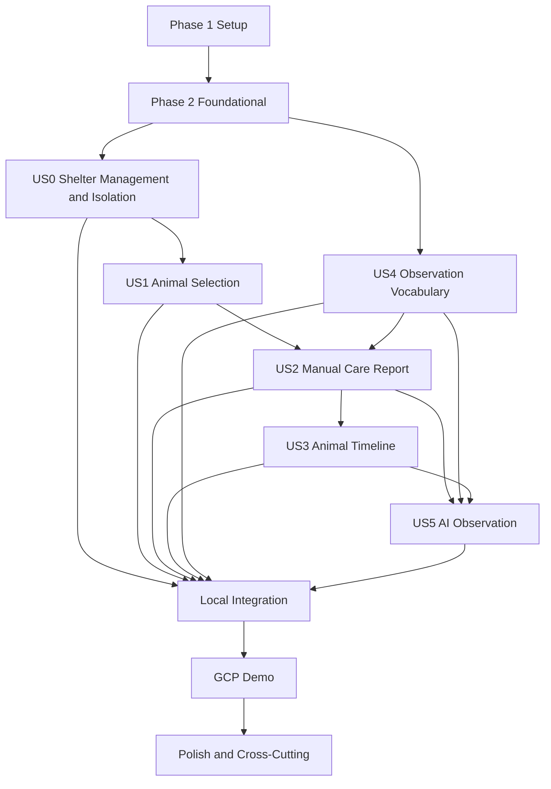

# Tasks：志工日常照護回報與動物近期歷程

## 輸入文件

- [constitution.md](../../.specify/memory/constitution.md)：專案 Constitution，包含 CRM 唯一事實來源、原始資料保存、AI 邊界、稽核、Python 品質門檻與多收容所資料隔離。
- [spec.md](./spec.md)：最新功能規格、User Story、Acceptance Scenarios、Functional Requirements、Edge Cases、成功條件與已完成 Clarification。
- [plan.md](./plan.md)：最新技術脈絡、專案目錄、Database Access、本機優先策略與 GCP Demo 門檻。
- [research.md](./research.md)：已核准的本機優先、Object Storage、QR Token、租戶隔離、AI Job、LIFF 與 SQLAlchemy 決策。
- [data-model.md](./data-model.md)：業務實體、Organization Scope、狀態轉換、關聯與資料驗證規則。
- [contracts/](./contracts/)：`crm-shelter-access.md`、`line-liff.md`、`object-storage.md`、`async-ai.md` 與 `gcp-demo.md`。
- [quickstart.md](./quickstart.md)：本機、MinIO、AI 降級、同時服務警示、24 小時修改、隔離與 GCP Demo 驗證路徑。
- `contracts/openapi.yaml`：目前不存在；本清單將其列為阻擋實作的契約補齊工作。

## 阻擋實作的未決事項

以下事項會直接影響 API Contract、Authentication 或 Storage Security，因此在解決前不得開始相依的 User Story 實作：

1. `contracts/openapi.yaml` 尚未存在。現有 Markdown contracts 不足以無歧義地提供 API 路徑、Request／Response、錯誤格式、Authentication 與租戶範圍契約；必須先完成 T015，並由 T018 驗證。
2. `Authentication` 的正式 session／token 方案尚未在 `plan.md` 或 `research.md` 定案；目前僅定義 LINE／LIFF 身分綁定與 Mock／受控 HTTPS 驗證入口。T016 必須先補上核准決策，T033-T034 才能實作登入與角色授權。
3. 圖片 EXIF 移除的執行邊界、支援格式、失敗處理與驗證方式尚未在 `plan.md` 或 `research.md` 定案。T017 必須先補上核准決策，T074 才能實作圖片處理；在此之前不得自行選擇影像套件或清理策略。

不阻擋 MVP 的低優先細節依目前規格保留為可追蹤決策：照片／心得必填規則、草稿保存期限與跨裝置恢復、重複送出的使用者確認文案，以及刪除／封存政策。這些事項不得被誤寫成超出規格的功能；實作時須沿用已核准的最小可行行為並留下決策紀錄。

## 任務格式說明

- 每項任務均使用連續的 `Txxx`、`- [ ]`、必要的 `[P]` 與 User Story 標籤。
- `[P]` 僅表示不同檔案、無未完成相依項目且可安全平行處理的工作。
- 每項任務都指定至少一個精確檔案路徑，並以動作開頭。
- 每個 User Story 先建立 Contract／Acceptance Test，再建立 Integration／Security Test、Unit Test、實作與 Regression／Story Validation。
- 所有測試都必須先確認在功能尚未實作時失敗；不得以 `skip`、刪除 assertion 或放寬驗收使測試通過。
- Repository 不得自行任意 `commit()`；交易邊界由 Application Service 控制。

## Phase 1：Setup

**目的**：建立可在本機啟動、測試與重設的 Next.js、FastAPI、Worker、PostgreSQL、MinIO 與品質工具基礎。

- [ ] T001 [P] 在 `apps/web/README.md` 建立符合 `plan.md` 的 Next.js 前端目錄說明與本機啟動入口
- [ ] T002 [P] 在 `pyproject.toml` 建立 Python 專案工具設定、Ruff、Pytest 與 FastAPI／SQLAlchemy／Alembic／`asyncpg` 的依賴邊界
- [ ] T003 [P] 在 `apps/web/package.json` 建立 Next.js、TypeScript、前端格式化與測試命令
- [ ] T004 [P] 在 `apps/web/tsconfig.json` 與 `apps/web/next.config.ts` 設定前端編譯、路徑與開發模式基礎
- [ ] T005 [P] 在 `services/api/app/main.py` 建立 FastAPI 應用程式入口與健康檢查路由骨架
- [ ] T006 [P] 在 `services/worker/worker.py` 建立 Background Worker 的本機啟動入口與可停止的處理迴圈骨架
- [ ] T007 [P] 在 `.env.example` 建立本機 PostgreSQL、MinIO、API、Worker、LINE／LIFF 與 AI 設定範例並遮罩祕密值
- [ ] T008 在 `infra/local/docker-compose.yml` 建立 PostgreSQL、MinIO 與本機必要服務的可重複啟動設定
- [ ] T009 在 `infra/local/init-minio.sh` 建立 MinIO Bucket 初始化、私人存取與本機測試前綴設定
- [ ] T010 [P] 在 `scripts/seed_local.py` 建立 Organization A／B、角色、動物、相同 Shelter Number 與虛構回報的本機 Seed 流程
- [ ] T011 [P] 在 `scripts/reset_local.py` 建立可安全重設本機 Seed 與測試資料的流程
- [ ] T012 [P] 在 `.github/workflows/ci.yml` 建立執行 Ruff、Pytest、前端測試與本機契約檢查的基本 CI Workflow
- [ ] T013 [P] 在 `README.md` 建立專案入口、文件索引與 `specs/001-volunteer-care-report/quickstart.md` 連結
- [ ] T014 在 `scripts/check_setup.sh` 建立 Setup Checkpoint，驗證 PostgreSQL、MinIO、Next.js、FastAPI、Worker、空 migration、Ruff、Pytest 與虛構 Seed 均可執行 (depends on T001, T002, T003, T005, T006, T008, T009, T010, T011)

**Setup Checkpoint**：T014 通過後，開發者可在本機啟動全部必要服務、載入虛構資料，並執行空的 Alembic Migration、Ruff 與 Pytest。

## Phase 2：Foundational

**目的**：完成所有 User Story 共用且會阻擋後續實作的設定、資料存取、Authentication、租戶隔離、Storage、錯誤與稽核基礎。

**⚠️ CRITICAL**：T015、T016、T017 解決前不得開始相依的 API、Authentication 或圖片處理實作；本 Phase 完成前不得開始任何 User Story 實作。

- [ ] T015 在 `specs/001-volunteer-care-report/contracts/openapi.yaml` 補齊與 `spec.md`、`crm-shelter-access.md`、`line-liff.md`、`object-storage.md`、`async-ai.md` 一致的 API、錯誤、Authentication、Organization Scope、Idempotency 與 Signed URL 契約
- [ ] T016 在 `specs/001-volunteer-care-report/research.md` 記錄經核准的 Authentication session／token、LINE／LIFF 身分交換、API 驗證、Worker 驗證與停用帳號失效策略，不自行選擇未核准方案
- [ ] T017 在 `specs/001-volunteer-care-report/research.md` 記錄經核准的圖片格式、EXIF 移除位置、失敗處理、原始檔與處理後檔案保存政策，以及 MinIO／GCS 一致性驗證方式
- [ ] T018 [P] 在 `tests/contract/test_openapi_contract.py` 建立 `contracts/openapi.yaml` 的路徑、Request／Response、統一錯誤、Authentication 與租戶範圍契約測試，並先確認契約缺少實作時會失敗 (depends on T015)
- [ ] T019 [P] 在 `services/api/app/config/settings.py` 建立 Pydantic Settings、環境變數驗證、Database URL、MinIO、GCS、LINE、AI 與祕密遮罩設定
- [ ] T020 [P] 在 `services/api/app/observability/logging.py` 建立結構化 Logging、Request ID、敏感值遮罩與不記錄 Token／Signed URL 的規則
- [ ] T021 [P] 在 `services/api/app/persistence/database/base.py` 建立 SQLAlchemy Declarative Base、共通 Audit 欄位映射邊界與 Model／Pydantic 分離規則
- [ ] T022 在 `services/api/app/persistence/database/engine.py` 建立 SQLAlchemy 2.x Async Engine、`asyncpg` 連線設定與 API `AsyncSession` Factory (depends on T019, T021)
- [ ] T023 [P] 在 `services/worker/persistence/session.py` 建立 Worker 專用 `AsyncSession` Factory、生命週期與失敗關閉規則 (depends on T019, T021)
- [ ] T024 在 `services/api/app/migrations/env.py` 建立 Alembic Async Configuration、metadata 載入與空資料庫 migration 入口 (depends on T021, T022)
- [ ] T025 [P] 在 `tests/integration/test_migrations.py` 建立從空 PostgreSQL 執行、升級、驗證與必要回復的 Alembic Migration 測試 (depends on T024)
- [ ] T026 [P] 在 `services/api/app/api/dependencies.py` 建立 Request `AsyncSession` Dependency、Current User Context 與統一交易生命週期邊界 (depends on T022)
- [ ] T027 在 `services/api/app/domain/transactions.py` 建立由 Application Service 控制的交易協調規則，禁止 Repository 自行任意 `commit()` (depends on T022, T026)
- [ ] T028 在 `services/api/app/persistence/models/organization.py` 建立 `organizations`、`users`、`organization_memberships` 的 SQLAlchemy Mapping 與第一組 Alembic Migration
- [ ] T029 [P] 在 `services/api/app/persistence/constraints.py` 建立角色、帳號狀態、Organization 狀態、Audit 欄位與 Composite Constraint 的資料庫驗證規則 (depends on T028)
- [ ] T030 [P] 在 `services/api/app/domain/tenant_context.py` 建立 Current User Context、Current Organization Context、Membership 驗證與不可由 Request 直接覆寫的 Scope 物件 (depends on T016, T026)
- [ ] T031 在 `services/api/app/persistence/repositories/base.py` 建立強制接收 `Organization Scope` 的 Controlled Repository 基底與一致的查詢／寫入邊界 (depends on T027, T030)
- [ ] T032 在 `services/api/app/migrations/versions/0002_tenant_defense.py` 建立同租戶關聯防護、Composite Foreign Key／Constraint 與 PostgreSQL Row-Level Security 或交易層 Scope 防護 (depends on T028, T029, T030, T031)
- [ ] T033 在 `services/api/app/domain/authentication.py` 實作已核准的登入、Token／Session 驗證、LINE 身分綁定、帳號停用與 Organization 停用檢查 (depends on T016, T019, T030)
- [ ] T034 [P] 在 `services/api/app/api/authorization.py` 建立 Platform Admin、Shelter Admin、Staff、Volunteer 的角色政策、最小權限 Dependency 與一致拒絕結果 (depends on T033)
- [ ] T035 在 `services/api/app/infrastructure/storage/ports.py` 建立共通 Object Storage Interface，並在 `services/api/app/infrastructure/storage/minio.py`、`services/api/app/infrastructure/storage/gcs.py`、`services/api/app/infrastructure/storage/memory.py` 提供 `MinioStorageAdapter`、`GcsStorageAdapter` 與 `InMemoryStorageFake` (depends on T019)
- [ ] T036 [P] 在 `tests/integration/test_storage_adapters.py` 建立 MinIO Integration Test、`InMemoryStorageFake` Contract Test、Object Key／Metadata 永久識別測試與跨租戶讀取拒絕測試 (depends on T035)
- [ ] T037 在 `services/api/app/api/errors.py` 建立統一 API Error Schema、Exception Handler、無權限／無法存取的一致結果與不洩漏存在性的錯誤處理 (depends on T018, T034)
- [ ] T038 在 `services/api/app/domain/audit.py` 建立 Audit Record Service、跨租戶拒絕事件、Platform Admin 跨機構事件、個資遮罩與來源管道保存 (depends on T020, T027, T037)
- [ ] T039 在 `tests/isolation/test_foundational_tenant_matrix.py` 以真實 PostgreSQL 建立 A／B Organization 隔離測試，涵蓋讀取、修改、Request `org_id` 越權、停用 Membership、停用 Organization 與 Platform Admin Audit Log (depends on T028, T029, T030, T031, T032, T034, T038)

**Foundational Checkpoint**：完成 T039 後，必須能建立 Organization A／B、不同角色 Membership、相同 Shelter Number 測試資料，並在本機 PostgreSQL 與 MinIO 驗證資料隔離、私人 Object 存取、Migration、Ruff 與 Foundational Pytest。

## Phase 3：User Story 0－管理收容所並維持機構資料隔離

**Story Goal**：平台管理員能建立與管理收容所及初始管理員；收容所管理員、工作人員與志工只能在被授權的 Shelter 內操作，且志工同一時間只能有一個目前服務中的 Shelter，偵測到不同 Shelter／地點同時操作時顯示警示。

**Requirement／Acceptance Criteria 對應**：對應 `spec.md` User Story 0、FR-045～FR-064、Acceptance Scenarios 48～64，以及新增 Shelter、停用 Shelter、A／B 隔離、相同 Shelter Number、Audit Log、目前 Shelter 警示與每日範圍設定驗收。

**Independent Test**：建立 Organization A／B、Platform Admin、Shelter Admin、Staff、可服務多個 Shelter 的 Volunteer；驗證 A／B 相同 Shelter Number 可以並存、一般角色不能存取另一 Shelter、平台管理員建立／停用流程可稽核，且同一 Volunteer 在不同 Shelter／地點同時操作會看到警示。

### Tests First

- [ ] T040 [P] [US0] 在 `tests/contract/test_organization_management_contract.py` 建立建立 Shelter、初始管理員、啟用／停用、Membership 與角色 API 的 Contract／Acceptance Test，先確認未實作時失敗 (depends on T018, T034)
- [ ] T041 [P] [US0] 在 `tests/integration/test_organization_management.py` 建立 Platform Admin 建立 Shelter、建立初始管理員、Shelter Admin 建立 Staff 與 Volunteer 的 PostgreSQL Integration Test (depends on T028, T033)
- [ ] T042 [P] [US0] 在 `tests/isolation/test_organization_management_isolation.py` 建立 A 使用者以識別碼、網址、搜尋條件或 Request `org_id` 存取 B 的拒絕與不存在性防護測試 (depends on T039)
- [ ] T043 [P] [US0] 在 `tests/integration/test_shelter_status_and_membership.py` 建立停用 Shelter、停用 Membership、停用帳號後不能登入、讀取或建立新業務資料的測試 (depends on T033)
- [ ] T044 [P] [US0] 在 `tests/integration/test_active_shelter_context.py` 建立 Volunteer 多 Shelter 授權、單一目前服務 Shelter、不同 Shelter／地點同時操作警示與明確切換測試 (depends on T030)
- [ ] T045 [P] [US0] 在 `tests/integration/test_daily_reportable_scope_modes.py` 建立個別 Animal、Cage／Area、指定 Volunteer 三種第一階段範圍設定與授權檢查測試 (depends on T030)
- [ ] T046 [P] [US0] 在 `tests/security/test_platform_admin_audit.py` 建立跨機構管理操作必須授權且留下完整 Audit Record 的測試 (depends on T038)
- [ ] T047 [US0] 在 `services/api/app/persistence/models/shelter_access.py` 建立 Shelter Admin、Cage／Area、Membership、Active Shelter Context 與 Daily Reportable Scope 的 SQLAlchemy Mapping 及 Alembic Migration (depends on T028, T029, T032)
- [ ] T048 [US0] 在 `services/api/app/domain/shelter_management.py` 實作 Shelter 必要欄位、預設未啟用、明確啟用、初始管理員與停用規則 (depends on T041, T047)
- [ ] T049 [US0] 在 `services/api/app/domain/active_shelter_context.py` 實作 Volunteer 目前 Shelter Context、同時服務警示、不可由 QR／搜尋結果自動切換與 Audit 事件 (depends on T044, T047, T048)
- [ ] T050 [US0] 在 `services/api/app/domain/reportable_scope.py` 實作個別 Animal、Cage／Area、指定 Volunteer 的有效期限、範圍展開與送出前重新驗證規則 (depends on T045, T047, T049)
- [ ] T051 [US0] 在 `services/api/app/api/organization_management.py` 實作 Platform Admin、Shelter Admin、Membership、Cage／Area 與 Daily Reportable Scope API (depends on T040, T048, T050)
- [ ] T052 [P] [US0] 在 `apps/web/app/(management)/shelters/page.tsx` 建立平台與收容所管理畫面，顯示 Shelter 狀態、初始管理員與只能操作授權 Shelter 的錯誤狀態 (depends on T051)
- [ ] T053 [P] [US0] 在 `apps/web/features/shelter-context/ActiveShelterContext.tsx` 建立 Volunteer 目前 Shelter 顯示、明確切換與不同 Shelter／地點同時操作警示畫面 (depends on T049, T051)
- [ ] T054 [US0] 在 `tests/e2e/test_us0_shelter_isolation.py` 執行 User Story 0 Independent Test、Acceptance Scenarios 與回歸測試，確認前端隱藏以外的 API、Repository、Database Constraint 與 Audit 均有效 (depends on T042, T043, T046, T051, T052, T053)

**Story Checkpoint**：T054 通過後，User Story 0 可獨立展示收容所建立、帳號與範圍管理、A／B 隔離、相同 Shelter Number、停用與同時服務警示。

## Phase 4：User Story 1－透過名單、QR Code 或收容編號正確選擇動物

**Story Goal**：志工可透過今日可回報名單、QR Code 或 Shelter Number 搜尋找到候選 Animal，看到照片、名稱、完整 Shelter Number 與 Cage／Area，明確確認後才進入回報 Draft。

**Requirement／Acceptance Criteria 對應**：對應 `spec.md` User Story 1、FR-001～FR-014、Acceptance Scenarios 1～17、QR Code 邊界情境與同名／重複 Shelter Number 防護。

**Independent Test**：Volunteer A 看到 A 的今日名單、掃描 A Animal QR Token、確認動物並建立 Draft；使用 B Token、重複 Shelter Number、被封存 Animal、錯誤或竄改 Token 均不能取得 B 資料或建立正式回報。

### Tests First

- [ ] T055 [P] [US1] 在 `tests/contract/test_animal_selection_contract.py` 建立今日名單、Shelter Number 搜尋、QR Resolve、Animal Confirmation 與失敗錯誤的 Contract／Acceptance Test，先確認未實作時失敗 (depends on T018, T054)
- [ ] T056 [P] [US1] 在 `tests/integration/test_shelter_number_constraints.py` 建立同一 `org_id` 不可重複、不同 `org_id` 可使用相同 Shelter Number、無 Shelter Number Animal 與歷史識別快照測試 (depends on T032, T047)
- [ ] T057 [P] [US1] 在 `tests/isolation/test_qr_cross_tenant.py` 建立 Volunteer A 掃描 B QR Token、B Shelter Number 與 B Animal ID 時拒絕且不洩漏存在性的測試 (depends on T039, T049)
- [ ] T058 [P] [US1] 在 `tests/security/test_qr_token_tampering.py` 建立修改 QR Token、`org_id`、Shelter Number、深層連結與貼錯 Cage 時不能繞過授權的測試 (depends on T057)
- [ ] T059 [P] [US1] 在 `tests/integration/test_reportable_animal_selection.py` 建立今日 Scope、Animal 封存／不可回報、唯一確認卡、未確認不建立正式回報與送出前 Scope 失效測試 (depends on T045, T050)
- [ ] T060 [P] [US1] 在 `tests/frontend/test_animal_disambiguation.tsx` 建立同名、相似照片與多筆搜尋結果同時顯示照片、名稱、完整 Shelter Number 與 Cage／Area 的前端測試 (depends on T055)
- [ ] T061 [P] [US1] 在 `tests/frontend/test_liff_mock_animal_selection.tsx` 建立 Mock LIFF 身分、QR Deep Link、改用搜尋與掃描失敗替代流程測試 (depends on T055, T060)

### Implementation

- [ ] T062 [US1] 在 `services/api/app/persistence/models/animal.py` 建立 Animal、Shelter Number、Cage／Area 關聯的 SQLAlchemy Mapping 與 Alembic Migration (depends on T056, T059)
- [ ] T063 [US1] 在 `services/api/app/persistence/repositories/animal_repository.py` 建立帶 `Organization Scope`、Shelter Number 唯一性、模糊搜尋多筆結果與歷史快照查詢的 Animal Repository (depends on T031, T062)
- [ ] T064 [US1] 在 `services/api/app/persistence/models/qr_code.py` 建立 QR Code／QR Token 狀態、撤銷與 Animal／Shelter 關聯的 SQLAlchemy Mapping 與 Migration (depends on T062)
- [ ] T065 [US1] 在 `services/api/app/domain/qr_token.py` 實作非祕密 QR Token 產生、撤銷、解析、唯一性與三方 Shelter Scope 驗證，不將 Token 當作授權憑證 (depends on T057, T058, T064)
- [ ] T066 [US1] 在 `services/api/app/application/animal_selection.py` 實作今日可回報清單、Shelter Number 搜尋、QR Resolve、Animal Confirmation 與建立 Draft 入口 (depends on T050, T063, T065)
- [ ] T067 [US1] 在 `services/api/app/api/animal_selection.py` 實作 Animal Confirmation、Shelter Number Search、QR Resolve 與統一拒絕錯誤 API (depends on T055, T066)
- [ ] T068 [P] [US1] 在 `apps/web/features/animal-selection/AnimalConfirmationCard.tsx` 建立照片、名稱、完整 Shelter Number、Cage／Area、可回報狀態與明確確認按鈕 (depends on T060, T067)
- [ ] T069 [P] [US1] 在 `apps/web/app/(volunteer)/care-report/select-animal/page.tsx` 建立今日名單、Shelter Number 搜尋、QR Deep Link、掃描失敗與跨 Shelter 拒絕流程 (depends on T061, T067, T068)
- [ ] T070 [US1] 在 `apps/web/features/care-report/create-draft.ts` 建立確認後建立 Draft 的前端入口，固定顯示已確認 Animal 並禁止未確認直接建立正式回報 (depends on T066, T068, T069)
- [ ] T071 [US1] 在 `tests/e2e/test_us1_animal_selection.py` 執行 User Story 1 Independent Test、Acceptance Scenarios 1～17 與回歸測試 (depends on T054, T067, T070)

**Story Checkpoint**：T071 通過後，志工可獨立完成「今日名單／QR／Shelter Number → 確認卡 → 建立 Draft」，且任何跨 Shelter、重複編號、錯誤 Token 或資格失效均不會誤綁 Animal。

## Phase 5：User Story 2－建立人工日常照護回報

**Story Goal**：即使 AI 或外部服務完全不可用，志工仍能在手機完成結構化人工照護回報、照片與心得，CRM 保存原始內容，並保留草稿、冪等、修改與更正的追溯性。

**Requirement／Acceptance Criteria 對應**：對應 `spec.md` User Story 2、FR-015～FR-029、Acceptance Scenarios 18～29、照片／心得／排泄照片待決策的最小可行規則、24 小時內容修改與 Animal Binding 不可由志工修改。

**Independent Test**：停止 AI Worker 或使用失敗 AI Adapter；Volunteer A 選擇 A Animal、填寫所有結構化欄位、上傳照片、輸入心得並送出。原始回報在 CRM 保存，重送同一 Idempotency Key 不產生不可辨識重複資料，且志工只能在 24 小時內修改自己的內容／照片／心得。

### Tests First

- [ ] T072 [P] [US2] 在 `tests/contract/test_care_report_contract.py` 建立 Draft、Media Upload、Care Report Submit、24 小時修改、預覽、成功與統一錯誤的 Contract／Acceptance Test，先確認未實作時失敗 (depends on T018, T071)
- [ ] T073 [P] [US2] 在 `tests/integration/test_report_submission_revalidation.py` 建立送出時重新驗證 Membership、Organization、Animal、Reportable Scope、Observation Option、Media 狀態與原 Animal 關聯的測試 (depends on T059, T072)
- [ ] T074 [P] [US2] 在 `tests/integration/test_multiple_care_reports.py` 建立同日同 Animal 多筆、多人同日回報、回報交易回滾與原始資料完整保存測試 (depends on T072)
- [ ] T075 [P] [US2] 在 `tests/integration/test_idempotent_report_submission.py` 建立同一 Idempotency Key 重送、不同 Key 建立第二筆回報與重複送出提示測試 (depends on T072)
- [ ] T076 [P] [US2] 在 `tests/security/test_report_observation_scope.py` 建立跨 Shelter Animal Association、停用選項、未授權 Observation Option 與 Volunteer 不能修改他人／Animal Binding 的測試 (depends on T039, T073)
- [ ] T077 [P] [US2] 在 `tests/integration/test_media_validation.py` 建立照片 MIME、大小、用途、上傳失敗、無照片／無心得的已核准最小規則測試 (depends on T017, T072)
- [ ] T078 [P] [US2] 在 `tests/integration/test_exif_removal.py` 建立依核准政策驗證 EXIF 移除、原始 Metadata 不外洩、失敗狀態與 Object Key 關聯的測試 (depends on T017, T077)
- [ ] T079 [P] [US2] 在 `tests/integration/test_minio_report_media.py` 建立 MinIO 上傳、私人讀取、跨租戶拒絕、穩定 Object Key 與 Signed URL 不作永久識別的測試 (depends on T036, T077)
- [ ] T080 [P] [US2] 在 `tests/integration/test_report_ai_failure_degradation.py` 建立 AI Job 建立失敗、Worker 停止與外部 AI 不可用時仍保存人工回報的測試 (depends on T072)
- [ ] T081 [P] [US2] 在 `tests/frontend/test_care_report_form.tsx` 建立手機表單、結構化觀察、照片、心得、預覽、成功與外部服務失敗不阻塞的前端測試 (depends on T072)
- [ ] T082 [P] [US2] 在 `tests/security/test_report_edit_window.py` 建立 24 小時內本人內容／照片／心得可修改、超時拒絕、他人拒絕與 Animal Binding 不可修改測試 (depends on T072)

### Implementation

- [ ] T083 [US2] 在 `services/api/app/persistence/models/care_report.py` 建立 `care_report_drafts`、`care_reports`、`care_report_observations`、`media_assets` 與 `idempotency_keys` 的 SQLAlchemy Mapping 與 Alembic Migration (depends on T073, T074)
- [ ] T084 [US2] 在 `services/api/app/persistence/repositories/care_report_repository.py` 建立 Draft、Care Report、Observation、Media 與 Idempotency 的 Organization-scoped Repository，不在 Repository 自行 `commit()` (depends on T027, T083)
- [ ] T085 [US2] 在 `services/api/app/domain/care_report_validation.py` 實作進食、飲水、活動、排泄、行為、外觀、照片用途、心得長度與「未觀察／無法判斷」的非診斷性驗證 (depends on T072, T076)
- [ ] T086 [US2] 在 `services/api/app/application/draft_service.py` 實作 Draft 建立、暫存、中斷恢復、照片失敗狀態與重新開啟時的 Animal／Membership／Scope 驗證 (depends on T073, T084, T085)
- [ ] T087 [US2] 在 `services/api/app/application/media_service.py` 實作共通 Storage Port、MIME／大小／用途驗證、EXIF 處理、Object Metadata 與失敗降級 (depends on T017, T035, T078, T079)
- [ ] T088 [US2] 在 `services/api/app/application/report_submission.py` 實作 Application Service 交易邊界，依序驗證 Scope、Option、Media、建立 Report、關聯 Observation／Media、寫入 Audit、完成 Draft 與建立 AI Job 紀錄 (depends on T027, T073, T080, T083, T084, T085, T086, T087)
- [ ] T089 [US2] 在 `services/api/app/application/idempotency_service.py` 實作 Idempotency Key 的請求重放辨識、成功結果重用與不同請求區分 (depends on T075, T084, T088)
- [ ] T090 [US2] 在 `services/api/app/application/report_correction.py` 實作志工 24 小時內容／照片／心得修改與授權 Staff／Shelter Admin Animal Binding 更正，保留前後版本與 Audit (depends on T082, T088)
- [ ] T091 [US2] 在 `services/api/app/api/care_reports.py` 實作 Draft、Media Upload、Care Report Submit、修改與更正 API，套用統一 Error Schema、Authentication 與 Organization Scope (depends on T072, T086, T088, T089, T090)
- [ ] T092 [P] [US2] 在 `apps/web/features/care-report/CareReportDraft.tsx` 建立固定 Animal 確認區、進食、飲水、活動、排泄、護食／行為、特殊狀態、照片與心得欄位 (depends on T081, T091)
- [ ] T093 [P] [US2] 在 `apps/web/features/care-report/ReportPreview.tsx` 建立回報預覽、送出確認、已填內容保留、照片失敗提示與重複送出防護 (depends on T081, T091)
- [ ] T094 [US2] 在 `apps/web/app/(volunteer)/care-report/page.tsx` 建立 Draft 恢復、網路中斷、LIFF 返回、成功保存確認與 24 小時本人修改流程 (depends on T086, T091, T092, T093)
- [ ] T095 [US2] 在 `tests/e2e/test_us2_manual_report.py` 執行 User Story 2 Independent Test、Acceptance Scenarios 18～29、AI 失敗降級與既有 US1 回歸測試 (depends on T071, T080, T091, T094)

**Story Checkpoint**：T095 通過後，US1 選定的 Animal 可完成人工回報；AI、照片後處理或其他外部服務失敗不會阻止 CRM 保存原始人工資料。

## Phase 6：User Story 3－查看單一動物近 14 天歷程

**Story Goal**：Staff 或有權限的 Shelter Admin 能以單一 Animal 為中心查看近 14 個曆日、同日多筆、指定日期、更早歷史、原始照片／心得、AI／人工狀態與更正歷程。

**Requirement／Acceptance Criteria 對應**：對應 `spec.md` User Story 3、FR-030～FR-035、Acceptance Scenarios 30～35、無回報日期、歷史 Option 停用、Media 權限與超過 14 日查詢。

**Independent Test**：Staff A 查看 A Animal 近 14 天，看到每日摘要、明確「當日無回報」、同日所有回報、原始心得與照片；可查更早日期，但使用 A 帳號不能查看 B Animal Timeline 或取得 B 的 Media Signed URL。

### Tests First

- [ ] T096 [P] [US3] 在 `tests/contract/test_animal_timeline_contract.py` 建立近 14 日、指定日期、逐筆展開、無回報狀態、原始資料與權限錯誤的 Contract／Acceptance Test，先確認未實作時失敗 (depends on T018, T095)
- [ ] T097 [P] [US3] 在 `tests/integration/test_animal_timeline.py` 建立 14 個曆日補齊、指定日期、同日多筆、超過 14 日歷史與停用 Option 歷史顯示測試 (depends on T095)
- [ ] T098 [P] [US3] 在 `tests/isolation/test_timeline_and_media_isolation.py` 建立 A Staff 無法查看 B Timeline、原始照片、心得與 Signed URL 的測試 (depends on T039, T079)
- [ ] T099 [P] [US3] 在 `tests/integration/test_timeline_correction_history.py` 建立原始 Report、AI 結果、人工結果、Animal Binding 更正與 Audit History 分離顯示測試 (depends on T090, T095)
- [ ] T100 [P] [US3] 在 `tests/integration/test_timeline_query_count.py` 建立 Timeline 查詢不產生未控制 N+1、指定主要摘要效能與近 14 日兩秒目標驗證 (depends on T097)
- [ ] T101 [P] [US3] 在 `tests/frontend/test_animal_timeline.tsx` 建立每日摘要、無回報、同日展開、照片權限、原始心得、AI 區域與 Loading／Empty／Error State 測試 (depends on T096)

### Implementation

- [ ] T102 [US3] 在 `services/api/app/application/timeline_query.py` 建立 Timeline Query Repository、14 個曆日序列補齊、日期區間、每日摘要與逐筆 DTO (depends on T096, T097, T100)
- [ ] T103 [US3] 在 `services/api/app/application/media_access.py` 建立帶 Organization Scope、角色權限、過期與拒絕錯誤的 Signed Media URL Service (depends on T098, T102)
- [ ] T104 [US3] 在 `services/api/app/api/animal_timeline.py` 實作 Animal Timeline、指定日期、歷史區間、Filter 與受控 Media 存取 API (depends on T096, T102, T103)
- [ ] T105 [P] [US3] 在 `apps/web/features/animal-timeline/AnimalTimeline.tsx` 建立近 14 日每日摘要、當日無回報、同日多筆、原始心得、照片與 AI／人工分區 (depends on T101, T104)
- [ ] T106 [P] [US3] 在 `apps/web/features/animal-timeline/TimelineFilters.tsx` 建立指定日期、日期區間、紀錄類型、Loading、Empty 與 Error State (depends on T101, T104)
- [ ] T107 [US3] 在 `apps/web/app/(management)/animals/[animalId]/timeline/page.tsx` 建立 Staff 進入指定 Animal 近期歷程、展開完整紀錄與權限拒絕流程 (depends on T104, T105, T106)
- [ ] T108 [US3] 在 `tests/e2e/test_us3_animal_timeline.py` 執行 User Story 3 Independent Test、Acceptance Scenarios 30～35、無回報語意與 US1／US2 回歸測試 (depends on T095, T104, T107)

**Story Checkpoint**：T108 通過後，工作人員能在主要操作門檻內看到近 14 天完整時間序列；缺少回報的日期不會被呈現成正常或沒有特殊訊號。

## Phase 7：User Story 4－使用與維護標準化觀察語彙

**Story Goal**：Volunteer 使用一致的 Observation Category／Option；Shelter Admin 或授權 Staff 能維護顯示名稱、說明、順序與啟用狀態，停用不破壞歷史紀錄。

**Requirement／Acceptance Criteria 對應**：對應 `spec.md` User Story 4、FR-036～FR-038、Acceptance Scenarios 35、標準化語彙與跨 Shelter 管理權限。

**Independent Test**：Shelter Admin A 能查看平台預設、新增／修改／排序／停用 A 選項；不能修改 B；Volunteer 不能管理；停用後新回報不能選用，但歷史 Report 仍可顯示原內容。

### Tests First

- [ ] T109 [P] [US4] 在 `tests/contract/test_observation_options_contract.py` 建立 Observation Category／Option 查詢、建立、修改、排序、停用與權限錯誤的 Contract Test，先確認未實作時失敗 (depends on T018, T108)
- [ ] T110 [P] [US4] 在 `tests/integration/test_observation_options.py` 建立 Platform Default、Organization Extension、穩定 Code、停用後不可供新回報與歷史仍顯示測試 (depends on T083, T108)
- [ ] T111 [P] [US4] 在 `tests/isolation/test_observation_option_isolation.py` 建立 A／B Option 查詢與修改隔離、Volunteer 無管理權限、Shelter Admin 角色權限測試 (depends on T039)
- [ ] T112 [P] [US4] 在 `tests/unit/test_ai_observation_whitelist.py` 建立 Observation Option 白名單與停用選項驗證測試 (depends on T110)
- [ ] T113 [P] [US4] 在 `tests/frontend/test_observation_admin.tsx` 建立觀察選項管理、來源顯示、停用、權限拒絕與歷史使用狀態測試 (depends on T109)

### Implementation

- [ ] T114 [US4] 在 `services/api/app/persistence/models/observation_option.py` 建立 `observation_categories`、`observation_options`、Platform Default／Organization Extension 關聯與 Alembic Migration (depends on T109, T110)
- [ ] T115 [US4] 在 `services/api/app/persistence/repositories/observation_option_repository.py` 建立有效 Option、歷史 Option 與 Organization Scope 查詢，不允許 Hard Delete (depends on T031, T114)
- [ ] T116 [US4] 在 `services/api/app/application/observation_option_service.py` 實作新增、顯示名稱／說明修改、排序、停用、Audit 與新回報白名單規則 (depends on T110, T111, T115)
- [ ] T117 [US4] 在 `services/api/app/api/observation_options.py` 實作 Volunteer 查詢、Shelter Admin／授權 Staff 管理 API 與統一權限錯誤 (depends on T109, T116)
- [ ] T118 [P] [US4] 在 `apps/web/app/(management)/settings/observation-options/page.tsx` 建立觀察語彙管理頁、平台／機構來源、排序、停用與權限錯誤處理 (depends on T113, T117)
- [ ] T119 [US4] 在 `tests/e2e/test_us4_observation_options.py` 執行 User Story 4 Independent Test、Acceptance Scenarios、停用歷史顯示與 US2／US3 回歸測試 (depends on T108, T117, T118)

**Story Checkpoint**：T119 通過後，標準化語彙可維護、跨 Shelter 隔離、停用不破壞歷史，且回報表單只提供有效且被授權的選項。

## Phase 8：User Story 5－取得可追溯的 AI 描述性觀察

**Story Goal**：AI 在原始回報保存後以非同步 Job 分析心得與照片，產生可驗證、可追溯、可人工確認／修正的描述性觀察；AI 失敗不影響人工回報或 Timeline。

**Requirement／Acceptance Criteria 對應**：對應 `spec.md` User Story 5、FR-039～FR-044、Acceptance Scenarios 36～42、AI 禁止診斷／計分／排序／改 Animal／覆蓋原始資料與失敗降級。

**Independent Test**：原始 Report 已保存後，Worker 從 pending Job 取得資料，Mock AI 回傳描述性觀察，系統完成 Schema、白名單與禁用詞驗證；Staff 能 Confirm／Reject／Correct。AI 逾時、無效 JSON、含診斷語意或服務中斷時，原始 Report 與 Timeline 仍可用，且不得顯示正常或沒有異常。

### Tests First

- [ ] T120 [P] [US5] 在 `tests/contract/test_ai_observation_contract.py` 建立 Job、AI Observation、原始輸出、人工確認／修正與失敗狀態的 Contract Test，先確認未實作時失敗 (depends on T018, T119)
- [ ] T121 [P] [US5] 在 `tests/integration/test_ai_job_lifecycle.py` 建立 Job enqueue、claim、狀態轉換、Idempotency、Worker Crash Recovery、Retry 與跨 Organization Job 隔離測試 (depends on T080, T120)
- [ ] T122 [P] [US5] 在 `tests/unit/test_ai_output_validation.py` 建立 Timeout、Invalid JSON、Schema、Medical Forbidden-term、Unknown Option、`animal_id`、分數／等級／排序禁止規則測試 (depends on T112, T120)
- [ ] T123 [P] [US5] 在 `tests/security/test_ai_cannot_change_source.py` 建立 AI 不能修改 Care Report、Animal Binding、正式狀態或產生正式識別碼的測試 (depends on T039, T120)
- [ ] T124 [P] [US5] 在 `tests/integration/test_ai_review.py` 建立授權 Staff Confirm／Reject／Correct、來源追溯、原始 AI 輸出與人工結果分離保存測試 (depends on T120)
- [ ] T125 [P] [US5] 在 `tests/integration/test_ai_failure_timeline.py` 建立 AI 失敗／逾時／無效／無法判讀時 Timeline 顯示待處理或失敗、人工回報與歷史查詢仍可用的測試 (depends on T108, T120)
- [ ] T126 [P] [US5] 在 `tests/frontend/test_ai_observation_review.tsx` 建立 AI 明確標示、來源連結、待處理／失敗、Confirm／Reject／Correct 與禁止語意顯示測試 (depends on T120)

### Implementation

- [ ] T127 [US5] 在 `services/api/app/persistence/models/ai_job.py` 建立 `jobs`、`ai_observations`、`ai_call_logs` 的 SQLAlchemy Mapping、狀態與 Alembic Migration (depends on T120, T121)
- [ ] T128 [US5] 在 `services/worker/repositories/job_repository.py` 建立 Job 的 Organization-scoped 查詢、claim、lease、retry、失敗與 Idempotency Repository (depends on T031, T121, T127)
- [ ] T129 [US5] 在 `services/worker/application/job_handler.py` 建立 Worker Loop／Handler、Crash Recovery、重試上限、AI 失敗狀態與不阻塞人工回報的流程 (depends on T121, T128)
- [ ] T130 [US5] 在 `services/worker/infrastructure/ai/ports.py` 建立 AI Client Port、Mock AI Adapter 與正式 AI Adapter 的隔離邊界 (depends on T120, T129)
- [ ] T131 [US5] 在 `services/worker/domain/ai_validation.py` 實作 Structured Output Schema、Medical Forbidden-term Validator、Observation Option Whitelist Validator 與禁止正式決定的規則 (depends on T122, T130)
- [ ] T132 [US5] 在 `services/worker/repositories/ai_observation_repository.py` 建立原始 AI 輸出、有效衍生資料、來源 Photo／Note 與人工結果分離保存的 Repository (depends on T124, T127)
- [ ] T133 [US5] 在 `services/api/app/application/ai_review_service.py` 實作授權 Staff Confirm／Reject／Correct、前後結果、原因、時間與 Audit 保存 (depends on T123, T124, T131, T132)
- [ ] T134 [US5] 在 `services/api/app/api/ai_observations.py` 實作 AI 狀態、來源追溯、Review、Confirm、Reject、Correct API (depends on T120, T133)
- [ ] T135 [P] [US5] 在 `apps/web/features/ai-observation/AIObservationPanel.tsx` 建立 AI 輔助標示、處理狀態、來源照片／心得、人工確認／修正與失敗狀態 UI (depends on T126, T134)
- [ ] T136 [US5] 在 `tests/e2e/test_us5_ai_observation.py` 執行 User Story 5 Independent Test、Acceptance Scenarios 36～42、AI Failure 降級與 US2／US3 回歸測試 (depends on T095, T108, T129, T134, T135)

**Story Checkpoint**：T136 通過後，AI 僅是可追溯的衍生觀察來源；原始 Report、照片、心得、Animal Binding 與人工結果均保持獨立且可查。

## Phase 9：本機整合驗證

**目的**：在任何 GCP 資源建立前，完成 MVP 與全部主要 User Story 的本機端到端驗證。

- [ ] T137 [P] 在 `tests/integration/test_empty_database_bootstrap.py` 從空 PostgreSQL 執行全部 Alembic Migration、Seed、Reset 與升級驗證 (depends on T025, T039, T136)
- [ ] T138 [P] 在 `tests/isolation/test_cross_tenant_resource_matrix.py` 建立完整 Organization A／B 測試矩陣，直接驗證 Organization、Membership、Animal、Shelter Number Search、QR Token、Reportable Scope、Draft、Care Report、Timeline、Media、Signed URL、AI Job、AI Observation、Observation Option 與 Audit Log (depends on T039, T071, T095, T108, T119, T136)
- [ ] T139 [P] 在 `tests/integration/test_local_vertical_flow.py` 執行建立 Shelter、建立 Staff／Volunteer、建立 Animal、產生 QR Token、確認 Animal、建立 Report、上傳 MinIO、建立 AI Job 與查看 Timeline 的完整本機流程 (depends on T054, T071, T095, T108, T136)
- [ ] T140 [P] 在 `tests/integration/test_local_failure_degradation.py` 執行網路中斷、照片上傳失敗、AI 失敗、Worker 停止、停用 Shelter／Membership 與送出前資格失效驗證 (depends on T095, T108, T136)
- [ ] T141 [P] 在 `tests/frontend/test_local_liff_e2e.tsx` 使用 Mock LIFF Context 執行 QR Deep Link、Animal Confirmation、手機回報、Draft 恢復、成功保存與 Timeline 檢視流程 (depends on T071, T095, T108)
- [ ] T142 在 `scripts/verify_local.sh` 建立本機整合驗證命令，依序執行 Docker Compose、Migration、Seed、Worker、完整 E2E、Ruff、Pytest 與前端測試 (depends on T137, T138, T139, T140, T141)
- [ ] T143 [P] 在 `tests/contract/test_contract_documents.py` 驗證 `contracts/openapi.yaml`、既有 Markdown contracts 與 `quickstart.md` 的路徑、狀態、錯誤、Storage、AI 與本機指令一致 (depends on T015, T018, T142)
- [ ] T144 在 `specs/001-volunteer-care-report/quickstart.md` 補上本機整合驗證結果、命令、前置條件與失敗排查紀錄 (depends on T142, T143)

**本機 MVP Checkpoint**：US0 作為多租戶管理前置能力，加上 US1、US2、US3 後形成第一個可展示垂直 MVP；MVP 不依賴 US4 或 US5 的 AI 成功。

## Phase 10：GCP Demo 部署

**目的**：僅在本機品質門檻、Migration、MinIO、GCS Contract、A／B 隔離與主要流程全部通過後，建立使用虛構資料的 GCP Demo。

- [ ] T145 [P] 在 `infra/gcp-demo/project.md` 建立 GCP Demo Project、區域、虛構資料、服務清單與不使用正式個資的環境規則 (depends on T142)
- [ ] T146 [P] 在 `infra/gcp-demo/terraform/main.tf` 建立 Artifact Registry、Cloud SQL for PostgreSQL、Cloud Storage Private Bucket、Secret Manager 與 Cloud Logging 基礎資源 (depends on T145)
- [ ] T147 [P] 在 `infra/gcp-demo/terraform/iam.tf` 建立 Cloud Run／Worker Service Account、最小 IAM、GCS Object 權限與 GitHub OIDC 設定 (depends on T146)
- [ ] T148 在 `services/api/app/infrastructure/storage/gcs.py` 完成 `GcsStorageAdapter`、Private Bucket、Object Key、Signed URL、過期與權限錯誤的實作 (depends on T017, T035, T146, T147)
- [ ] T149 [P] 在 `tests/contract/test_gcs_storage_contract.py` 使用 GCP Demo 測試環境驗證 `GcsStorageAdapter` 與 MinIO／`InMemoryStorageFake` 共通契約 (depends on T148)
- [ ] T150 [P] 在 `infra/gcp-demo/cloud-run-web.yaml` 建立 Next.js Cloud Run Service 的虛構資料 Demo 設定 (depends on T146, T147)
- [ ] T151 [P] 在 `infra/gcp-demo/cloud-run-api.yaml` 建立 FastAPI Cloud Run Service、Cloud SQL 連線與 Secret Manager 設定 (depends on T146, T147)
- [ ] T152 [P] 在 `infra/gcp-demo/cloud-run-worker.yaml` 建立 Background Worker／Job、AI Adapter、Cloud SQL 與 Secret Manager 設定 (depends on T146, T147)
- [ ] T153 在 `infra/gcp-demo/migrate.sh` 建立 Cloud SQL 空資料庫 Migration、版本驗證與失敗停止流程 (depends on T151)
- [ ] T154 在 `infra/gcp-demo/seed-demo.sh` 建立僅含虛構或合法公開資料的 Demo Seed、A／B Organization 與相同 Shelter Number (depends on T153)
- [ ] T155 在 `tests/integration/test_gcp_demo_smoke.py` 執行 Cloud SQL、Cloud Storage、Signed URL、LIFF HTTPS、QR、A／B 隔離、AI 失敗降級與 Cloud Logging Smoke Test (depends on T149, T150, T151, T152, T153, T154)

**GCP Deployment Gate**：T155 前必須通過 `ruff check .`、`ruff format --check .`、`pytest`、前端測試、空資料庫 Migration、本機關鍵流程、Multi-tenant Security Test、MinIO Adapter Test、GCS Adapter Contract Test、Secret Scan 與 Docker Build；本機通過不代表 GCP IAM、Signed URL、Cloud SQL、Service Account 或 LIFF HTTPS 已驗證。

## Final Phase：Polish 與 Cross-Cutting

**目的**：只處理已存在於 spec／plan 的跨 User Story 品質、可觀測性、效能、可用性與文件收尾；不得新增未規格化功能。

- [ ] T156 [P] 在 `pyproject.toml` 與 `services/api/app/` 清理 Ruff、Type Check、AsyncSession 使用與 Repository 交易邊界違規 (depends on T155)
- [ ] T157 [P] 在 `tests/test_feature_quality.py` 執行完整 Pytest、Cross-tenant Regression、Migration Validation、Security Hardening 與無未說明 Skip 的檢查 (depends on T155)
- [ ] T158 [P] 在 `apps/web/package.json` 執行完整 Frontend Test、E2E Test、Mobile／LIFF Viewport 與 Accessibility 基本檢查 (depends on T155)
- [ ] T159 [P] 在 `tests/integration/test_performance_targets.py` 驗證 Timeline 兩秒主要摘要目標與標準回報 90 秒可完成流程的可觀測測試資料 (depends on T155)
- [ ] T160 [P] 在 `services/api/app/observability/logging.py` 檢查 Error Message 統一、Audit Log 遮罩、Secret／Token／Signed URL 不進 Log 與 Request ID 關聯 (depends on T155)
- [ ] T161 [P] 在 `specs/001-volunteer-care-report/quickstart.md` 與 `README.md` 更新最終本機、MVP、GCP Demo、失敗降級、權限與驗證命令 (depends on T155)
- [ ] T162 [P] 在 `scripts/demo.sh` 建立可重複執行的虛構資料 Demo Script，涵蓋 US0、US1、US2、US3 與 AI 未完成時的 MVP 流程 (depends on T155)
- [ ] T163 在 `infra/gcp-demo/smoke-test.sh` 執行最終 GCP Demo Smoke Test、Organization A／B 隔離、QR、Signed URL、AI Failure 與 Cloud Logging 驗證 (depends on T155, T162)
- [ ] T164 在 `specs/001-volunteer-care-report/tasks.md` 記錄所有 Checkpoint、測試命令、阻擋事項處理結果、未完成範圍與最終 Completion Evidence (depends on T156, T157, T158, T159, T160, T161, T162, T163)

## Dependencies & Execution Order

### Phase Dependencies

1. Setup T001-T014 可先行；T014 是 Setup Checkpoint。
2. Foundational T015-T039 依序解決 OpenAPI、Authentication、EXIF 與共通資料／安全基礎；T039 完成前不得開始任何 User Story。
3. User Story 0 T040-T054 是多租戶管理與授權前置能力；User Story 1-T3 的業務流程依賴其 Organization、Membership、Active Shelter Context 與 Daily Reportable Scope。
4. User Story 1 T055-T071 建立正確 Animal 選擇與 Draft 入口；User Story 2 依賴其確認後 Animal 與 Draft 邊界。
5. User Story 2 T072-T095 建立人工回報；User Story 3 依賴其正式 Report、Media、原始 Note 與更正資料。
6. User Story 4 T109-T119 可在 Foundational 後與部分 US3 平行，但要與 US2 的 Observation Option 驗證整合。
7. User Story 5 T120-T136 依賴 US2 的原始回報／AI Job 建立與 US4 的 Option 白名單；AI 不阻擋 US1～US3 MVP。
8. 本機整合 T137-T144 必須在欲交付的 User Story Checkpoint 通過後執行；GCP Demo T145-T155 必須在本機 Gate 通過後執行。
9. Polish T156-T164 依賴本機與 GCP Demo 的目標交付範圍完成。

### User Story Dependencies

- **User Story 0（P1）**：依賴 Foundational；是所有一般角色租戶操作的必要前置能力。
- **User Story 1（P1）**：依賴 User Story 0 的 Organization Scope、Membership、Active Shelter Context 與 Reportable Scope；可獨立驗收 Animal 選擇。
- **User Story 2（P2）**：依賴 User Story 1 的確認 Animal／Draft 入口與 User Story 4 的最小有效 Observation Option 查詢；可在 AI 未完成時獨立驗收人工回報。
- **User Story 3（P3）**：依賴 User Story 2 的 Care Report、Photo、Volunteer Note 與 Audit；可獨立驗收 Timeline 查詢與無回報日期。
- **User Story 4（P4）**：依賴 Foundational 的租戶與角色基礎；與 US2 的表單選項契約相容後可獨立驗收管理能力。
- **User Story 5（P5）**：依賴 User Story 2 的原始 Report／Media／Note、User Story 4 的 Option 白名單與 US3 的狀態呈現；不得成為 US1～US3 的必要條件。

### 每個 User Story 內的執行順序

每個 Story 均遵守：Contract／Acceptance Test → Integration／Security Test → Unit Test → Model／Migration → Repository → Domain／Application Service → API → Frontend → Regression／Independent Test。測試任務先於對應實作任務，且每一個 Checkpoint 都要保留通過證據。

### Mermaid Dependency Graph

### Parallel Opportunities

- Setup 可平行處理 T001-T013，但 T014 必須等待服務、工具與 Seed 都完成。
- Foundational 的設定、Logging、Base Model、Worker Session、Storage Interface 可在不同檔案中平行；Authentication、Repository、RLS／交易防護仍須等待阻擋決策與 Model。
- 每個 User Story 的 Contract Test、Integration Test、Security Test 與 Frontend Test 可在不同檔案中平行建立，但所有測試必須先於實作，且不得同時修改相同契約或核心 Model。
- Foundational 完成後，US0 可先行；US4 的語彙管理與 US1 的前端測試／後端測試可依明確檔案邊界平行準備。US2 須等待 US1 的確認與 Draft 邊界；US5 須等待 US2／US4 的契約。
- 本機整合的 migration、隔離矩陣、MinIO、Frontend Mock LIFF 與 AI 降級測試可平行，但最後的 `scripts/verify_local.sh` 必須等待全部結果。
- GCP 資源文件、IAM 文件與 Cloud Run YAML 可平行建立；`GcsStorageAdapter`、Migration、Seed 與 Smoke Test 仍須遵守相依順序。

## Implementation Strategy

### 本機優先

先完成 Docker Compose 的 PostgreSQL／MinIO、直接執行的 Next.js／FastAPI／Worker、Mock LIFF、Mock AI、虛構 Seed 與 `InMemoryStorageFake`。所有主要開發與整合測試不得依賴 GCP 正式資源。

### MVP First

第一個可展示垂直 MVP 必須包含 US0 的多租戶與權限前置能力，以及 US1 正確選擇 Animal、US2 建立人工回報、US3 查看近 14 天 Timeline。MVP 不依賴 US5 AI 成功；US4 的選項管理可先使用已核准的 Seed／查詢契約，但正式 MVP 仍須保留其跨租戶與歷史相容邊界。

### Incremental Delivery

依序完成 Setup → Foundational → US0 → US1 → US2 → US3 → 本機 MVP 驗證，再完成 US4 → US5 → GCP Demo → Polish。每個 Story 在自己的 Independent Test、Acceptance Scenario、Cross-tenant Test 與既有 Regression Test 通過後才進入下一個主要交付點。

### 七人團隊平行策略

不永久指派姓名，僅按工作流分組：

- **Backend／Database**：Foundational Database、Organization／Membership、Animal、Care Report、Timeline 的 SQLAlchemy Mapping、Alembic、Repository 與 Application Service；不得讓兩人同時修改同一個 Migration 或核心 Repository。
- **Backend／Worker／AI**：Storage Port、Media／EXIF、Job、Worker、AI Adapter、Validation 與 Review；等待 US2 原始 Report 契約後開始 Worker 串接。
- **Frontend／Management**：US0 Shelter、Membership、Daily Scope、Observation Option 與 Timeline 管理畫面；依 OpenAPI Contract 產生型別與 API 呼叫。
- **Frontend／LIFF**：Mock LIFF、Active Shelter Context、QR／Search／Confirmation、Care Report Draft 與手機回報流程；不得把租戶規則放在前端。
- **Data／Testing**：Contract、Integration、Isolation、Migration、Seed、E2E 與性能目標測試；跨租戶測試必須使用真實 PostgreSQL。
- **Infrastructure／CI**：Docker Compose、MinIO、CI、GCP Demo、IAM、Cloud SQL、Cloud Storage、Cloud Run 與 Smoke Test；GCP 工作等待本機 Gate。
- **Documentation／Demo**：README、quickstart、Demo Script、Checkpoint Evidence、錯誤排查與最終驗收紀錄；不得建立規格外功能。

Foundational 完成後可平行啟動 US0 的管理後端、US1 的測試與前端準備、US4 的語彙管理測試，以及本機基礎整合腳本；US2、US3、US5 仍須遵守資料與契約相依，不能為增加平行度而共改未完成的核心檔案。

### GCP Deployment Gate

只有在 `ruff check .`、`ruff format --check .`、`pytest`、前端測試、空資料庫 Migration、本機關鍵流程、Multi-tenant Security Test、MinIO Adapter Test、GCS Adapter Contract Test、Secret Scan 與 Docker Build 全部通過後，才執行 T145-T155。GCP Demo 只使用虛構或合法公開資料。

## Requirement Traceability

| 規格範圍 | 主要實作任務 | 主要驗證任務 |
|---|---|---|
| User Story 0、FR-045～FR-064 | T047-T053 | T040-T046、T054 |
| User Story 1、FR-001～FR-014 | T062-T070 | T055-T061、T071 |
| User Story 2、FR-015～FR-029 | T083-T094 | T072-T082、T095 |
| User Story 3、FR-030～FR-035 | T102-T107 | T096-T101、T108 |
| User Story 4、FR-036～FR-038 | T114-T118 | T109-T113、T119 |
| User Story 5、FR-039～FR-044 | T127-T135 | T120-T126、T136 |
| Constitution XI、多租戶資料隔離 | T030-T034、T047-T051、T063-T066、T084、T102-T104、T128、T138 | T039、T042、T057-T058、T076、T098、T111、T121、T123、T138、T155 |
| 本機優先、Storage Adapter 與 GCP Demo | T008-T011、T035、T145-T154 | T014、T036、T079、T137-T143、T149、T155 |
| 原始資料、AI 非同步、人工覆核與失敗降級 | T088、T090、T127-T135 | T080、T099、T120-T126、T136、T140、T155 |

核心 Functional Requirements 已按上述群組逐一落在對應 Story；Acceptance Scenario 1～64 由各 Story 的 Contract／Integration／E2E 任務涵蓋。若執行期間新增或修改任何 FR，必須同步補上至少一項實作任務與一項驗證任務。

## Completion Summary

- **tasks.md 路徑**：`specs/001-volunteer-care-report/tasks.md`
- **總任務數**：164
- **Setup 任務數**：14（T001-T014）
- **Foundational 任務數**：25（T015-T039）
- **User Story 0 任務數**：15（T040-T054）
- **User Story 1 任務數**：17（T055-T071）
- **User Story 2 任務數**：24（T072-T095）
- **User Story 3 任務數**：13（T096-T108）
- **User Story 4 任務數**：11（T109-T119）
- **User Story 5 任務數**：17（T120-T136）
- **本機整合驗證任務數**：8（T137-T144）
- **GCP Demo 部署任務數**：11（T145-T155）
- **Polish 與 Cross-Cutting 任務數**：9（T156-T164）
- **測試與驗證任務數**：68 項，涵蓋 Contract、Integration、Isolation／Security、Unit、Frontend、E2E、Migration、Storage、Worker、品質門檻與 GCP Smoke Test。
- **Security Test 任務數**：11 項以 `tests/security/` 或 `tests/isolation/` 為主要檔案路徑，另由 T039、T076、T155 等整合驗證補強隔離／權限邊界。
- **可平行任務數**：95 項標記 `[P]`；仍須依相依條件、檔案邊界與 Checkpoint 執行，主要平行群組已在 `Parallel Opportunities` 與七人團隊策略列出。
- **阻擋實作的未決事項**：`contracts/openapi.yaml` 缺少；Authentication session／token 方案未定案；EXIF 移除政策與處理邊界未定案。T015-T017 必須先完成，不能由實作者自行猜測。
- **各 User Story Independent Test**：T054、T071、T095、T108、T119、T136，分別對應 US0～US5；US1＋US2＋US3 加上 US0 租戶前置能力形成 MVP。
- **建議 MVP 範圍**：US0 多租戶管理與隔離前置能力、US1 正確選擇 Animal、US2 人工照護回報、US3 近 14 天 Timeline；AI 不可用時仍可完成 MVP。
- **建議第一批執行任務**：先處理 T001-T014；接著由產品／架構核准 T015-T017，再執行 T018-T039。未完成三項阻擋決策前，不應開始 API、Authentication 或 EXIF 相關實作。
- **任務格式檢查**：所有任務均使用連續 `T001`～`T164`、`- [ ]`、符合條件的 `[P]`／`[USx]`，並以動作開頭。
- **檔案路徑檢查**：所有任務均包含與 `plan.md` 一致的實際路徑，例如 `apps/web/`、`services/api/`、`services/worker/`、`infra/local/`、`infra/gcp-demo/`、`tests/` 或功能文件路徑。
- **核心 Requirement 追溯檢查**：已建立 User Story、FR 群組、Constitution XI、本機／GCP、Storage、AI 與原始資料的實作／驗證追溯；執行期間變更 FR 必須補追溯。
- **範圍外任務檢查**：未加入完整醫療、疫苗、關注排序、領養、公開島民檔案、智慧排班、捐贈、政府同步、Azure、Vercel、Redis、Pub/Sub、Kubernetes、Microservices 或其他規格外功能。
- **是否需要先執行 `/speckit.analyze`**：需要，但應在 T015-T017 的契約／重大決策補齊後、開始 `/speckit.implement` 前執行 `$speckit-analyze`；本次只產生並驗證 `tasks.md`，未執行分析或實作。
