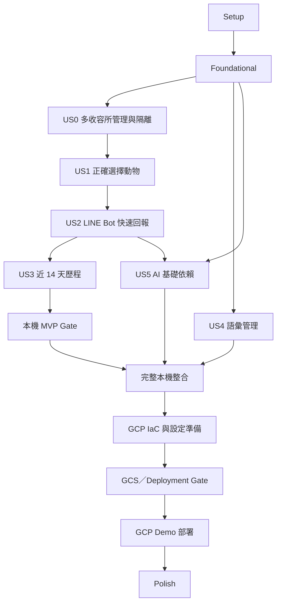

# Tasks：志工日常照護回報與動物近期歷程

## 輸入文件

- [constitution.md](../../.specify/memory/constitution.md)：CRM 唯一事實來源、原始資料保存、LINE 後端邊界、AI 治理、Python 品質門檻與多收容所資料隔離。
- [spec.md](./spec.md)：US0～US5、FR-001～FR-075、Acceptance Scenarios、Edge Cases、SC-001～SC-026 與最新 Clarification。
- [plan.md](./plan.md)：Next.js、FastAPI、SQLAlchemy 2.x、Alembic、`asyncpg`、Authentication API、Database Scope Setter、正式 LINE Adapter、Observation／Job Foundational 邊界、Contract Types、本機優先及 GCP Demo Gate。
- [research.md](./research.md)：Authentication、LINE Messaging API、PostgreSQL RLS、`set_config(..., true)`、Job dispatch、`openapi-typescript` 與測試目錄決策。
- [data-model.md](./data-model.md)：Organization、Session、LINE Binding、Webhook Event、Animal、Draft、Care Report、Observation、Job、Media、Timeline 與 Audit 關係。
- [contracts/](./contracts/)：OpenAPI、Contract Types、CRM Scope、LINE／LIFF、Object Storage、AI Job 與 GCP Demo 契約。
- [quickstart.md](./quickstart.md)：本機 Authentication、Database Scope、Mock LINE Bot、MinIO、AI 降級、A／B 隔離與 GCP Demo 驗證流程。

## 阻擋實作的未決事項

目前沒有尚待產品決策且會阻擋 Schema、Authentication、Tenant Isolation、API Contract、Storage Security、交易邊界、Job Processing 或正式資料正確性的事項。

Feature 仍維持 `Blocked`，直到本清單重新通過 `$speckit-analyze`。不得在 Analyze 出現 `CRITICAL` 或 `HIGH` 結果時開始 `$speckit-implement`。

## 任務格式說明

- 每項任務使用 `- [ ] Txxx [P?] [USx?]`，Task ID 依執行順序連續編號。
- `[P]` 僅用於不同檔案、沒有未完成依賴且合併順序不影響資料正確性的工作。
- Setup、Foundational、Integration、Deployment 與 Polish 不加 User Story 標籤；User Story 階段必須加 `[US0]`～`[US5]`。
- 所有 SQLAlchemy Model 與 Alembic Migration 必須是不同 Task；不得在同一 Task 同時建立 Model 與 Migration。
- 每個 Story 依序執行 Contract／Acceptance Test → Integration／Security Test → Unit Test → Model → Migration → Repository → Service → API／UI → Independent Test。
- 測試先確認因功能尚未實作而失敗；不得以刪除、`skip` 或放寬 assertion 讓測試通過。
- Repository 不得自行 `commit()`；Application Service 控制 transaction。AI Job dispatch 使用 Report commit 後的獨立 transaction。

## Phase 1：Setup

**目的**：建立可在本機啟動、檢查與重設的 Next.js、FastAPI、Worker、PostgreSQL、MinIO、Mock LINE 與品質工具基礎。

- [ ] T001 [P] 在 `apps/web/package.json` 建立 Next.js、TypeScript、前端格式化、型別檢查與測試命令
- [ ] T002 [P] 在 `apps/web/tsconfig.json` 設定 `apps/web` 與 `packages/contracts` 的 TypeScript 路徑及嚴格型別檢查
- [ ] T003 [P] 在 `apps/web/next.config.ts` 設定本機 Development Server 與 LIFF 輔助頁的開發模式
- [ ] T004 [P] 在 `pyproject.toml` 建立 `uv`、FastAPI、SQLAlchemy 2.x、Alembic、`asyncpg`、Ruff、Pytest、圖片處理與 LINE HTTP Client 依賴及命令
- [ ] T005 [P] 在 `services/api/app/main.py` 建立 FastAPI 啟動入口、健康檢查與 router 掛載骨架
- [ ] T006 [P] 在 `services/worker/worker.py` 建立可啟動、停止及回報健康狀態的 Background Worker 入口
- [ ] T007 [P] 在 `.env.example` 建立 PostgreSQL、MinIO、GCS、LINE、LIFF、Session、AI 與 Worker 設定範例並使用假值遮罩祕密
- [ ] T008 在 `infra/local/docker-compose.yml` 建立 PostgreSQL、MinIO 與本機必要基礎服務的可重複啟動設定
- [ ] T009 在 `infra/local/init-minio.sh` 建立 Private Bucket、Temporary Prefix 與測試 Prefix 初始化流程 (depends on T008)
- [ ] T010 [P] 在 `tests/fixtures/line_webhook.py` 建立 Mock LINE User、Webhook、Postback、Image、Redelivery 與 Signature Fixture
- [ ] T011 [P] 在 `infra/local/line-rich-menu.yaml` 建立不含授權資訊的本機 Rich Menu 版本化範本
- [ ] T012 [P] 在 `scripts/seed_local.py` 建立可於 Schema 完成後載入 Organization A／B、角色、相同 Shelter Number、Observation 預設值與虛構資料的 Seed 命令
- [ ] T013 [P] 在 `scripts/reset_local.py` 建立只針對本機資料庫、MinIO 測試物件與 Fixture 狀態的安全 Reset 命令
- [ ] T014 [P] 在 `packages/contracts/package.json` 建立固定版本的 `openapi-typescript`、`generate` 與 `check` 命令
- [ ] T015 在 `services/api/migrations/env.py` 建立 Alembic Async Configuration、metadata 載入入口與 Runtime／Migration Role 分離設定骨架 (depends on T004)
- [ ] T016 在 `services/api/migrations/versions/0001_bootstrap.py` 建立可於空 PostgreSQL 執行與回復的空 Bootstrap Migration (depends on T015)
- [ ] T017 [P] 在 `.github/workflows/ci.yml` 建立 `uv run` Ruff／Pytest、Frontend、Contract Types、Secret Scan、Docker Build 與 Terraform path-filter Workflow
- [ ] T018 在 `scripts/check_setup.sh` 建立 PostgreSQL、MinIO、Next.js、FastAPI、Worker、Bootstrap Migration、Ruff、Pytest discovery、Contract Types 與 Seed／Reset 命令可執行檢查 (depends on T001-T017)

**Setup Checkpoint**：T018 通過後，所有本機服務可啟動，Bootstrap Migration 可在空資料庫執行，品質命令可被發現，Seed／Reset 入口可執行；完整 A／B 業務 Seed 於 Foundational Model／Migration 完成後驗證。

## Phase 2：Foundational

**目的**：完成阻擋所有 User Story 的 Contract、Authentication、Database Scope、租戶模型、Observation Vocabulary、AI Job Persistence、Storage、正式 LINE Adapter、錯誤與 Audit 基礎。

**重要階段規則**：US2 依賴 Observation Vocabulary 與 AI Job persistence，因此兩者必須在本階段完成；US4 只新增管理命令與 UI，US5 只新增 Worker／AI Observation／人工覆核。

### Contract、設定與共通執行環境

- [ ] T019 在 `specs/001-volunteer-care-report/contracts/openapi.yaml` 完成 Authentication、Organization、Animal、Draft、Media、Care Report、Timeline、Observation、AI、LINE Webhook 與 Contract Types metadata
- [ ] T020 在 `tests/contract/test_openapi_contract.py` 建立 OpenAPI 解析、必要路徑、Authentication、統一錯誤、Idempotency、`X-Line-Signature` 與禁止 Request 任意控制 `org_id` 的失敗優先 Contract Test (depends on T019)
- [ ] T021 [P] 在 `tests/contract/test_generated_contract_types.py` 建立 `openapi.yaml` 與 `packages/contracts/src/openapi.ts` 漂移檢查 Test (depends on T014, T019)
- [ ] T022 在 `packages/contracts/src/openapi.ts` 由 OpenAPI 產生禁止手動修改的 TypeScript Contract Types，並使 T021 通過 (depends on T020, T021)
- [ ] T023 [P] 在 `services/api/app/config/settings.py` 建立 Pydantic Settings、Database、Session、MinIO、GCS、LINE、LIFF、AI、Draft TTL 與 Secret 遮罩設定
- [ ] T024 [P] 在 `services/api/app/observability/logging.py` 建立結構化 Logging、Request ID、Security Event 及 Secret／Token／Signed URL 遮罩
- [ ] T025 在 `services/api/app/api/errors.py` 建立統一 API Error Schema、Exception Handler、一致拒絕結果與 Cross-tenant Enumeration 防護 (depends on T020)

### Database、Transaction 與 Scope Setter

- [ ] T026 [P] 在 `services/api/app/persistence/database/base.py` 建立 SQLAlchemy Declarative Base、共通 Audit 欄位及 Pydantic／SQLAlchemy 分離邊界
- [ ] T027 在 `services/api/app/persistence/database/engine.py` 建立 SQLAlchemy 2.x Async Engine、`asyncpg`、API `AsyncSession` Factory 與 pool 設定 (depends on T023, T026)
- [ ] T028 在 `services/worker/app/persistence/session.py` 建立 Worker 專用 `AsyncSession` Factory、受限 Credential 與失敗關閉規則 (depends on T023, T026)
- [ ] T029 在 `services/api/app/domain/transactions.py` 建立由 Application Service 控制 transaction 且 Repository 不得自行 `commit()` 的規則 (depends on T027)
- [ ] T030 在 `services/api/app/api/dependencies.py` 建立 Request `AsyncSession`、Current User 與 transaction 生命週期 Dependency (depends on T027, T029)
- [ ] T031 在 `tests/integration/test_database_scope_setter.py` 以真實 PostgreSQL 建立缺少 Scope 拒絕、`set_config(..., true)`、transaction 結束清除、pooled connection 不殘留與 Worker 禁止平台 Scope Test (depends on T027, T028)
- [ ] T032 在 `services/api/app/persistence/database/scope.py` 實作 Organization／`PLATFORM` transaction-local Database Scope Setter，禁止 Request、QR、Token 或 Postback 直接設定 (depends on T029, T031)

### Organization、Authentication 與租戶防護

- [ ] T033 在 `services/api/app/persistence/models/identity.py` 建立 Organization、User、Membership、Session、Refresh Token 與 Active Shelter Context SQLAlchemy Model (depends on T026)
- [ ] T034 在 `services/api/migrations/versions/0002_identity_and_sessions.py` 建立 T033 對應資料表、Index、Unique／Composite Constraint 與可回復 Migration (depends on T016, T033)
- [ ] T035 在 `services/api/migrations/versions/0003_tenant_rls.py` 建立 Runtime Role 非 Owner／無 `BYPASSRLS`、`FORCE ROW LEVEL SECURITY`、`app.current_org_id` 與受控 `app.platform_scope` Policy (depends on T032, T034)
- [ ] T036 在 `services/api/app/domain/tenant_context.py` 建立 Current User、Membership、Active Shelter Context 與內建最高權限 `PLATFORM` Scope 驗證物件 (depends on T033)
- [ ] T037 在 `services/api/app/persistence/repositories/base.py` 建立每次操作都要求已驗證 Scope 的 Controlled Repository 基底 (depends on T029, T032, T036)
- [ ] T038 在 `tests/contract/test_authentication_contract.py` 建立 Login、Refresh、Logout、Current User、LIFF Exchange 及 Active Shelter Context Read／Switch 的失敗優先 Contract Test (depends on T020)
- [ ] T039 在 `tests/integration/test_authentication_session.py` 建立密碼登入、Refresh rotation／replay、Session 撤銷、立即停用、LIFF Exchange 與 Context Switch Test (depends on T034, T038)
- [ ] T040 在 `services/api/app/persistence/repositories/authentication_repository.py` 建立 Session、Refresh Token、User、Membership 與 Active Context 的 scoped Repository (depends on T034, T037, T039)
- [ ] T041 在 `services/api/app/application/authentication/session_service.py` 實作 Login、Refresh rotation／replay 防護、Logout、LIFF Identity Exchange、立即撤銷與 Current User 流程 (depends on T036, T039, T040)
- [ ] T042 在 `services/api/app/application/authentication/context_service.py` 實作 Active Shelter Context 查詢／明確切換、Membership 重驗證與 Audit 協調 (depends on T036, T040)
- [ ] T043 在 `services/api/app/api/authentication.py` 實作 OpenAPI 定義的七項 Authentication API 與一致錯誤 (depends on T038, T041, T042)
- [ ] T044 在 `services/api/app/api/authorization.py` 建立 `PLATFORM_ADMIN` 平台級 Scope、Shelter Admin、Staff、Volunteer 角色政策與受保護 Request 即時重驗證 (depends on T036, T041)

### LINE Binding、Webhook Session 與 Event 基礎模型

- [ ] T045 在 `services/api/app/persistence/models/line_identity.py` 建立 LINE User Binding、Webhook Session 與 LINE Webhook Event SQLAlchemy Model (depends on T026, T033)
- [ ] T046 在 `services/api/migrations/versions/0004_line_identity_and_events.py` 建立 T045 對應資料表、`webhook_event_id` Unique Constraint、必要 Index 與可回復 Migration (depends on T034, T045)
- [ ] T047 在 `services/api/app/persistence/repositories/line_identity_repository.py` 建立 Binding、唯一 Webhook Session、Event 冪等狀態與最小 Metadata Repository (depends on T037, T046)
- [ ] T048 在 `services/api/app/application/authentication/line_identity_service.py` 實作可信 `line_user_id` 對應既有 User／Membership、唯一 Context 解析與多候選要求 LIFF 的流程 (depends on T041, T047)

### Audit 基礎

- [ ] T049 在 `services/api/app/persistence/models/audit.py` 建立不可由一般使用者修改的 Audit Record SQLAlchemy Model (depends on T026, T033)
- [ ] T050 在 `services/api/migrations/versions/0005_audit_records.py` 建立 T049 對應資料表、Index、RLS 與可回復 Migration (depends on T035, T049)
- [ ] T051 在 `services/api/app/application/audit_service.py` 實作跨租戶操作、Scope 切換、拒絕、Correction、Archive 與來源通道 Audit 寫入 (depends on T024, T037, T050)

### Observation Vocabulary 基礎

- [ ] T052 在 `tests/integration/test_observation_vocabulary_foundation.py` 建立 Platform Default、Organization Effective Options、穩定 Code、停用後歷史顯示與跨租戶拒絕的失敗優先 Test (depends on T035)
- [ ] T053 在 `services/api/app/persistence/models/observation.py` 建立 Observation Category、Observation Option 與 Organization Extension SQLAlchemy Model (depends on T026, T033)
- [ ] T054 在 `services/api/migrations/versions/0006_observation_vocabulary.py` 建立 T053 對應資料表、Code／Scope Constraint、Index、RLS 與可回復 Migration (depends on T035, T053)
- [ ] T055 在 `scripts/seed_observation_vocabulary.py` 建立非診斷性 Platform Default Category／Option Seed，穩定 Code 不依顯示名稱 (depends on T054)
- [ ] T056 在 `services/api/app/persistence/repositories/observation_repository.py` 建立 Platform Default、Organization Extension、Effective Options 與歷史停用 Option 的 scoped Repository (depends on T037, T052, T054)
- [ ] T057 在 `services/api/app/application/effective_observation_service.py` 實作 Bot／LIFF／Care Report 共用的有效 Option 查詢與 Code 驗證 (depends on T052, T055, T056)

### AI Job Persistence 基礎

- [ ] T058 在 `tests/integration/test_ai_job_persistence_foundation.py` 建立版本欄位非空、Organization-scoped target reference、冪等關係、dispatch 狀態與 reconciliation 的失敗優先 Test (depends on T035)
- [ ] T059 在 `services/api/app/persistence/models/ai_job.py` 建立 AI Processing Job、版本、狀態、時間、retry、Organization 與 target reference SQLAlchemy Model，不提前依賴尚未建立的 Care Report table (depends on T026, T033)
- [ ] T060 在 `services/api/migrations/versions/0007_ai_jobs.py` 建立 T059 對應資料表、版本非空、target 冪等 Unique Constraint、Index、RLS 與可回復 Migration；Care Report Composite FK 由建立 Report table 的後續 Migration 補上 (depends on T035, T059)
- [ ] T061 在 `services/api/app/persistence/repositories/ai_job_repository.py` 建立 Organization-scoped Job create／read、冪等建立與待 reconciliation 查詢 (depends on T037, T058, T060)
- [ ] T062 在 `services/api/app/application/ai_job_dispatch.py` 建立 Report commit 後獨立 transaction 的 Job dispatch、`pending_enqueue`／`enqueue_failed` 與 reconciliation 協調 (depends on T029, T058, T061)

### Object Storage 與正式 LINE Adapter

- [ ] T063 [P] 在 `services/api/app/infrastructure/storage/ports.py` 建立共通 Object Storage Interface、Object Key、Metadata、Scope、Temporary Object 與 Signed URL 契約
- [ ] T064 在 `tests/contract/test_storage_adapter_contract.py` 建立 MinIO、GCS 與 InMemory 共用的 Private Object、清理後位元、Scope、Signed URL 與失敗語意 Contract Test (depends on T063)
- [ ] T065 [P] 在 `services/api/app/infrastructure/storage/minio.py` 實作本機 `MinioStorageAdapter` 並通過 T064 (depends on T064)
- [ ] T066 [P] 在 `services/api/app/infrastructure/storage/gcs.py` 實作可使用 Fake Transport 驗證的完整 `GcsStorageAdapter`、Private Object、Signed URL 與錯誤轉換，不等待 GCP 部署 (depends on T064)
- [ ] T067 [P] 在 `services/api/app/infrastructure/storage/memory.py` 實作 `InMemoryStorageFake` 與 Organization 隔離並通過 T064 (depends on T064)
- [ ] T068 [P] 在 `services/api/app/application/ports/line_messaging.py` 建立 Reply、受控 Push、Image Content 與 Rich Menu 管理的 `LineMessagingPort`
- [ ] T069 在 `tests/contract/test_line_adapter_contract.py` 建立 Mock／正式 LINE Adapter 的 Reply、Image Content、Rich Menu、錯誤轉換與 Secret 不洩漏 Contract Test (depends on T068)
- [ ] T070 [P] 在 `services/api/app/infrastructure/line/mock_adapter.py` 實作不連線真實 LINE API 的 `MockLineAdapter` (depends on T010, T069)
- [ ] T071 [P] 在 `services/api/app/infrastructure/line/messaging_api_adapter.py` 實作正式 `LineMessagingApiAdapter` 的 Reply、受控 Push、Image Content、Rich Menu 與安全錯誤轉換 (depends on T023, T069)
- [ ] T072 在 `services/api/app/application/line_message_presenter.py` 建立由 Effective Observation Options 產生 Quick Reply／Postback payload 的 Presenter，禁止第二套硬編碼選項 (depends on T057, T068)

### Foundational Security 與 Checkpoint

- [ ] T073 在 `tests/security/test_unauthenticated_internal_data.py` 建立未登入者不能取得 Care Report、Volunteer Note、照片、AI Observation、Timeline 或 Signed URL 的 Security Test (depends on T025, T043, T044)
- [ ] T074 在 `tests/isolation/test_foundational_tenant_matrix.py` 以真實 PostgreSQL 驗證 A／B、RLS、Database Scope Setter、Platform Scope Audit、GCS／MinIO Object Scope、停用狀態與 Request 偽造防護 (depends on T031-T073)
- [ ] T075 在 `scripts/check_foundational.sh` 建立空 Migration、完整 A／B Seed、Authentication、Contract Types、Observation、AI Job Persistence、MinIO／GCS／InMemory Contract、LINE Adapter、Ruff 與 Foundational Pytest Gate (depends on T074)

**Foundational Checkpoint**：T075 通過後，才可開始 User Story。Observation Vocabulary 與 AI Job Persistence 已可供 US2 使用；完整 `GcsStorageAdapter` Contract Test 已在本機可執行，但不代表真實 GCP IAM／Signed URL 已驗證。

## Phase 3：User Story 0－管理收容所並維持機構資料隔離（Priority: P1）

**Story Goal**：平台管理員以內建最高權限建立／停用 Shelter 與初始管理員；一般角色只能操作授權 Organization，Volunteer 的 Active Shelter Context 必須明確選擇。

**Requirement／Acceptance Criteria 對應**：US0、FR-045～FR-064、平台／收容所管理、停用、相同 Shelter Number、A／B 隔離、Active Shelter Context 與 Audit Scenarios。

**Independent Test**：建立 Organization A／B、各角色及相同 Shelter Number；一般角色無法讀寫 B，`PLATFORM_ADMIN` 不需 Membership 且所有跨 Organization 操作可稽核，Context 不一致時拒絕。

### Tests First

- [ ] T076 [US0] 在 `tests/contract/test_organization_management_contract.py` 建立 Organization、Initial Admin、Membership、Status 與 Active Shelter Context API 的失敗優先 Contract Test (depends on T020, T075)
- [ ] T077 [P] [US0] 在 `tests/integration/test_organization_management.py` 建立 Platform Admin 建立 Shelter／Initial Admin 及 Shelter Admin 建立 Staff／Volunteer Test (depends on T075)
- [ ] T078 [P] [US0] 在 `tests/isolation/test_organization_management_isolation.py` 建立 A 使用者以識別碼、網址、搜尋或 `org_id` 存取 B 的拒絕與不存在性防護 Test (depends on T075)
- [ ] T079 [P] [US0] 在 `tests/integration/test_shelter_status_and_membership.py` 建立 Organization、Membership、User 停用後立即拒絕 Login／Read／Create Test (depends on T039, T075)
- [ ] T080 [P] [US0] 在 `tests/integration/test_active_shelter_context.py` 建立多 Membership、明確切換、Draft 不移動及 QR／GPS／IP 不自動切換 Test (depends on T039, T075)
- [ ] T081 [US0] 在 `tests/unit/test_platform_scope_audit.py` 建立 `PLATFORM_ADMIN` 不需 Shelter Membership、可跨 Organization 且每次操作留 Audit 的 Unit Test (depends on T051)

### Model 與 Migration

- [ ] T082 [US0] 在 `services/api/app/persistence/models/shelter_area.py` 建立 Cage／Area SQLAlchemy Model 與 Organization 關聯 (depends on T077)
- [ ] T083 [US0] 在 `services/api/migrations/versions/0008_shelter_areas.py` 建立 T082 對應資料表、Composite Constraint、Index、RLS 與可回復 Migration (depends on T075, T082)

### Repository、Service、API 與 UI

- [ ] T084 [US0] 在 `services/api/app/persistence/repositories/organization_repository.py` 建立 Platform Scope 與 Shelter Scope 的 Organization／Membership／Status Repository (depends on T037, T077)
- [ ] T085 [US0] 在 `services/api/app/persistence/repositories/shelter_area_repository.py` 建立 Organization-scoped Cage／Area Repository (depends on T037, T083)
- [ ] T086 [US0] 在 `services/api/app/application/organization_management.py` 實作必要欄位、預設未啟用、Initial Admin、Membership、停用與 Audit 流程 (depends on T077-T081, T084)
- [ ] T087 [US0] 在 `services/api/app/application/authentication/context_service.py` 完成 Active Shelter Context 明確切換、重驗證、Draft 固定與 Audit 規則 (depends on T080, T086)
- [ ] T088 [US0] 在 `services/api/app/api/organization_management.py` 實作 Organization、Membership、Cage／Area、Status 與 Initial Admin API (depends on T076, T083, T085-T087)
- [ ] T089 [P] [US0] 在 `apps/web/app/(management)/shelters/page.tsx` 建立平台／收容所管理畫面及授權錯誤狀態 (depends on T022, T076, T088)
- [ ] T090 [P] [US0] 在 `apps/web/features/shelter-context/ActiveShelterContext.tsx` 建立目前 Shelter 顯示、明確切換及 Context 不一致提示 (depends on T022, T087, T088)
- [ ] T091 [US0] 在 `tests/e2e/test_us0_shelter_isolation.py` 執行 US0 Independent Test、Acceptance Scenarios、API／Repository／RLS 與 Audit 回歸 (depends on T078, T079, T081, T088-T090)

**Story Checkpoint**：T091 通過後，US0 可獨立展示 Organization、帳號、停用、A／B 隔離、平台最高權限與 Active Shelter Context。

## Phase 4：User Story 1－透過名單、QR Code 或收容編號正確選擇動物（Priority: P1）

**Story Goal**：Volunteer 從 Rich Menu 今日清單、QR Token、Shelter Number Search 或 LIFF 確認正確 Animal；確認前不建立正式回報。

**Requirement／Acceptance Criteria 對應**：US1、FR-001～FR-014、FR-059、FR-065、Acceptance Scenarios 1～17 與 QR／同名／重複編號 Edge Cases。

**Independent Test**：Volunteer A 可辨識並確認 A Animal；B Token、篡改 Token、重複 Shelter Number、封存 Animal 或無權限結果均不洩漏或建立 Draft。

### Tests First

- [ ] T092 [US1] 在 `tests/contract/test_animal_selection_contract.py` 建立今日清單、Shelter Number Search、QR Resolve、Animal Confirmation 與錯誤的失敗優先 Contract Test (depends on T020, T091)
- [ ] T093 [P] [US1] 在 `tests/integration/test_shelter_number_constraints.py` 建立同 Organization 不可重複、跨 Organization 可相同、缺少 Shelter Number 與歷史快照 Test (depends on T091)
- [ ] T094 [P] [US1] 在 `tests/security/test_qr_token_tampering.py` 建立 A Volunteer 使用 B／篡改／撤銷／貼錯 Cage QR Token 不能越權的 Test (depends on T074, T091)
- [ ] T095 [P] [US1] 在 `tests/unit/test_reportable_scope_rules.py` 建立今日 Scope、封存、不可回報、唯一確認及未確認不建立 Draft 的 Unit Test (depends on T091)
- [ ] T096 [P] [US1] 在 `tests/frontend/test_animal_disambiguation.tsx` 建立同名、相似照片、多筆搜尋及照片／名稱／完整 Shelter Number／Cage 顯示 Test (depends on T022, T092)
- [ ] T097 [US1] 在 `tests/frontend/test_liff_animal_confirmation.tsx` 建立 QR Deep Link、掃描失敗、搜尋替代、最多兩個確認步驟與 LIFF 確認 Test (depends on T096)

### Model 與 Migration

- [ ] T098 [US1] 在 `services/api/app/persistence/models/animal.py` 建立 Animal、Shelter Number 與 Cage／Area 關聯 SQLAlchemy Model (depends on T093, T095)
- [ ] T099 [US1] 在 `services/api/migrations/versions/0009_animals.py` 建立 T098 對應資料表、Organization 內 Shelter Number Unique、Composite Constraint、Index、RLS 與可回復 Migration (depends on T083, T098)
- [ ] T100 [US1] 在 `services/api/app/persistence/models/qr_code.py` 建立不可預測 QR Token、撤銷狀態、Organization 與 Animal 關聯 SQLAlchemy Model (depends on T094, T098)
- [ ] T101 [US1] 在 `services/api/migrations/versions/0010_qr_codes.py` 建立 T100 對應資料表、Token Unique、Composite Constraint、Index、RLS 與可回復 Migration (depends on T099, T100)
- [ ] T102 [US1] 在 `services/api/app/persistence/models/reportable_scope.py` 建立個別 Animal、Cage／Area、指定 Volunteer 與有效期間 SQLAlchemy Model (depends on T095, T098)
- [ ] T103 [US1] 在 `services/api/migrations/versions/0011_reportable_scopes.py` 建立 T102 對應資料表、Composite Constraint、Index、RLS 與可回復 Migration (depends on T099, T102)

### Repository、Service、API 與 LIFF

- [ ] T104 [US1] 在 `services/api/app/persistence/repositories/animal_repository.py` 建立 scoped Animal List、Shelter Number Search、多筆結果與識別快照查詢 (depends on T037, T099)
- [ ] T105 [US1] 在 `services/api/app/persistence/repositories/qr_code_repository.py` 建立 QR Token create／resolve／revoke 與 Organization Scope Repository (depends on T037, T101)
- [ ] T106 [US1] 在 `services/api/app/persistence/repositories/reportable_scope_repository.py` 建立個別 Animal、Cage／Area、Volunteer 與有效期間查詢 (depends on T037, T103)
- [ ] T107 [US1] 在 `services/api/app/application/qr_token_service.py` 實作非祕密 Token 產生、撤銷、唯一解析及 QR／Actor／Animal Organization 三方驗證 (depends on T094, T105)
- [ ] T108 [US1] 在 `services/api/app/application/reportable_scope_service.py` 實作今日範圍查詢與送出前重驗證 (depends on T095, T106)
- [ ] T109 [US1] 在 `services/api/app/application/animal_selection.py` 實作今日清單、搜尋、QR Resolve、Animal Confirmation 及確認後 Draft 入口 (depends on T092, T104, T107, T108)
- [ ] T110 [US1] 在 `services/api/app/api/animal_selection.py` 實作 OpenAPI 的 List、Search、QR Resolve、Confirmation 與一致拒絕 API (depends on T092, T109)
- [ ] T111 [P] [US1] 在 `apps/web/features/animal-selection/AnimalConfirmationCard.tsx` 建立照片、名稱、完整 Shelter Number、Cage／Area、狀態與明確確認 (depends on T096, T110)
- [ ] T112 [P] [US1] 在 `apps/web/app/(volunteer)/animal-confirmation/page.tsx` 建立 QR Deep Link、Shelter Number Search、重新掃描與 LIFF 輔助確認頁 (depends on T097, T110)
- [ ] T113 [US1] 在 `services/api/app/application/create_report_draft.py` 建立確認後才產生 Server-side Draft Token 的入口並固定 Animal／Organization (depends on T109)
- [ ] T114 [US1] 在 `tests/e2e/test_us1_animal_selection.py` 執行 US1 Independent Test、Acceptance Scenarios 1～17、SC-003～SC-005 與跨租戶回歸 (depends on T091, T110-T113)

**Story Checkpoint**：T114 通過後，可完成 Rich Menu／今日名單／QR／Shelter Number／LIFF → 確認卡 → Draft，且 QR 只識別候選 Animal，不是授權憑證。

## Phase 5：User Story 2－透過 LINE Bot 快速完成照護回報（Priority: P2）

**Story Goal**：Volunteer 以 LINE Quick Reply／Postback 完成結構化回報，以 Image Message 選擇性附加照片；最終確認前不建立 Care Report，AI 不可用仍可保存原始回報。

**Requirement／Acceptance Criteria 對應**：US2、FR-015～FR-029、FR-065～FR-075、Acceptance Scenarios 18～29、65～74、SC-001～SC-002、SC-022～SC-026。

**Independent Test**：停止 AI Worker，Volunteer A 仍可完成 Bot Draft、結構化答案、可選照片／心得、摘要與送出；重送 Event／Postback 不重複，A 不可操作 B Draft。

### Tests First

- [ ] T115 [US2] 在 `tests/contract/test_line_care_report_contract.py` 建立 Webhook、Rich Menu Context、Draft、Resume、Cancel、Media、Summary、Submit、Correction 與 Archive 的失敗優先 Contract Test (depends on T020, T114)
- [ ] T116 [P] [US2] 在 `tests/security/test_line_webhook_signature.py` 建立合法／缺少／錯誤 `X-Line-Signature` 且非法事件零業務寫入 Test (depends on T023, T115)
- [ ] T117 [P] [US2] 在 `tests/integration/test_line_webhook_idempotency.py` 建立 `webhookEventId` 重送不重複 Draft、Answer、Media、Report、Job 或 Audit Test (depends on T046, T115)
- [ ] T118 [P] [US2] 在 `tests/unit/test_line_care_report_state_machine.py` 建立所有 Draft State、合法／無效轉移、Back、Cancel、Expire 與不信任傳入 `step` Test (depends on T115)
- [ ] T119 [US2] 在 `tests/integration/test_line_postback_flow.py` 建立 Rich Menu → Animal Confirmation → Quick Reply → Summary 的 Integration Test (depends on T117, T118)
- [ ] T120 [P] [US2] 在 `tests/security/test_line_cross_tenant_postback.py` 建立 A 使用 B Draft Token、Animal、QR、Postback、Media 或 `org_id` 的拒絕 Test (depends on T074, T118)
- [ ] T121 [P] [US2] 在 `tests/integration/test_line_draft_resume.py` 建立中斷、Resume、單 Organization 單一 active Draft、放棄與 TTL 到期 Test (depends on T118)
- [ ] T122 [P] [US2] 在 `tests/integration/test_line_duplicate_submit.py` 建立重複點擊、Postback Redelivery 及相同 Idempotency Key 只建立一筆 Report Test (depends on T117, T119)
- [ ] T123 [P] [US2] 在 `tests/integration/test_line_unbound_user.py` 建立無效 Binding、唯一／多個 Webhook Session、唯一／多個 Context 與停用 Membership／Organization Test (depends on T048, T116)
- [ ] T124 [P] [US2] 在 `tests/integration/test_line_image_message.py` 建立 Image Content 及時取得、Draft 關聯、大小／MIME／格式、EXIF、重新編碼、Checksum 與失敗略過 Test (depends on T064, T071, T116)
- [ ] T125 [US2] 在 `tests/integration/test_media_validation.py` 建立 MinIO／GCS 相同清理政策、原始檔不保留、Temporary 清理及 AI 只讀清理後圖片 Test (depends on T124)
- [ ] T126 [P] [US2] 在 `tests/integration/test_report_submission_revalidation.py` 建立 Session、Membership、Organization、Animal、Scope、Option、Media 與 Draft 送出時重驗證 Test (depends on T057, T118)
- [ ] T127 [P] [US2] 在 `tests/integration/test_multiple_care_reports.py` 建立同日多筆、多人回報、原始值與 transaction rollback Test (depends on T115)
- [ ] T128 [P] [US2] 在 `tests/security/test_report_observation_scope.py` 建立 Option、Animal、Media、Draft 與 Report 跨 Organization 關聯拒絕 Test (depends on T074, T126)
- [ ] T129 [US2] 在 `tests/integration/test_ai_job_dispatch_fallback.py` 建立 Report commit 後 Job dispatch、enqueue 失敗不回滾、狀態可追蹤及 reconciliation 不重複 Test (depends on T058, T062, T127)
- [ ] T130 [P] [US2] 在 `tests/frontend/test_line_liff_fallback.tsx` 建立 LIFF 長文字、答案批次修改、圖片失敗、Draft Resume 與 Bot 備援 Test (depends on T022, T121)
- [ ] T131 [P] [US2] 在 `tests/security/test_report_edit_window.py` 建立本人 24 小時內容／照片／心得修改、他人／逾時拒絕及禁止 Hard Delete Test (depends on T126)

### Model 與 Migration

- [ ] T132 [US2] 在 `services/api/app/persistence/models/care_report_draft.py` 建立 Draft、Draft Answer 與 Draft Media SQLAlchemy Model 及完整 State (depends on T118, T121)
- [ ] T133 [US2] 在 `services/api/migrations/versions/0012_care_report_drafts.py` 建立 T132 對應資料表、單 Volunteer／Organization active Draft Constraint、Index、RLS 與可回復 Migration (depends on T103, T132)
- [ ] T134 [US2] 在 `services/api/app/persistence/models/care_report.py` 建立 Care Report、Observation Snapshot、Volunteer Note、Media Asset、Idempotency Key、Correction 與 Archive SQLAlchemy Model (depends on T126, T127, T131)
- [ ] T135 [US2] 在 `services/api/migrations/versions/0013_care_reports_and_media.py` 建立 T134 對應資料表、跨 Organization Composite Constraint、Index、RLS、既有 AI Job target 到 Care Report 的 Composite FK 與可回復 Migration (depends on T060, T133, T134)

### Repository、Domain 與 Application Service

- [ ] T136 [US2] 在 `services/api/app/persistence/repositories/line_webhook_repository.py` 建立 Event claim、冪等狀態、Redelivery、Binding 與 Webhook Session Repository (depends on T047, T117, T123)
- [ ] T137 [US2] 在 `services/api/app/persistence/repositories/care_report_draft_repository.py` 建立 scoped Draft、Answer、Media、Resume、Cancel 與 Expire Repository (depends on T037, T133)
- [ ] T138 [US2] 在 `services/api/app/persistence/repositories/care_report_repository.py` 建立 scoped Report、Observation、Note、Media、Idempotency、Correction 與 Archive Repository (depends on T037, T135)
- [ ] T139 [US2] 在 `services/api/app/domain/line_webhook_security.py` 實作未修改 raw Body 簽章、Event Idempotency、安全重試與零業務寫入拒絕 (depends on T116, T117, T136)
- [ ] T140 [US2] 在 `services/api/app/domain/line_care_report_state.py` 實作 Server-side Draft State Machine、Answer Schema、穩定 Code、合法轉移與 TTL (depends on T118, T132, T137)
- [ ] T141 [US2] 在 `services/api/app/application/line_webhook_session.py` 實作 Binding → system user → 唯一 Session／Context → Membership 重驗證流程 (depends on T123, T136)
- [ ] T142 [US2] 在 `services/api/app/application/line_draft_service.py` 實作 Draft Create／Resume／Cancel／Expire、單一 active Draft 與固定 Organization／Animal (depends on T121, T137, T140, T141)
- [ ] T143 [US2] 在 `services/api/app/application/line_postback_service.py` 實作 Rich Menu Action、單題 Quick Reply、Back、Other、Summary、Modify 與 Confirm (depends on T072, T119, T140, T142)
- [ ] T144 [US2] 在 `services/api/app/application/media_service.py` 實作大小／MIME／格式／解碼、EXIF 移除、重新編碼、Checksum、Temporary 與正式 Media 生命週期 (depends on T125, T135)
- [ ] T145 [US2] 在 `services/api/app/application/line_image_service.py` 實作 Image Event 驗證、正式 LINE Adapter Content 取得、Media Sanitization、Draft Media 關聯與失敗略過 (depends on T124, T137, T139, T144)
- [ ] T146 [US2] 在 `services/api/app/application/report_submission.py` 實作只保存 Report／Observation／Media／Audit／Draft／Idempotency 的正式 transaction，不建立或呼叫 AI (depends on T122, T126-T128, T138, T143-T145)
- [ ] T147 [US2] 在 `services/api/app/application/report_job_dispatch.py` 實作 Report commit 後獨立 transaction 的 AI Job dispatch、失敗狀態及 reconciliation 入口 (depends on T062, T129, T146)
- [ ] T148 [US2] 在 `services/api/app/application/report_correction.py` 實作志工 24 小時內容修改、授權人員 Animal Correction、Archive 與完整 Audit (depends on T131, T138, T146)

### API、Rich Menu 與 LIFF

- [ ] T149 [US2] 在 `services/api/app/api/line_webhook.py` 實作 `/v1/line/webhook` 的 raw Body 簽章前置、Event Dispatch、Postback／Image／Text Handler 與一致回應 (depends on T115, T139, T141, T143, T145)
- [ ] T150 [US2] 在 `services/api/app/api/line_binding.py` 實作 `/v1/line/bind`、既有 User／Membership 對應及未綁定引導 (depends on T048, T115)
- [ ] T151 [US2] 在 `services/api/app/api/line_drafts.py` 實作 Rich Menu Context、Current Draft、Resume、Cancel 及要求 LIFF 明確選擇 API (depends on T115, T142, T149)
- [ ] T152 [US2] 在 `services/api/app/api/care_reports.py` 實作 Draft／Media／Report／Correction／Archive API、Authentication、Idempotency 與 Scope (depends on T115, T146-T148)
- [ ] T153 [US2] 在 `scripts/sync_line_rich_menu.py` 建立正式 Adapter 的 Rich Menu Validate／Create／Upload／Bind、環境版本及安全重跑流程 (depends on T011, T071, T143)
- [ ] T154 [P] [US2] 在 `apps/web/features/line-bot/LiffFallback.tsx` 建立長文字、批次修改、完整確認與 Bot 備援介面 (depends on T130, T151, T152)
- [ ] T155 [P] [US2] 在 `apps/web/app/(volunteer)/care-report/page.tsx` 建立 LIFF Draft Resume、Media 狀態、網路中斷、Summary 與保存成功輔助頁 (depends on T130, T151, T152)
- [ ] T156 [US2] 在 `tests/integration/test_line_adapter_real_boundary.py` 驗證正式 Adapter HTTP request、Reply Token、Image Content、Rich Menu 與錯誤補償，不呼叫正式 LINE 環境 (depends on T069, T071, T145, T153)
- [ ] T157 [US2] 在 `tests/e2e/test_us2_line_bot_report.py` 執行 US2 Independent Test、Acceptance Scenarios 18～29／65～74、SC-001／SC-002／SC-022～SC-026、AI 降級與跨租戶回歸 (depends on T114, T129, T149-T156)

**Story Checkpoint**：T157 通過後，標準流程除心得／Other 外文字輸入為 0，不需完整 LIFF 表單；最終確認前沒有 Care Report，AI／LINE 回覆失敗不破壞已保存原始資料。

## Phase 6：User Story 3－查看單一動物近 14 天歷程（Priority: P3）

**Story Goal**：Staff 或授權 Shelter Admin 可查看近 14 個曆日、同日多筆、指定日期、更早歷史、原始照片／心得、AI／人工狀態與更正歷程。

**Requirement／Acceptance Criteria 對應**：US3、FR-030～FR-035、Acceptance Scenarios 30～35、SC-006～SC-007、SC-014 及 Media／Timeline 權限。

**Independent Test**：Staff A 看見 A Animal 近 14 天每日狀態、明確「當日無回報」、同日所有 Report 與受控照片；不能取得 B Timeline 或 Signed URL。

### Tests First

- [ ] T158 [US3] 在 `tests/contract/test_animal_timeline_contract.py` 建立 Recent、Date Range、Daily Summary、No-report、逐筆展開與權限錯誤的失敗優先 Contract Test (depends on T020, T157)
- [ ] T159 [P] [US3] 在 `tests/integration/test_animal_timeline.py` 建立 14 個曆日補齊、指定日期、同日多筆、較早歷史及停用 Option Snapshot Test (depends on T157)
- [ ] T160 [P] [US3] 在 `tests/isolation/test_timeline_and_media_isolation.py` 建立 A Staff 無法取得 B Timeline、Note、Media 或 Signed URL 的 Test (depends on T074, T157)
- [ ] T161 [P] [US3] 在 `tests/integration/test_timeline_correction_history.py` 建立原始 Report、Correction、Animal Binding、Archive 與 Audit 分離 Test (depends on T148, T157)
- [ ] T162 [P] [US3] 在 `tests/unit/test_timeline_date_sequence.py` 建立日期序列、時區、No-report 與日期區間驗證 Unit Test (depends on T158)
- [ ] T163 [P] [US3] 在 `tests/integration/test_timeline_query_count.py` 建立 Timeline N+1 防護與可接受 Query Count Test (depends on T159)
- [ ] T164 [P] [US3] 在 `tests/frontend/test_animal_timeline.tsx` 建立每日摘要、No-report、同日展開、原始心得、照片、AI 預留區及 Loading／Empty／Error Test (depends on T022, T158)

### Migration、Repository、Service、API 與 UI

- [ ] T165 [US3] 在 `services/api/migrations/versions/0014_timeline_query_indexes.py` 建立 Timeline 日期、Animal／Organization、Report 與 Media 查詢 Index 的可回復 Migration (depends on T135, T159, T163)
- [ ] T166 [US3] 在 `services/api/app/persistence/repositories/timeline_repository.py` 建立 Organization-scoped Report／Observation／Note／Media／Correction Timeline Query (depends on T037, T159, T165)
- [ ] T167 [US3] 在 `services/api/app/application/timeline_query.py` 實作 14 日序列補齊、Daily Summary、No-report、逐筆 DTO、Filter 與 Date Range 驗證 (depends on T158-T163, T166)
- [ ] T168 [US3] 在 `services/api/app/application/media_access.py` 實作角色、Organization、到期與一致拒絕的 Signed Media URL Service (depends on T064, T160, T167)
- [ ] T169 [US3] 在 `services/api/app/api/animal_timeline.py` 實作 Recent、Date Range、Daily Summary、No-report 與受控 Media API (depends on T158, T167, T168)
- [ ] T170 [P] [US3] 在 `apps/web/features/animal-timeline/AnimalTimeline.tsx` 建立 14 日摘要、No-report、同日多筆、原始／AI／人工分區 (depends on T164, T169)
- [ ] T171 [P] [US3] 在 `apps/web/features/animal-timeline/TimelineFilters.tsx` 建立日期、區間、類型、Loading、Empty 與 Error State (depends on T164, T169)
- [ ] T172 [US3] 在 `apps/web/app/(management)/animals/[animalId]/timeline/page.tsx` 建立 Staff Timeline 入口、展開、照片及權限拒絕流程 (depends on T170, T171)
- [ ] T173 [US3] 在 `tests/e2e/test_us3_animal_timeline.py` 執行 US3 Independent Test、Acceptance Scenarios 30～35、SC-006／SC-007／SC-014 與 US1／US2 回歸 (depends on T157, T169, T172)

**Story Checkpoint**：T173 通過後，工作人員可查看完整近 14 天序列；No-report 不會顯示為正常、未觀察或 AI 未發現問題。

## Phase 7：本機 MVP 驗證

**目的**：US0＋US1＋US2＋US3 形成第一個可展示垂直 MVP；US4 管理頁與 US5 AI 處理不得阻擋。

- [ ] T174 在 `tests/integration/test_empty_database_bootstrap.py` 從空 PostgreSQL 執行 0001～0014 Migration、Seed、Reset 與升級／回復策略驗證 (depends on T173)
- [ ] T175 [P] 在 `tests/isolation/test_cross_tenant_resource_matrix.py` 驗證 Organization、Membership、Animal、Shelter Number、QR、Scope、Draft、Report、Timeline、Media、Signed URL、Job、Option 與 Audit A／B 矩陣 (depends on T074, T173)
- [ ] T176 [P] 在 `tests/e2e/test_local_line_bot_vertical_flow.py` 執行 Shelter → User → Animal → QR → Bot Draft → Quick Reply → Image → Report → Timeline 完整流程 (depends on T091, T114, T157, T173)
- [ ] T177 [P] 在 `tests/integration/test_local_failure_degradation.py` 執行非法 Signature、Redelivery、網路中斷、圖片清理失敗、AI Job enqueue 失敗、停用 Scope 與資格失效 (depends on T129, T157, T173)
- [ ] T178 [P] 在 `tests/frontend/test_local_bot_mvp.tsx` 使用 Mock LINE／LIFF 驗證 Animal Confirmation、Draft Resume、LIFF 備援、Summary 與保存成功 (depends on T114, T130, T155)
- [ ] T179 在 `tests/contract/test_contract_documents.py` 驗證 OpenAPI、Contract Types、LINE、Storage、AI、data-model 與 quickstart 的路徑／狀態／命令一致 (depends on T019-T022, T176)
- [ ] T180 在 `scripts/verify_local_mvp.sh` 建立 Docker Compose、Migration、Seed、Mock LINE E2E、Ruff、Pytest、Frontend、Contract Types、MinIO／GCS Contract 與 MVP Gate (depends on T174-T179)

**本機 MVP Checkpoint**：T180 通過後，US0＋US1＋US2＋US3 可在 AI Worker 未完成或 AI 完全失敗時本機展示。

## Phase 8：User Story 4－使用與維護標準化觀察語彙（Priority: P4）

**Story Goal**：Volunteer 使用 Foundational Effective Options；Shelter Admin 或授權 Staff 可建立、改名、排序、停用 Organization Option，歷史內容不被破壞。

**Requirement／Acceptance Criteria 對應**：US4、FR-036～FR-038、FR-066、Acceptance Scenario 35、SC-026 與 Option 管理隔離。

**Independent Test**：Shelter Admin A 可管理 A Extension，不能修改 B；Volunteer 無管理權；Bot 顯示文字改變後 Code 與歷史 Snapshot 仍可追溯。

### Tests First

- [ ] T181 [US4] 在 `tests/contract/test_observation_options_contract.py` 建立 Category／Option List、Create、Update、Reorder、Disable 與權限的失敗優先 Contract Test (depends on T020, T180)
- [ ] T182 [P] [US4] 在 `tests/integration/test_observation_options.py` 建立 Platform Default、Organization Extension、Code Unique、Disable 新選擇拒絕及歷史顯示 Test (depends on T057, T180)
- [ ] T183 [P] [US4] 在 `tests/isolation/test_observation_option_isolation.py` 建立 A／B Option 管理隔離、Volunteer 拒絕及 Shelter Admin 允許 Test (depends on T074)
- [ ] T184 [P] [US4] 在 `tests/unit/test_bot_option_mapping.py` 建立 Quick Reply 顯示名稱／穩定 Code、有效白名單、Other 補充與停用拒絕 Test (depends on T057, T072)
- [ ] T185 [P] [US4] 在 `tests/frontend/test_observation_admin.tsx` 建立來源、建立、改名、排序、停用、權限錯誤與歷史狀態 Test (depends on T022, T181)

### Service、API 與 UI

- [ ] T186 [US4] 在 `services/api/app/application/observation_option_service.py` 實作 Organization Extension Create／Update／Reorder／Disable、禁止 Hard Delete 與 Audit (depends on T051, T056, T182-T184)
- [ ] T187 [US4] 在 `services/api/app/api/observation_options.py` 實作 Effective List 與 Organization Option 管理 API (depends on T181, T186)
- [ ] T188 [US4] 在 `apps/web/app/(management)/settings/observation-options/page.tsx` 建立管理頁、來源、排序、停用及權限處理 (depends on T185, T187)
- [ ] T189 [US4] 在 `tests/integration/test_bot_observation_vocabulary_regression.py` 驗證 Bot Presenter 與管理語彙共用同一 Code／Effective Options，沒有硬編碼副本 (depends on T072, T184, T186)
- [ ] T190 [US4] 在 `tests/e2e/test_us4_observation_options.py` 執行 US4 Independent Test、Option Acceptance、SC-026 及 US2／US3 歷史回歸 (depends on T173, T187-T189)

**Story Checkpoint**：T190 通過後，Observation 基礎資料仍由 Foundational 提供，US4 只增加可維護管理能力且不破壞歷史。

## Phase 9：User Story 5－AI 擷取描述性觀察訊號（Priority: P5）

**Story Goal**：Worker 非同步分析正式 Note 與已清理圖片；AI 原始輸出、驗證結果及人工結果分開保存，失敗不影響 Report／Timeline。

**Requirement／Acceptance Criteria 對應**：US5、FR-039～FR-044、Acceptance Scenarios 36～42、SC-008～SC-009、AI 版本、禁用語意、來源與 EXIF。

**Independent Test**：Worker 取得 Foundational Job，Mock AI 回傳描述性訊號，完成 Schema／Option／禁用詞驗證；Staff 可 Confirm／Reject／Correct，失敗時原始 Report 仍完整。

### Tests First

- [ ] T191 [US5] 在 `tests/contract/test_ai_observation_contract.py` 建立 Status、Version、Source、Confirm／Reject／Correct 與錯誤的失敗優先 Contract Test (depends on T020, T190)
- [ ] T192 [P] [US5] 在 `tests/integration/test_ai_job_version_trace.py` 建立 Job 建立／呼叫時 Provider、Model、Snapshot、Prompt、Schema、時間及 Retry Count Test (depends on T058-T062)
- [ ] T193 [P] [US5] 在 `tests/integration/test_ai_worker_lifecycle.py` 建立 Claim、Idempotency、Crash Recovery、Retry、Timeout、Invalid JSON 與 Organization Scope Test (depends on T061)
- [ ] T194 [P] [US5] 在 `tests/unit/test_ai_output_validation.py` 建立 Structured Output、Effective Option 白名單、醫療禁用詞、禁止 `animal_id`／分數／等級／狀態 Test (depends on T057, T191)
- [ ] T195 [P] [US5] 在 `tests/integration/test_ai_raw_output_preservation.py` 建立成功／失敗保存 raw output、版本、validation result 及人工修正不覆蓋 Test (depends on T192, T194)
- [ ] T196 [P] [US5] 在 `tests/integration/test_ai_failure_timeline_status.py` 建立逾時／中斷／無效內容時 Report 與 Timeline 保留且不顯示正常 Test (depends on T173, T193)
- [ ] T197 [P] [US5] 在 `tests/security/test_ai_cross_tenant_and_source.py` 建立 AI 不跨 Organization、不讀原始 EXIF、只讀清理後 Media 及來源可追溯 Test (depends on T074, T125)
- [ ] T198 [P] [US5] 在 `tests/frontend/test_ai_observation_review.tsx` 建立 AI 標示、pending／failed、來源、Confirm／Reject／Correct 與原始資料分區 Test (depends on T022, T191)

### Model 與 Migration

- [ ] T199 [US5] 在 `services/api/app/persistence/models/ai_observation.py` 建立 AI Observation、AI Call Log、Validated Result 與 Human Review SQLAlchemy Model (depends on T191, T195)
- [ ] T200 [US5] 在 `services/api/migrations/versions/0015_ai_observations.py` 建立 T199 對應資料表、Source／Organization Composite Constraint、Index、RLS 與可回復 Migration (depends on T060, T199)

### Worker、Review、API 與 UI

- [ ] T201 [US5] 在 `services/worker/app/persistence/job_repository.py` 建立 Job claim／lock／retry／crash recovery 與 Organization Scope Repository (depends on T028, T061, T193)
- [ ] T202 [US5] 在 `services/api/app/persistence/repositories/ai_observation_repository.py` 建立 raw／validated／human 分離及來源追溯 Repository (depends on T037, T200)
- [ ] T203 [P] [US5] 在 `services/worker/app/infrastructure/ai_port.py` 建立指定 Provider／Model／Prompt／Schema Version 的 AI Client Port (depends on T192)
- [ ] T204 [P] [US5] 在 `services/worker/app/infrastructure/mock_ai_adapter.py` 實作成功、逾時、Invalid JSON、診斷語意與中斷的 Mock AI Adapter (depends on T203)
- [ ] T205 [US5] 在 `services/worker/app/infrastructure/ai_adapter.py` 實作正式 AI Adapter、指定版本、Timeout 與不洩漏 Secret 的錯誤轉換 (depends on T203, T204)
- [ ] T206 [US5] 在 `services/worker/app/handlers/ai_validation.py` 實作 Structured Output、Effective Option 白名單、禁用詞及禁止正式決定 Validator (depends on T194, T205)
- [ ] T207 [US5] 在 `services/worker/app/handlers/ai_handler.py` 實作 Job／Report／Organization／Media 重驗證、清理後輸入、raw 保存、validation 與失敗狀態 (depends on T193, T195-T197, T201, T202, T206)
- [ ] T208 [US5] 在 `services/api/app/application/ai_review.py` 實作 Confirm／Reject／Correct、來源、Audit 及原始輸出不可覆蓋 (depends on T051, T195, T202, T207)
- [ ] T209 [US5] 在 `services/api/app/api/ai_observations.py` 實作 AI Status、Observation List、Confirm、Reject 與 Correct API (depends on T191, T208)
- [ ] T210 [US5] 在 `apps/web/features/ai-observation/AIObservationPanel.tsx` 建立 AI 標示、狀態、來源及人工結果 UI (depends on T198, T209)
- [ ] T211 [US5] 在 `tests/e2e/test_us5_ai_observation.py` 執行 US5 Independent Test、Acceptance Scenarios 36～42、SC-008／SC-009、版本／原始輸出及 US2／US3 回歸 (depends on T157, T173, T207, T209, T210)

**Story Checkpoint**：T211 通過後，AI 僅提供可追溯描述性衍生結果；原始 Report、Media、Note 與人工結果保持獨立。

## Phase 10：本機整合驗證

**目的**：在建立任何 GCP 資源前完成全部 Story、Storage Adapter、Worker、Contract Types、Migration 與跨租戶本機驗證。

- [ ] T212 在 `tests/e2e/test_full_local_flow.py` 執行 Shelter、Staff／Volunteer、Animal、QR、Bot、Image、MinIO、Report、Job、Timeline、Option 與 AI Review 完整流程 (depends on T180, T190, T211)
- [ ] T213 [P] 在 `tests/isolation/test_full_cross_tenant_matrix.py` 直接驗證 Organization、Membership、Animal、Search、QR、Scope、Draft、Report、Timeline、Media、Signed URL、Job、AI Observation、Option 與 Audit Log 矩陣 (depends on T175, T190, T211)
- [ ] T214 [P] 在 `tests/integration/test_full_local_failure_matrix.py` 執行 Authentication 撤銷、非法 Signature、Redelivery、Tampering、圖片失敗、Job enqueue／AI 失敗與資格失效 (depends on T177, T196, T211)
- [ ] T215 [P] 在 `tests/contract/test_all_adapters.py` 執行 MinIO、完整 GCS Fake Transport、InMemory、Mock／正式 LINE 與 Mock／正式 AI Adapter Contract Test (depends on T064-T071, T156, T205)
- [ ] T216 在 `tests/contract/test_contract_documents.py` 驗證 OpenAPI、Generated Types、所有 Markdown Contract、data-model、plan 與 quickstart 一致 (depends on T179, T212)
- [ ] T217 在 `specs/001-volunteer-care-report/quickstart.md` 記錄本機 Authentication、Scope Setter、Bot、MinIO、GCS Contract、AI 降級與排查驗證結果 (depends on T212-T216)
- [ ] T218 在 `scripts/verify_local.sh` 建立空 Migration、Seed、Ruff、Pytest、Frontend、E2E、Contract Types、Isolation、MinIO／GCS Adapter、Secret Scan 與 Docker Build 的完整本機 Gate (depends on T212-T217)

**Local Integration Checkpoint**：T218 必須通過後才能準備 GCP Demo。此 Gate 已執行完整 `GcsStorageAdapter` Contract Test，但真實 GCS IAM／Signed URL 仍須部署後驗證。

## Phase 11：GCP Demo 準備與 Deployment Gate

**目的**：只建立可審查的 Demo IaC、映像建置、設定與 Gate；T232 通過前不得建立或修改任何 GCP 資源。

- [ ] T219 在 `infra/gcp-demo/project.md` 建立 Project、Region、虛構資料、LINE Channel、Service 清單、Secret 與禁止正式個資規則 (depends on T218)
- [ ] T220 在 `infra/gcp-demo/terraform/main.tf` 建立 Terraform Provider、Backend 約束及必要 GCP Service API 宣告 (depends on T219)
- [ ] T221 在 `infra/gcp-demo/terraform/variables.tf` 建立 Project／Region、Image、Database、Bucket、Domain 與 Secret Reference 輸入驗證 (depends on T220)
- [ ] T222 在 `infra/gcp-demo/terraform/iam.tf` 建立 Next.js／FastAPI／Worker Service Account、最小 IAM 與 GitHub OIDC (depends on T220, T221)
- [ ] T223 [P] 在 `infra/gcp-demo/terraform/observability.tf` 建立 Artifact Registry、Cloud Logging 與不含 Secret 的 Log 設定 (depends on T220, T221)
- [ ] T224 [P] 在 `infra/gcp-demo/terraform/cloud-sql.tf` 建立 Cloud SQL、Database、Runtime／Migration Role 與連線防護宣告 (depends on T220-T222)
- [ ] T225 [P] 在 `infra/gcp-demo/terraform/storage.tf` 建立 Private GCS Bucket、Temporary Object TTL、正式物件與 Signed URL IAM 宣告 (depends on T220-T222)
- [ ] T226 在 `infra/gcp-demo/terraform/cloud-run.tf` 建立 Next.js、FastAPI、Worker／Job、Service Account、Cloud SQL／GCS／Secret 關聯宣告 (depends on T222-T225)
- [ ] T227 在 `infra/gcp-demo/terraform/outputs.tf` 建立 Deployment、Migration、Webhook HTTPS 與 Rich Menu 所需輸出，敏感值標記 `sensitive` (depends on T223-T226)
- [ ] T228 [P] 在 `infra/gcp-demo/line-rich-menu.yaml` 建立 Demo Rich Menu Action、Webhook／LIFF URL Reference 與環境版本範本 (depends on T219)
- [ ] T229 在 `.github/workflows/demo-build.yml` 建立 Secret Scan、Next.js／FastAPI／Worker Docker Build、Artifact metadata 與不執行 Terraform apply 的 Build Workflow (depends on T017, T219)
- [ ] T230 在 `tests/contract/test_gcp_iac_contract.py` 驗證 Terraform format／validate、Private GCS、IAM 最小權限、Cloud SQL Role、Secret Reference 與無 `cloud-run-*.yaml` 部署來源 (depends on T220-T229)
- [ ] T231 在 `infra/gcp-demo/deploy-gate.sh` 固化 Ruff、Pytest、Frontend、E2E、Contract Types、Migration、Isolation、MinIO、完整 GCS Adapter Contract、LINE Adapter Contract、Secret Scan、Docker Build 與 Terraform validate Gate (depends on T218, T230)
- [ ] T232 在 `infra/gcp-demo/gate-evidence.md` 執行 T231 並記錄全部通過證據、版本與虛構資料檢查；任何失敗皆阻擋 T233 (depends on T231)

**GCP Deployment Gate**：T232 是第一個 GCP 資源異動前的硬 Gate。尤其 `GcsStorageAdapter` 與 `tests/contract/test_storage_adapter_contract.py`／`test_all_adapters.py` 必須在此通過；不得部署後才補做 Contract Test。

## Phase 12：GCP Demo 部署與環境驗證

**目的**：只有 T232 通過後才建立 GCP Demo，並以真實 Cloud SQL、GCS、IAM、LINE HTTPS 與 Service Account 驗證環境專屬行為。

- [ ] T233 在 `infra/gcp-demo/apply.sh` 建立受控 Terraform plan／review／apply 流程，拒絕未通過 Gate 的部署 (depends on T232)
- [ ] T234 在 `infra/gcp-demo/migrate.sh` 建立 Migration Role 的 Cloud SQL 空資料庫 Migration、版本驗證與失敗停止流程 (depends on T233)
- [ ] T235 在 `infra/gcp-demo/seed-demo.sh` 建立只含虛構 Organization A／B、相同 Shelter Number、測試角色與 Demo Animal 的 Seed (depends on T234)
- [ ] T236 在 `infra/gcp-demo/sync-line.sh` 使用 `scripts/sync_line_rich_menu.py` 與 Secret Manager Reference 發布 Demo Rich Menu，不輸出 Token (depends on T153, T227, T233)
- [ ] T237 在 `tests/integration/test_gcp_demo_smoke.py` 執行真實 Cloud SQL Migration、GCS IAM／Signed URL、正式 LINE Adapter／Webhook HTTPS、QR、A／B 隔離與 AI 降級 Smoke Test (depends on T233-T236)
- [ ] T238 在 `infra/gcp-demo/deployment-evidence.md` 記錄 Terraform、Migration、GCS、LINE、Isolation、AI 降級與 Cloud Logging 驗證結果 (depends on T237)

**GCP Demo Checkpoint**：T238 通過只代表虛構資料 Demo 完成，不代表正式環境部署完成。

## Final Phase：Polish 與 Cross-Cutting

**目的**：只完成 spec／plan 已要求的跨 Story 品質、效能、可用性、安全與文件收尾，不增加範圍外功能。

- [ ] T239 在 `pyproject.toml` 清理 Ruff、Type Check、Pytest marker、AsyncSession 與測試命令設定 (depends on T238)
- [ ] T240 在 `tests/test_feature_quality.py` 執行完整 Pytest、Migration、Scope Setter、Webhook、State Machine、EXIF、Job dispatch、跨租戶及無未說明 Skip 檢查 (depends on T238)
- [ ] T241 在 `apps/web/package.json` 固化 Frontend Test、Type Check、Mobile／LIFF Viewport 與 Accessibility 命令 (depends on T238)
- [ ] T242 在 `tests/integration/test_performance_targets.py` 驗證 80%／90 秒 Bot 回報、Timeline 兩秒摘要、No-report 狀態辨識與 Query Count 目標 (depends on T238)
- [ ] T243 在 `tests/e2e/test_draft_interruption_matrix.py` 執行至少 15 組 SC-023 中斷案例，驗證有效 Draft 100% 恢復已保存內容且取消／過期不建立 Report (depends on T238)
- [ ] T244 在 `services/api/app/observability/logging.py` 完成 Error Message、Security／Audit Event 遮罩與 Secret／Token／Signed URL 不進 Log 的最終檢查 (depends on T238)
- [ ] T245 在 `README.md` 更新本機 Setup、Authentication、Contract Types、LINE Bot、GCS Gate、GCP Demo 與品質命令 (depends on T239-T244)
- [ ] T246 在 `scripts/demo.sh` 建立虛構資料 Demo Script，涵蓋 US0、US1、US2、US3 及 AI 失敗仍完成 MVP (depends on T245)
- [ ] T247 在 `specs/001-volunteer-care-report/tasks.md` 記錄所有 Checkpoint、命令、阻擋事項、未完成範圍與 Completion Evidence (depends on T239-T246)

## Dependencies & Execution Order

### Phase Dependencies

1. Setup T001～T018 可先行；T018 是可啟動與工具入口 Checkpoint。
2. Foundational T019～T075 依序完成 Contract、Database Scope、Authentication、LINE Identity、Audit、Observation、AI Job Persistence、Storage 與 LINE Adapter；T075 阻擋所有 Story。
3. US0 T076～T091 建立 Organization 管理與隔離；US1 依賴其 Scope／Context。
4. US1 T092～T114 建立 Animal／QR／Reportable Scope 與確認流程；US2 依賴確認後 Draft 入口。
5. US2 T115～T157 建立 Bot Draft、Webhook、Image、Report 與 post-commit Job dispatch；不依賴 AI Worker。
6. US3 T158～T173 建立 Timeline；T174～T180 隨即驗證本機 MVP。
7. US4 T181～T190 與 US5 T191～T211 不阻擋 MVP；US5 使用 Foundational Effective Options 與 Job persistence，不依賴 US4 管理 UI。
8. 完整本機整合 T212～T218 通過後才能開始 GCP 準備。
9. GCP IaC／設定 T219～T231 不建立資源；T232 Gate 通過後，T233～T238 才能部署與驗證。
10. Polish T239～T247 依賴目標 Demo Checkpoint；若本次不交付 Demo，可在 T218 後執行不依賴 GCP 的品質子集並記錄範圍。

### User Story Dependencies

- **US0（P1）**：依賴 Foundational，是一般角色租戶操作與 Active Shelter Context 的前置能力。
- **US1（P1）**：依賴 US0；可獨立驗證 Animal 選擇與 QR 安全。
- **US2（P2）**：依賴 US1 與 Foundational Observation／Job／LINE／Storage；不依賴 AI Worker 或 US4 管理頁。
- **US3（P3）**：依賴 US2 正式 Report／Media／Note；不依賴 AI 成功。
- **US4（P4）**：依賴 Foundational Observation model／migration／repository；可在 MVP 後獨立加入管理能力。
- **US5（P5）**：依賴 US2 原始資料與 Foundational Job／Effective Options；不需等待 US4 UI。

### 每個 User Story 內的執行順序

Contract／Acceptance Test → Integration／Security Test → Unit Test → SQLAlchemy Model → Alembic Migration → Repository → Domain／Application Service → API／UI → Independent Test。Migration 必須依前一個 Migration head 串接；任何 Model Task 不得同時修改 `services/api/migrations/`。

### Mermaid Dependency Graph



### Parallel Opportunities

- Setup 中不同工具檔案的 T001～T014 可平行；T015～T018 依 Alembic 與完整 Setup 結果執行。
- Foundational 中 Logging、SQLAlchemy Base、Storage Port、LINE Port 與 Contract Test 可在各自前置完成後平行；Model 與其 Migration 不得平行。
- T065、T066、T067 可在 T064 Contract Test 建立後由不同工作流平行實作，且完整 GCS Adapter 不需等待 GCP。
- US0／US1／US2 各 Story 的 `[P]` Test 可先行平行撰寫；Repository、Service 與 API 仍按資料依賴合併。
- 本機 MVP 通過後，US4 管理能力與 US5 Worker／AI 可由不同工作流平行，但不得同時修改 Foundational Observation／Job Model。
- GCP 準備中的 T223～T225 可平行；T226～T232 必須依序整合。任何 Terraform apply 都等待 T232。

### 阻擋任務

- T020：OpenAPI Contract Test，阻擋前後端自行猜測 API。
- T031～T032、T035、T074：Database Scope Setter 與真實 PostgreSQL RLS／Isolation Gate。
- T052～T062：US2 所需 Observation Vocabulary 與 AI Job Persistence Foundation。
- T064～T071：MinIO／GCS／InMemory 與 Mock／正式 LINE Adapter Contract。
- T116～T129：Webhook Signature、Event Idempotency、State Machine、EXIF、Submission Revalidation 與 AI dispatch 降級。
- T174～T180：本機 MVP Gate。
- T218：完整 Local Integration Gate。
- T232：GCP Deployment Gate；未通過不得執行 T233。

### GCP Deployment Gate

T232 必須記錄以下全部通過：

```bash
uv run ruff check .
uv run ruff format --check .
uv run pytest
npm --prefix apps/web test
npm --prefix packages/contracts run check
terraform fmt -check -recursive infra/gcp-demo/terraform
terraform -chdir=infra/gcp-demo/terraform validate
```

另須通過 Local Integration、Migration、Multi-tenant Security、MinIO Adapter、完整 GCS Adapter Contract、LINE Adapter Contract、Secret Scan 與 Docker Build。真實 GCS IAM／Signed URL 在 T237 部署後 Smoke Test 再驗證，不可用部署後結果取代部署前 Adapter Contract。

## Implementation Strategy

### 本機優先

日常開發使用 PostgreSQL／MinIO Docker Compose、Mock LINE／LIFF、Mock AI、虛構 A／B Seed 與 `InMemoryStorageFake`。正式 `LineMessagingApiAdapter` 與 `GcsStorageAdapter` 先以 Contract Test 驗證；不要求日常開發連線 GCP 或真實 LINE。

### MVP First

第一個垂直 MVP 是 US0＋US1＋US2＋US3。Observation Vocabulary 與 AI Job Persistence 是 Foundational 技術前置，但 US4 管理頁、US5 Worker 及 AI 成功都不是 MVP 條件。

### Incremental Delivery

Setup → Foundational → US0 → US1 → US2 → US3 → 本機 MVP → US4／US5 → 完整本機整合 → GCP 準備／Gate → GCP Demo → Polish。每個 Story 必須先通過 Independent Test 與既有 Regression。

### 七人團隊平行策略

- **Backend／Database**：Model、Migration、Repository、Scope Setter、Authentication、Animal、Report、Timeline；同一 Migration chain 只由一個工作流修改。
- **Backend／Worker／AI**：LINE Webhook、State Machine、Media Sanitization、Job dispatch、Worker、AI Adapter／Validation／Review。
- **Frontend／Management**：Organization、Active Shelter Context、Timeline、Observation 管理。
- **Frontend／LIFF**：Animal Confirmation、Draft Resume、長文字／批次修改與 Bot 備援；正式 Quick Reply payload 由後端產生。
- **Data／Testing**：Contract、Security、Isolation、Migration、Adapter、E2E、效能與 15 組中斷矩陣。
- **Infrastructure／CI**：Docker Compose、MinIO、GCS Contract transport、Terraform、Docker Build、Gate 與 Demo smoke；不得在 T232 前 apply。
- **Documentation／Demo**：README、quickstart、Gate Evidence、Deployment Evidence 與 Demo Script。

### GCP Deployment Gate 策略

GCS 分成兩層：T064／T066／T215 在本機驗證 `GcsStorageAdapter` 共通契約；T232 將此結果列為部署硬 Gate；T237 才在已部署 Demo 驗證真實 IAM、Service Account 與 Signed URL。這三層不得互相替代。

## Requirement Traceability

| 規格範圍 | 主要實作任務 | 主要驗證任務 |
|---|---|---|
| Authentication、Session、Active Shelter Context | T033～T048、T084～T090 | T038～T039、T076～T081、T091 |
| Database Scope Setter、RLS、Constitution XI | T032、T035～T037、各 scoped Repository | T031、T074、T078、T120、T128、T160、T175、T213 |
| US0、FR-045～FR-064 | T082～T090 | T076～T081、T091 |
| US1、FR-001～FR-014、FR-059、FR-065 | T098～T113 | T092～T097、T114 |
| US2、FR-015～FR-029、FR-065～FR-075 | T132～T156 | T115～T131、T157 |
| US3、FR-030～FR-035 | T165～T172 | T158～T164、T173 |
| US4、FR-036～FR-038、FR-066 | T053～T057、T186～T189 | T052、T181～T185、T190 |
| US5、FR-039～FR-044 | T059～T062、T199～T210 | T058、T191～T198、T211 |
| OpenAPI 與 Contract Types | T019、T022 | T020～T021、T179、T216 |
| Object Storage、EXIF、GCS Gate | T063、T065～T067、T144～T145 | T064、T124～T125、T215、T218、T232、T237 |
| 正式 LINE Adapter／Webhook | T068～T072、T136、T139、T149～T153 | T069、T116～T123、T156～T157 |
| 本機 MVP 與 GCP Demo | T174～T180、T219～T238 | T174～T180、T212～T218、T230～T232、T237～T238 |

所有核心 FR 都至少對應一項實作與一項驗證任務；後續 FR 變更必須同步更新本表。

## Completion Summary

- **tasks.md 路徑**：`specs/001-volunteer-care-report/tasks.md`
- **總任務數**：247（T001～T247）
- **Setup 任務數**：18（T001～T018）
- **Foundational 任務數**：57（T019～T075）
- **US0 任務數**：16（T076～T091）
- **US1 任務數**：23（T092～T114）
- **US2 任務數**：43（T115～T157）
- **US3 任務數**：16（T158～T173）
- **本機 MVP 任務數**：7（T174～T180）
- **US4 任務數**：10（T181～T190）
- **US5 任務數**：21（T191～T211）
- **本機整合任務數**：7（T212～T218）
- **GCP Demo 準備／Gate 任務數**：14（T219～T232）
- **GCP Demo 部署／驗證任務數**：6（T233～T238）
- **Polish 任務數**：9（T239～T247）
- **測試與驗證任務數**：85 項以 `tests/` 為主要路徑，另有 Setup／Foundational／MVP／Deployment Gate Script 與 Evidence 任務。
- **Security／Isolation Test 任務數**：13 項以 `tests/security/` 或 `tests/isolation/` 為主要路徑。
- **可平行任務數**：83 項標記 `[P]`；每項仍須等待其明列的 dependency，且 Model 與對應 Migration 永不平行。
- **阻擋實作的未決事項**：無產品未決事項；仍須執行 `$speckit-analyze` 並達到 `CRITICAL = 0`、`HIGH = 0`。
- **Independent Tests**：US0 T091、US1 T114、US2 T157、US3 T173、US4 T190、US5 T211。
- **建議 MVP**：T001～T180，包含 US0＋US1＋US2＋US3；US4／US5 不阻擋。
- **建議第一批任務**：T001～T018；Setup 通過後執行 T019～T075。
- **範圍外檢查**：未加入醫療、關注排序、領養、公開頁面、Notification、Export、跨收容所共享、Kubernetes、Redis、Pub/Sub 或其他未核准能力。
- **下一步**：先執行 `$speckit-analyze`；通過前不得執行 `$speckit-implement`。
