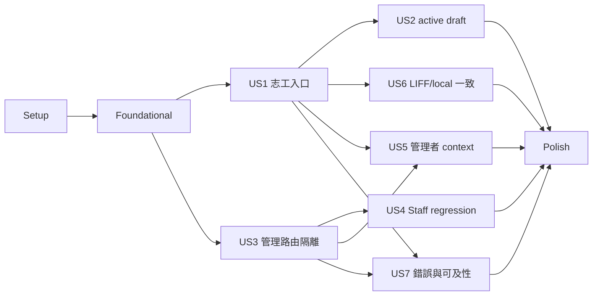

# Tasks：志工角色導向入口與管理路由隔離

**Input**：`/specs/004-volunteer-entry-route-isolation/` 下的 `spec.md`、`plan.md`、`research.md`、`data-model.md`、`contracts/route-access.md`、`quickstart.md`

**Tests**：本功能規格明確要求角色矩陣、request ordering、active draft、可及性、視覺與後端授權 regression，因此每個 user story 均採測試先行；先確認新增測試在實作前失敗，再完成實作。

**Organization**：任務依 user story 分階段，所有描述包含實際檔案路徑。`[P]` 只標示可在不同檔案、無未完成相依工作的情況下平行執行。

## Format：`[ID] [P?] [Story] Description`

- **[P]**：可與同階段其他 `[P]` 任務平行執行
- **[US1]…[US7]**：對應 `spec.md` 的 user story
- Setup、Foundational、Polish 任務不加 user story label

---

## Phase 1：Setup（共用測試與證據入口）

**Purpose**：先固定既有基準、角色 fixture 與 P0 test command，避免實作後才補驗收入口。

- [ ] T001 執行變更前 `npm --prefix apps/web run quality`、`npm --prefix apps/web run build` 與 `npm --prefix apps/web run test:e2e:p0:list`，將基準結果與既有失敗記錄在 `specs/004-volunteer-entry-route-isolation/quickstart.md`
- [ ] T002 [P] 在 `apps/web/e2e/fixtures.ts` 建立四角色、有效／缺少／不一致 context、Session 401／5xx、current draft 與 management request recorder 的可組合 fixture 型別及 scenario builders
- [ ] T003 [P] 在 `apps/web/package.json` 將 `e2e/role-route-isolation.spec.ts` 納入 `test:e2e:p0` 與 `test:e2e:p0:list`，並在 `apps/web/e2e/README.md` 說明本 suite 的 local-only P0 邊界

**Checkpoint**：測試資料可表達完整 P0 狀態，P0 指令已包含新 suite，且未新增 production dependency。

---

## Phase 2：Foundational（所有故事的阻斷前置）

**Purpose**：建立單一角色推導、route decision、auth 型別與不掛載 children 的共用 boundary。

**⚠️ CRITICAL**：本階段完成前不得開始 user story implementation。

- [ ] T004 [P] 先在 `apps/web/lib/route-access.test.ts` 撰寫 `EffectiveRole`、management／volunteer policy、缺少 token、401、context mismatch、5xx 與 redirect-loop prevention 的失敗 decision matrix 測試
- [ ] T005 在 `apps/web/lib/route-access.ts` 實作 `EffectiveRole`、`ProtectedRoutePolicy`、`RouteAccessDecision`、登入目的地與錯誤分類純函式，使 T004 通過且不得以 pathname 或 sessionStorage 提升角色
- [ ] T006 [P] 在 `apps/web/lib/auth.ts` 補齊 profile、active context、membership、organization role 與 `AuthenticatedRouteContext` 共用型別及清除 auth cache helper，不修改既有 storage keys 或 HTTP contract
- [ ] T007 先在 `apps/web/components/auth/AuthenticatedRouteBoundary.test.tsx` 撰寫 checking 時不掛載 children、profile/context 401 清除登入、context-required、retry、management volunteer redirect 與 management role allow 的失敗 component tests（依賴 T004–T006）
- [ ] T008 在 `apps/web/components/auth/AuthenticatedRouteBoundary.tsx` 實作 profile + Active Shelter Context loader、有限狀態 render、`router.replace` 與經驗證 context provider，使 T007 通過且 redirect destination 相同時不重複導向
- [ ] T009 [P] 先在 `apps/web/components/management/route-state.test.ts` 加入 checking、redirecting、session-expired、context-required、membership-mismatch 與 temporary-error 的繁中 copy／下一步／ARIA 語意測試
- [ ] T010 在 `apps/web/components/management/route-state.ts` 與 `apps/web/components/management/StateViews.tsx` 實作 T009 所需的共用安全狀態文案與 status／alert 呈現，不包含受保護資料名稱、存在性或筆數

**Checkpoint**：純 decision matrix 與 boundary component tests 通過；任一 protected child 都只能在 profile/context 驗證後掛載。

---

## Phase 3：User Story 1－志工登入後直接開始回報（Priority：P0）🎯 MVP

**Goal**：志工完成 local login 或既有受控 Session 建立後，在有效 Active Shelter Context 下直接進入 `/animal-confirmation`，且志工頁查詢不早於 route gate。

**Independent Test**：分別以 `local-volunteer-a`、`local-volunteer-b` 登入或注入等價 Session，確認最終 URL 為 `/animal-confirmation`、動物確認功能可使用、首次畫面無 Management Shell，且 boundary 通過前沒有動物／draft request。

### Tests for User Story 1（先寫並確認失敗）

- [ ] T011 [P] [US1] 在 `apps/web/app/login/page.test.tsx` 新增單一與多 organization 志工登入目的地、context PUT 成功後才 redirect、context 失敗清除 auth，以及角色中立登入文案測試
- [ ] T012 [P] [US1] 在 `apps/web/e2e/role-route-isolation.spec.ts` 新增 `local-volunteer-a`／`local-volunteer-b` 的 login destination、首次可見內容與零 Dashboard request 測試
- [ ] T013 [P] [US1] 在 `apps/web/app/(volunteer)/animal-confirmation/page.test.tsx` 新增 boundary 未 allow 前不載入今日名單／QR／draft、allow 後保留既有動物確認能力的測試

### Implementation for User Story 1

- [ ] T014 [US1] 在 `apps/web/app/login/page.tsx` 於 Active Shelter Context 建立成功後依選定 organization role 使用 `replace` 導向 `/animal-confirmation` 或 `/`，並將「管理入口／工作台」文案改為角色中立
- [ ] T015 [US1] 新增 `apps/web/app/(volunteer)/layout.tsx` 並套用 `AuthenticatedRouteBoundary` 的 volunteer policy，Session/context 未通過時不得掛載 `/animal-confirmation` 或 `/care-report` children

**Checkpoint**：US1 可獨立展示志工登入直達動物確認；這是入口 MVP，完整 management deep-link isolation 仍需 US3。

---

## Phase 4：User Story 2－志工安全恢復 active draft（Priority：P0）

**Goal**：只在 current draft 為 active、未過期、同 context 且動物可回報時提供「繼續回報／稍後處理」，其他狀態不揭露草稿內容。

**Independent Test**：以無 draft、可恢復 draft、過期／非 active、跨 context、動物不可回報與保存失敗 fixture 進入 `/animal-confirmation`，逐一驗證 continue／later／unavailable 與原始輸入保留。

### Tests for User Story 2（先寫並確認失敗）

- [ ] T016 [P] [US2] 在 `apps/web/features/line-bot/ActiveDraftPrompt.test.tsx` 撰寫 available／unavailable／none、繁中進度、鍵盤 focus、continue 與 later 不修改 draft 的失敗 component tests
- [ ] T017 [P] [US2] 在 `apps/web/app/(volunteer)/animal-confirmation/page.test.tsx` 新增 `/v1/animals` 與 `/v1/line/care-report/drafts/current` join、過期／跨 context／不可回報動物不揭露內容、retry 的失敗整合測試
- [ ] T018 [P] [US2] 在 `apps/web/app/(volunteer)/care-report/page.test.tsx` 新增 current draft 重新驗證、保存失敗保留答案與心得、401 不導向管理頁的 regression tests
- [ ] T019 [P] [US2] 在 `apps/web/e2e/role-route-isolation.spec.ts` 新增無 draft、單一可恢復 draft、稍後處理、過期／不可恢復與 save failure 的 browser tests

### Implementation for User Story 2

- [ ] T020 [US2] 新增 `apps/web/features/line-bot/ActiveDraftPrompt.tsx`，顯示授權後的動物名稱／收容編號／繁中進度與「繼續回報」「稍後處理」「重試」操作
- [ ] T021 [US2] 在 `apps/web/app/(volunteer)/animal-confirmation/page.tsx` 於 boundary allow 後並行取得今日動物與 current draft，建立 `ActiveDraftResumeView` 並只將 available draft 傳入 T020
- [ ] T022 [US2] 在 `apps/web/app/(volunteer)/animal-confirmation/page.tsx` 實作 continue 前往 `/care-report`、later 僅關閉本次提示、unavailable 不顯示答案／跨租戶動物資訊的行為
- [ ] T023 [US2] 在 `apps/web/app/(volunteer)/care-report/page.tsx` 將 current draft 取得與保存改用既有 auth helper，保留完整答案、長文字、保存失敗 retry 與 401 Session 終止行為，不改變後端 draft contract

**Checkpoint**：US2 在每個 fixture 下都有有限下一步；P0 仍只處理每位志工／context 一筆 current draft。

---

## Phase 5：User Story 3－志工直接開啟管理網址時不會看到管理資料（Priority：P0）

**Goal**：所有 P0 management routes 在管理 child 掛載前完成角色判斷；志工只看到安全 status 並被導回 `/animal-confirmation`，management request count 為 0。

**Independent Test**：以志工 Session 逐一開啟 root、動物、timeline、回報、AI、settings 與 shelters 的 concrete／dynamic／query／trailing-slash deep link，驗證首次畫面、request recorder、reload 與 back。

### Tests for User Story 3（先寫並確認失敗）

- [ ] T024 [P] [US3] 在 `apps/web/components/auth/AuthenticatedRouteBoundary.test.tsx` 新增志工 management policy 不掛載 child、不載入 organizations、只執行一次 `replace('/animal-confirmation')` 的測試
- [ ] T025 [P] [US3] 在 `apps/web/components/management/management-shell.test.tsx` 新增 boundary allow 前 Shell／Sidebar／Breadcrumb 不掛載，allow 後才取得 organizations 與掛載 child 的 request-ordering 測試
- [ ] T026 [P] [US3] 將 `apps/web/app/page.test.tsx` 遷移為 `apps/web/app/(management)/page.test.tsx` 並改寫 root composition 測試，要求 `/` 由 `(management)` layout gate 接管且 Dashboard effect 不會在志工 decision 前執行
- [ ] T027 [P] [US3] 在 `apps/web/e2e/role-route-isolation.spec.ts` 建立全部 P0 management route pattern、dynamic id、query string、trailing slash、reload 與 browser back 矩陣，逐案 assert 管理內容不可見且 page-specific management request 為 0

### Implementation for User Story 3

- [ ] T028 [US3] 在 `apps/web/app/(management)/layout.tsx` 先套用 `AuthenticatedRouteBoundary` 的 management policy，再於 allow-management 後掛載 `ManagementLayout` 與 page children
- [ ] T029 [US3] 新增 `apps/web/app/(management)/page.tsx` 接管 `/`，移除 `apps/web/app/page.tsx` 的舊 root composition，確保 Dashboard 與其他 management routes 共用同一 layout gate
- [ ] T030 [US3] 將 `apps/web/app/management-home.tsx` 改成只渲染 Dashboard content，移除內層 `ManagementLayout`，使 Dashboard request 只能在 T028 allow 後開始
- [ ] T031 [US3] 在 `apps/web/components/management/ManagementLayout.tsx` 消費 boundary 提供的已驗證 profile/context，將 `/v1/organizations` 延後到 allow-management 後並移除重複 profile/context 查詢
- [ ] T032 [US3] 在 `apps/web/e2e/role-route-isolation.spec.ts` 增加首次可見 frame 與 network recorder 的最終 assertions，明確拒絕 Dashboard、Sidebar、Breadcrumb、metrics、筆數及 permission-denied 管理畫面 flash

**Checkpoint**：US3 的 route matrix 全數導回志工入口，任何志工 management page-specific request 都是 0，back／reload 不可繞過 gate。

---

## Phase 6：User Story 4－工作人員登入後維持管理首頁（Priority：P0）

**Goal**：`STAFF` 維持 `/`、Management Shell、Dashboard 與既有授權頁面，不被志工入口規則誤導向。

**Independent Test**：以 `local-staff-a` 登入、reload `/`、開啟代表性 management deep link 並返回，確認 context、Shell 與既有 permission-denied 行為不變。

### Tests for User Story 4（先寫並確認失敗）

- [ ] T033 [P] [US4] 在 `apps/web/app/login/page.test.tsx` 新增 `STAFF` 單一／多 context 登入維持 `replace('/')` 的 regression tests
- [ ] T034 [P] [US4] 在 `apps/web/e2e/login-home.spec.ts` 與 `apps/web/e2e/role-route-isolation.spec.ts` 新增 staff login、root reload、management deep link、back 與既有未授權提示 tests

### Implementation for User Story 4

- [ ] T035 [US4] 在 `apps/web/app/management-home.tsx` 修正 route-group 重組後的 Dashboard loading／success／error lifecycle，使 staff 不產生重複 profile/context/Dashboard request
- [ ] T036 [US4] 在 `apps/web/components/management/ManagementLayout.tsx` 保留 staff 的 Sidebar、Breadcrumb、logout 與目前 context 行為，且 context 未變時不觸發志工 redirect

**Checkpoint**：US4 的既有 staff login-home 與 management regression tests 全數通過。

---

## Phase 7：User Story 5－管理者維持原本的管理流程與 context 選擇（Priority：P0）

**Goal**：`SHELTER_ADMIN` 與 `PLATFORM_ADMIN` 維持管理入口；平台管理員在 context 選擇成功前不掛載管理資料，切換失敗不混合租戶內容。

**Independent Test**：以 shelter admin 與 platform admin 測試單一／多 context、初次選擇、切換成功、切換失敗、reload 與 deep link，確認只顯示目前已驗證 context 資料。

### Tests for User Story 5（先寫並確認失敗）

- [ ] T037 [P] [US5] 在 `apps/web/app/login/page.test.tsx` 新增 `SHELTER_ADMIN`／`PLATFORM_ADMIN` 目的地、多 context 未確認不 redirect、context PUT 失敗不掛載管理資料的 tests
- [ ] T038 [P] [US5] 在 `apps/web/components/management/management-shell.test.tsx` 新增 context switch 成功後重新驗證、失敗保留舊 context 或安全 error、organizations 不混合的 tests
- [ ] T039 [P] [US5] 在 `apps/web/e2e/role-route-isolation.spec.ts` 新增 shelter admin 與 platform admin 的 root、context selection、switch、reload 與 deep-link regression matrix

### Implementation for User Story 5

- [ ] T040 [US5] 在 `apps/web/app/login/page.tsx` 依選定 organization role 顯示正確的角色中立 context 確認文案，且 platform admin 只有在 Active Shelter Context PUT 成功後才前往 `/`
- [ ] T041 [US5] 在 `apps/web/components/management/ManagementLayout.tsx` 實作 context switch 成功後重新載入已驗證情境、失敗時保留舊 context 或顯示安全 error，並避免新舊 organization data 同時可見

**Checkpoint**：US5 的管理者入口與 context 切換可獨立驗收，沒有未選 context 或跨 organization 的管理資料 flash。

---

## Phase 8：User Story 6－LINE／LIFF 與 local fixture 遵循一致的志工權限邊界（Priority：P0）

**Goal**：credential login 與受控 LIFF exchange 後的等價 Session 共用同一 role/context decision；P0 不依賴真實 LINE deployment。

**Independent Test**：分別用 local volunteer login 與模擬既有 LIFF exchange 成功後的 Session 進入 root、志工 route 與 management deep link，確認 destination、draft 與 request isolation 結果相同。

### Tests for User Story 6（先寫並確認失敗）

- [ ] T042 [P] [US6] 在 `apps/web/lib/route-access.test.ts` 新增 credential login role 與 LIFF-established profile/context 對同一 effective role 產生相同 destination／route decision 的 source-agnostic tests
- [ ] T043 [P] [US6] 在 `apps/web/e2e/role-route-isolation.spec.ts` 先撰寫受控 LIFF exchange 結果與 credential login 應得到相同志工入口、current draft 與 management request = 0 的失敗矩陣測試

### Implementation for User Story 6

- [ ] T044 [US6] 在 `apps/web/lib/route-access.ts` 與 `apps/web/app/login/page.tsx` 共用同一 role-to-destination function，讓 credential login 不建立與 boundary／LIFF Session 不同的角色規則
- [ ] T045 [US6] 在 `apps/web/e2e/fixtures.ts` 實作 credential／controlled-LIFF `authSource` 的共用 authenticated Session setup，使 T043 通過且不模擬真實 LINE deployment 或新增 client-side 授權規則

**Checkpoint**：US6 可用 local fixture 完整判定 P0；真實 LINE channel、Rich Menu 與 production LIFF deployment 仍留在 P1。

---

## Phase 9：User Story 7－遇到 session、context 或權限問題時知道下一步（Priority：P0）

**Goal**：Session 失效、context 缺少／撤銷、membership mismatch 與 temporary error 都終止於安全、繁中、可重試且可及的狀態，不形成 redirect loop。

**Independent Test**：對 management 與 volunteer route 分別注入無 token、401、409、membership mismatch、network／5xx，使用鍵盤與 screen-reader semantics 驗證 retry、返回登入與終止狀態，並確認 children/request 未啟動。

### Tests for User Story 7（先寫並確認失敗）

- [ ] T046 [P] [US7] 在 `apps/web/components/auth/AuthenticatedRouteBoundary.test.tsx` 補齊 token 缺少、profile/context 401、409、membership mismatch、network／5xx、retry、auth-changed 與 destination-equals-path 的有限狀態 tests
- [ ] T047 [P] [US7] 在 `apps/web/e2e/state-feedback.spec.ts` 與 `apps/web/e2e/role-route-isolation.spec.ts` 新增 Session/context/error 的終止 state、受保護 request = 0、cache 清除與無連續 navigation loop tests
- [ ] T048 [P] [US7] 在 `apps/web/e2e/p0-keyboard.spec.ts` 與 `apps/web/e2e/p0-a11y.spec.ts` 新增 checking、context-required、error、retry、返回登入與 active draft prompt 的 keyboard／ARIA／axe tests
- [ ] T049 [P] [US7] 在 `apps/web/e2e/p0-responsive.spec.ts` 新增 360x800、768x1024、1024x768、1440x900 下長繁中文案、status、error 與 draft prompt 無水平溢出的 tests

### Implementation for User Story 7

- [ ] T050 [US7] 在 `apps/web/components/auth/AuthenticatedRouteBoundary.tsx` 完成 401 清除 auth 並前往 `/login`、context-required 終止、temporary error retry、auth/context change 重新 checking 與 stale protected content 清除
- [ ] T051 [US7] 在 `apps/web/components/management/StateViews.tsx` 與 `apps/web/app/globals.css` 完成 polite status、阻斷 alert、可見 focus、reduced-motion 與 360px 長中文安全狀態版面

**Checkpoint**：US7 每個錯誤分支都有單一可理解終點及下一步；鍵盤、axe 與四 viewport 驗證通過。

---

## Phase 10：Polish & Cross-Cutting Concerns

**Purpose**：完成跨故事的 visual evidence、前後端 regression、contract 與最終驗收記錄。

- [ ] T052 [P] 擴充 `apps/web/e2e/p0-visual.spec.ts` 的 checking、redirecting、volunteer entry、active draft、context-required 與 management regression 視覺案例；只有 reviewer 確認後才更新 `apps/web/e2e/p0-visual.spec.ts-snapshots/`
- [ ] T053 [P] 執行 `npm --prefix apps/web run quality` 與 `npm --prefix apps/web run build`，修正 `apps/web/` 中由本功能造成的單元測試、型別、格式與 production build 問題
- [ ] T054 執行 `npm --prefix apps/web run test:e2e:p0`、`npm --prefix apps/web run test:a11y:browser`、`npm --prefix apps/web run test:axe` 與 `npm --prefix apps/web run test:visual`，將 route/request/a11y/visual 結果記錄在 `specs/004-volunteer-entry-route-isolation/quickstart.md`
- [ ] T055 [P] 執行 `env UV_CACHE_DIR=/tmp/uv-cache uv run pytest tests/security tests/isolation tests/contract -q`，確認 `tests/security/`、`tests/isolation/`、`tests/contract/` 的志工 API 拒絕與 Organization／Active Shelter Context 隔離未回歸
- [ ] T056 [P] 執行 `npm --prefix packages/contracts run check` 並確認 `packages/contracts/src/openapi.ts` 無非預期變更，以證明本功能沒有 OpenAPI contract 漂移
- [ ] T057 執行 `./scripts/verify_local.sh` 完成 CRM、LINE、LIFF exchange、AI 人工覆核、Ruff、Pytest 與完整 local regression，將結果記錄在 `specs/004-volunteer-entry-route-isolation/quickstart.md`
- [ ] T058 檢查 `specs/004-volunteer-entry-route-isolation/spec.md` 的 FR-001～FR-017 與 SC-001～SC-008 均有對應自動化或人工證據，完成 `specs/004-volunteer-entry-route-isolation/quickstart.md` 的 P0 驗收摘要並明列 P1 未納入項目

**Final Checkpoint**：全部 P0 stories、前端品質、browser、accessibility、visual、後端 authorization／isolation、OpenAPI 與完整 regression 通過；未以前端 redirect 取代後端安全邊界。

---

## Dependencies & Execution Order

### Phase Dependencies

- **Phase 1 Setup**：無依賴，可立即開始。
- **Phase 2 Foundational**：依賴 Setup；完成前阻擋全部 user stories。
- **US1**：依賴 Foundational；是最小可展示的角色導向入口。
- **US2**：依賴 Foundational 與 US1 的 volunteer route gate；不依賴 management route 重組。
- **US3**：依賴 Foundational；可與 US1／US2 由不同開發者平行，但 root／login 整合時需先同步共用 boundary contract。
- **US4**：依賴 US3 的 `(management)` root composition。
- **US5**：依賴 US3 的 management boundary 與 US1 的 role-directed login。
- **US6**：依賴 Foundational 與 US1；不依賴真實 LINE deployment，也不依賴 US2 的 UI 完成。
- **US7**：依賴 Foundational，最終整合需 US1 volunteer layout 與 US3 management layout。
- **Polish**：依賴本次欲交付的所有 P0 stories。

### User Story Dependency Graph

### Within Each User Story

1. 先完成該故事的 tests，執行並確認因缺少新行為而失敗。
2. 先完成純函式／view model，再完成 component／layout composition。
3. 只有 boundary allow 後才允許 children 與業務 request。
4. 執行該故事的 focused Vitest／Playwright 測試，通過後才進入 checkpoint。
5. 不得以刪除測試、放寬 assertion、skip 或更新未審核 snapshot 宣稱完成。

---

## Parallel Opportunities

- Setup 中 T002 與 T003 可平行；T001 的基準結果需在 production code 變更前完成。
- Foundational 中 T004、T006、T009 可平行；T007/T008 依賴 T004–T006，T010 依賴 T009。
- Foundational 完成後，US1、US3 可由不同開發者先行；US2／US6 可在 US1 gate 穩定後平行，US4／US5 在 US3 composition 完成後平行。
- 各故事中標記 `[P]` 的 unit、component 與 browser test 位於不同檔案時可平行撰寫；同一檔案的後續 implementation 需串行整合。
- Polish 中 frontend quality、backend regression 與 contract check 可平行；完整 browser suite、`verify_local.sh` 與最終證據摘要需在程式整合後執行。

## Parallel Examples by User Story

- **US1**：T011、T012、T013 可平行撰寫；完成後依序整合 T014、T015。
- **US2**：T016、T017、T018、T019 可平行撰寫；T020 可與 care-report 的 T023 分工，T021/T022 依賴 T020。
- **US3**：T024、T025、T026、T027 可平行撰寫；T028–T031 會共同改變 composition，應依序整合後再完成 T032。
- **US4**：T033、T034 可平行；T035 與 T036 分屬 Dashboard content 與 Shell，可在共用 contract 固定後平行實作。
- **US5**：T037、T038、T039 可平行；T040 與 T041 分屬 login 與 management shell，可平行實作後合併驗證。
- **US6**：T042 與 T043 可平行；T044 固定共用 destination 後再完成 T045 regression。
- **US7**：T046、T047、T048、T049 可平行；T050 與 T051 分屬 state logic 與 presentation，可平行實作後整合。

---

## Implementation Strategy

### MVP First（US1）

1. 完成 Setup。
2. 完成 Foundational，固定有效角色、route decision 與 child-mount gate。
3. 完成 US1，讓志工登入後直達 `/animal-confirmation`。
4. 停下並以兩個 volunteer fixture 驗證登入目的地、首次可見內容與 request ordering。
5. 此時可展示入口 MVP；必須再完成 US3 才達到本功能完整的管理 deep-link isolation 目標。

### Incremental Delivery

1. Setup + Foundational → 共用安全 route boundary。
2. US1 → 志工角色導向入口 MVP。
3. US3 + US4 + US5 → 完整 management isolation 與管理角色 regression。
4. US2 → 單一 active draft 的安全恢復選擇。
5. US6 + US7 → 通道一致性與完整 failure/accessibility 狀態。
6. Polish → 全面 P0、視覺、後端與 contract gate。

### Scope Guardrails

- 不新增或修改 database migration、OpenAPI schema、CRM entity、後端 authorization、JWT claims、LINE Bot state machine、Webhook 或 LIFF exchange contract。
- 不建立多筆 active draft P0 UI；維持每位志工／Active Shelter Context 最多一筆 current draft。
- 不新增「管理角色不能進志工 route」的反向限制。
- 前端 role gate 只縮小畫面與 request 啟動時機；後端 security／tenant isolation tests 不得省略。
- 真實 LINE channel、Rich Menu、production LIFF deployment 與多筆草稿策略保持 P1，不得成為 P0 完成依賴。

## Notes

- 每個 task 都包含實際檔案路徑，task ID 依執行順序遞增。
- `[P]` 表示檔案與依賴允許平行，不表示可略過前一 phase gate。
- 測試任務必須先失敗再實作；已有 regression test 不應因新 route composition 被弱化。
- 建議在每個 story checkpoint 後提交一個可回滾的 logical commit。
